# Mi-zoo

Complete list of Xiaomi Mi Smart Home Ecosystem devices with descriptions and codes.
---
---
# Audio & video equipment
## Alarm clock
<table border="1" class="dataframe">
  <thead>
    <tr style="text-align: right;">
      <th></th>
      <th>Pic</th>
      <th>Name</th>
      <th>Description</th>
      <th>Model</th>
      <th>Product Number</th>
    </tr>
  </thead>
  <tbody>
    <tr>
      <th>0</th>
      <td></td>
      <td>Mi AI Alarm</td>
      <td>Desktop clock, smart home control</td>
      <td>zimi.clock.myk01</td>
      <td>AI01ZM</td>
    </tr>
    <tr>
      <th>1</th>
      <td></td>
      <td>Qingping Bluetooth Alarm Clock</td>
      <td>Qingping alarm clock + temperature and humidity meter</td>
      <td>cgllc.clock.dove</td>
      <td>CGD1</td>
    </tr>
    <tr>
      <th>2</th>
      <td></td>
      <td>ZenMeasure Smart Temperature Clock</td>
      <td>Touch the clock, can be used as an alarm clock, support temperature and humidity display, tomato and countdown</td>
      <td>miaomiaoce.clock.ht02</td>
      <td></td>
    </tr>
  </tbody>
</table>

## Learning device
<table border="1" class="dataframe">
  <thead>
    <tr style="text-align: right;">
      <th></th>
      <th>Pic</th>
      <th>Name</th>
      <th>Description</th>
      <th>Model</th>
      <th>Product Number</th>
    </tr>
  </thead>
  <tbody>
    <tr>
      <th>3</th>
      <td></td>
      <td>Mi Card Learning Robot</td>
      <td>Mitu card learning machine</td>
      <td>jiqid.mistudy.v2</td>
      <td></td>
    </tr>
  </tbody>
</table>

## Printer
<table border="1" class="dataframe">
  <thead>
    <tr style="text-align: right;">
      <th></th>
      <th>Pic</th>
      <th>Name</th>
      <th>Description</th>
      <th>Model</th>
      <th>Product Number</th>
    </tr>
  </thead>
  <tbody>
    <tr>
      <th>4</th>
      <td>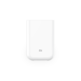</td>
      <td>Mi Portable Photo Printer</td>
      <td>This product is a pure Bluetooth device, using Zink printing technology, the phone is connected to the printer through Bluetooth and printing equipment, and the image will then output 2x3 ", photos.</td>
      <td>hannto.printer.basil</td>
      <td></td>
    </tr>
    <tr>
      <th>5</th>
      <td></td>
      <td>Mi Wireless Inkjet Printer</td>
      <td>This equipment uses thermal inkjet technology, can print documents and photos, and supports shooting, copying and scanning.The supported product sizes include A4, 6-inch and 7-inch, etc.The device uses Wi-Fi and BLE dual-mode communication, which can realize remote printing and control.</td>
      <td>hannto.printer.anise</td>
      <td></td>
    </tr>
    <tr>
      <th>6</th>
      <td></td>
      <td>Mi Wireless Photo Printer</td>
      <td>This product uses sublimation printing technology to support printing 6-inch photos.Users can use Mijia APP, AirPrint, or wirelessly connect to a computer, and send photos to the device for printing.</td>
      <td>hannto.printer.honey</td>
      <td></td>
    </tr>
    <tr>
      <th>7</th>
      <td></td>
      <td>Mi Wireless Photo Printer 1S</td>
      <td>This product is based on Xiaomi Mijia photo printer, adding 3-inch photo support and wifi-direct hardware switch.</td>
      <td>hannto.printer.honey1s</td>
      <td></td>
    </tr>
  </tbody>
</table>

## Radio
<table border="1" class="dataframe">
  <thead>
    <tr style="text-align: right;">
      <th></th>
      <th>Pic</th>
      <th>Name</th>
      <th>Description</th>
      <th>Model</th>
      <th>Product Number</th>
    </tr>
  </thead>
  <tbody>
    <tr>
      <th>8</th>
      <td></td>
      <td>Mi Network Radio</td>
      <td></td>
      <td>chuangmi.radio.v1</td>
      <td>WLSYJ01CM</td>
    </tr>
    <tr>
      <th>9</th>
      <td></td>
      <td>Mi Network Radio Plus</td>
      <td>On the basis of the first generation of Internet radio, add Bluetooth speaker function</td>
      <td>chuangmi.radio.v2</td>
      <td>WLSYJ02CM</td>
    </tr>
  </tbody>
</table>

## Robot
<table border="1" class="dataframe">
  <thead>
    <tr style="text-align: right;">
      <th></th>
      <th>Pic</th>
      <th>Name</th>
      <th>Description</th>
      <th>Model</th>
      <th>Product Number</th>
    </tr>
  </thead>
  <tbody>
    <tr>
      <th>10</th>
      <td></td>
      <td>KebbiAir</td>
      <td>Nuwa Robot II</td>
      <td>nuwa.robot.nb1</td>
      <td></td>
    </tr>
    <tr>
      <th>11</th>
      <td></td>
      <td>Nuwa Robotics Danny Robot</td>
      <td>Nuwa creates a robot</td>
      <td>nuwa.robot.minikiwi</td>
      <td></td>
    </tr>
    <tr>
      <th>12</th>
      <td></td>
      <td>Rokid Alien</td>
      <td>An artificial intelligence robot based on voice interaction, hope to be a good companion in your family and life.</td>
      <td>rokid.robot.alien</td>
      <td></td>
    </tr>
    <tr>
      <th>13</th>
      <td></td>
      <td>Rokid Alien</td>
      <td>An artificial intelligence robot based on voice interaction, hope to be a good companion in your family and life.</td>
      <td>rokid.robot.alien2</td>
      <td></td>
    </tr>
    <tr>
      <th>14</th>
      <td></td>
      <td>Rokid Me</td>
      <td>ROKID ME is a hand-wide portable smart speaker, innovative shake and flip gesture interaction, providing users with a new list of listening songs (simultaneous access to weather, audio content and other tools and services).ROKID ME uses metal &, mesh combined with materials, with personalized fashion, and superior sound quality, the whole machine has only one cans of cola, very convenient to carry out in home, hotel, tourist scenes.</td>
      <td>rokid.robot.me</td>
      <td></td>
    </tr>
    <tr>
      <th>15</th>
      <td></td>
      <td>Rokid Moonstone</td>
      <td>An artificial intelligence robot based on voice interaction, hope to be a good companion in your family and life.</td>
      <td>rokid.robot.pebble</td>
      <td></td>
    </tr>
    <tr>
      <th>16</th>
      <td></td>
      <td>Rokid Panda</td>
      <td>Rokid Panda is Ruoqi's new generation of smart speakers, which are mainly sold in operator channels and come in a variety of colors.</td>
      <td>rokid.robot.panda0</td>
      <td></td>
    </tr>
    <tr>
      <th>17</th>
      <td>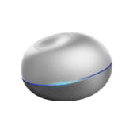</td>
      <td>Rokid Pebble</td>
      <td>An artificial intelligence robot based on voice interaction, hope to be a good companion in your family and life.</td>
      <td>rokid.robot.pebble2</td>
      <td></td>
    </tr>
    <tr>
      <th>18</th>
      <td></td>
      <td>Rokid mini</td>
      <td>Rokid Mini is a Rokid device that focuses on home control. It is small in size and focuses on the intelligent experience of the whole house.</td>
      <td>rokid.robot.mini</td>
      <td></td>
    </tr>
    <tr>
      <th>19</th>
      <td></td>
      <td>XunBot</td>
      <td>1. Lovely and technological sense 2. High-definition IPS eye protection large screen 3. Massive authorized content, healthy and fun, entertaining and entertaining 4. Family KTV, massive songs, stereo sound effects, dual microphones let the whole family sing together. 5. Selfie, record karaoke video/photo upload and share with one click, show yourself. 6. The app store will help you recommend the most suitable apps for children's respective age groups. 7. Voice interaction increases unlimited fun. 8. Fun selfie with camera</td>
      <td>xiaoxun.robot.v1</td>
      <td></td>
    </tr>
  </tbody>
</table>

## Smart rubik's cube
<table border="1" class="dataframe">
  <thead>
    <tr style="text-align: right;">
      <th></th>
      <th>Pic</th>
      <th>Name</th>
      <th>Description</th>
      <th>Model</th>
      <th>Product Number</th>
    </tr>
  </thead>
  <tbody>
    <tr>
      <th>20</th>
      <td></td>
      <td>Mi Smart Magic Cube</td>
      <td>On the traditional Rubik's cube, add BLE chip to change the status of the Rubik's cube</td>
      <td>jiqid.robot.cube</td>
      <td></td>
    </tr>
  </tbody>
</table>

## Speaker
<table border="1" class="dataframe">
  <thead>
    <tr style="text-align: right;">
      <th></th>
      <th>Pic</th>
      <th>Name</th>
      <th>Description</th>
      <th>Model</th>
      <th>Product Number</th>
    </tr>
  </thead>
  <tbody>
    <tr>
      <th>21</th>
      <td></td>
      <td>HOPE Music Box Mini 3A</td>
      <td></td>
      <td>hope.wifispeaker.mini3a</td>
      <td></td>
    </tr>
    <tr>
      <th>22</th>
      <td></td>
      <td>Hope Music with dual source</td>
      <td></td>
      <td>hope.wifispeaker.pad3s</td>
      <td></td>
    </tr>
    <tr>
      <th>23</th>
      <td></td>
      <td>Leopard AI speaker</td>
      <td>Leopard AI speaker</td>
      <td>orion.wifispeaker.cm1</td>
      <td></td>
    </tr>
    <tr>
      <th>24</th>
      <td></td>
      <td>Loudspeaker Remote Control</td>
      <td>Mijia speaker infrared remote control</td>
      <td>miir.wifispeaker.ir01</td>
      <td></td>
    </tr>
    <tr>
      <th>25</th>
      <td></td>
      <td>Mi AI Speaker</td>
      <td>Xiaomi AI speaker</td>
      <td>xiaomi.wifispeaker.s12</td>
      <td></td>
    </tr>
    <tr>
      <th>26</th>
      <td></td>
      <td>Mi AI Speaker II</td>
      <td>New Xiaoai Speaker</td>
      <td>xiaomi.wifispeaker.l06a</td>
      <td></td>
    </tr>
    <tr>
      <th>27</th>
      <td></td>
      <td>Mi AI Speaker Mini</td>
      <td>Xiaoai speaker mini</td>
      <td>xiaomi.wifispeaker.lx01</td>
      <td></td>
    </tr>
    <tr>
      <th>28</th>
      <td>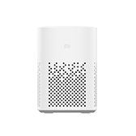</td>
      <td>Mi AI Speaker Play</td>
      <td>Xiaoai speaker mini 2nd generation</td>
      <td>xiaomi.wifispeaker.lx05</td>
      <td></td>
    </tr>
    <tr>
      <th>29</th>
      <td></td>
      <td>Mi AI Speaker Pro</td>
      <td>Large speaker infrared version</td>
      <td>xiaomi.wifispeaker.lx06</td>
      <td></td>
    </tr>
    <tr>
      <th>30</th>
      <td></td>
      <td>Mi AI Speaker Remote</td>
      <td>Xiaoai smart speaker with infrared</td>
      <td>xiaomi.wifispeaker.lx5a</td>
      <td></td>
    </tr>
    <tr>
      <th>31</th>
      <td></td>
      <td>Mi Music Alarm Clock</td>
      <td>Bluetooth speaker with clock and alarm function</td>
      <td>onemore.soundbox.sm001</td>
      <td></td>
    </tr>
    <tr>
      <th>32</th>
      <td></td>
      <td>Mi Network Speaker</td>
      <td>Xiaomi network speaker (audio), product of Xiaomi TV project group</td>
      <td>xiaomi.wifispeaker.v1</td>
      <td></td>
    </tr>
    <tr>
      <th>33</th>
      <td></td>
      <td>Mi Network Speaker</td>
      <td>Another model of Xiaomi network audio</td>
      <td>xiaomi.wifispeaker.v3</td>
      <td></td>
    </tr>
    <tr>
      <th>34</th>
      <td></td>
      <td>Mi Smart Clock 4inch</td>
      <td></td>
      <td>xiaomi.wifispeaker.lx04</td>
      <td></td>
    </tr>
    <tr>
      <th>35</th>
      <td></td>
      <td>Mi Smart Display Pro 8inch</td>
      <td>8-inch screen version touch screen speaker</td>
      <td>xiaomi.wifispeaker.x08a</td>
      <td></td>
    </tr>
    <tr>
      <th>36</th>
      <td></td>
      <td>Mi Smart Speaker Art</td>
      <td></td>
      <td>xiaomi.wifispeaker.l09a</td>
      <td></td>
    </tr>
    <tr>
      <th>37</th>
      <td></td>
      <td>Mi Smart Speaker Art II</td>
      <td></td>
      <td>xiaomi.wifispeaker.l09b</td>
      <td></td>
    </tr>
    <tr>
      <th>38</th>
      <td></td>
      <td>Redmi AI Speaker Play</td>
      <td>No screen speaker, deformation of lx05</td>
      <td>xiaomi.wifispeaker.l7a</td>
      <td></td>
    </tr>
    <tr>
      <th>39</th>
      <td></td>
      <td>Redmi Smart Display 8inch</td>
      <td></td>
      <td>xiaomi.wifispeaker.x08c</td>
      <td>X08C</td>
    </tr>
    <tr>
      <th>40</th>
      <td></td>
      <td>Redmi Smart Display Pro 8inch</td>
      <td></td>
      <td>xiaomi.wifispeaker.x08e</td>
      <td></td>
    </tr>
    <tr>
      <th>41</th>
      <td></td>
      <td>Remote control master-wifi to infrared-speaker</td>
      <td>Remote control master-wifi to infrared-speaker</td>
      <td>coolki.wifispeaker.yk13</td>
      <td></td>
    </tr>
    <tr>
      <th>42</th>
      <td></td>
      <td>Remote control master-wifi to infrared-speaker</td>
      <td>Remote control master-wifi to infrared-speaker</td>
      <td>zhihw.wifispeaker.yk13</td>
      <td></td>
    </tr>
    <tr>
      <th>43</th>
      <td></td>
      <td>Ruili Music Player</td>
      <td></td>
      <td>future.wifispeaker.amp02</td>
      <td></td>
    </tr>
    <tr>
      <th>44</th>
      <td></td>
      <td>Tencent Smart Display</td>
      <td></td>
      <td>txdd.wifispeaker.x1</td>
      <td></td>
    </tr>
    <tr>
      <th>45</th>
      <td>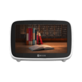</td>
      <td>Xiaoya AI Library</td>
      <td></td>
      <td>xiaoya.wifispeaker.ai016</td>
      <td></td>
    </tr>
    <tr>
      <th>46</th>
      <td></td>
      <td>Yeelight Smart Speaker</td>
      <td>Pre-researched products</td>
      <td>yeelink.wifispeaker.v1</td>
      <td></td>
    </tr>
    <tr>
      <th>47</th>
      <td></td>
      <td>xiaomiaibox</td>
      <td>Smart speakers can control music playback and smart home devices by voice.</td>
      <td>onemore.wifispeaker.sm4</td>
      <td></td>
    </tr>
    <tr>
      <th>48</th>
      <td></td>
      <td>xiaoya nano</td>
      <td>Xiaoya nano speaker</td>
      <td>xiaoya.wifispeaker.nano</td>
      <td></td>
    </tr>
  </tbody>
</table>

## Story teller
<table border="1" class="dataframe">
  <thead>
    <tr style="text-align: right;">
      <th></th>
      <th>Pic</th>
      <th>Name</th>
      <th>Description</th>
      <th>Model</th>
      <th>Product Number</th>
    </tr>
  </thead>
  <tbody>
    <tr>
      <th>49</th>
      <td></td>
      <td>Mi Bunny Storyteller</td>
      <td>Mi Rabbit Smart Story Machine New Solution</td>
      <td>jiqid.mistory.pro</td>
      <td></td>
    </tr>
    <tr>
      <th>50</th>
      <td></td>
      <td>Mi Bunny Storyteller</td>
      <td></td>
      <td>jiqid.mistory.v1</td>
      <td></td>
    </tr>
  </tbody>
</table>

## Talking pen
<table border="1" class="dataframe">
  <thead>
    <tr style="text-align: right;">
      <th></th>
      <th>Pic</th>
      <th>Name</th>
      <th>Description</th>
      <th>Model</th>
      <th>Product Number</th>
    </tr>
  </thead>
  <tbody>
    <tr>
      <th>51</th>
      <td>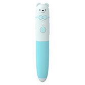</td>
      <td>iPen</td>
      <td>Dual-mode wifi (dual-mode used as single-mode)</td>
      <td>jiqid.mistory.ipen1</td>
      <td></td>
    </tr>
  </tbody>
</table>

## Tv
<table border="1" class="dataframe">
  <thead>
    <tr style="text-align: right;">
      <th></th>
      <th>Pic</th>
      <th>Name</th>
      <th>Description</th>
      <th>Model</th>
      <th>Product Number</th>
    </tr>
  </thead>
  <tbody>
    <tr>
      <th>52</th>
      <td></td>
      <td>Cloud access to TV</td>
      <td>Cloud access to TV</td>
      <td>ezhome.tv.yy1002</td>
      <td></td>
    </tr>
    <tr>
      <th>53</th>
      <td></td>
      <td>DVD remote control (infrared)</td>
      <td>DVD remote control (infrared)</td>
      <td>kongke.tv.irdvd</td>
      <td></td>
    </tr>
    <tr>
      <th>54</th>
      <td></td>
      <td>Hotel IR Controller</td>
      <td>Hotel infrared TV voice switching channel dedicated</td>
      <td>miir.tv.hir01</td>
      <td></td>
    </tr>
    <tr>
      <th>55</th>
      <td></td>
      <td>Infrared DVD</td>
      <td>Infrared DVD</td>
      <td>konke2.tv.rmdvd</td>
      <td></td>
    </tr>
    <tr>
      <th>56</th>
      <td></td>
      <td>Infrared TV</td>
      <td>Infrared TV</td>
      <td>konke2.tv.rmtv</td>
      <td></td>
    </tr>
    <tr>
      <th>57</th>
      <td></td>
      <td>Infrared TV</td>
      <td>Infrared TV Infrared TV 145 1</td>
      <td>uiot.tv.tv1</td>
      <td></td>
    </tr>
    <tr>
      <th>58</th>
      <td></td>
      <td>Infrared TV</td>
      <td></td>
      <td>yonsz.tv.0</td>
      <td></td>
    </tr>
    <tr>
      <th>59</th>
      <td></td>
      <td>KH TV Controller</td>
      <td>Through the mobile phone APP or with smart speakers, you can voice control home appliances.Cloud massive infrared code library, one-key pairing of home appliances.You can set the channel in the APP, and then you can control the channel by voice.No matter on the street, the company can use mobile phones to remotely control home appliances.</td>
      <td>693948.tv.khp</td>
      <td></td>
    </tr>
    <tr>
      <th>60</th>
      <td></td>
      <td>Mi 4K TV 82</td>
      <td></td>
      <td>xiaomi.tv.4kh1</td>
      <td></td>
    </tr>
    <tr>
      <th>61</th>
      <td></td>
      <td>Mi 8K TV 82</td>
      <td></td>
      <td>xiaomi.tv.8kh1</td>
      <td></td>
    </tr>
    <tr>
      <th>62</th>
      <td></td>
      <td>Mi Full Screen TV</td>
      <td>This TV is a Xiaomi full-screen TV with only infrared and no Bluetooth</td>
      <td>xiaomi.tv.fsi1</td>
      <td></td>
    </tr>
    <tr>
      <th>63</th>
      <td></td>
      <td>Mi Full Screen TV</td>
      <td></td>
      <td>xiaomi.tv.fsv1</td>
      <td></td>
    </tr>
    <tr>
      <th>64</th>
      <td></td>
      <td>Mi Full Screen TV Pro</td>
      <td></td>
      <td>xiaomi.tv.fsprov1</td>
      <td></td>
    </tr>
    <tr>
      <th>65</th>
      <td></td>
      <td>Mi Mural TV 65</td>
      <td>Mi TV 65-inch mural TV, support speaker function after the TV is turned off</td>
      <td>xiaomi.tv.h1</td>
      <td></td>
    </tr>
    <tr>
      <th>66</th>
      <td></td>
      <td>Mi OLED TV 65 inch</td>
      <td></td>
      <td>xiaomi.tv.oledh1</td>
      <td></td>
    </tr>
    <tr>
      <th>67</th>
      <td></td>
      <td>Mi TV</td>
      <td>This product is a Xiaomi TV with only Bluetooth and no infrared</td>
      <td>xiaomi.tv.b1</td>
      <td></td>
    </tr>
    <tr>
      <th>68</th>
      <td></td>
      <td>Mi TV</td>
      <td>This product is a Xiaomi TV with only infrared and no Bluetooth</td>
      <td>xiaomi.tv.i1</td>
      <td></td>
    </tr>
    <tr>
      <th>69</th>
      <td></td>
      <td>Mi TV</td>
      <td>Xiaomi TV</td>
      <td>xiaomi.tv.v1</td>
      <td></td>
    </tr>
    <tr>
      <th>70</th>
      <td></td>
      <td>MiTV 5</td>
      <td></td>
      <td>xiaomi.tv.mitv5h1</td>
      <td></td>
    </tr>
    <tr>
      <th>71</th>
      <td></td>
      <td>MiTV 5Pro</td>
      <td></td>
      <td>xiaomi.tv.mitv5proh1</td>
      <td></td>
    </tr>
    <tr>
      <th>72</th>
      <td></td>
      <td>Redmi TV</td>
      <td>This TV is a Redmi TV with only infrared and no Bluetooth</td>
      <td>xiaomi.tv.rmi1</td>
      <td></td>
    </tr>
    <tr>
      <th>73</th>
      <td></td>
      <td>Redmi TV</td>
      <td></td>
      <td>xiaomi.tv.rmv1</td>
      <td></td>
    </tr>
    <tr>
      <th>74</th>
      <td></td>
      <td>RedmiTV X series</td>
      <td></td>
      <td>xiaomi.tv.rmh1</td>
      <td></td>
    </tr>
    <tr>
      <th>75</th>
      <td></td>
      <td>Remote control master-wifi to infrared-TV</td>
      <td>Remote control master-wifi to infrared-TV</td>
      <td>coolki.tv.yk0002</td>
      <td></td>
    </tr>
    <tr>
      <th>76</th>
      <td></td>
      <td>Remote control master-wifi to infrared-TV</td>
      <td>Remote control master-wifi to infrared-TV</td>
      <td>zhihw.tv.yk0002</td>
      <td></td>
    </tr>
    <tr>
      <th>77</th>
      <td></td>
      <td>Remote control master-wifi to infrared-TV box</td>
      <td>Remote control master-wifi to infrared-TV box</td>
      <td>coolki.tv.yk0010</td>
      <td></td>
    </tr>
    <tr>
      <th>78</th>
      <td></td>
      <td>Remote control master-wifi to infrared-TV box</td>
      <td>Remote control master-wifi to infrared-TV box</td>
      <td>zhihw.tv.yk0010</td>
      <td></td>
    </tr>
    <tr>
      <th>79</th>
      <td></td>
      <td>TV</td>
      <td>Xiao Ai controls smart home smart TV through Xiaohei universal remote control</td>
      <td>123888.tv.xhzn11</td>
      <td></td>
    </tr>
    <tr>
      <th>80</th>
      <td></td>
      <td>TV</td>
      <td></td>
      <td>bright.tv.tv</td>
      <td></td>
    </tr>
    <tr>
      <th>81</th>
      <td></td>
      <td>TV</td>
      <td></td>
      <td>deocea.tv.cq</td>
      <td></td>
    </tr>
    <tr>
      <th>82</th>
      <td></td>
      <td>TV</td>
      <td>TV equipment</td>
      <td>ecloud.tv.eq</td>
      <td></td>
    </tr>
    <tr>
      <th>83</th>
      <td></td>
      <td>TV</td>
      <td></td>
      <td>hbkj1.tv.v1</td>
      <td></td>
    </tr>
    <tr>
      <th>84</th>
      <td></td>
      <td>TV</td>
      <td>Infrared TV</td>
      <td>ikecin.tv.ir2</td>
      <td></td>
    </tr>
    <tr>
      <th>85</th>
      <td></td>
      <td>TV</td>
      <td></td>
      <td>jusval.tv.1</td>
      <td></td>
    </tr>
    <tr>
      <th>86</th>
      <td></td>
      <td>TV</td>
      <td></td>
      <td>juzi.tv.050201</td>
      <td></td>
    </tr>
    <tr>
      <th>87</th>
      <td></td>
      <td>TV</td>
      <td></td>
      <td>jyx.tv.016301</td>
      <td></td>
    </tr>
    <tr>
      <th>88</th>
      <td></td>
      <td>TV</td>
      <td></td>
      <td>milamp.tv.tv</td>
      <td></td>
    </tr>
    <tr>
      <th>89</th>
      <td></td>
      <td>TV</td>
      <td></td>
      <td>mkzn.tv.tv</td>
      <td></td>
    </tr>
    <tr>
      <th>90</th>
      <td></td>
      <td>TV</td>
      <td>Smart TV remote control, support Xiaoai audio voice control</td>
      <td>orvibo.tv.ltv1</td>
      <td></td>
    </tr>
    <tr>
      <th>91</th>
      <td></td>
      <td>TV</td>
      <td>Infrared TV</td>
      <td>tuya.tv.tytv01</td>
      <td></td>
    </tr>
    <tr>
      <th>92</th>
      <td></td>
      <td>TV</td>
      <td></td>
      <td>tyzhjt.tv.ds0001</td>
      <td></td>
    </tr>
    <tr>
      <th>93</th>
      <td></td>
      <td>TV</td>
      <td>TV</td>
      <td>xzh.tv.tv</td>
      <td></td>
    </tr>
    <tr>
      <th>94</th>
      <td></td>
      <td>TV Remote Control</td>
      <td>Mijia TV infrared remote control</td>
      <td>miir.tv.ir01</td>
      <td></td>
    </tr>
    <tr>
      <th>95</th>
      <td></td>
      <td>TV controller</td>
      <td></td>
      <td>huazhu.tv.ir1</td>
      <td></td>
    </tr>
    <tr>
      <th>96</th>
      <td></td>
      <td>TV infrared remote control</td>
      <td></td>
      <td>ghome.tv.sf005</td>
      <td></td>
    </tr>
    <tr>
      <th>97</th>
      <td></td>
      <td>TV infrared remote control</td>
      <td>IR-BOX TV remote control</td>
      <td>kiwik.tv.irtv</td>
      <td></td>
    </tr>
    <tr>
      <th>98</th>
      <td></td>
      <td>TV infrared remote control</td>
      <td></td>
      <td>oge.tv.tv</td>
      <td></td>
    </tr>
    <tr>
      <th>99</th>
      <td></td>
      <td>TV remote</td>
      <td>1. Remote control switch 2. Volume control 3. Switch programs 4. Key operation</td>
      <td>kongke.tv.infraredtv</td>
      <td></td>
    </tr>
    <tr>
      <th>100</th>
      <td></td>
      <td>TV remote</td>
      <td></td>
      <td>yszj.tv.f0022</td>
      <td></td>
    </tr>
    <tr>
      <th>101</th>
      <td></td>
      <td>TV set</td>
      <td></td>
      <td>future.tv.tv</td>
      <td></td>
    </tr>
    <tr>
      <th>102</th>
      <td></td>
      <td>ZJ TV Controller</td>
      <td></td>
      <td>zhijia.tv.zjkzq</td>
      <td></td>
    </tr>
    <tr>
      <th>103</th>
      <td></td>
      <td>delian_dianshi</td>
      <td></td>
      <td>delian.tv.delian</td>
      <td></td>
    </tr>
    <tr>
      <th>104</th>
      <td></td>
      <td>ircTv</td>
      <td></td>
      <td>heiman.tv.rc1</td>
      <td></td>
    </tr>
    <tr>
      <th>105</th>
      <td></td>
      <td>mini-tv</td>
      <td>Thinker mini has a mature universal infrared and radio frequency remote control compatible solution, which supports the learning and control of TV sets.The App has a built-in TV cloud code library, which supports smart and fast matching, which is simple and convenient.</td>
      <td>jilian.tv.minitv</td>
      <td></td>
    </tr>
    <tr>
      <th>106</th>
      <td></td>
      <td>television</td>
      <td>Infrared TV supported by Aiyun Intelligent Scene Control A1.</td>
      <td>ayzn.tv.irtv</td>
      <td></td>
    </tr>
    <tr>
      <th>107</th>
      <td></td>
      <td>tv</td>
      <td>TV</td>
      <td>cgzn.tv.tv</td>
      <td></td>
    </tr>
  </tbody>
</table>

## Tv box
<table border="1" class="dataframe">
  <thead>
    <tr style="text-align: right;">
      <th></th>
      <th>Pic</th>
      <th>Name</th>
      <th>Description</th>
      <th>Model</th>
      <th>Product Number</th>
    </tr>
  </thead>
  <tbody>
    <tr>
      <th>108</th>
      <td></td>
      <td>Mi Box</td>
      <td>This product is a Xiaomi box with only Bluetooth and no infrared</td>
      <td>xiaomi.tvbox.b1</td>
      <td></td>
    </tr>
    <tr>
      <th>109</th>
      <td></td>
      <td>Mi Box</td>
      <td>This product is a Xiaomi box with only infrared and no Bluetooth</td>
      <td>xiaomi.tvbox.i1</td>
      <td></td>
    </tr>
    <tr>
      <th>110</th>
      <td></td>
      <td>Mi Box</td>
      <td>Mi TV Box</td>
      <td>xiaomi.tvbox.v1</td>
      <td></td>
    </tr>
    <tr>
      <th>111</th>
      <td></td>
      <td>Mi Box 4S Pro</td>
      <td></td>
      <td>xiaomi.tvbox.4prob1</td>
      <td></td>
    </tr>
    <tr>
      <th>112</th>
      <td></td>
      <td>TV Box Remote Control</td>
      <td>Mijia TV box infrared remote control</td>
      <td>miir.tvbox.ir01</td>
      <td></td>
    </tr>
  </tbody>
</table>

## Walkie-talkie
<table border="1" class="dataframe">
  <thead>
    <tr style="text-align: right;">
      <th></th>
      <th>Pic</th>
      <th>Name</th>
      <th>Description</th>
      <th>Model</th>
      <th>Product Number</th>
    </tr>
  </thead>
  <tbody>
    <tr>
      <th>113</th>
      <td></td>
      <td>BEEBEST Smart PoC Two Way Radio</td>
      <td>Jifeng intelligent network walkie-talkie</td>
      <td>fengyu.intercom.beebird</td>
      <td></td>
    </tr>
    <tr>
      <th>114</th>
      <td></td>
      <td>Mi Walkie-Talkie 1S</td>
      <td>Mi Walkie Talkie 1S</td>
      <td>fengyu.intercom.sealv1</td>
      <td></td>
    </tr>
    <tr>
      <th>115</th>
      <td></td>
      <td>Mi Walkie-Talkie 2</td>
      <td>Mi Walkie Talkie 2</td>
      <td>fengyu.intercom.sharkv1</td>
      <td></td>
    </tr>
    <tr>
      <th>116</th>
      <td></td>
      <td>Mi Walkie-Talkie Lite</td>
      <td>Mi Walkie Talkie Lite</td>
      <td>fengyu.intercom.litev1</td>
      <td></td>
    </tr>
  </tbody>
</table>

## Walking pad
<table border="1" class="dataframe">
  <thead>
    <tr style="text-align: right;">
      <th></th>
      <th>Pic</th>
      <th>Name</th>
      <th>Description</th>
      <th>Model</th>
      <th>Product Number</th>
    </tr>
  </thead>
  <tbody>
    <tr>
      <th>117</th>
      <td></td>
      <td>KingSmith WalkingPad S1</td>
      <td>Goldsmith WalkingPad walking machine is a lightweight walking, fast walking, jogging equipment, convenient to move and store, is a solution for indoor light exercise.</td>
      <td>ksmb.walkingpad.s1</td>
      <td></td>
    </tr>
    <tr>
      <th>118</th>
      <td></td>
      <td>Mi Walking Pad</td>
      <td>Mijia walking machine</td>
      <td>ksmb.walkingpad.v3</td>
      <td></td>
    </tr>
    <tr>
      <th>119</th>
      <td></td>
      <td>Stubborn deer game power exercise bike</td>
      <td></td>
      <td>magene.walkingpad.g83</td>
      <td></td>
    </tr>
    <tr>
      <th>120</th>
      <td></td>
      <td>WalkingPad</td>
      <td>The WalkingPad walking machine is a lightweight walking, fast walking, jogging device, convenient to move and store, and is a solution for indoor light exercise.</td>
      <td>ksmb.walkingpad.v1</td>
      <td>WPA1F Pro</td>
    </tr>
  </tbody>
</table>

---
# Camera
## Camera
<table border="1" class="dataframe">
  <thead>
    <tr style="text-align: right;">
      <th></th>
      <th>Pic</th>
      <th>Name</th>
      <th>Description</th>
      <th>Model</th>
      <th>Product Number</th>
    </tr>
  </thead>
  <tbody>
    <tr>
      <th>121</th>
      <td></td>
      <td>Mi Action Camera 4K</td>
      <td>Mi Action Camera 4K is with 4K 30fps video recording, 145 wide-angle, EIS 6 axis, 1450mAh battery, 2.4 inch touch screen, 7 glass high standard lens, 9 kinds of shooting mode and other features. Connected through Wi-Fi, App assists in settings to explore more possibilities.</td>
      <td>fimi.camera.c1</td>
      <td></td>
    </tr>
    <tr>
      <th>122</th>
      <td></td>
      <td>Mi Action Camera 4K</td>
      <td>Mi Action Camera 4K is with 4K 30fps video recording, 145 wide-angle, EIS 6 axis, 1450mAh battery, 2.4 inch touch screen, 7 glass high standard lens, 9 kinds of shooting mode and other features. Connected through Wi-Fi, App assists in settings to explore more possibilities.</td>
      <td>fimi.camera.c1b</td>
      <td></td>
    </tr>
  </tbody>
</table>

## Video camera
<table border="1" class="dataframe">
  <thead>
    <tr style="text-align: right;">
      <th></th>
      <th>Pic</th>
      <th>Name</th>
      <th>Description</th>
      <th>Model</th>
      <th>Product Number</th>
    </tr>
  </thead>
  <tbody>
    <tr>
      <th>123</th>
      <td></td>
      <td>Camera Hub</td>
      <td>Aqara smart camera is a smart camera product with Zigbee gateway function.The product can use wifi to transmit video to the APP client to view the camera video remotely.At the same time, this device acts as a zigbee gateway, which can realize the function of environment perception and scene linkage together with other green rice zigbee devices.This product is suitable for live video, security monitoring and other fields.</td>
      <td>lumi.camera.aq1</td>
      <td></td>
    </tr>
    <tr>
      <th>124</th>
      <td></td>
      <td>Camera Hub G2</td>
      <td>A Wi-Fi smart camera allows you to know the situation at home anytime and anywhere through your mobile phone. Even if you are not at home, you can easily make two-way voice calls with your family, making the communication visible. Integrated Zigbee gateway, can cooperate with other Zigbee sub-devices to achieve more intelligent applications.</td>
      <td>lumi.camera.gwagl01</td>
      <td>ZNSXJ12LM</td>
    </tr>
    <tr>
      <th>125</th>
      <td></td>
      <td>Da Fang SMART CAMERA</td>
      <td>Dafang Smart Camera (1080P PTZ Version)</td>
      <td>isa.camera.df3</td>
      <td></td>
    </tr>
    <tr>
      <th>126</th>
      <td></td>
      <td>Flood light camera</td>
      <td></td>
      <td>xiaovv.camera.lamp</td>
      <td></td>
    </tr>
    <tr>
      <th>127</th>
      <td></td>
      <td>Hualai Xiaofang smart camera (dual camera version)</td>
      <td>Hualai Xiaofang Smart Camera (Dual Camera Version)</td>
      <td>isa.camera.qf3</td>
      <td></td>
    </tr>
    <tr>
      <th>128</th>
      <td></td>
      <td>IMI 1080P Home Security Camera</td>
      <td>Xiaobai Smart Camera PTZ Enhanced Edition</td>
      <td>chuangmi.camera.v3</td>
      <td></td>
    </tr>
    <tr>
      <th>129</th>
      <td></td>
      <td>IMI AI Security Camera</td>
      <td>Xiaoai classmate + camera function</td>
      <td>chuangmi.camera.ipc007b</td>
      <td></td>
    </tr>
    <tr>
      <th>130</th>
      <td></td>
      <td>IMI Home Security Camera</td>
      <td>Xiaobai Smart Camera Popular Edition</td>
      <td>chuangmi.camera.v5</td>
      <td></td>
    </tr>
    <tr>
      <th>131</th>
      <td></td>
      <td>IMI Home Security Camera 1080P</td>
      <td>Home and commercial basic security smart cameras</td>
      <td>chuangmi.camera.ipc010</td>
      <td></td>
    </tr>
    <tr>
      <th>132</th>
      <td></td>
      <td>IMI Home Security Camera 1080P</td>
      <td>Xiaobai Smart Camera 1080P</td>
      <td>chuangmi.camera.ipc017</td>
      <td></td>
    </tr>
    <tr>
      <th>133</th>
      <td></td>
      <td>IMI Home Security Camera 1080P Global</td>
      <td>Xiaobai Smart Camera PTZ Version</td>
      <td>chuangmi.camera.ipc013d</td>
      <td>CMSXJ13B</td>
    </tr>
    <tr>
      <th>134</th>
      <td></td>
      <td>IMI Home Security Camera 1080P Youth</td>
      <td>Xiaobai Smart Camera Youth Edition</td>
      <td>chuangmi.camera.ipc013</td>
      <td></td>
    </tr>
    <tr>
      <th>135</th>
      <td></td>
      <td>IMI Home Security Camera 1080P Youth</td>
      <td>Xiaobai Smart Camera Youth Edition Iteration</td>
      <td>chuangmi.camera.ipc019b</td>
      <td></td>
    </tr>
    <tr>
      <th>136</th>
      <td></td>
      <td>IMI Home Security Camera 720P Youth</td>
      <td>Xiaobai Smart Camera 720P PTZ Version</td>
      <td>chuangmi.camera.ipc004b</td>
      <td></td>
    </tr>
    <tr>
      <th>137</th>
      <td></td>
      <td>IMI Home Security Camera A1</td>
      <td>Xiaobai Smart Camera A1</td>
      <td>chuangmi.camera.ipc019e</td>
      <td></td>
    </tr>
    <tr>
      <th>138</th>
      <td></td>
      <td>IMI Home Security Camera mini</td>
      <td>Little white smart camera mini</td>
      <td>chuangmi.camera.v4</td>
      <td></td>
    </tr>
    <tr>
      <th>139</th>
      <td></td>
      <td>IMILAB C10</td>
      <td>Xiaobai Smart Camera Volkswagen 1080P</td>
      <td>chuangmi.camera.27a02</td>
      <td></td>
    </tr>
    <tr>
      <th>140</th>
      <td></td>
      <td>IMILAB C21</td>
      <td>Xiaobai Smart Camera PTZ Version Y4</td>
      <td>chuangmi.camera.038a02</td>
      <td></td>
    </tr>
    <tr>
      <th>141</th>
      <td></td>
      <td>IMILAB C40</td>
      <td>Xiaobai Smart Camera A2</td>
      <td>chuangmi.camera.021e02</td>
      <td></td>
    </tr>
    <tr>
      <th>142</th>
      <td></td>
      <td>IMILAB Home Security Camera A1 (Mom& Baby Caring Version)</td>
      <td>Love him cooperation version</td>
      <td>chuangmi.camera.019e04</td>
      <td></td>
    </tr>
    <tr>
      <th>143</th>
      <td></td>
      <td>IMILAB Home Security Camera Basic</td>
      <td></td>
      <td>chuangmi.camera.ipc016</td>
      <td>CMSXJ16A</td>
    </tr>
    <tr>
      <th>144</th>
      <td></td>
      <td>IMILAB Home Security Camera Y2</td>
      <td>Xiaobai Smart Camera PTZ Version Y2</td>
      <td>chuangmi.camera.036a02</td>
      <td></td>
    </tr>
    <tr>
      <th>145</th>
      <td></td>
      <td>IMILAB Security Camera N Series</td>
      <td></td>
      <td>chuangmi.camera.025b02</td>
      <td></td>
    </tr>
    <tr>
      <th>146</th>
      <td></td>
      <td>IMILAB Security Camera N Series</td>
      <td>Xiaobai Smart Camera Outdoor Version</td>
      <td>chuangmi.camera.ipc020</td>
      <td></td>
    </tr>
    <tr>
      <th>147</th>
      <td></td>
      <td>IMOU Smart Camera 360</td>
      <td>PTZ/1080P/voice intercom/infrared night vision</td>
      <td>imou99.camera.tp2</td>
      <td></td>
    </tr>
    <tr>
      <th>148</th>
      <td></td>
      <td>Mi 360 Home Security AI Camera</td>
      <td>Xiaomi AI Camera Enhanced Edition</td>
      <td>chuangmi.camera.ipc022</td>
      <td></td>
    </tr>
    <tr>
      <th>149</th>
      <td></td>
      <td>Mi 360 Home Security Camera 1080p Essential</td>
      <td>Xiaomi Smart Camera-Single Axis Version</td>
      <td>chuangmi.camera.ip026c</td>
      <td>MJSXJ08CM</td>
    </tr>
    <tr>
      <th>150</th>
      <td></td>
      <td>Mi 360 Home Security Camera 2K</td>
      <td>Mi Smart Camera PTZ Version 2K Distribution Version</td>
      <td>chuangmi.camera.029a02</td>
      <td></td>
    </tr>
    <tr>
      <th>151</th>
      <td></td>
      <td>Mi 360 Home Security Camera 2K</td>
      <td>Xiaomi Smart Camera-3 million pixel version</td>
      <td>chuangmi.camera.ip029a</td>
      <td>MJSXJ09CM</td>
    </tr>
    <tr>
      <th>152</th>
      <td></td>
      <td>Mi 360 Home Security Camera 2K Pro</td>
      <td>Xiaomi Smart Camera PTZ Version Pro</td>
      <td>chuangmi.camera.021a04</td>
      <td></td>
    </tr>
    <tr>
      <th>153</th>
      <td></td>
      <td>Mi 360 Home Security Camera 2K Pro</td>
      <td>Xiaomi Smart Camera PTZ version pro</td>
      <td>chuangmi.camera.ipc021</td>
      <td>MJSXJ06CM</td>
    </tr>
    <tr>
      <th>154</th>
      <td></td>
      <td>Mi 360 Webcam</td>
      <td>Mijia Xiaobai Smart Camera</td>
      <td>chuangmi.camera.xiaobai</td>
      <td></td>
    </tr>
    <tr>
      <th>155</th>
      <td></td>
      <td>Mi 360 Webcam Pro</td>
      <td>Mijia Xiaobai Smart Camera Enhanced Edition</td>
      <td>chuangmi.camera.v6</td>
      <td></td>
    </tr>
    <tr>
      <th>156</th>
      <td></td>
      <td>Mi Home Security Camera</td>
      <td></td>
      <td>mijia.camera.v1</td>
      <td>SXJ01ZM</td>
    </tr>
    <tr>
      <th>157</th>
      <td></td>
      <td>Mi Home Security Camera 1080p (Magnetic Mount)</td>
      <td>Xiaomi Smart Camera Standard Edition</td>
      <td>isa.camera.hlc6</td>
      <td></td>
    </tr>
    <tr>
      <th>158</th>
      <td></td>
      <td>Mi Home Security Camera 360</td>
      <td>PTZ version smart camera</td>
      <td>chuangmi.camera.v2</td>
      <td></td>
    </tr>
    <tr>
      <th>159</th>
      <td></td>
      <td>Mi Home Security Camera 360 1080P</td>
      <td></td>
      <td>chuangmi.camera.ipc009</td>
      <td>MJSXJ02CM</td>
    </tr>
    <tr>
      <th>160</th>
      <td></td>
      <td>Mi Home Security Camera 360 1080P</td>
      <td>Mijia Smart Camera PTZ Version 1080P</td>
      <td>chuangmi.camera.ipc019</td>
      <td>MJSXJ05CM</td>
    </tr>
    <tr>
      <th>161</th>
      <td></td>
      <td>Mi Home Security Camera Basic 1080P</td>
      <td>The second camera in cooperation with Zimi, Ingenic Platform</td>
      <td>mijia.camera.v3</td>
      <td>SXJ02ZM</td>
    </tr>
    <tr>
      <th>162</th>
      <td></td>
      <td>Outdoor 360 Webcam</td>
      <td></td>
      <td>xiaovv.camera.ptz</td>
      <td></td>
    </tr>
    <tr>
      <th>163</th>
      <td></td>
      <td>Outdoor Camera Pro</td>
      <td></td>
      <td>xiaovv.camera.xvcb2</td>
      <td></td>
    </tr>
    <tr>
      <th>164</th>
      <td></td>
      <td>SLR Camera Remote Control</td>
      <td>Mijia SLR infrared remote control</td>
      <td>miir.camera.ir01</td>
      <td></td>
    </tr>
    <tr>
      <th>165</th>
      <td></td>
      <td>Smart Wifi PTZ Camera</td>
      <td></td>
      <td>xiaovv.camera.xvsnowman</td>
      <td></td>
    </tr>
    <tr>
      <th>166</th>
      <td></td>
      <td>Xiao Fang SMART CAMERA</td>
      <td>Remote smart camera with mobile alarm, sound alarm, voiceprint recognition, cloud video and other functions</td>
      <td>isa.camera.isc5</td>
      <td></td>
    </tr>
    <tr>
      <th>167</th>
      <td></td>
      <td>Xiao Fang SMART CAMERA</td>
      <td>Xiaofang Smart Camera</td>
      <td>isa.camera.isc5c1</td>
      <td></td>
    </tr>
    <tr>
      <th>168</th>
      <td></td>
      <td>XiaoYuan Smart Camera</td>
      <td>Xiaoyuan smart camera.Own brand, sell through our own channels.</td>
      <td>isa.camera.hl5</td>
      <td></td>
    </tr>
    <tr>
      <th>169</th>
      <td></td>
      <td>Yi Smart Webcam</td>
      <td>YI Smart Camera</td>
      <td>yunyi.camera.v1</td>
      <td></td>
    </tr>
    <tr>
      <th>170</th>
      <td></td>
      <td>webcam</td>
      <td>Fluorite camera</td>
      <td>cgzn.camera.camera</td>
      <td></td>
    </tr>
    <tr>
      <th>171</th>
      <td></td>
      <td>webcam</td>
      <td>webcam</td>
      <td>xzh.camera.camera</td>
      <td></td>
    </tr>
    <tr>
      <th>172</th>
      <td></td>
      <td>xiaovv Babymonitor</td>
      <td></td>
      <td>xiaovv.camera.c1</td>
      <td></td>
    </tr>
    <tr>
      <th>173</th>
      <td></td>
      <td>xiaovv Outdoor PTZ Camera 2K</td>
      <td></td>
      <td>xiaovv.camera.p1</td>
      <td></td>
    </tr>
    <tr>
      <th>174</th>
      <td></td>
      <td>xiaovv Smart Wifi PTZ Camera 2K</td>
      <td></td>
      <td>xiaovv.camera.q8</td>
      <td></td>
    </tr>
    <tr>
      <th>175</th>
      <td></td>
      <td>xiaovv outdoor camera</td>
      <td>1. Household monitoring, 180 degrees super wide angle coverage,  2. Garage, warehouse, top 360 degree panoramic coverage monitoring,  3. Home pet monitoring can be inserted directly into the wall outlet, panoramic monitoring pets,</td>
      <td>xiaovv.camera.xvb4</td>
      <td></td>
    </tr>
    <tr>
      <th>176</th>
      <td></td>
      <td>xiaovv smart panoramic camera</td>
      <td>1. Household monitoring, 180 degrees super wide angle coverage,  2. Garage, warehouse, top 360 degree panoramic coverage monitoring,  3. Home pet monitoring can be inserted directly into the wall outlet, panoramic monitoring pets,  4. The villa porch can be controlled directly with the entrance of the entrance.  5. Outdoor activities use a battery module, 24-hour panoramic coverage of arming monitoring. 6. Function module is freely combined.</td>
      <td>xiaovv.camera.xva3</td>
      <td></td>
    </tr>
    <tr>
      <th>177</th>
      <td></td>
      <td>xiaovv smart panoramic camera (cloud storage)</td>
      <td>1. Household monitoring, 180 degrees super wide angle coverage,  2. Garage, warehouse, top 360 degree panoramic coverage monitoring,  3. Home pet monitoring can be inserted directly into the wall outlet, panoramic monitoring pets,</td>
      <td>xiaovv.camera.xvd5</td>
      <td></td>
    </tr>
  </tbody>
</table>

---
# Environment appliances
## Ac power outlet
<table border="1" class="dataframe">
  <thead>
    <tr style="text-align: right;">
      <th></th>
      <th>Pic</th>
      <th>Name</th>
      <th>Description</th>
      <th>Model</th>
      <th>Product Number</th>
    </tr>
  </thead>
  <tbody>
    <tr>
      <th>178</th>
      <td></td>
      <td>Air Conditioning Controller</td>
      <td>Air conditioner companion. You can use the air conditioner companion to make the ordinary red air conditioner in the home intelligent, and you can send infrared code control commands to the ordinary air conditioner</td>
      <td>lumi.acpartner.v1</td>
      <td>KTBL01LM</td>
    </tr>
    <tr>
      <th>179</th>
      <td></td>
      <td>Air Conditioning Controller (Advanced)</td>
      <td>1 Infrared transceiver function (mainly to control the air conditioner, reserved for iteration to upgrade the TV, set-top box control function) 2 Functions of ZigBee control center (gateway function) 3 Power metering function 4 ON/OFF relay switch function (can control water heaters and other equipment)</td>
      <td>lumi.acpartner.v3</td>
      <td>KTBL11LM</td>
    </tr>
    <tr>
      <th>180</th>
      <td></td>
      <td>Mi Smart Air Conditioner Controller</td>
      <td>The Mijia brand air conditioner companion itself is both a gateway and it can also be used to make the ordinary red air conditioner in the home intelligent. It can send infrared code control commands to the ordinary air conditioner, with functions such as power statistics, timer switches, smart sleep, and quick cooling.</td>
      <td>lumi.acpartner.v2</td>
      <td>KTBL02LM</td>
    </tr>
    <tr>
      <th>181</th>
      <td></td>
      <td>Mi Smart Air Conditioner Controller 2</td>
      <td>Combining WIFI with infrared transmission and reception can realize intelligent control of infrared remote control home appliances such as traditional air conditioners.</td>
      <td>lumi.acpartner.mcn02</td>
      <td>KTBL03LM</td>
    </tr>
  </tbody>
</table>

## Air conditioner
<table border="1" class="dataframe">
  <thead>
    <tr style="text-align: right;">
      <th></th>
      <th>Pic</th>
      <th>Name</th>
      <th>Description</th>
      <th>Model</th>
      <th>Product Number</th>
    </tr>
  </thead>
  <tbody>
    <tr>
      <th>182</th>
      <td></td>
      <td>16A Intelligent Air Conditioning Socket</td>
      <td></td>
      <td>tt2019.aircondition.air</td>
      <td></td>
    </tr>
    <tr>
      <th>183</th>
      <td></td>
      <td>16A Intelligent Air Conditioning Socket</td>
      <td></td>
      <td>yuerzj.aircondition.air</td>
      <td></td>
    </tr>
    <tr>
      <th>184</th>
      <td></td>
      <td>AUX Smart Air Conditioner</td>
      <td>Oaks air conditioning_cooling and heating cabinet machine</td>
      <td>aux.aircondition.hc1</td>
      <td></td>
    </tr>
    <tr>
      <th>185</th>
      <td></td>
      <td>AUX Smart Air Conditioner</td>
      <td>Oaks Smart Air Conditioner</td>
      <td>aux.aircondition.v1</td>
      <td></td>
    </tr>
    <tr>
      <th>186</th>
      <td></td>
      <td>Air Conditioner</td>
      <td>Cloud access air conditioner</td>
      <td>ezhome.aircondition.yy1001</td>
      <td></td>
    </tr>
    <tr>
      <th>187</th>
      <td></td>
      <td>Air Conditioner</td>
      <td>air conditioning</td>
      <td>tuya.aircondition.tyac1</td>
      <td></td>
    </tr>
    <tr>
      <th>188</th>
      <td></td>
      <td>Air Conditioner Remote Control</td>
      <td>Mijia air conditioner infrared remote control</td>
      <td>miir.aircondition.ir01</td>
      <td></td>
    </tr>
    <tr>
      <th>189</th>
      <td></td>
      <td>Air Conditioner Remote Control</td>
      <td>Mijia air conditioner infrared remote control-stateful version</td>
      <td>miir.aircondition.ir02</td>
      <td></td>
    </tr>
    <tr>
      <th>190</th>
      <td></td>
      <td>Air Conditioning</td>
      <td>Infrared air conditioner</td>
      <td>tuya.aircondition.ac01</td>
      <td></td>
    </tr>
    <tr>
      <th>191</th>
      <td></td>
      <td>Air conditioner</td>
      <td>Infrared air conditioner</td>
      <td>orvibo.aircondition.ir1</td>
      <td></td>
    </tr>
    <tr>
      <th>192</th>
      <td></td>
      <td>Air conditioner infrared remote control</td>
      <td>IR-BOX air conditioner remote control</td>
      <td>kiwik.aircondition.irac</td>
      <td></td>
    </tr>
    <tr>
      <th>193</th>
      <td></td>
      <td>Air conditioning controller</td>
      <td></td>
      <td>huazhu.airc.v2</td>
      <td></td>
    </tr>
    <tr>
      <th>194</th>
      <td></td>
      <td>Air conditioning floor heating panel</td>
      <td>Air conditioning and floor heating dual panel</td>
      <td>hosjoy.aircondition.airfh</td>
      <td></td>
    </tr>
    <tr>
      <th>195</th>
      <td></td>
      <td>Air conditioning plug</td>
      <td></td>
      <td>btiot.aircondition.air2</td>
      <td></td>
    </tr>
    <tr>
      <th>196</th>
      <td></td>
      <td>Air conditioning remote control</td>
      <td>1. Control switch 2. Temperature adjustment 3. Mode adjustment</td>
      <td>kongke.aircondition.inf</td>
      <td></td>
    </tr>
    <tr>
      <th>197</th>
      <td></td>
      <td>Air conditioning thermostat</td>
      <td>aq1</td>
      <td>lumi.aircondition.aq1</td>
      <td></td>
    </tr>
    <tr>
      <th>198</th>
      <td></td>
      <td>AllCenter Air Conditioning Series</td>
      <td>AllCenter Smart Air Conditioner Series</td>
      <td>umiot.aircondition.ums</td>
      <td></td>
    </tr>
    <tr>
      <th>199</th>
      <td></td>
      <td>Aqara Air Conditioning Controller P3</td>
      <td>Aqara Air Conditioning Companion P3 is an air conditioner controller that can remotely control the air conditioner, support power statistics, relay on-off power supply and other functions. It is also a Zigbee3.0 gateway, which can add a variety of Zigbee sub-devices to achieve rich intelligenceLinkage.</td>
      <td>lumi.aircondition.acn05</td>
      <td>KTBL12LM</td>
    </tr>
    <tr>
      <th>200</th>
      <td></td>
      <td>Bit air conditioner controller</td>
      <td></td>
      <td>btzn.aircondition.v1</td>
      <td></td>
    </tr>
    <tr>
      <th>201</th>
      <td></td>
      <td>Bus air conditioner</td>
      <td>Bus central air-conditioning thermostat</td>
      <td>simon.aircondition.bst</td>
      <td></td>
    </tr>
    <tr>
      <th>202</th>
      <td></td>
      <td>Bus fresh air thermostat</td>
      <td>Bus fresh air thermostat</td>
      <td>simon.aircondition.bvt</td>
      <td></td>
    </tr>
    <tr>
      <th>203</th>
      <td></td>
      <td>Central air conditioning</td>
      <td>Inverter multi-line central air-conditioning thermostat all</td>
      <td>uiot.aircondition.airc6</td>
      <td></td>
    </tr>
    <tr>
      <th>204</th>
      <td></td>
      <td>China Mobile Air Conditioning Companion CMCC-X12</td>
      <td></td>
      <td>cmcc.aircondition.x12</td>
      <td></td>
    </tr>
    <tr>
      <th>205</th>
      <td></td>
      <td>Crown-22A</td>
      <td>Small multi-link KV-22V1</td>
      <td>viomi.aircondition.v21</td>
      <td></td>
    </tr>
    <tr>
      <th>206</th>
      <td></td>
      <td>Crown-28A</td>
      <td>Small multi-link KV-28V1</td>
      <td>viomi.aircondition.v22</td>
      <td>KV-28V1</td>
    </tr>
    <tr>
      <th>207</th>
      <td></td>
      <td>Crown-36A</td>
      <td>Small Multi KV-36V1</td>
      <td>viomi.aircondition.v23</td>
      <td>KV-36V1</td>
    </tr>
    <tr>
      <th>208</th>
      <td></td>
      <td>Crown-56A</td>
      <td>Small multi-link KV-56V1</td>
      <td>viomi.aircondition.v24</td>
      <td>KV-56V1</td>
    </tr>
    <tr>
      <th>209</th>
      <td></td>
      <td>Crown-71A</td>
      <td>Small multi-unit KV-71V1</td>
      <td>viomi.aircondition.v25</td>
      <td>KV-71V1</td>
    </tr>
    <tr>
      <th>210</th>
      <td></td>
      <td>Daikin Central Air Conditioning</td>
      <td>Daikin Central Air Conditioning</td>
      <td>tc0756.aircondition.35</td>
      <td></td>
    </tr>
    <tr>
      <th>211</th>
      <td></td>
      <td>Elf</td>
      <td></td>
      <td>iwarm.aircondition.gt</td>
      <td></td>
    </tr>
    <tr>
      <th>212</th>
      <td></td>
      <td>Fresh air thermostat</td>
      <td>The product was discarded because the fresh air has been changed to an air purifier</td>
      <td>simon.aircondition.xfwk</td>
      <td></td>
    </tr>
    <tr>
      <th>213</th>
      <td></td>
      <td>Future Home Air Conditioning Controller (Infrared Version)</td>
      <td></td>
      <td>bymiot.aircondition.ir2</td>
      <td></td>
    </tr>
    <tr>
      <th>214</th>
      <td></td>
      <td>Future home central air conditioning controller</td>
      <td>Wired connection</td>
      <td>bymiot.aircondition.v1</td>
      <td></td>
    </tr>
    <tr>
      <th>215</th>
      <td></td>
      <td>Guangzhou Zhunde Air Conditioner</td>
      <td>Control the temperature and setting mode of the air conditioner</td>
      <td>zdzn.aircondition.66764</td>
      <td></td>
    </tr>
    <tr>
      <th>216</th>
      <td></td>
      <td>Hitachi Central Air Conditioning</td>
      <td>Hitachi brand iez</td>
      <td>759413.aircondition.iez</td>
      <td></td>
    </tr>
    <tr>
      <th>217</th>
      <td></td>
      <td>Hitachi Central Air Conditioning</td>
      <td>Hitachi Central Air Conditioning (abandoned)</td>
      <td>tc0756.aircondition.53</td>
      <td></td>
    </tr>
    <tr>
      <th>218</th>
      <td></td>
      <td>Hitachi Central Air Conditioning</td>
      <td>Hitachi Central Air Conditioning b</td>
      <td>tc0756.aircondition.53b</td>
      <td></td>
    </tr>
    <tr>
      <th>219</th>
      <td></td>
      <td>Hitachi Central Air Conditioning</td>
      <td>Hitachi Central Air Conditioning (Changsha Vanke)</td>
      <td>tc0756.aircondition.73</td>
      <td></td>
    </tr>
    <tr>
      <th>220</th>
      <td></td>
      <td>Hydroelectric floor heating thermostat</td>
      <td>I7 hydroelectric floor heating thermostat E3 hydroelectric floor heating thermostat</td>
      <td>simon.aircondition.sddn</td>
      <td></td>
    </tr>
    <tr>
      <th>221</th>
      <td></td>
      <td>IR blaster</td>
      <td>Embedded zigbee standard protocol module, ultra-low power consumption, ultra-long standby, and high stability.It can intelligently control many home appliances such as air conditioners, TVs, fans, set-top boxes and so on in infrared code matching mode.</td>
      <td>feibit.aircondition.zrc</td>
      <td></td>
    </tr>
    <tr>
      <th>222</th>
      <td></td>
      <td>Infrared Air Conditioner</td>
      <td>Infrared air conditioner Infrared code library air conditioner 146 2</td>
      <td>uiot.aircondition.ai11</td>
      <td></td>
    </tr>
    <tr>
      <th>223</th>
      <td></td>
      <td>Infrared Air Conditioner</td>
      <td>Infrared air conditioner</td>
      <td>uiot.aircondition.air4</td>
      <td></td>
    </tr>
    <tr>
      <th>224</th>
      <td></td>
      <td>Infrared air conditioner</td>
      <td>Infrared air conditioner</td>
      <td>konke2.aircondition.rmair</td>
      <td></td>
    </tr>
    <tr>
      <th>225</th>
      <td></td>
      <td>Infrared air conditioner</td>
      <td></td>
      <td>yonsz.aircondition.air</td>
      <td></td>
    </tr>
    <tr>
      <th>226</th>
      <td></td>
      <td>Infrared controller third generation (air conditioning)</td>
      <td>Infrared controller third generation (air conditioning)</td>
      <td>kuju.aircondition.57</td>
      <td></td>
    </tr>
    <tr>
      <th>227</th>
      <td></td>
      <td>Infrared intelligent control terminal</td>
      <td></td>
      <td>h2t.aircondition.ac</td>
      <td></td>
    </tr>
    <tr>
      <th>228</th>
      <td></td>
      <td>Jinxing Smart Air Conditioner</td>
      <td>Jinxing Smart Air Conditioner</td>
      <td>idelan.aircondition.g1</td>
      <td></td>
    </tr>
    <tr>
      <th>229</th>
      <td></td>
      <td>Jinxing Smart Air Conditioner</td>
      <td>Jinxing Smart Air Conditioner</td>
      <td>idelan.aircondition.g2</td>
      <td></td>
    </tr>
    <tr>
      <th>230</th>
      <td></td>
      <td>Jinxing Smart Air Conditioner</td>
      <td>Jinxing Smart Air Conditioner</td>
      <td>idelan.aircondition.v1</td>
      <td></td>
    </tr>
    <tr>
      <th>231</th>
      <td></td>
      <td>Jinxing Smart Air Conditioner</td>
      <td>Jinxing Air Conditioning</td>
      <td>idelan.aircondition.v2</td>
      <td></td>
    </tr>
    <tr>
      <th>232</th>
      <td>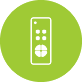</td>
      <td>KH Air Controller</td>
      <td>It can be compatible with ASK modulated 315, 433 RF remote control equipment and infrared remote control equipment, such as air-conditioned TV, electric curtains, etc. You can set one-button, timed, link three intelligent scenes, Security features, can be used with products, infrared, sound and light alarms, cameras, gas detectors, etc., can also set up telephone alarm function, Currently, it can be docked with Tmall Elim Sounds, docked with Duters and Gossi fingerprint locks.</td>
      <td>693948.aircondition.khp</td>
      <td></td>
    </tr>
    <tr>
      <th>233</th>
      <td></td>
      <td>King</td>
      <td>1.5P on-hook KFRd-35GW/KH1-C1</td>
      <td>viomi.aircondition.v7</td>
      <td>KFRd-35GW/KH1-C1</td>
    </tr>
    <tr>
      <th>234</th>
      <td></td>
      <td>King (1P)</td>
      <td>1P on hook KFRd-26GW/KH1-C1</td>
      <td>viomi.aircondition.v6</td>
      <td>KFRd-26GW/KH1-C1</td>
    </tr>
    <tr>
      <th>235</th>
      <td></td>
      <td>King 1A 1.5P</td>
      <td>erp code: 50.01.01.01.0039 69 yards: 6923185613503 Product model: KFRd-35GW/K2PC1-A1</td>
      <td>viomi.aircondition.v35</td>
      <td>KFRd-35GW/K2PC1-A1</td>
    </tr>
    <tr>
      <th>236</th>
      <td></td>
      <td>King 1A 1P</td>
      <td>erp code: 50.01.01.01.0037 69 yards: 6923185613480 Product model: KFRd-26GW/K2PC1-A1</td>
      <td>viomi.aircondition.v34</td>
      <td>KFRd-26GW/K2PC1-A1</td>
    </tr>
    <tr>
      <th>237</th>
      <td></td>
      <td>King 1S</td>
      <td>1.5P on-hook KFRd-35GW/KV1-C1</td>
      <td>viomi.aircondition.v8</td>
      <td>KFRd-35GW/KV1-C1</td>
    </tr>
    <tr>
      <th>238</th>
      <td></td>
      <td>King 1S (Rou Feng) 1.5P</td>
      <td>erp code: 50.01.01.01.0031 69 yards: 6923185613428 Product model: KFRd-35GW/K1RB1-A1</td>
      <td>viomi.aircondition.v31</td>
      <td>KFRd-35GW/K1RB1-A1</td>
    </tr>
    <tr>
      <th>239</th>
      <td></td>
      <td>King 1X 1.5P</td>
      <td>erp code: 50.01.01.01.0035 69 yards: 6923185613466 Product model: KFRd-35GW/K1QB2-A1</td>
      <td>viomi.aircondition.v33</td>
      <td>KFRd-35GW/K1QB2-A1</td>
    </tr>
    <tr>
      <th>240</th>
      <td></td>
      <td>King 1X 1P</td>
      <td>erp code: 50.01.01.01.0033 69 yards: 6923185613442 Product model: KFRd-26GW/K1QB2-A1</td>
      <td>viomi.aircondition.v32</td>
      <td>KFRd-26GW/K1QB2-A1</td>
    </tr>
    <tr>
      <th>241</th>
      <td></td>
      <td>King Pro</td>
      <td>1.5P on-hook KFRd-35GW/KV2-C1</td>
      <td>viomi.aircondition.v26</td>
      <td>KFRd-35GW/KV2-C1</td>
    </tr>
    <tr>
      <th>242</th>
      <td></td>
      <td>King Pro-A</td>
      <td>erp code: 50.01.01.01.0029 69 yards: 6923185612322 Product model: KFRd-35GW/K1KA1-C1</td>
      <td>viomi.aircondition.v30</td>
      <td>KFRd-35GW/K1KA1-C1</td>
    </tr>
    <tr>
      <th>243</th>
      <td></td>
      <td>MIJIA Smart Air Conditioner (Energy Efficiency Level 3)</td>
      <td>Mijia inverter air conditioner, 1.5hp, level 3 energy efficiency</td>
      <td>zhimi.aircondition.ma1</td>
      <td></td>
    </tr>
    <tr>
      <th>244</th>
      <td></td>
      <td>MIJIA Smart Air Conditioner (Energy Efficiency Level 3)</td>
      <td>Mijia Internet Air Conditioner (Level 3 Energy Efficiency) OTA available</td>
      <td>zhimi.aircondition.ma3</td>
      <td>KFR-35GW-B1ZM-M3</td>
    </tr>
    <tr>
      <th>245</th>
      <td></td>
      <td>Maid White Air Conditioner</td>
      <td>An air conditioner that can be controlled by Maid White</td>
      <td>tih.aircondition.a12345</td>
      <td></td>
    </tr>
    <tr>
      <th>246</th>
      <td></td>
      <td>Mi Inverter Air Conditioner (1.5HP)</td>
      <td>Mijia Internet air conditioner inverter A02T, three-level energy efficiency</td>
      <td>xiaomi.aircondition.ma1</td>
      <td>KFR-35GW-B1ZM-M3</td>
    </tr>
    <tr>
      <th>247</th>
      <td></td>
      <td>Mi Inverter Air Conditioner (1.5HP, China Energy Label Level 1)</td>
      <td>Mijia Internet air conditioner inverter A04T, first-class energy efficiency</td>
      <td>xiaomi.aircondition.ma2</td>
      <td></td>
    </tr>
    <tr>
      <th>248</th>
      <td></td>
      <td>Mi Inverter Air Conditioner (Level 1 Energy Efficiency)</td>
      <td>Mijia Internet Air Conditioner (Level 1 Energy Efficiency) OTA available</td>
      <td>zhimi.aircondition.ma4</td>
      <td></td>
    </tr>
    <tr>
      <th>249</th>
      <td></td>
      <td>Mi Smart Air Conditioner A (1.5HP / Inverter / China Energy Label Level 1)</td>
      <td></td>
      <td>xiaomi.aircondition.mc2</td>
      <td></td>
    </tr>
    <tr>
      <th>250</th>
      <td></td>
      <td>Mi Smart Air Conditioner A (1.5HP / Inverter / China Energy Label Level <1)</td>
      <td></td>
      <td>xiaomi.aircondition.mc5</td>
      <td></td>
    </tr>
    <tr>
      <th>251</th>
      <td></td>
      <td>Mi Smart Air Conditioner A (1HP / Inverter / China Energy Label Level 1)</td>
      <td></td>
      <td>xiaomi.aircondition.mc1</td>
      <td></td>
    </tr>
    <tr>
      <th>252</th>
      <td></td>
      <td>Mi Smart Air Conditioner A (1HP / Inverter / China Energy Label Level <1)</td>
      <td></td>
      <td>xiaomi.aircondition.mc4</td>
      <td></td>
    </tr>
    <tr>
      <th>253</th>
      <td></td>
      <td>Mi Smart Air Conditioner C (1.5HP / Inverter / New China Energy Label Level 1)</td>
      <td></td>
      <td>xiaomi.aircondition.mh2</td>
      <td></td>
    </tr>
    <tr>
      <th>254</th>
      <td></td>
      <td>Mi Smart Air Conditioner C (1HP / Inverter / New China Energy Label Level 1)</td>
      <td></td>
      <td>xiaomi.aircondition.mh1</td>
      <td></td>
    </tr>
    <tr>
      <th>255</th>
      <td></td>
      <td>Mi Smart Air Conditioner C1 (1.5HP / Conventional / China Energy Label Level 3)</td>
      <td>Mijia Internet Air Conditioner C1 (1.5hp/fixed frequency/level 3 energy efficiency)</td>
      <td>xiaomi.aircondition.ma6</td>
      <td></td>
    </tr>
    <tr>
      <th>256</th>
      <td></td>
      <td>Mi Smart Air Conditioner C1 (1HP / Inverter / China Energy Label Level 1)</td>
      <td>Mijia Internet Air Conditioner C1 (Large 1HP/Inverter/Level 1 Energy Efficiency)</td>
      <td>xiaomi.aircondition.ma9</td>
      <td></td>
    </tr>
    <tr>
      <th>257</th>
      <td></td>
      <td>Mi Smart Air Conditioner X (1.5HP / Inverter / New China Energy Label Level 1)</td>
      <td></td>
      <td>xiaomi.aircondition.mt2</td>
      <td></td>
    </tr>
    <tr>
      <th>258</th>
      <td></td>
      <td>Mi Smart Air Conditioner X (1HP / Inverter / New China Energy Label Level 1)</td>
      <td></td>
      <td>xiaomi.aircondition.mt1</td>
      <td></td>
    </tr>
    <tr>
      <th>259</th>
      <td></td>
      <td>Mi Smart Gentle Breeze Air Conditioner (1.5HP / Inverter / New China Energy Label Level 1)</td>
      <td></td>
      <td>xiaomi.aircondition.mt4</td>
      <td></td>
    </tr>
    <tr>
      <th>260</th>
      <td></td>
      <td>Mi Smart Gentle Breeze Air Conditioner (1HP / Inverter / New China Energy Label Level 1)</td>
      <td></td>
      <td>xiaomi.aircondition.mt3</td>
      <td></td>
    </tr>
    <tr>
      <th>261</th>
      <td></td>
      <td>Mi Smart Gentle Breeze Vertical Air Conditioner (3HP / Inverter / New China Energy Label Level 1)</td>
      <td></td>
      <td>xiaomi.aircondition.mt5</td>
      <td></td>
    </tr>
    <tr>
      <th>262</th>
      <td></td>
      <td>Mi Smart Ultra Electricity Saving Air Conditioner (1.5HP/Inverter/New China Energy Label Level 1)</td>
      <td></td>
      <td>xiaomi.aircondition.mt8</td>
      <td></td>
    </tr>
    <tr>
      <th>263</th>
      <td></td>
      <td>Mi Smart Ultra Electricity Saving Air Conditioner (1.5HP/Inverter/New China Energy Label Level 3)</td>
      <td></td>
      <td>xiaomi.aircondition.mc8</td>
      <td></td>
    </tr>
    <tr>
      <th>264</th>
      <td></td>
      <td>Mi Smart Ultra Electricity Saving Air Conditioner (1HP/Inverter/New China Energy Label Level 1)</td>
      <td></td>
      <td>xiaomi.aircondition.mt7</td>
      <td></td>
    </tr>
    <tr>
      <th>265</th>
      <td></td>
      <td>Mi Smart Ultra Electricity Saving Air Conditioner (1HP/Inverter/New China Energy Label Level 3)</td>
      <td></td>
      <td>xiaomi.aircondition.mh3</td>
      <td></td>
    </tr>
    <tr>
      <th>266</th>
      <td></td>
      <td>Mi Smart Ultra Electricity Saving Vertical Air Conditioner (2HP/Inverter/New China Energy Label Level 1)</td>
      <td></td>
      <td>xiaomi.aircondition.c10</td>
      <td></td>
    </tr>
    <tr>
      <th>267</th>
      <td></td>
      <td>Mi Smart Ultra Electricity Saving Vertical Air Conditioner (2HP/Inverter/New China Energy Label Level 3)</td>
      <td></td>
      <td>xiaomi.aircondition.mc9</td>
      <td></td>
    </tr>
    <tr>
      <th>268</th>
      <td></td>
      <td>Mi Smart Ultra Electricity Saving Vertical Air Conditioner (3HP/Inverter/New China Energy Label Level 1)</td>
      <td></td>
      <td>xiaomi.aircondition.c11</td>
      <td></td>
    </tr>
    <tr>
      <th>269</th>
      <td></td>
      <td>Mi Smart Ultra Electricity Saving Vertical Air Conditioner (3HP/Inverter/New China Energy Label Level 3)</td>
      <td></td>
      <td>xiaomi.aircondition.c14</td>
      <td></td>
    </tr>
    <tr>
      <th>270</th>
      <td></td>
      <td>Mi Smart Vertical Air Conditioner A (2HP / Inverter / China Energy Label Level <1)</td>
      <td></td>
      <td>xiaomi.aircondition.mc6</td>
      <td></td>
    </tr>
    <tr>
      <th>271</th>
      <td></td>
      <td>Mi Smart Vertical Air Conditioner A (3HP / Inverter / China Energy Label Level <1)</td>
      <td></td>
      <td>xiaomi.aircondition.mc7</td>
      <td></td>
    </tr>
    <tr>
      <th>272</th>
      <td></td>
      <td>Mi Smart Vertical Air Conditioner C1 (2HP / Inverter / China Energy Label Level 1)</td>
      <td>Mijia Internet Vertical Air Conditioner C1 (2HP/Inverter/Level 1 Energy Efficiency)</td>
      <td>xiaomi.aircondition.ma5</td>
      <td></td>
    </tr>
    <tr>
      <th>273</th>
      <td></td>
      <td>Mi Vertical Air Conditioner (2HP)</td>
      <td></td>
      <td>xiaomi.aircondition.ma4</td>
      <td></td>
    </tr>
    <tr>
      <th>274</th>
      <td></td>
      <td>Midea AC-Cool Golden</td>
      <td>Midea WXA air conditioner</td>
      <td>midea.aircondition.xa1</td>
      <td></td>
    </tr>
    <tr>
      <th>275</th>
      <td></td>
      <td>Midea AC-i Youth</td>
      <td>Midea Smart Air Conditioner</td>
      <td>midea.aircondition.v1</td>
      <td></td>
    </tr>
    <tr>
      <th>276</th>
      <td></td>
      <td>Midea Central Air Conditioning</td>
      <td>Midea Central Air Conditioning</td>
      <td>tc0756.aircondition.49</td>
      <td></td>
    </tr>
    <tr>
      <th>277</th>
      <td></td>
      <td>Midea Central Air Conditioning</td>
      <td></td>
      <td>tc0756.aircondition.49b</td>
      <td></td>
    </tr>
    <tr>
      <th>278</th>
      <td></td>
      <td>Midea air conditioner-cool gold</td>
      <td>Cool gold mw300</td>
      <td>midea.aircondition.xa2</td>
      <td></td>
    </tr>
    <tr>
      <th>279</th>
      <td></td>
      <td>Milano (Rou Feng) 1.5P</td>
      <td>erp code: 50.01.01.01.0047 69 yards: 6923185613589 Product model: KFRd-35GW/Y2QB4-A1</td>
      <td>viomi.aircondition.y8</td>
      <td>KFRd-35GW/Y2QB4-A1</td>
    </tr>
    <tr>
      <th>280</th>
      <td></td>
      <td>Milano (Rou Feng) 1P</td>
      <td>erp code: 50.01.01.01.0045 69 yards: 6923185613565 Product model: KFRd-26GW/Y2QB4-A1</td>
      <td>viomi.aircondition.y7</td>
      <td>KFRd-26GW/Y2QB4-A1</td>
    </tr>
    <tr>
      <th>281</th>
      <td></td>
      <td>Milano (Rou Feng) 2P</td>
      <td>erp code: 50.01.01.02.0013 69 yards: 6923185612346 Product model: KFRd-51LW/Y3PD1-A1</td>
      <td>viomi.aircondition.y1</td>
      <td>KFRd-51LW/Y3PD1-A1</td>
    </tr>
    <tr>
      <th>282</th>
      <td></td>
      <td>Milano (Rou Feng) 3P</td>
      <td>erp code: 50.01.01.02.0015 69 yards: 6923185612360 Product model: KFRd-72LW/Y3PD1-A1</td>
      <td>viomi.aircondition.y2</td>
      <td>KFRd-72LW/Y3PD1-A1</td>
    </tr>
    <tr>
      <th>283</th>
      <td></td>
      <td>Milano 1.5P</td>
      <td>erp code: 50.01.01.01.0027 69 yards: 6923185612247 Product model: KFRd-35GW/Y3PD1-A1</td>
      <td>viomi.aircondition.y10</td>
      <td>KFRd-35GW/Y3PD1-A1</td>
    </tr>
    <tr>
      <th>284</th>
      <td></td>
      <td>Milano 1C 2P (New Energy Efficiency)</td>
      <td>erp code: 50.01.01.02.0041 69 yards: 6923185616832 Product model: KFRd-51LW/Y4PC2-A3</td>
      <td>viomi.aircondition.y37</td>
      <td>KFRd-51LW/Y4PC2-A3</td>
    </tr>
    <tr>
      <th>285</th>
      <td></td>
      <td>Milano 1C 3P (New Energy Efficiency)</td>
      <td>erp code: 50.01.01.02.0043 69 yards: 6923185616856 Product model: KFRd-72LW/Y4PC2-A3</td>
      <td>viomi.aircondition.y38</td>
      <td>KFRd-72LW/Y4PC2-A3</td>
    </tr>
    <tr>
      <th>286</th>
      <td></td>
      <td>Milano 1N 1.5P</td>
      <td>erp code: 50.01.01.01.0061 Code 69: 6923185615156 Product model: KFRd-35GW/Y2PD2-A1</td>
      <td>viomi.aircondition.y28</td>
      <td>KFRd-35GW/Y2PD2-A1</td>
    </tr>
    <tr>
      <th>287</th>
      <td></td>
      <td>Milano 1N 1P</td>
      <td>erp code: 50.01.01.01.0063 69 yards: 6923185615132 Product model: KFRd-26GW/Y2PD2-A1</td>
      <td>viomi.aircondition.y27</td>
      <td>KFRd-26GW/Y2PD2-A1</td>
    </tr>
    <tr>
      <th>288</th>
      <td></td>
      <td>Milano 1P</td>
      <td>erp code: 50.01.01.01.0025 69 yards: 6923185612223 Product model: KFRd-26GW/Y3PD1-A1</td>
      <td>viomi.aircondition.y9</td>
      <td>KFRd-26GW/Y3PD1-A1</td>
    </tr>
    <tr>
      <th>289</th>
      <td></td>
      <td>Milano 1S (Rou Feng) 1.5P</td>
      <td>erp code: 50.01.01.01.0043 69 yards: 6923185613541 Product model: KFRd-35GW/Y2RB3-A1</td>
      <td>viomi.aircondition.y6</td>
      <td>KFRd-35GW/Y2RB3-A1</td>
    </tr>
    <tr>
      <th>290</th>
      <td></td>
      <td>Milano 1S (Rou Feng) 1P</td>
      <td>erp code: 50.01.01.01.0041 69 yards: 6923185613527 Product model: KFRd-26GW/Y2RB3-A1</td>
      <td>viomi.aircondition.y5</td>
      <td>KFRd-26GW/Y2RB3-A1</td>
    </tr>
    <tr>
      <th>291</th>
      <td></td>
      <td>Milano 2P</td>
      <td>erp code: 50.01.01.02.0007 69 yards: 6923185612261 Product model: KFRd-51LW/Y4PC1-C3</td>
      <td>viomi.aircondition.y3</td>
      <td>KFRd-51LW/Y4PC1-C3</td>
    </tr>
    <tr>
      <th>292</th>
      <td></td>
      <td>Milano 3P</td>
      <td>erp code: 50.01.01.02.0009 69 yards: 6923185612285 Product model: KFRd-72LW/Y4PC1-C3</td>
      <td>viomi.aircondition.y4</td>
      <td>KFRd-72LW/Y4PC1-C3</td>
    </tr>
    <tr>
      <th>293</th>
      <td></td>
      <td>Mitsubishi Heavy Industries Haier Smart Air Conditioner</td>
      <td></td>
      <td>mhaq.aircondition.miair</td>
      <td></td>
    </tr>
    <tr>
      <th>294</th>
      <td></td>
      <td>MxiControlCAC</td>
      <td>This product can be connected to control the household central air conditioner. The supported functions include the control of switch, mode, temperature, wind speed, etc., and can monitor the current state of the central air conditioner.Currently supported central air-conditioning brands include Daikin, Hitachi, Toshiba, Mitsubishi Electric, Hisense, Haier, Panasonic, York, Mitsubishi Heavy Industries, Midea, LG, Oaks, Bosch, Gree, Samsung, etc.</td>
      <td>maxi.aircondition.b01x</td>
      <td></td>
    </tr>
    <tr>
      <th>295</th>
      <td></td>
      <td>NWT Internet Portable Air Conditioner</td>
      <td>NWT Internet mobile air conditioner</td>
      <td>nwt.aircondition.26eaw1</td>
      <td></td>
    </tr>
    <tr>
      <th>296</th>
      <td></td>
      <td>Navi  (Rou Feng) 3P</td>
      <td>erp code: 50.01.01.02.0055 69 yards: 6923185617242 Product model: KFRd-72LW/Y2RD2-A1</td>
      <td>viomi.aircondition.y54</td>
      <td>KFRd-72LW/Y2RD2-A1</td>
    </tr>
    <tr>
      <th>297</th>
      <td></td>
      <td>Navi (Rou Feng) 2P</td>
      <td>erp code: 50.01.01.02.0053 69 yards: 6923185617228 Product model: KFRd-51LW/Y2RD2-A1</td>
      <td>viomi.aircondition.y53</td>
      <td>KFRd-51LW/Y2RD2-A1</td>
    </tr>
    <tr>
      <th>298</th>
      <td></td>
      <td>Navi 1.5P</td>
      <td>erp code: 50.01.01.01.0145 69 yards: 6923185617389 Product model: KFRd-35GW/Y2PD3-A1</td>
      <td>viomi.aircondition.y56</td>
      <td>KFRd-35GW/Y2PD3-A1</td>
    </tr>
    <tr>
      <th>299</th>
      <td></td>
      <td>Navi 1P</td>
      <td>erp code: 50.01.01.01.0147 69 yards: 6923185617365 Product model: KFRd-26GW/Y2PD3-A1</td>
      <td>viomi.aircondition.y55</td>
      <td>KFRd-26GW/Y2PD3-A1</td>
    </tr>
    <tr>
      <th>300</th>
      <td></td>
      <td>Online-Air Conditioner Plug</td>
      <td>For online products, please do not change if you don't need it.</td>
      <td>scinan.aircondition.online</td>
      <td></td>
    </tr>
    <tr>
      <th>301</th>
      <td></td>
      <td>PTX central air conditioning controller</td>
      <td>The central air-conditioning controller cooperates with the air-conditioning gateway to connect all control panels of the central air-conditioning system to the Mijia system.</td>
      <td>090615.aircondition.lnk</td>
      <td></td>
    </tr>
    <tr>
      <th>302</th>
      <td></td>
      <td>QJ_WK</td>
      <td>Central air conditioning controller</td>
      <td>linked.aircondition.st1</td>
      <td></td>
    </tr>
    <tr>
      <th>303</th>
      <td></td>
      <td>Remote control master-wifi to infrared-air conditioner</td>
      <td>Remote control master-wifi to infrared-air conditioner</td>
      <td>coolki.aircondition.yk7</td>
      <td></td>
    </tr>
    <tr>
      <th>304</th>
      <td></td>
      <td>Remote control master-wifi to infrared-air conditioner</td>
      <td>Remote control master-wifi to infrared-air conditioner</td>
      <td>zhihw.aircondition.yk7</td>
      <td></td>
    </tr>
    <tr>
      <th>305</th>
      <td></td>
      <td>Royal</td>
      <td>2P cabinet machine KFRd-51LW/KH1-C1</td>
      <td>viomi.aircondition.v9</td>
      <td>KFRd-51LW/KH1-C1</td>
    </tr>
    <tr>
      <th>306</th>
      <td></td>
      <td>Royal (AI Yu Yin) 2P</td>
      <td>erp code: 50.01.01.02.0019 69 yards: 6923185613404 Product model: KFRd-51LW/K2YB2-A1</td>
      <td>viomi.aircondition.v28</td>
      <td>KFRd-51LW/K2YB2-A1</td>
    </tr>
    <tr>
      <th>307</th>
      <td></td>
      <td>Royal (AI Yu Yin) 3P</td>
      <td>erp code: 50.01.01.02.0017 69 yards: 6923185612384 Product model: KFRd-72LW/K2YB2-A1</td>
      <td>viomi.aircondition.v29</td>
      <td>KFRd-72LW/K2YB2-A1</td>
    </tr>
    <tr>
      <th>308</th>
      <td></td>
      <td>Royal Pro</td>
      <td>3P cabinet machine KFRd-72LW/KV1-C1</td>
      <td>viomi.aircondition.v10</td>
      <td>KFRd-72LW/KV1-C1</td>
    </tr>
    <tr>
      <th>309</th>
      <td></td>
      <td>SDF</td>
      <td></td>
      <td>heiman.aircondition.rc1</td>
      <td></td>
    </tr>
    <tr>
      <th>310</th>
      <td></td>
      <td>Sanheng System</td>
      <td>Constant temperature, constant humidity, constant oxygen, smart</td>
      <td>zkea.aircondition.zkea</td>
      <td></td>
    </tr>
    <tr>
      <th>311</th>
      <td></td>
      <td>Small air conditioner</td>
      <td></td>
      <td>tyzhjt.aircondition.air</td>
      <td></td>
    </tr>
    <tr>
      <th>312</th>
      <td></td>
      <td>Smart 1.5P</td>
      <td>erp code: 50.01.01.01.0139 Code 69: 692318567082 Product model: KFRd-35GW/Y4PM3-A3</td>
      <td>viomi.aircondition.y50</td>
      <td>KFRd-35GW/Y4PM3-A3</td>
    </tr>
    <tr>
      <th>313</th>
      <td></td>
      <td>Smart 1C 1.5P</td>
      <td>erp code: 50.01.01.01.0135 69 yards: 6923185617044 Product model: KFRd-35GW/Y4PM2-A3</td>
      <td>viomi.aircondition.y46</td>
      <td>KFRd-35GW/Y4PM2-A3</td>
    </tr>
    <tr>
      <th>314</th>
      <td></td>
      <td>Smart 1C 1P</td>
      <td>erp code: 50.01.01.01.0133 69 yards: 6923185617020 Product model: KFRd-26GW/Y4PM2-A3</td>
      <td>viomi.aircondition.y45</td>
      <td>KFRd-26GW/Y4PM2-A3</td>
    </tr>
    <tr>
      <th>315</th>
      <td></td>
      <td>Smart 1P</td>
      <td>erp code: 50.01.01.01.0137 69 yards: 6923185617068 Product model: KFRd-26GW/Y4PM3-A3</td>
      <td>viomi.aircondition.y49</td>
      <td>KFRd-26GW/Y4PM3-A3</td>
    </tr>
    <tr>
      <th>316</th>
      <td></td>
      <td>Smart 1S 1.5P</td>
      <td>erp code: 50.01.01.01.0131 69 yards: 6923185617006 Product model: KFRd-35GW/Y3PM1-A1</td>
      <td>viomi.aircondition.y44</td>
      <td>KFRd-35GW/Y3PM1-A1</td>
    </tr>
    <tr>
      <th>317</th>
      <td></td>
      <td>Smart 1S 1P</td>
      <td>erp code: 50.01.01.01.0129 69 yards: 6923185616986 Product model: KFRd-26GW/Y3PM1-A1</td>
      <td>viomi.aircondition.y43</td>
      <td>KFRd-26GW/Y3PM1-A1</td>
    </tr>
    <tr>
      <th>318</th>
      <td></td>
      <td>Smart 1X 1.5P</td>
      <td>erp code: 50.01.01.01.0143 69 yards: 6923185617204 Product model: KFRd-35GW/Y3PM4-A1</td>
      <td>viomi.aircondition.y48</td>
      <td>KFRd-35GW/Y3PM4-A1</td>
    </tr>
    <tr>
      <th>319</th>
      <td></td>
      <td>Smart 1X 1P</td>
      <td>erp code: 50.01.01.01.0141 69 yards: 6923185617181 Product model: KFRd-26GW/Y3PM4-A1</td>
      <td>viomi.aircondition.y47</td>
      <td>KFRd-26GW/Y3PM4-A1</td>
    </tr>
    <tr>
      <th>320</th>
      <td></td>
      <td>Smart 1X 2P</td>
      <td>erp code: 50.01.01.02.0031 69 yards: 6923185615255 Product model: KFRd-51LW/Y3RE3-A1</td>
      <td>viomi.aircondition.y59</td>
      <td>KFRd-51LW/Y3RE3-A1</td>
    </tr>
    <tr>
      <th>321</th>
      <td></td>
      <td>Smart 1X 3P</td>
      <td>erp code: 50.01.01.02.0033 69 yards: 6923185615279 Product model: KFRd-72LW/Y3RE3-A1</td>
      <td>viomi.aircondition.y60</td>
      <td>KFRd-72LW/Y3RE3-A1</td>
    </tr>
    <tr>
      <th>322</th>
      <td></td>
      <td>Smart 2P</td>
      <td>erp code: 50.01.01.02.0049 69 yards: 6923185617143 Product model: KFRd-51LW/Y4RE2-A3</td>
      <td>viomi.aircondition.y57</td>
      <td>KFRd-51LW/Y4RE2-A3</td>
    </tr>
    <tr>
      <th>323</th>
      <td></td>
      <td>Smart 3P</td>
      <td>erp code: 50.01.01.02.0051 69 yards: 6923185617167 Product model: KFRd-72LW/Y4RE2-A3</td>
      <td>viomi.aircondition.y58</td>
      <td>KFRd-72LW/Y4RE2-A3</td>
    </tr>
    <tr>
      <th>324</th>
      <td></td>
      <td>Smart air conditioner</td>
      <td></td>
      <td>alive.aircondition.air1</td>
      <td></td>
    </tr>
    <tr>
      <th>325</th>
      <td></td>
      <td>Smart air conditioner</td>
      <td>Smart air conditioner</td>
      <td>ecloud.airc.eq</td>
      <td></td>
    </tr>
    <tr>
      <th>326</th>
      <td></td>
      <td>Smart air conditioner</td>
      <td></td>
      <td>thing.airc.air</td>
      <td></td>
    </tr>
    <tr>
      <th>327</th>
      <td></td>
      <td>Smartmi Smart Air Conditioner</td>
      <td>Zhimi full DC inverter air conditioner</td>
      <td>zhimi.aircondition.v1</td>
      <td>KFR-35GW/02ZM, KFR-35GW-B1ZM-M3</td>
    </tr>
    <tr>
      <th>328</th>
      <td></td>
      <td>Smartmi Smart Air Conditioner</td>
      <td>Zhimi full DC inverter air conditioner</td>
      <td>zhimi.aircondition.v2</td>
      <td></td>
    </tr>
    <tr>
      <th>329</th>
      <td></td>
      <td>Smartmi inventer air conditioner 1A</td>
      <td>Zhimi Full DC Inverter Air Conditioner Economy Edition 1.5HP Class 1 Energy Efficiency</td>
      <td>zhimi.aircondition.va1</td>
      <td></td>
    </tr>
    <tr>
      <th>330</th>
      <td></td>
      <td>Smartmi inventer air conditioner 2 (Engergy Level 1)</td>
      <td>Zhimi Inverter Air Conditioner 2 (1.5HP Class 1 energy efficiency)</td>
      <td>zhimi.aircondition.za1</td>
      <td></td>
    </tr>
    <tr>
      <th>331</th>
      <td></td>
      <td>Smartmi inventer air conditioner 2 (Engergy Level 3)</td>
      <td>Zhimi Inverter Air Conditioner 2 (1.5HP Level 3 Energy Efficiency)</td>
      <td>zhimi.aircondition.za2</td>
      <td></td>
    </tr>
    <tr>
      <th>332</th>
      <td></td>
      <td>Sumi central air conditioning controller</td>
      <td>Central Air Conditioning Wire Control Module (485)</td>
      <td>qdhkl.aircondition.md01</td>
      <td></td>
    </tr>
    <tr>
      <th>333</th>
      <td></td>
      <td>VINO Inverter Air Conditioner</td>
      <td>VINO inverter air conditioner 2 horses 2 energy efficiency</td>
      <td>aden.aircondition.a4</td>
      <td></td>
    </tr>
    <tr>
      <th>334</th>
      <td></td>
      <td>VINO Inverter Air Conditioner (Energy Label Level 1)</td>
      <td>VINO inverter air conditioner (level 1 energy efficiency)</td>
      <td>aden.aircondition.a2</td>
      <td></td>
    </tr>
    <tr>
      <th>335</th>
      <td></td>
      <td>VINO Inverter Air Conditioner (Energy Label Level 3)</td>
      <td>VINO inverter air conditioner (three-level energy efficiency)</td>
      <td>aden.aircondition.a1</td>
      <td></td>
    </tr>
    <tr>
      <th>336</th>
      <td></td>
      <td>VINO Inverter Air Conditioner 2P (New Energy Label Level 2)</td>
      <td>VINO inverter air conditioner 2hp (new second level energy efficiency)</td>
      <td>aden.aircondition.a7</td>
      <td></td>
    </tr>
    <tr>
      <th>337</th>
      <td></td>
      <td>VINO Inverter Air Conditioner 3P (New Energy Label Level 2)</td>
      <td>VINO inverter air conditioner 3hp (new second level energy efficiency)</td>
      <td>aden.airc.a6</td>
      <td></td>
    </tr>
    <tr>
      <th>338</th>
      <td></td>
      <td>VRV Gateway</td>
      <td>Connect to Japanese VRV air conditioners such as Daikin, Toshiba, Mitsubishi, Hitachi, etc.</td>
      <td>knx.aircondition.kac</td>
      <td></td>
    </tr>
    <tr>
      <th>339</th>
      <td></td>
      <td>Xiaoyan central air conditioning controller</td>
      <td></td>
      <td>terncy.aircondition.vg1</td>
      <td></td>
    </tr>
    <tr>
      <th>340</th>
      <td></td>
      <td>Youth version thermostat</td>
      <td></td>
      <td>linked.aircondition.st8</td>
      <td></td>
    </tr>
    <tr>
      <th>341</th>
      <td></td>
      <td>Youth version thermostat (Bluetooth version)</td>
      <td>Youth version thermostat (Bluetooth version)</td>
      <td>linked.aircondition.st4</td>
      <td></td>
    </tr>
    <tr>
      <th>342</th>
      <td></td>
      <td>ZJ Air conditioning controller</td>
      <td></td>
      <td>zhijia.aircondition.ktq</td>
      <td></td>
    </tr>
    <tr>
      <th>343</th>
      <td></td>
      <td>ZTE Deshun Air Conditioning</td>
      <td>ZTE Deshun Air Conditioning</td>
      <td>tc0756.aircondition.39</td>
      <td></td>
    </tr>
    <tr>
      <th>344</th>
      <td></td>
      <td>air</td>
      <td>air conditioning</td>
      <td>cgzn.aircondition.air</td>
      <td></td>
    </tr>
    <tr>
      <th>345</th>
      <td></td>
      <td>air</td>
      <td>Control the temperature and setting mode of the air conditioner</td>
      <td>zunder.aircondition.air</td>
      <td></td>
    </tr>
    <tr>
      <th>346</th>
      <td></td>
      <td>air conditioning</td>
      <td>Infrared air conditioner supported by Aiyun Intelligent Universal Infrared Remote Control.</td>
      <td>ayzn.aircondition.i1</td>
      <td></td>
    </tr>
    <tr>
      <th>347</th>
      <td></td>
      <td>air conditioning</td>
      <td></td>
      <td>bright.aircondition.air</td>
      <td></td>
    </tr>
    <tr>
      <th>348</th>
      <td></td>
      <td>air conditioning</td>
      <td>General air conditioning equipment</td>
      <td>dctrls.aircondition.common</td>
      <td></td>
    </tr>
    <tr>
      <th>349</th>
      <td></td>
      <td>air conditioning</td>
      <td></td>
      <td>deocea.aircondition.cq</td>
      <td></td>
    </tr>
    <tr>
      <th>350</th>
      <td></td>
      <td>air conditioning</td>
      <td></td>
      <td>dnake.aircondition.air</td>
      <td></td>
    </tr>
    <tr>
      <th>351</th>
      <td></td>
      <td>air conditioning</td>
      <td></td>
      <td>eide.aircondition.air</td>
      <td></td>
    </tr>
    <tr>
      <th>352</th>
      <td></td>
      <td>air conditioning</td>
      <td></td>
      <td>fine.aircondition.cl</td>
      <td></td>
    </tr>
    <tr>
      <th>353</th>
      <td></td>
      <td>air conditioning</td>
      <td></td>
      <td>future.aircondition.ac</td>
      <td></td>
    </tr>
    <tr>
      <th>354</th>
      <td></td>
      <td>air conditioning</td>
      <td></td>
      <td>giz.aircondition.kt001</td>
      <td></td>
    </tr>
    <tr>
      <th>355</th>
      <td></td>
      <td>air conditioning</td>
      <td></td>
      <td>hbkj1.aircondition.v1</td>
      <td></td>
    </tr>
    <tr>
      <th>356</th>
      <td></td>
      <td>air conditioning</td>
      <td>air conditioning</td>
      <td>hosjoy.aircondition.hos</td>
      <td></td>
    </tr>
    <tr>
      <th>357</th>
      <td></td>
      <td>air conditioning</td>
      <td>Haoxiangjia Air Conditioner</td>
      <td>hosjoy.aircondition.tt</td>
      <td></td>
    </tr>
    <tr>
      <th>358</th>
      <td>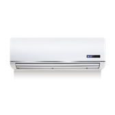</td>
      <td>air conditioning</td>
      <td>No certification trademark required</td>
      <td>ihome.aircondition.eaac</td>
      <td></td>
    </tr>
    <tr>
      <th>359</th>
      <td></td>
      <td>air conditioning</td>
      <td>Infrared air conditioner</td>
      <td>ikecin.aircondition.ir1</td>
      <td></td>
    </tr>
    <tr>
      <th>360</th>
      <td></td>
      <td>air conditioning</td>
      <td></td>
      <td>jusval.aircondition.1</td>
      <td></td>
    </tr>
    <tr>
      <th>361</th>
      <td></td>
      <td>air conditioning</td>
      <td></td>
      <td>juzi.aircondition.050101</td>
      <td></td>
    </tr>
    <tr>
      <th>362</th>
      <td></td>
      <td>air conditioning</td>
      <td></td>
      <td>jyx.aircondition.016301</td>
      <td></td>
    </tr>
    <tr>
      <th>363</th>
      <td></td>
      <td>air conditioning</td>
      <td></td>
      <td>milamp.aircondition.air</td>
      <td></td>
    </tr>
    <tr>
      <th>364</th>
      <td></td>
      <td>air conditioning</td>
      <td></td>
      <td>mkzn.aircondition.kt</td>
      <td></td>
    </tr>
    <tr>
      <th>365</th>
      <td></td>
      <td>air conditioning</td>
      <td></td>
      <td>p2c.aircondition.air</td>
      <td></td>
    </tr>
    <tr>
      <th>366</th>
      <td></td>
      <td>air conditioning</td>
      <td></td>
      <td>simon.aircondition.ac</td>
      <td></td>
    </tr>
    <tr>
      <th>367</th>
      <td></td>
      <td>air conditioning</td>
      <td></td>
      <td>srkj.aircondition.v001</td>
      <td></td>
    </tr>
    <tr>
      <th>368</th>
      <td></td>
      <td>air conditioning</td>
      <td>air conditioning</td>
      <td>tbsy.aircondition.123</td>
      <td></td>
    </tr>
    <tr>
      <th>369</th>
      <td></td>
      <td>air conditioning</td>
      <td></td>
      <td>wlank.aircondition.001</td>
      <td></td>
    </tr>
    <tr>
      <th>370</th>
      <td></td>
      <td>air conditioning</td>
      <td>air conditioning</td>
      <td>xzh.aircondition.air</td>
      <td></td>
    </tr>
    <tr>
      <th>371</th>
      <td></td>
      <td>air conditioning</td>
      <td></td>
      <td>ykkj.aircondition.ykm04</td>
      <td></td>
    </tr>
    <tr>
      <th>372</th>
      <td></td>
      <td>air conditioning</td>
      <td>air conditioning</td>
      <td>yongqi.aircondition.ac</td>
      <td></td>
    </tr>
    <tr>
      <th>373</th>
      <td></td>
      <td>air-conditioner remote</td>
      <td>Smart remote air conditioner remote control products</td>
      <td>yszj.aircondition.f0025</td>
      <td></td>
    </tr>
    <tr>
      <th>374</th>
      <td></td>
      <td>aircondition</td>
      <td>The black remote controls the smart home air conditioner of the smart house</td>
      <td>123888.aircondition.z</td>
      <td></td>
    </tr>
    <tr>
      <th>375</th>
      <td></td>
      <td>aircondition</td>
      <td></td>
      <td>juhl.aircondition.a11</td>
      <td></td>
    </tr>
    <tr>
      <th>376</th>
      <td></td>
      <td>aircondition</td>
      <td></td>
      <td>wd7qt6.aircondition.air</td>
      <td></td>
    </tr>
    <tr>
      <th>377</th>
      <td></td>
      <td>aricondition</td>
      <td></td>
      <td>btiot.aircondition.air</td>
      <td></td>
    </tr>
    <tr>
      <th>378</th>
      <td></td>
      <td>aux-air condition</td>
      <td>Hang up</td>
      <td>aux.aircondition.test1</td>
      <td></td>
    </tr>
    <tr>
      <th>379</th>
      <td></td>
      <td>aux-air condition</td>
      <td>Guiji</td>
      <td>aux.aircondition.test2</td>
      <td></td>
    </tr>
    <tr>
      <th>380</th>
      <td></td>
      <td>delianAir</td>
      <td></td>
      <td>delian.aircondition.de</td>
      <td></td>
    </tr>
    <tr>
      <th>381</th>
      <td></td>
      <td>ductedAir</td>
      <td>Suitable for fan-coil central air-conditioning and fan-coil central air-conditioning (3h1)</td>
      <td>uiot.aircondition.air1</td>
      <td></td>
    </tr>
    <tr>
      <th>382</th>
      <td></td>
      <td>floor heat</td>
      <td>Suitable for water floor heating central air conditioning, water floor heating central air conditioning (3h1) and electric floor heating central air conditioning</td>
      <td>uiot.aircondition.air2</td>
      <td></td>
    </tr>
    <tr>
      <th>383</th>
      <td></td>
      <td>hosjoy+</td>
      <td>VRV air conditioning intelligent control</td>
      <td>iracc.aircondition.d19</td>
      <td></td>
    </tr>
    <tr>
      <th>384</th>
      <td></td>
      <td>iCool 1.5P</td>
      <td>erp code: 50.01.01.01.0017 69 yards: 6923185612179 Product model: KFRd-35GW/Y4PE1-C3</td>
      <td>viomi.aircondition.y14</td>
      <td>KFRd-35GW/Y4PE1-C3</td>
    </tr>
    <tr>
      <th>385</th>
      <td></td>
      <td>iCool 1.5P (New Energy Efficiency)</td>
      <td>erp encoding: 69 yards: 6923185616276 Product model: KFRd-35GW/Y4PE2-A3</td>
      <td>viomi.aircondition.y32</td>
      <td>KFRd-35GW/Y4PE2-A3</td>
    </tr>
    <tr>
      <th>386</th>
      <td></td>
      <td>iCool 1C 1.5P</td>
      <td>erp code: 50.01.01.01.0051 69 yards: 6923185613626 Product model: KFRd-35GW/Y4PC2-C3</td>
      <td>viomi.aircondition.y12</td>
      <td>KFRd-35GW/Y4PC2-C3</td>
    </tr>
    <tr>
      <th>387</th>
      <td></td>
      <td>iCool 1C 1P</td>
      <td>erp code: 50.01.01.01.0049 69 yards: 692318561362 Product model: KFRd-26GW/Y4PC2-C3</td>
      <td>viomi.aircondition.y11</td>
      <td>KFRd-26GW/Y4PC2-C3</td>
    </tr>
    <tr>
      <th>388</th>
      <td></td>
      <td>iCool 1H 1.5P</td>
      <td></td>
      <td>viomi.aircondition.y34</td>
      <td></td>
    </tr>
    <tr>
      <th>389</th>
      <td></td>
      <td>iCool 1H 1P</td>
      <td>erp code: 50.01.01.01.0121 69 yards: 6923185616757 Product model: KFRd-26GW/Y4PE4-A3</td>
      <td>viomi.aircondition.y33</td>
      <td>KFRd-26GW/Y4PE4-A3</td>
    </tr>
    <tr>
      <th>390</th>
      <td></td>
      <td>iCool 1N 1.5P</td>
      <td>erp code: 50.01.01.01.0089 69 yards: 6923185615835 Product model: KFRd-35GW/Y4PK2-C3</td>
      <td>viomi.aircondition.y26</td>
      <td>KFRd-35GW/Y4PK2-C3</td>
    </tr>
    <tr>
      <th>391</th>
      <td></td>
      <td>iCool 1P</td>
      <td>erp code: 50.01.01.01.0015 69 yards: 6923185612155 Product model: KFRd-26GW/Y4PE1-C3</td>
      <td>viomi.aircondition.y13</td>
      <td>KFRd-26GW/Y4PE1-C3</td>
    </tr>
    <tr>
      <th>392</th>
      <td></td>
      <td>iCool 1P (New Energy Efficiency)</td>
      <td>erp encoding: 69 yards: 6923185616252 Product model: KFRd-26GW/Y4PE2-A3</td>
      <td>viomi.aircondition.y31</td>
      <td>KFRd-26GW/Y4PE2-A3</td>
    </tr>
    <tr>
      <th>393</th>
      <td></td>
      <td>iCool 1R 1.5P</td>
      <td>erp code: 50.01.01.01.0127 69 yards: 6923185616818 Product model: KFRd-35GW/Y3PE3-A1</td>
      <td>viomi.aircondition.y36</td>
      <td>KFRd-35GW/Y3PE3-A1</td>
    </tr>
    <tr>
      <th>394</th>
      <td></td>
      <td>iCool 1R 1P</td>
      <td>erp code: 50.01.01.01.0125 69 yards: 6923185616795 Product model: KFRd-26GW/Y3PE3-A1</td>
      <td>viomi.aircondition.y35</td>
      <td>KFRd-26GW/Y3PE3-A1</td>
    </tr>
    <tr>
      <th>395</th>
      <td></td>
      <td>iCool 1S 1.5P</td>
      <td>ERP code: 50.01.01.01.0053 69 yards: 6923185614005 Product model: KFRd-35GW/Y3PC3-C1</td>
      <td>viomi.aircondition.y15</td>
      <td>KFRd-35GW/Y3PC3-C1</td>
    </tr>
    <tr>
      <th>396</th>
      <td></td>
      <td>iCool 1S 1.5P (New Energy Efficiency)</td>
      <td>erp code: 50.01.01.01.0071 69 yards: 6923185615194 Product model: KFRd-35GW/Y3PC5-A1</td>
      <td>viomi.aircondition.y30</td>
      <td>KFRd-35GW/Y3PC5-A1</td>
    </tr>
    <tr>
      <th>397</th>
      <td></td>
      <td>iCool 1S 1P (New Energy Efficiency)</td>
      <td>erp code: 50.01.01.01.0069 69 yards: 6923185615170 Product model: KFRd-26GW/Y3PC5-A1</td>
      <td>viomi.aircondition.y29</td>
      <td>KFRd-26GW/Y3PC5-A1</td>
    </tr>
    <tr>
      <th>398</th>
      <td></td>
      <td>iCool 1V 1.5P</td>
      <td>erp code: 50.01.01.01.0087 69 yards: 6923185615811 Product model: KFRd-35GW/Y3PK1-C1</td>
      <td>viomi.aircondition.y25</td>
      <td>KFRd-35GW/Y3PK1-C1</td>
    </tr>
    <tr>
      <th>399</th>
      <td></td>
      <td>iCool 2P</td>
      <td>erp code: 50.01.01.02.0045 69 yards: 6923185617105 Product model: KFRd-51LW/Y2RF1-A1</td>
      <td>viomi.aircondition.y51</td>
      <td>KFRd-51LW/Y2RF1-A1</td>
    </tr>
    <tr>
      <th>400</th>
      <td></td>
      <td>iCool 3P</td>
      <td>erp code: 50.01.01.02.0047 69 yards: 6923185617129 Product model: KFRd-72LW/Y2RF1-A1</td>
      <td>viomi.aircondition.y52</td>
      <td>KFRd-72LW/Y2RF1-A1</td>
    </tr>
    <tr>
      <th>401</th>
      <td></td>
      <td>ir-air</td>
      <td>The infrared smart socket allows you to control most of the air conditioners or fans that support infrared control. The user only needs a mobile phone and APP to control all the traditional infrared appliances in the home.After successful installation, the smart socket will become a universal remote control device, which greatly expands the functions of the traditional smart socket, making family life more comfortable and simple.</td>
      <td>oge.aircondition.stir0</td>
      <td></td>
    </tr>
    <tr>
      <th>402</th>
      <td></td>
      <td>meekee 1.5P</td>
      <td>erp code: 50.01.01.01.0075 69 yards: 6923185615231 Product model: KFRd-35GW/M3PC4-A1</td>
      <td>viomi.airc.m2</td>
      <td>KFRd-35GW/M3PC4-A1</td>
    </tr>
    <tr>
      <th>403</th>
      <td></td>
      <td>meekee 1P</td>
      <td>erp code: 50.01.01.01.0073 69 yards: 6923185615217 Product model: KFRd-26GW/M3PC4-A1</td>
      <td>viomi.airc.m1</td>
      <td>KFRd-26GW/M3PC4-A1</td>
    </tr>
    <tr>
      <th>404</th>
      <td></td>
      <td>meekee 2P</td>
      <td>erp encoding: 69 yards: Product number:</td>
      <td>viomi.airc.m3</td>
      <td></td>
    </tr>
    <tr>
      <th>405</th>
      <td></td>
      <td>meekee 3P</td>
      <td>erp code: 50.01.01.02.0037 69 yards: 6923185615316 Product model: KFRd-72LW/M3RE1-A1</td>
      <td>viomi.airc.m4</td>
      <td>KFRd-72LW/M3RE1-A1</td>
    </tr>
    <tr>
      <th>406</th>
      <td></td>
      <td>mini-aircondition</td>
      <td>Thinker mini has a mature universal infrared and radio frequency remote control compatible program, which supports the learning and control of air conditioners.App has built-in air conditioner cloud code library, supports smart and fast matching, simple and convenient.</td>
      <td>jilian.aircondition.a0</td>
      <td></td>
    </tr>
    <tr>
      <th>407</th>
      <td></td>
      <td>thermostat</td>
      <td></td>
      <td>sykj.aircondition.wkq0a</td>
      <td></td>
    </tr>
  </tbody>
</table>

## Air humidifier
<table border="1" class="dataframe">
  <thead>
    <tr style="text-align: right;">
      <th></th>
      <th>Pic</th>
      <th>Name</th>
      <th>Description</th>
      <th>Model</th>
      <th>Product Number</th>
    </tr>
  </thead>
  <tbody>
    <tr>
      <th>408</th>
      <td>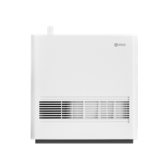</td>
      <td>352 Skin humidifier</td>
      <td>H70 humidifier</td>
      <td>bj352.humidifier.h70</td>
      <td></td>
    </tr>
    <tr>
      <th>409</th>
      <td></td>
      <td>EDON 39 Humidifier</td>
      <td></td>
      <td>edon.humidifier.s108e1</td>
      <td></td>
    </tr>
    <tr>
      <th>410</th>
      <td></td>
      <td>Evaporative Humidifier</td>
      <td></td>
      <td>deerma.humidifier.ct500</td>
      <td></td>
    </tr>
    <tr>
      <th>411</th>
      <td></td>
      <td>Humidifier King</td>
      <td></td>
      <td>viomi.humidifier.h1</td>
      <td></td>
    </tr>
    <tr>
      <th>412</th>
      <td></td>
      <td>MI Smart humidifer</td>
      <td>149</td>
      <td>deerma.humidifier.jsq3</td>
      <td>MJJSQ04DY</td>
    </tr>
    <tr>
      <th>413</th>
      <td></td>
      <td>Mi S Smart humidifer</td>
      <td>299 Atomization amount: 450mL/h Remarks: Glass glaze atomizer, stainless steel heat sink, with filter element, product power is about 40W</td>
      <td>deerma.humidifier.jsq1</td>
      <td>SCKOA45 (SCK0A45)</td>
    </tr>
    <tr>
      <th>414</th>
      <td></td>
      <td>Mi Smart Antibacterial Humidifier</td>
      <td>Export Europe-Korean version</td>
      <td>deerma.humidifier.jsq</td>
      <td>ZNJSQ01DEM / SKV4140GL</td>
    </tr>
    <tr>
      <th>415</th>
      <td></td>
      <td>Mi Smart Evaporative Humidifer</td>
      <td>199</td>
      <td>deerma.humidifier.jsq4</td>
      <td>CJSJSQ01DY</td>
    </tr>
    <tr>
      <th>416</th>
      <td></td>
      <td>Mi Smart Humidifier</td>
      <td>Realize three-speed variable power intelligent humidification function.</td>
      <td>deerma.humidifier.mjjsq</td>
      <td>MJJSQ03DY</td>
    </tr>
    <tr>
      <th>417</th>
      <td></td>
      <td>Smart humidifier</td>
      <td>Smart humidifier</td>
      <td>arnoo.humidifier.aahz10</td>
      <td></td>
    </tr>
    <tr>
      <th>418</th>
      <td></td>
      <td>Smartmi Antibacterial Humidifier 1S</td>
      <td>Ultrasonic humidifier</td>
      <td>zhimi.humidifier.va1</td>
      <td></td>
    </tr>
    <tr>
      <th>419</th>
      <td></td>
      <td>Smartmi Evaporative Humidifer 2</td>
      <td>Increase the display screen, increase the amount of humidification</td>
      <td>zhimi.humidifier.ca4</td>
      <td>CJXJSQ04ZM</td>
    </tr>
    <tr>
      <th>420</th>
      <td></td>
      <td>Smartmi Evaporative Humidifier</td>
      <td>Evaporative no pollution</td>
      <td>zhimi.humidifier.ca1</td>
      <td>SKV6001RU/SKV6001RT</td>
    </tr>
    <tr>
      <th>421</th>
      <td></td>
      <td>Smartmi Evaporative Humidifier</td>
      <td>Same function as ca1, US version of evaporative humidifier</td>
      <td>zhimi.humidifier.cb1</td>
      <td>SKV6001EU/SKV6001US</td>
    </tr>
    <tr>
      <th>422</th>
      <td></td>
      <td>Smartmi Evaporative Humidifier</td>
      <td>Korean version of humidifier (Singapore server)</td>
      <td>zhimi.humidifier.cb2</td>
      <td>CJXJSQ02ZM  / SKV6004EU</td>
    </tr>
    <tr>
      <th>423</th>
      <td></td>
      <td>Smartmi Humidifier</td>
      <td>Zhimi sterilizing humidifier</td>
      <td>zhimi.humidifier.v1</td>
      <td>CJJSQ01ZM</td>
    </tr>
    <tr>
      <th>424</th>
      <td></td>
      <td>The fog free of humidifier</td>
      <td>Low temperature evaporative humidifier is an upgrade of ultrasonic spray humidifier, and its core thinking is highlighted three basic experiences: 1, safe without white powder, 2, the room is very dry when the room can be rapidly humidified (the evaporation rate is greater than 500 ml / hour), 3, no need for any consumables, easy to clean. In addition, the product can choose a warm air, and winter use will be more comfortable.When using special crowds such as pregnancy, you can choose to add boostering directly, more reliable than ultraviolet sterilization. Advanced experience, I hope to access the millet platform to make the product more intelligent, humanized.</td>
      <td>shuii.humidifier.jsq001</td>
      <td></td>
    </tr>
    <tr>
      <th>425</th>
      <td></td>
      <td>Thermal Distillation Humidifier</td>
      <td></td>
      <td>deerma.humidifier.rz300</td>
      <td></td>
    </tr>
    <tr>
      <th>426</th>
      <td></td>
      <td>Zero-fog low-temperature evaporative humidifier (upgrade)</td>
      <td>This humidifier has the following features 1, safe without white powder, 2, the humidity is greater than 500ml / h, 3, no need for any consumables, easy to clean, 4, you can add boiling water directly,</td>
      <td>shuii.humidifier.jsq002</td>
      <td></td>
    </tr>
    <tr>
      <th>427</th>
      <td></td>
      <td>humidifier</td>
      <td>Universal humidifier</td>
      <td>dctrls.humidifier.common</td>
      <td></td>
    </tr>
    <tr>
      <th>428</th>
      <td></td>
      <td>humidifier</td>
      <td></td>
      <td>tyzhjt.humidifier.j01</td>
      <td></td>
    </tr>
    <tr>
      <th>429</th>
      <td></td>
      <td>humidifier</td>
      <td></td>
      <td>zeroy.humidifier.m91</td>
      <td></td>
    </tr>
    <tr>
      <th>430</th>
      <td></td>
      <td>leshow humidifier is2</td>
      <td>Motor type</td>
      <td>leshow.humidifier.is2</td>
      <td></td>
    </tr>
  </tbody>
</table>

## Air purifier
<table border="1" class="dataframe">
  <thead>
    <tr style="text-align: right;">
      <th></th>
      <th>Pic</th>
      <th>Name</th>
      <th>Description</th>
      <th>Model</th>
      <th>Product Number</th>
    </tr>
  </thead>
  <tbody>
    <tr>
      <th>431</th>
      <td></td>
      <td>Air Cleaner Remote Control</td>
      <td>Mijia air purifier infrared remote control</td>
      <td>miir.airpurifier.ir01</td>
      <td></td>
    </tr>
    <tr>
      <th>432</th>
      <td></td>
      <td>Airdog MINI (M) air purifier</td>
      <td>Beiang mini purifier The program adds intelligent control on the basis of x3</td>
      <td>airdog.airpurifier.mn</td>
      <td></td>
    </tr>
    <tr>
      <th>433</th>
      <td></td>
      <td>Airdog X3 (M) air purifier</td>
      <td></td>
      <td>airdog.airpurifier.x5</td>
      <td></td>
    </tr>
    <tr>
      <th>434</th>
      <td></td>
      <td>Airdog X7 (M) air purifier</td>
      <td></td>
      <td>airdog.airpurifier.x7</td>
      <td></td>
    </tr>
    <tr>
      <th>435</th>
      <td></td>
      <td>Airdog X7S (M) air purifier</td>
      <td>Add formaldehyde function to X7</td>
      <td>airdog.airpurifier.x7sm</td>
      <td></td>
    </tr>
    <tr>
      <th>436</th>
      <td></td>
      <td>Airman</td>
      <td>ESP-WROOM-02D Spec protocol</td>
      <td>viomi.airpurifier.v2</td>
      <td></td>
    </tr>
    <tr>
      <th>437</th>
      <td></td>
      <td>Airman Pro</td>
      <td>ESP-WROOM-02D Spec protocol</td>
      <td>viomi.airpurifier.v1</td>
      <td></td>
    </tr>
    <tr>
      <th>438</th>
      <td></td>
      <td>Baomi Air Purifier 2S</td>
      <td></td>
      <td>baomi.airpurifier.450a</td>
      <td></td>
    </tr>
    <tr>
      <th>439</th>
      <td></td>
      <td>CoClean cloud docking</td>
      <td>Speaker control (this application is in a faulty state, waiting for Xiaomi work order processing)</td>
      <td>coc.airpurifier.tk2</td>
      <td></td>
    </tr>
    <tr>
      <th>440</th>
      <td></td>
      <td>DATUDOU SUPER</td>
      <td></td>
      <td>1245.airpurifier.dl01</td>
      <td></td>
    </tr>
    <tr>
      <th>441</th>
      <td>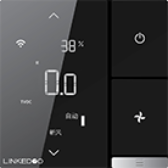</td>
      <td>Fresh Air Controller Youth Edition</td>
      <td>Fresh Air Controller Youth Edition Firmware ST800FAC Product ID 160fa8b80f1103e9160fa8b80f111001</td>
      <td>linked.airpurifier.800fac</td>
      <td></td>
    </tr>
    <tr>
      <th>442</th>
      <td></td>
      <td>Fresh air control panel (Chopin)</td>
      <td>Fresh air control panel (Chopin)</td>
      <td>kongke.airpurifier.cfair</td>
      <td></td>
    </tr>
    <tr>
      <th>443</th>
      <td></td>
      <td>Ion Tower/Silent Air Purifier without Consumables-Knight</td>
      <td></td>
      <td>coc.airpurifier.tk</td>
      <td></td>
    </tr>
    <tr>
      <th>444</th>
      <td></td>
      <td>Mi Air Purifier</td>
      <td>Xiaomi air purifier</td>
      <td>zhimi.airpurifier.v1</td>
      <td></td>
    </tr>
    <tr>
      <th>445</th>
      <td></td>
      <td>Mi Air Purifier</td>
      <td>Xiaomi air purifier</td>
      <td>zhimi.airpurifier.v2</td>
      <td></td>
    </tr>
    <tr>
      <th>446</th>
      <td></td>
      <td>Mi Air Purifier</td>
      <td>Xiaomi air purifier</td>
      <td>zhimi.airpurifier.v3</td>
      <td></td>
    </tr>
    <tr>
      <th>447</th>
      <td></td>
      <td>Mi Air Purifier</td>
      <td>Xiaomi air purifier</td>
      <td>zhimi.airpurifier.v5</td>
      <td></td>
    </tr>
    <tr>
      <th>448</th>
      <td></td>
      <td>Mi Air Purifier 2</td>
      <td></td>
      <td>zhimi.airpurifier.m1</td>
      <td></td>
    </tr>
    <tr>
      <th>449</th>
      <td></td>
      <td>Mi Air Purifier 2</td>
      <td>Mi Air Purifier 2nd Generation-Hardware Upgrade Version</td>
      <td>zhimi.airpurifier.m2</td>
      <td></td>
    </tr>
    <tr>
      <th>450</th>
      <td></td>
      <td>Mi Air Purifier 2H</td>
      <td>Air purifier 2 upgraded version (overseas), no display, square infrared sensor</td>
      <td>zhimi.airpurifier.mc2</td>
      <td>FJY4026GL</td>
    </tr>
    <tr>
      <th>451</th>
      <td></td>
      <td>Mi Air Purifier 2S</td>
      <td>The upgraded version of Mi Air Purifier 2, the dust sensor is changed to a laser sensor, the PM2.5 value is displayed locally, and the RFID filter recognition function is added</td>
      <td>zhimi.airpurifier.ma1</td>
      <td>AC-M4-AA</td>
    </tr>
    <tr>
      <th>452</th>
      <td></td>
      <td>Mi Air Purifier 2S</td>
      <td>The upgraded version of Mi Air Purifier 2, the dust sensor is changed to a laser sensor, the PM2.5 value is displayed locally, and the RFID filter recognition function is added</td>
      <td>zhimi.airpurifier.ma2</td>
      <td>AC-M4-AA</td>
    </tr>
    <tr>
      <th>453</th>
      <td></td>
      <td>Mi Air Purifier 2S</td>
      <td>Xiaomi Mijia Air Purifier 2S (Hong Kong and Taiwan Version)</td>
      <td>zhimi.airpurifier.mb1</td>
      <td></td>
    </tr>
    <tr>
      <th>454</th>
      <td></td>
      <td>Mi Air Purifier 2S</td>
      <td>Mi Air Purifier 2S (International Version)</td>
      <td>zhimi.airpurifier.mc1</td>
      <td>FJY4020GL</td>
    </tr>
    <tr>
      <th>455</th>
      <td></td>
      <td>Mi Air Purifier 3</td>
      <td>Mi Air Purifier 2s upgraded version, CADR increased, noise reduced, and touch buttons added</td>
      <td>zhimi.airpurifier.ma4</td>
      <td></td>
    </tr>
    <tr>
      <th>456</th>
      <td></td>
      <td>Mi Air Purifier 3/3H</td>
      <td>Mi Air Purifier 3H overseas version, including language display of different countries or regions</td>
      <td>zhimi.airpurifier.mb3</td>
      <td>FJY4031GL</td>
    </tr>
    <tr>
      <th>457</th>
      <td></td>
      <td>Mi Air Purifier 3C</td>
      <td>Overseas version 2H upgraded version, ESP32D</td>
      <td>zhimi.airpurifier.mb4</td>
      <td>AC-M14-SC</td>
    </tr>
    <tr>
      <th>458</th>
      <td></td>
      <td>Mi Air Purifier F1</td>
      <td></td>
      <td>dmaker.airpurifier.f20</td>
      <td>AC-MD1-SC</td>
    </tr>
    <tr>
      <th>459</th>
      <td></td>
      <td>Mi Air Purifier MAX</td>
      <td>Mijia Air Purifier MAX (Hong Kong Version)</td>
      <td>zhimi.airpurifier.sb1</td>
      <td>AC-M5-SC</td>
    </tr>
    <tr>
      <th>460</th>
      <td></td>
      <td>Mi Air Purifier MAX / MAX Pro</td>
      <td>Mijia Air Purifier MAX</td>
      <td>zhimi.airpurifier.sa2</td>
      <td>AC-M5-SC</td>
    </tr>
    <tr>
      <th>461</th>
      <td></td>
      <td>Mi Air Purifier Pro</td>
      <td>Mijia Air Purifier Pro</td>
      <td>zhimi.airpurifier.v6</td>
      <td>FJY4011CN</td>
    </tr>
    <tr>
      <th>462</th>
      <td></td>
      <td>Mi Air Purifier Pro</td>
      <td>Mijia Air Purifier Pro (International Version)</td>
      <td>zhimi.airpurifier.v7</td>
      <td>FJY4013GL</td>
    </tr>
    <tr>
      <th>463</th>
      <td></td>
      <td>Mi Air Purifier Pro</td>
      <td>Display traditional Chinese characters and QR code of Hong Kong/Taiwan official website</td>
      <td>zhimi.airpurifier.v8</td>
      <td></td>
    </tr>
    <tr>
      <th>464</th>
      <td></td>
      <td>Mi Air Purifier Pro H</td>
      <td>Xiaomi Air Purifier Pro upgraded version, the filter element is increased in size, formaldehyde removal filter is optional, and touch button is added</td>
      <td>zhimi.airpurifier.va1</td>
      <td>AC-M7-SC / AC-M13-SC / BHR4280GL</td>
    </tr>
    <tr>
      <th>465</th>
      <td></td>
      <td>Mi Air Purifier Pro H</td>
      <td>pro H overseas version shows different languages Britain, Thailand, Poland, West Russia, Italy, France, Germany, Vietnam, South Korea</td>
      <td>zhimi.airpurifier.vb2</td>
      <td>AC-M7-SC / AC-M13-SC / BHR4280GL</td>
    </tr>
    <tr>
      <th>466</th>
      <td></td>
      <td>Mi Air Purifier X</td>
      <td>Sheet metal</td>
      <td>zhimi.airpurifier.xa1</td>
      <td></td>
    </tr>
    <tr>
      <th>467</th>
      <td></td>
      <td>Mi Desktop Air Purifier</td>
      <td>personal use</td>
      <td>zhimi.airpurifier.oa1</td>
      <td></td>
    </tr>
    <tr>
      <th>468</th>
      <td></td>
      <td>MiWhole Air Purifier Mix</td>
      <td></td>
      <td>hanyi.airpurifier.kj550</td>
      <td></td>
    </tr>
    <tr>
      <th>469</th>
      <td></td>
      <td>Petoneer AirMaster</td>
      <td></td>
      <td>skyrc.airpurifier.pur</td>
      <td></td>
    </tr>
    <tr>
      <th>470</th>
      <td></td>
      <td>Petoneer Smart Odor Eliminator-Pro</td>
      <td></td>
      <td>skyrc.airp.su001</td>
      <td></td>
    </tr>
    <tr>
      <th>471</th>
      <td></td>
      <td>Smart Air Purifier</td>
      <td>MIoT SPEC agreement, overseas version empty net</td>
      <td>viomi.airp.v3</td>
      <td></td>
    </tr>
    <tr>
      <th>472</th>
      <td></td>
      <td>Smartmi Air Purifier</td>
      <td>Zhimi version air purifier, cylinder version</td>
      <td>zhimi.airpurifier.za1</td>
      <td></td>
    </tr>
    <tr>
      <th>473</th>
      <td></td>
      <td>Zigma air purifier series</td>
      <td>aerio series</td>
      <td>zigma.airp.aerio</td>
      <td></td>
    </tr>
    <tr>
      <th>474</th>
      <td></td>
      <td>ai</td>
      <td>air purifier</td>
      <td>cgzn.airpurifier.ai</td>
      <td></td>
    </tr>
    <tr>
      <th>475</th>
      <td></td>
      <td>air purifier</td>
      <td></td>
      <td>tyzhjt.airpurifier.001</td>
      <td></td>
    </tr>
    <tr>
      <th>476</th>
      <td></td>
      <td>air purifier</td>
      <td>air purifier</td>
      <td>xzh.airpurifier.ai</td>
      <td></td>
    </tr>
    <tr>
      <th>477</th>
      <td></td>
      <td>baomi-air-purifier</td>
      <td>air purifier</td>
      <td>baomi.airpurifier.bmi</td>
      <td></td>
    </tr>
    <tr>
      <th>478</th>
      <td></td>
      <td>filter</td>
      <td></td>
      <td>yonsz.airp.4</td>
      <td></td>
    </tr>
    <tr>
      <th>479</th>
      <td></td>
      <td>ozner air purifier u1</td>
      <td></td>
      <td>ozner.airpurifier.u1</td>
      <td></td>
    </tr>
  </tbody>
</table>

## Air quality detector
<table border="1" class="dataframe">
  <thead>
    <tr style="text-align: right;">
      <th></th>
      <th>Pic</th>
      <th>Name</th>
      <th>Description</th>
      <th>Model</th>
      <th>Product Number</th>
    </tr>
  </thead>
  <tbody>
    <tr>
      <th>480</th>
      <td></td>
      <td>Air box</td>
      <td></td>
      <td>dnake.airm.aird</td>
      <td></td>
    </tr>
    <tr>
      <th>481</th>
      <td></td>
      <td>BlinkerAirDetector</td>
      <td></td>
      <td>blink.airmonitor.bs0001</td>
      <td></td>
    </tr>
    <tr>
      <th>482</th>
      <td></td>
      <td>Environmental monitor</td>
      <td>Environmental Monitoring Equipment Model C (Formaldehyde Version)</td>
      <td>tc0756.airmonitor.60</td>
      <td></td>
    </tr>
    <tr>
      <th>483</th>
      <td></td>
      <td>Medilon Fresh Air</td>
      <td>Medilon Fresh Air</td>
      <td>tc0756.airmonitor.71</td>
      <td></td>
    </tr>
    <tr>
      <th>484</th>
      <td></td>
      <td>Mi Multifunction Air Monitor</td>
      <td>Mijia air detector</td>
      <td>cgllc.airmonitor.b1</td>
      <td></td>
    </tr>
    <tr>
      <th>485</th>
      <td></td>
      <td>Mi PM2.5 Air Quality Monitor</td>
      <td>Mijia PM2.5 detector</td>
      <td>zhimi.airmonitor.v1</td>
      <td></td>
    </tr>
    <tr>
      <th>486</th>
      <td></td>
      <td>PM sensor</td>
      <td></td>
      <td>jyx.airm.030901</td>
      <td></td>
    </tr>
    <tr>
      <th>487</th>
      <td></td>
      <td>Qingping Air Monitor</td>
      <td>Qingping Air Detector (Snow)</td>
      <td>cgllc.airmonitor.s1</td>
      <td>CGS1</td>
    </tr>
    <tr>
      <th>488</th>
      <td></td>
      <td>Qingping Air Monitor Lite</td>
      <td></td>
      <td>cgllc.airm.cgdn1</td>
      <td>CGDN1</td>
    </tr>
    <tr>
      <th>489</th>
      <td></td>
      <td>SmartAq</td>
      <td></td>
      <td>heiman.airmonitor.hs2ar</td>
      <td></td>
    </tr>
    <tr>
      <th>490</th>
      <td></td>
      <td>WIFI air quality test</td>
      <td></td>
      <td>hsmart.airmonitor.hs2ar</td>
      <td></td>
    </tr>
    <tr>
      <th>491</th>
      <td></td>
      <td>ZenMeasure Air Quality Monitor</td>
      <td></td>
      <td>miaomiaoce.airm.air01</td>
      <td></td>
    </tr>
    <tr>
      <th>492</th>
      <td></td>
      <td>wifiAq</td>
      <td></td>
      <td>heiman.airmonitor.hs2ai</td>
      <td></td>
    </tr>
  </tbody>
</table>

## Electric heater
<table border="1" class="dataframe">
  <thead>
    <tr style="text-align: right;">
      <th></th>
      <th>Pic</th>
      <th>Name</th>
      <th>Description</th>
      <th>Model</th>
      <th>Product Number</th>
    </tr>
  </thead>
  <tbody>
    <tr>
      <th>493</th>
      <td></td>
      <td>Airmate mobile floor heating</td>
      <td></td>
      <td>air.heater.wda14</td>
      <td></td>
    </tr>
    <tr>
      <th>494</th>
      <td></td>
      <td>Electric heater</td>
      <td>Electric heater</td>
      <td>hosjoy.heater.ehot</td>
      <td></td>
    </tr>
    <tr>
      <th>495</th>
      <td></td>
      <td>Electric heater/floor heating</td>
      <td>Universal electric heater</td>
      <td>dctrls.heater.common</td>
      <td></td>
    </tr>
    <tr>
      <th>496</th>
      <td></td>
      <td>Floor heating intelligent temperature control</td>
      <td>Floor heating</td>
      <td>pingke.heater.7801</td>
      <td></td>
    </tr>
    <tr>
      <th>497</th>
      <td></td>
      <td>Focus Heater</td>
      <td>pd-eh1a-focus electric heater</td>
      <td>ows.heater.pdeh1a</td>
      <td></td>
    </tr>
    <tr>
      <th>498</th>
      <td></td>
      <td>Geothermal</td>
      <td></td>
      <td>dnake.heater.heater</td>
      <td></td>
    </tr>
    <tr>
      <th>499</th>
      <td></td>
      <td>Heating</td>
      <td></td>
      <td>deocea.heater.cq</td>
      <td></td>
    </tr>
    <tr>
      <th>500</th>
      <td></td>
      <td>Intelligent temperature control</td>
      <td></td>
      <td>shy.heater.h</td>
      <td></td>
    </tr>
    <tr>
      <th>501</th>
      <td></td>
      <td>JO FOND Indoor heater (convection electric heater)</td>
      <td>NDL200-B73BRGW</td>
      <td>kadeer.heater.b73brg</td>
      <td>NDL200-B73BRGW</td>
    </tr>
    <tr>
      <th>502</th>
      <td></td>
      <td>JO FOND Indoor heater (electric oil)</td>
      <td>NSC-220-12B5RW AHR3144YA</td>
      <td>kadeer.heater.12b5rw</td>
      <td>AHR3144YA, NSC-220-12B5RW</td>
    </tr>
    <tr>
      <th>503</th>
      <td></td>
      <td>JO FOND Indoor heater (skirting heater)</td>
      <td>NTJX-L220IRW</td>
      <td>kadeer.heater.l220ir</td>
      <td></td>
    </tr>
    <tr>
      <th>504</th>
      <td></td>
      <td>JO FOND Indoor heater (wall mounted heater)</td>
      <td>NDY_20YRW</td>
      <td>kadeer.heater.20yrw</td>
      <td></td>
    </tr>
    <tr>
      <th>505</th>
      <td></td>
      <td>JO FOND Wall mounted electric oiling</td>
      <td>NSC-220-15B6RW AHR4144YX</td>
      <td>kadeer.heater.15b6rw</td>
      <td>NSC-220-15B6RW, AHR4144YX</td>
    </tr>
    <tr>
      <th>506</th>
      <td>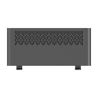</td>
      <td>JiPin Smart Heater</td>
      <td></td>
      <td>jipin.heater.my204</td>
      <td></td>
    </tr>
    <tr>
      <th>507</th>
      <td></td>
      <td>Jya Convection Heater</td>
      <td>Jya convection electric heater</td>
      <td>jya.heater.sha1</td>
      <td></td>
    </tr>
    <tr>
      <th>508</th>
      <td></td>
      <td>Logic floor heating thermostat</td>
      <td>Logic floor heating thermostat, the maximum temperature is 45 degrees</td>
      <td>hosjoy.heater.logic</td>
      <td></td>
    </tr>
    <tr>
      <th>509</th>
      <td>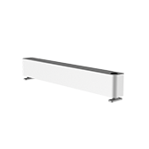</td>
      <td>Mi Smart Baseboard Heater</td>
      <td></td>
      <td>leshow.heater.bs1</td>
      <td></td>
    </tr>
    <tr>
      <th>510</th>
      <td></td>
      <td>Mi Smart Baseboard Heater 1S</td>
      <td></td>
      <td>leshow.heater.bs1s</td>
      <td>Lexiu HS1</td>
    </tr>
    <tr>
      <th>511</th>
      <td></td>
      <td>Mi Smart Baseboard Heater E</td>
      <td>ESP32-WROOM-32U</td>
      <td>zhimi.heater.ma3</td>
      <td>TJXDNQ01ZM</td>
    </tr>
    <tr>
      <th>512</th>
      <td></td>
      <td>Mi Smart Space Heater</td>
      <td>Mijia fast thermal electric heater</td>
      <td>zhimi.heater.ma1</td>
      <td></td>
    </tr>
    <tr>
      <th>513</th>
      <td></td>
      <td>Mi Smart Space Heater S</td>
      <td>Mi Home Appliance Heater Upgraded Version</td>
      <td>zhimi.heater.ma2</td>
      <td></td>
    </tr>
    <tr>
      <th>514</th>
      <td></td>
      <td>Mi Smart Space Heater S</td>
      <td>Mijia Smart Electric Heater Overseas Version</td>
      <td>zhimi.heater.mc2</td>
      <td>KRDNQ03ZM (BHR4037GL)</td>
    </tr>
    <tr>
      <th>515</th>
      <td></td>
      <td>Mijia vertical heater</td>
      <td></td>
      <td>leshow.heater.nfj1lx</td>
      <td></td>
    </tr>
    <tr>
      <th>516</th>
      <td></td>
      <td>MxiControlEH</td>
      <td>This product can be connected to control household floor heating, and the supported functions include control of switch, mode, temperature, wind speed, etc., and can monitor the current status of floor heating.Currently supported floor heating brands include Daikin, Hitachi, Toshiba, Mitsubishi Electric, Hisense, Haier, Panasonic, York, Mitsubishi Heavy Industries, Midea, LG, Oaks, Bosch, Gree, Samsung, etc.</td>
      <td>maxi.heater.b01x2rt</td>
      <td></td>
    </tr>
    <tr>
      <th>517</th>
      <td></td>
      <td>OWS Heater 3T</td>
      <td>Smart electric heater</td>
      <td>ows.heater.pdeh2a</td>
      <td></td>
    </tr>
    <tr>
      <th>518</th>
      <td></td>
      <td>OWS Heater Pro</td>
      <td></td>
      <td>ows.heater.pdeh3a</td>
      <td></td>
    </tr>
    <tr>
      <th>519</th>
      <td></td>
      <td>OWSYUDI</td>
      <td></td>
      <td>ows.heater.yudi20</td>
      <td></td>
    </tr>
    <tr>
      <th>520</th>
      <td></td>
      <td>PTC10-electric heater</td>
      <td></td>
      <td>poer19.heater.ptc10</td>
      <td></td>
    </tr>
    <tr>
      <th>521</th>
      <td></td>
      <td>PTC20-electric heater</td>
      <td></td>
      <td>poer19.heater.ptc20</td>
      <td></td>
    </tr>
    <tr>
      <th>522</th>
      <td></td>
      <td>PTV30-electric heating</td>
      <td></td>
      <td>poer19.heater.ptv30</td>
      <td></td>
    </tr>
    <tr>
      <th>523</th>
      <td></td>
      <td>Really Heater</td>
      <td>Ruili electric heater supporting Xiaoai</td>
      <td>really.heater.f1</td>
      <td></td>
    </tr>
    <tr>
      <th>524</th>
      <td></td>
      <td>Silicon crystal heater</td>
      <td></td>
      <td>jisi.heater.is30w</td>
      <td></td>
    </tr>
    <tr>
      <th>525</th>
      <td></td>
      <td>Simon Floor Heating</td>
      <td>Simon Floor Heating</td>
      <td>tc0756.heater.75</td>
      <td></td>
    </tr>
    <tr>
      <th>526</th>
      <td></td>
      <td>Smart Thermostat DKM3</td>
      <td></td>
      <td>di8hao.heater.m3</td>
      <td></td>
    </tr>
    <tr>
      <th>527</th>
      <td></td>
      <td>Smartmi Radiant Heater Smart Version</td>
      <td>Zhimi Smart Electric Heater</td>
      <td>zhimi.heater.za1</td>
      <td></td>
    </tr>
    <tr>
      <th>528</th>
      <td></td>
      <td>Smartmi Smart Convector Heater 1S</td>
      <td>Zhimi electric heater smart version upgrades heating materials, interactive changes</td>
      <td>zhimi.heater.za2</td>
      <td></td>
    </tr>
    <tr>
      <th>529</th>
      <td></td>
      <td>Smartmi Smart Convector Heater 1S</td>
      <td>Zhimi Smart Electric Heater 1S Overseas Version</td>
      <td>zhimi.heater.zb1</td>
      <td></td>
    </tr>
    <tr>
      <th>530</th>
      <td></td>
      <td>Smartmi Smart Fan</td>
      <td>Floor smart heater</td>
      <td>zhimi.heater.na1</td>
      <td></td>
    </tr>
    <tr>
      <th>531</th>
      <td></td>
      <td>Smartmi Smart Fan Heater</td>
      <td>Zhimi Smart Heater 1S Overseas Version</td>
      <td>zhimi.heater.nb1</td>
      <td></td>
    </tr>
    <tr>
      <th>532</th>
      <td></td>
      <td>Synthetic floor heating</td>
      <td>Synthetic floor heating</td>
      <td>tc0756.heater.55</td>
      <td></td>
    </tr>
    <tr>
      <th>533</th>
      <td></td>
      <td>Vaillant Floor Heating</td>
      <td>Vaillant Floor Heating</td>
      <td>tc0756.heater.46</td>
      <td></td>
    </tr>
    <tr>
      <th>534</th>
      <td>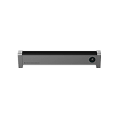</td>
      <td>Viomi Kick-Line heater Pro</td>
      <td></td>
      <td>viomi.heater.vxtj01</td>
      <td>VXTJ01</td>
    </tr>
    <tr>
      <th>535</th>
      <td></td>
      <td>Viomi Kick-Line heater Pro2</td>
      <td>MIoT SPEC protocol</td>
      <td>viomi.heater.v4</td>
      <td></td>
    </tr>
    <tr>
      <th>536</th>
      <td></td>
      <td>Viomi Tower type heater</td>
      <td>MIoT SPEC protocol</td>
      <td>viomi.heater.v3</td>
      <td></td>
    </tr>
  </tbody>
</table>

## Fan
<table border="1" class="dataframe">
  <thead>
    <tr style="text-align: right;">
      <th></th>
      <th>Pic</th>
      <th>Name</th>
      <th>Description</th>
      <th>Model</th>
      <th>Product Number</th>
    </tr>
  </thead>
  <tbody>
    <tr>
      <th>537</th>
      <td></td>
      <td>Airmate air circulation fan</td>
      <td>Scene: living room/bedroom/dining room/study Number of fan blades: 3 large angled horn leaves Blade size: 9 inches Power supply mode: DC Appointment/timing: 24h appointment timing Gear position: 32 gears Wind type: ordinary wind, baby wind Swing head: left and right swing head, top and bottom swing head Control method: remote control + WIFI APP</td>
      <td>air.fan.ca23ad9</td>
      <td></td>
    </tr>
    <tr>
      <th>538</th>
      <td></td>
      <td>Cloud access fan</td>
      <td>Cloud access fan</td>
      <td>ezhome.fan.yy1003</td>
      <td></td>
    </tr>
    <tr>
      <th>539</th>
      <td></td>
      <td>DEMULLER Fan (Single Cold Tower Fan)</td>
      <td></td>
      <td>wanai.fan.t118</td>
      <td></td>
    </tr>
    <tr>
      <th>540</th>
      <td></td>
      <td>Dream maker somatosensory floor fan</td>
      <td></td>
      <td>dmaker.fan.01</td>
      <td></td>
    </tr>
    <tr>
      <th>541</th>
      <td></td>
      <td>Electric fan</td>
      <td>Xiaohei universal remote control smart electric fan through Xiaoai classmate</td>
      <td>123888.fan.1121</td>
      <td></td>
    </tr>
    <tr>
      <th>542</th>
      <td></td>
      <td>Fan</td>
      <td>Infrared fan supported by Aiyun Intelligent Scene Control A1</td>
      <td>ayzn.fan.irfan</td>
      <td></td>
    </tr>
    <tr>
      <th>543</th>
      <td></td>
      <td>Fan</td>
      <td>Infrared fan</td>
      <td>orvibo.fan.ir01</td>
      <td></td>
    </tr>
    <tr>
      <th>544</th>
      <td></td>
      <td>Fan</td>
      <td>Infrared fan</td>
      <td>tuya.fan.tyfan01</td>
      <td></td>
    </tr>
    <tr>
      <th>545</th>
      <td></td>
      <td>Fan Remote Control</td>
      <td>Mijia fan infrared remote control</td>
      <td>miir.fan.ir01</td>
      <td></td>
    </tr>
    <tr>
      <th>546</th>
      <td></td>
      <td>Fan infrared remote control</td>
      <td>IR-BOX fan remote control</td>
      <td>kiwik.fan.fan</td>
      <td></td>
    </tr>
    <tr>
      <th>547</th>
      <td></td>
      <td>Fan infrared remote control</td>
      <td></td>
      <td>oge.fan.fan1</td>
      <td></td>
    </tr>
    <tr>
      <th>548</th>
      <td></td>
      <td>Fruit wheat cooling and heating fan</td>
      <td></td>
      <td>gmair.fan.wy100</td>
      <td></td>
    </tr>
    <tr>
      <th>549</th>
      <td></td>
      <td>Fruit wheat cooling fan</td>
      <td></td>
      <td>gmair.fan.wy101</td>
      <td></td>
    </tr>
    <tr>
      <th>550</th>
      <td></td>
      <td>Infrared fan</td>
      <td></td>
      <td>yonsz.fan.0</td>
      <td></td>
    </tr>
    <tr>
      <th>551</th>
      <td></td>
      <td>Leshow Fan SS310</td>
      <td></td>
      <td>leshow.fan.ss310</td>
      <td></td>
    </tr>
    <tr>
      <th>552</th>
      <td></td>
      <td>Leshow Fan SS320</td>
      <td></td>
      <td>leshow.fan.ss320</td>
      <td></td>
    </tr>
    <tr>
      <th>553</th>
      <td></td>
      <td>Mi Smart Air Circulator Fan</td>
      <td>Two-way swing head, circulating air</td>
      <td>zhimi.fan.fa1</td>
      <td></td>
    </tr>
    <tr>
      <th>554</th>
      <td></td>
      <td>Mi Smart Standing Fan 1C</td>
      <td></td>
      <td>dmaker.fan.p8</td>
      <td>PYV4007GL</td>
    </tr>
    <tr>
      <th>555</th>
      <td></td>
      <td>Mi Smart Standing Fan 1X</td>
      <td>Dream Maker Mijia DC Fan</td>
      <td>dmaker.fan.p5</td>
      <td></td>
    </tr>
    <tr>
      <th>556</th>
      <td></td>
      <td>Mi Smart Standing Fan 2</td>
      <td>Mijia DC double-layer fan</td>
      <td>dmaker.fan.p10</td>
      <td></td>
    </tr>
    <tr>
      <th>557</th>
      <td></td>
      <td>Mi Smart Standing Fan 2 Lite</td>
      <td>Distribution version</td>
      <td>dmaker.fan.1c</td>
      <td></td>
    </tr>
    <tr>
      <th>558</th>
      <td></td>
      <td>Mi Smart Standing Fan Pro</td>
      <td></td>
      <td>dmaker.fan.p11</td>
      <td>BPLDS03DM</td>
    </tr>
    <tr>
      <th>559</th>
      <td></td>
      <td>Mi Smart Standing Fan Pro</td>
      <td></td>
      <td>dmaker.fan.p15</td>
      <td>ZLBPSP01XY /  PYV4009GL</td>
    </tr>
    <tr>
      <th>560</th>
      <td></td>
      <td>Mi Smart Tower Fan</td>
      <td></td>
      <td>dmaker.fan.p9</td>
      <td></td>
    </tr>
    <tr>
      <th>561</th>
      <td></td>
      <td>Mi Standing Fan</td>
      <td>Full direct current, natural wind.</td>
      <td>zhimi.fan.sa1</td>
      <td></td>
    </tr>
    <tr>
      <th>562</th>
      <td></td>
      <td>Moonlight fan</td>
      <td></td>
      <td>orz.fan.ygs</td>
      <td></td>
    </tr>
    <tr>
      <th>563</th>
      <td></td>
      <td>Philips Water Tower Fan</td>
      <td></td>
      <td>kadeer.fan.flp01</td>
      <td></td>
    </tr>
    <tr>
      <th>564</th>
      <td></td>
      <td>Philips leafless cold fan</td>
      <td></td>
      <td>kadeer.fan.l20b</td>
      <td></td>
    </tr>
    <tr>
      <th>565</th>
      <td></td>
      <td>Plain desktop fan F5i</td>
      <td></td>
      <td>solove.fan.f5new</td>
      <td></td>
    </tr>
    <tr>
      <th>566</th>
      <td></td>
      <td>Remote control master-wifi to infrared-fan</td>
      <td>Remote control master-wifi to infrared-fan</td>
      <td>coolki.fan.yk0006</td>
      <td></td>
    </tr>
    <tr>
      <th>567</th>
      <td></td>
      <td>Remote control master-wifi to infrared-fan</td>
      <td>Remote control master-wifi to infrared-fan</td>
      <td>zhihw.fan.yk0006</td>
      <td></td>
    </tr>
    <tr>
      <th>568</th>
      <td></td>
      <td>Smart Fan</td>
      <td></td>
      <td>wfiot.fan.fan001</td>
      <td></td>
    </tr>
    <tr>
      <th>569</th>
      <td></td>
      <td>Smartmi DC Pedestal Fan</td>
      <td>Zhimi DC Inverter Floor Fan</td>
      <td>zhimi.fan.v2</td>
      <td></td>
    </tr>
    <tr>
      <th>570</th>
      <td></td>
      <td>Smartmi DC Pedestal Fan</td>
      <td>Based on v2, modify the motor configuration</td>
      <td>zhimi.fan.v3</td>
      <td></td>
    </tr>
    <tr>
      <th>571</th>
      <td></td>
      <td>Smartmi Inverter Pedestal Fan</td>
      <td>Natural wind, table fan and floor fan dual purpose, built-in battery</td>
      <td>zhimi.fan.za1</td>
      <td></td>
    </tr>
    <tr>
      <th>572</th>
      <td></td>
      <td>Smartmi Standing Fan 2</td>
      <td>Zhimi DC inverter floor fan, no remote control, dual buttons, no lithium battery</td>
      <td>zhimi.fan.za3</td>
      <td></td>
    </tr>
    <tr>
      <th>573</th>
      <td></td>
      <td>Smartmi Standing Fan 2S</td>
      <td>Zhimi DC inverter floor fan, no remote control, dual buttons, lithium battery</td>
      <td>zhimi.fan.za4</td>
      <td></td>
    </tr>
    <tr>
      <th>574</th>
      <td></td>
      <td>Smartmi Standing Fan 3</td>
      <td>Digital screen, battery display, temperature and humidity</td>
      <td>zhimi.fan.za5</td>
      <td>ZLBPLDS05ZM</td>
    </tr>
    <tr>
      <th>575</th>
      <td></td>
      <td>Viomi ButterflyFan DC</td>
      <td>ESP-WROOM-02D MIOT-Spec protocol</td>
      <td>viomi.fan.v5</td>
      <td></td>
    </tr>
    <tr>
      <th>576</th>
      <td></td>
      <td>ZJ Smart Fan</td>
      <td></td>
      <td>zhijia.fan.fan</td>
      <td></td>
    </tr>
    <tr>
      <th>577</th>
      <td></td>
      <td>fan</td>
      <td></td>
      <td>bemfa.fan.fan</td>
      <td></td>
    </tr>
    <tr>
      <th>578</th>
      <td></td>
      <td>fan</td>
      <td>fan</td>
      <td>cgzn.fan.fan</td>
      <td></td>
    </tr>
    <tr>
      <th>579</th>
      <td></td>
      <td>fan</td>
      <td>General fan equipment</td>
      <td>dctrls.fan.test</td>
      <td></td>
    </tr>
    <tr>
      <th>580</th>
      <td></td>
      <td>fan</td>
      <td>Fan equipment</td>
      <td>ecloud.fan.eq</td>
      <td></td>
    </tr>
    <tr>
      <th>581</th>
      <td></td>
      <td>fan</td>
      <td></td>
      <td>edaltd.fan.fan</td>
      <td></td>
    </tr>
    <tr>
      <th>582</th>
      <td></td>
      <td>fan</td>
      <td></td>
      <td>fine.fan.fan</td>
      <td></td>
    </tr>
    <tr>
      <th>583</th>
      <td></td>
      <td>fan</td>
      <td></td>
      <td>ghome.fan.sf008</td>
      <td></td>
    </tr>
    <tr>
      <th>584</th>
      <td></td>
      <td>fan</td>
      <td></td>
      <td>tyzhjt.fan.fs0001</td>
      <td></td>
    </tr>
    <tr>
      <th>585</th>
      <td></td>
      <td>fan</td>
      <td></td>
      <td>wfiot.fan.a8</td>
      <td></td>
    </tr>
    <tr>
      <th>586</th>
      <td></td>
      <td>fan</td>
      <td>fan</td>
      <td>xzh.fan.fan</td>
      <td></td>
    </tr>
    <tr>
      <th>587</th>
      <td></td>
      <td>fan</td>
      <td></td>
      <td>ykkj.fan.ykm103</td>
      <td></td>
    </tr>
    <tr>
      <th>588</th>
      <td></td>
      <td>fan</td>
      <td></td>
      <td>zeroy.fan.m93</td>
      <td></td>
    </tr>
    <tr>
      <th>589</th>
      <td></td>
      <td>fs</td>
      <td></td>
      <td>heiman.fan.rc1</td>
      <td></td>
    </tr>
    <tr>
      <th>590</th>
      <td></td>
      <td>leshow fan</td>
      <td></td>
      <td>leshow.fan.ss4</td>
      <td></td>
    </tr>
  </tbody>
</table>

## Flower pot
<table border="1" class="dataframe">
  <thead>
    <tr style="text-align: right;">
      <th></th>
      <th>Pic</th>
      <th>Name</th>
      <th>Description</th>
      <th>Model</th>
      <th>Product Number</th>
    </tr>
  </thead>
  <tbody>
    <tr>
      <th>591</th>
      <td></td>
      <td>Yimitian smart food</td>
      <td></td>
      <td>ymt.flowerpot.v1</td>
      <td></td>
    </tr>
  </tbody>
</table>

## Formaldehyde detector
<table border="1" class="dataframe">
  <thead>
    <tr style="text-align: right;">
      <th></th>
      <th>Pic</th>
      <th>Name</th>
      <th>Description</th>
      <th>Model</th>
      <th>Product Number</th>
    </tr>
  </thead>
  <tbody>
    <tr>
      <th>592</th>
      <td></td>
      <td>352 Air Detector M30</td>
      <td>M30 formaldehyde detector, can detect temperature, humidity, formaldehyde, TVOC</td>
      <td>bj352.airmonitor.m30</td>
      <td></td>
    </tr>
    <tr>
      <th>593</th>
      <td></td>
      <td>AIR QUALITY TESTER</td>
      <td>Formaldehyde detector suitable for home use formaldehyde TVOC temperature humidity</td>
      <td>fbs.airmonitor.pth02</td>
      <td></td>
    </tr>
    <tr>
      <th>594</th>
      <td></td>
      <td>Honeywell Smart Formaldehyde Monitor</td>
      <td></td>
      <td>yuemee.airmonitor.mhfd1</td>
      <td></td>
    </tr>
  </tbody>
</table>

## Fresh air system
<table border="1" class="dataframe">
  <thead>
    <tr style="text-align: right;">
      <th></th>
      <th>Pic</th>
      <th>Name</th>
      <th>Description</th>
      <th>Model</th>
      <th>Product Number</th>
    </tr>
  </thead>
  <tbody>
    <tr>
      <th>595</th>
      <td></td>
      <td>Air-fresh Gateway</td>
      <td>Access to fresh air systems of various brands</td>
      <td>knx.airfresh.kts</td>
      <td></td>
    </tr>
    <tr>
      <th>596</th>
      <td></td>
      <td>Bijia Fresh Air Ventilator</td>
      <td>Bijia new fan</td>
      <td>szdy.airfresh.n80</td>
      <td></td>
    </tr>
    <tr>
      <th>597</th>
      <td></td>
      <td>Central Italian Aipu Fresh Air</td>
      <td>Central Italian Aipu Fresh Air</td>
      <td>tc0756.airfresh.65</td>
      <td></td>
    </tr>
    <tr>
      <th>598</th>
      <td></td>
      <td>Central Italian Apple Fresh Air</td>
      <td></td>
      <td>tc0756.airfresh.65b</td>
      <td></td>
    </tr>
    <tr>
      <th>599</th>
      <td></td>
      <td>Di Nike Fresh Air</td>
      <td>Xiangjiajing</td>
      <td>dnk.airfresh.airf</td>
      <td></td>
    </tr>
    <tr>
      <th>600</th>
      <td></td>
      <td>DreamMaker Fresh Air Ventilator</td>
      <td>Dream maker owns new fan</td>
      <td>dmaker.airfresh.dm2018</td>
      <td></td>
    </tr>
    <tr>
      <th>601</th>
      <td></td>
      <td>Fresh air</td>
      <td></td>
      <td>deocea.airfresh.deocea</td>
      <td></td>
    </tr>
    <tr>
      <th>602</th>
      <td></td>
      <td>Fresh air</td>
      <td></td>
      <td>dnake.airfresh.fair</td>
      <td></td>
    </tr>
    <tr>
      <th>603</th>
      <td></td>
      <td>Fresh air</td>
      <td>New fan</td>
      <td>ecloud.airfresh.eq</td>
      <td></td>
    </tr>
    <tr>
      <th>604</th>
      <td></td>
      <td>Fresh air</td>
      <td>New fan</td>
      <td>hosjoy.airfresh.fshair</td>
      <td></td>
    </tr>
    <tr>
      <th>605</th>
      <td></td>
      <td>Fresh air</td>
      <td>Fresh air</td>
      <td>yongqi.airfresh.fw</td>
      <td></td>
    </tr>
    <tr>
      <th>606</th>
      <td></td>
      <td>Fresh air system</td>
      <td>Fresh air system</td>
      <td>tc0756.airfresh.25</td>
      <td></td>
    </tr>
    <tr>
      <th>607</th>
      <td></td>
      <td>Fruit wheat fresh air blower 420S</td>
      <td></td>
      <td>gmair.airfresh.gm420s</td>
      <td></td>
    </tr>
    <tr>
      <th>608</th>
      <td></td>
      <td>Fruit wheat fresh fan 520</td>
      <td></td>
      <td>gmair.airfresh.gm520</td>
      <td></td>
    </tr>
    <tr>
      <th>609</th>
      <td></td>
      <td>Fruit wheat fresh wind 320Pro</td>
      <td></td>
      <td>gmair.airfresh.gm320p</td>
      <td></td>
    </tr>
    <tr>
      <th>610</th>
      <td></td>
      <td>Fruit wheat new fan 320</td>
      <td></td>
      <td>gmair.airfresh.gm320</td>
      <td></td>
    </tr>
    <tr>
      <th>611</th>
      <td></td>
      <td>Fruit wheat new fan 420</td>
      <td></td>
      <td>gmair.airfresh.gm420</td>
      <td></td>
    </tr>
    <tr>
      <th>612</th>
      <td></td>
      <td>Fruit wheat new fan 500</td>
      <td></td>
      <td>gmair.airfresh.gm500</td>
      <td></td>
    </tr>
    <tr>
      <th>613</th>
      <td></td>
      <td>Hitachi Fresh Air</td>
      <td>Hitachi Fresh Air (abandoned)</td>
      <td>tc0756.airfresh.50</td>
      <td></td>
    </tr>
    <tr>
      <th>614</th>
      <td></td>
      <td>Hitachi Fresh Air</td>
      <td>Hitachi Fresh Air</td>
      <td>tc0756.airfresh.50b</td>
      <td></td>
    </tr>
    <tr>
      <th>615</th>
      <td></td>
      <td>Honey Fresh</td>
      <td>Honey Fresh</td>
      <td>tc0756.airfresh.78</td>
      <td></td>
    </tr>
    <tr>
      <th>616</th>
      <td></td>
      <td>Intelligent fresh air control</td>
      <td>KP01C1530</td>
      <td>ikecin.airfresh.95</td>
      <td></td>
    </tr>
    <tr>
      <th>617</th>
      <td></td>
      <td>LOMEDIQI Intelligent automatic air purifier</td>
      <td>Luo Meidiqi Smart Fresh Air Purifier</td>
      <td>bjdm.airfresh.test01</td>
      <td></td>
    </tr>
    <tr>
      <th>618</th>
      <td></td>
      <td>Medilon Fresh Air</td>
      <td>Medilon Fresh Air</td>
      <td>tc0756.airfresh.71b</td>
      <td></td>
    </tr>
    <tr>
      <th>619</th>
      <td></td>
      <td>Mi Fresh Air Ventilator</td>
      <td>Dream Maker Mijia New Fan</td>
      <td>dmaker.airfresh.t2017</td>
      <td>MJXFJ-300-G1</td>
    </tr>
    <tr>
      <th>620</th>
      <td></td>
      <td>Mi Fresh Air Ventilator A1-150</td>
      <td>Mijia fresh air fan bedroom version, air volume 150 m3/h</td>
      <td>dmaker.airfresh.a1</td>
      <td>MJXFJ-150-A1</td>
    </tr>
    <tr>
      <th>621</th>
      <td></td>
      <td>Mi Fresh Air Ventilator C1-80</td>
      <td>Electric auxiliary heating</td>
      <td>zhimi.airfresh.ua1</td>
      <td></td>
    </tr>
    <tr>
      <th>622</th>
      <td></td>
      <td>Mitsubishi Heavy Industries Haier Constant Temperature Fresh Air Blower</td>
      <td></td>
      <td>mhaq.airfresh.miwind</td>
      <td></td>
    </tr>
    <tr>
      <th>623</th>
      <td></td>
      <td>MxiControlPAU</td>
      <td>This product can be connected to control household fresh air fan equipment, and the supported functions include power on and off, wind speed control, and can monitor the current status of the fresh air fan.Currently supported brands include Daikin, Hitachi, Toshiba, Mitsubishi Electric, Hisense, Haier, Panasonic, York, Mitsubishi Heavy Industries, Midea, LG, Oaks, Bosch, Gree, Samsung, etc.</td>
      <td>maxi.airfresh.b01x2rt</td>
      <td></td>
    </tr>
    <tr>
      <th>624</th>
      <td></td>
      <td>New fan</td>
      <td>New fan</td>
      <td>hosjoy.airfresh.fair</td>
      <td></td>
    </tr>
    <tr>
      <th>625</th>
      <td></td>
      <td>New fan</td>
      <td></td>
      <td>p2c.airfresh.fresh</td>
      <td></td>
    </tr>
    <tr>
      <th>626</th>
      <td></td>
      <td>Panasonic Fresh Air</td>
      <td>Panasonic Fresh Air A</td>
      <td>tc0756.airfresh.70</td>
      <td></td>
    </tr>
    <tr>
      <th>627</th>
      <td></td>
      <td>Panasonic Fresh Air</td>
      <td>Panasonic Fresh Air B</td>
      <td>tc0756.airfresh.76</td>
      <td></td>
    </tr>
    <tr>
      <th>628</th>
      <td></td>
      <td>Potato Mini</td>
      <td></td>
      <td>1245.airfresh.mini2</td>
      <td></td>
    </tr>
    <tr>
      <th>629</th>
      <td></td>
      <td>QUICK IN</td>
      <td>550 air volume</td>
      <td>etern.airfresh.nh550</td>
      <td></td>
    </tr>
    <tr>
      <th>630</th>
      <td></td>
      <td>Smartmi Fresh Air System (Heating)</td>
      <td>Zhimi fresh air system adds electric auxiliary heat</td>
      <td>zhimi.airfresh.va4</td>
      <td>XFXTDFR02ZM</td>
    </tr>
    <tr>
      <th>631</th>
      <td></td>
      <td>Smartmi Ventilation System</td>
      <td>Wall-mounted fresh air blower</td>
      <td>zhimi.airfresh.va2</td>
      <td>XFXT01ZM</td>
    </tr>
    <tr>
      <th>632</th>
      <td></td>
      <td>linked-air8</td>
      <td>Central fresh air purifier</td>
      <td>linked.airfresh.air8</td>
      <td></td>
    </tr>
  </tbody>
</table>

## Plant monitor
<table border="1" class="dataframe">
  <thead>
    <tr style="text-align: right;">
      <th></th>
      <th>Pic</th>
      <th>Name</th>
      <th>Description</th>
      <th>Model</th>
      <th>Product Number</th>
    </tr>
  </thead>
  <tbody>
    <tr>
      <th>633</th>
      <td></td>
      <td>Flower Care</td>
      <td></td>
      <td>hhcc.plantmonitor.v1</td>
      <td>HHCCJCY01</td>
    </tr>
  </tbody>
</table>

## Robot vacuum
<table border="1" class="dataframe">
  <thead>
    <tr style="text-align: right;">
      <th></th>
      <th>Pic</th>
      <th>Name</th>
      <th>Description</th>
      <th>Model</th>
      <th>Product Number</th>
    </tr>
  </thead>
  <tbody>
    <tr>
      <th>634</th>
      <td></td>
      <td>360AICleanRobotics</td>
      <td></td>
      <td>360sdj.vacuum.s</td>
      <td></td>
    </tr>
    <tr>
      <th>635</th>
      <td></td>
      <td>A little smart sweeping robot</td>
      <td></td>
      <td>yeedi.vacuum.yeedi</td>
      <td></td>
    </tr>
    <tr>
      <th>636</th>
      <td></td>
      <td>Cobos intelligent sweeping robot</td>
      <td></td>
      <td>eco.vacuum.dk45</td>
      <td></td>
    </tr>
    <tr>
      <th>637</th>
      <td></td>
      <td>Cobos intelligent sweeping robot</td>
      <td></td>
      <td>eco.vacuum.dv33p</td>
      <td></td>
    </tr>
    <tr>
      <th>638</th>
      <td></td>
      <td>Cobos intelligent sweeping robot</td>
      <td></td>
      <td>eco.vacuum.dv37</td>
      <td></td>
    </tr>
    <tr>
      <th>639</th>
      <td></td>
      <td>Cobos intelligent sweeping robot</td>
      <td></td>
      <td>eco.vacuum.dx93</td>
      <td></td>
    </tr>
    <tr>
      <th>640</th>
      <td></td>
      <td>Cobos intelligent sweeping robot</td>
      <td></td>
      <td>eco.vacuum.n72</td>
      <td></td>
    </tr>
    <tr>
      <th>641</th>
      <td></td>
      <td>Cobos intelligent sweeping robot</td>
      <td>n8 level n8+black (BK)</td>
      <td>eco.vacuum.n8bk</td>
      <td></td>
    </tr>
    <tr>
      <th>642</th>
      <td></td>
      <td>Cobos intelligent sweeping robot</td>
      <td>n8 level n8+</td>
      <td>eco.vacuum.n8pink</td>
      <td></td>
    </tr>
    <tr>
      <th>643</th>
      <td></td>
      <td>Cobos intelligent sweeping robot</td>
      <td>n8 level n8+white (WH) series</td>
      <td>eco.vacuum.n8wh</td>
      <td></td>
    </tr>
    <tr>
      <th>644</th>
      <td></td>
      <td>Cobos intelligent sweeping robot</td>
      <td>t5 power (wh)</td>
      <td>eco.vacuum.t5wh</td>
      <td></td>
    </tr>
    <tr>
      <th>645</th>
      <td></td>
      <td>Cobos intelligent sweeping robot</td>
      <td></td>
      <td>eco.vacuum.t8aivi</td>
      <td></td>
    </tr>
    <tr>
      <th>646</th>
      <td></td>
      <td>Cobos intelligent sweeping robot</td>
      <td>Intelligent sweeping robot, integrated sweeping and mopping</td>
      <td>eco.vacuum.t8mop</td>
      <td></td>
    </tr>
    <tr>
      <th>647</th>
      <td></td>
      <td>Cobos sweeping robot</td>
      <td></td>
      <td>eco.vacuum.deebot</td>
      <td></td>
    </tr>
    <tr>
      <th>648</th>
      <td></td>
      <td>DoHomevacuum</td>
      <td>Intelligent robot, support start, pause and other functions.</td>
      <td>doit.vacuum.vacuum</td>
      <td></td>
    </tr>
    <tr>
      <th>649</th>
      <td></td>
      <td>Dreame Bot L10 Pro</td>
      <td>Laser-navigated sweeping robot using line laser for obstacle avoidance</td>
      <td>dreame.vacuum.p2029</td>
      <td></td>
    </tr>
    <tr>
      <th>650</th>
      <td></td>
      <td>Dreame Robot Vacuum D9</td>
      <td>Sweeping robot based on laser navigation</td>
      <td>dreame.vacuum.p2009</td>
      <td>RLS5-WH0</td>
    </tr>
    <tr>
      <th>651</th>
      <td></td>
      <td>Dreame Robot Vacuum-Mop F9</td>
      <td>Sweeping robot based on VSlam navigation</td>
      <td>dreame.vacuum.p2008</td>
      <td>RVS5-WH0</td>
    </tr>
    <tr>
      <th>652</th>
      <td></td>
      <td>ILIFE Robot</td>
      <td>ILIFE Tianyao X900 adopts classic vinyl record shape and ultra-thin body design. It is equipped with PanoView panoramic visual navigation technology and the third-generation CyclonePower cleaning system. Through real-time precise positioning and navigation, it can carry out planned deep cleaning of the whole house.Missed scanning does not re-scan, and can flexibly avoid areas that do not need to be cleaned with the help of the ElectroWall function.Tianyao X900 is a sweeping and mopping two-in-one model, which has a strong performance in wet mopping.Its patented vibrating water tank technology can imitate the principle of manual wiping, and can deeply clean the stubborn dirt on the ground. It is a good hand for sweeping and mopping the floor.</td>
      <td>ilife.vacuum.x900</td>
      <td></td>
    </tr>
    <tr>
      <th>653</th>
      <td></td>
      <td>Infrared sweeper</td>
      <td></td>
      <td>yonsz.vacuum.0</td>
      <td></td>
    </tr>
    <tr>
      <th>654</th>
      <td></td>
      <td>Infrared sweeper</td>
      <td></td>
      <td>yonsz.vacuum.1</td>
      <td></td>
    </tr>
    <tr>
      <th>655</th>
      <td></td>
      <td>Lambot Vacuum Cleaner</td>
      <td>Lanbao sweeping robot</td>
      <td>lambot.vacuum.lambot</td>
      <td></td>
    </tr>
    <tr>
      <th>656</th>
      <td></td>
      <td>MOVA L600 Robot Vacuum and Mop Cleaner</td>
      <td></td>
      <td>dreame.vacuum.p2157</td>
      <td></td>
    </tr>
    <tr>
      <th>657</th>
      <td></td>
      <td>MOVA Z500 Robot Vacuum and Mop Cleaner</td>
      <td></td>
      <td>dreame.vacuum.p2156o</td>
      <td></td>
    </tr>
    <tr>
      <th>658</th>
      <td></td>
      <td>Mi Robot Vacuum</td>
      <td>Mijia sweeping robot</td>
      <td>rockrobo.vacuum.v1</td>
      <td>(SDJQR01RR/SKV4000CN) (China) / (SDJQR02RR/SKV4022GL) (Global)</td>
    </tr>
    <tr>
      <th>659</th>
      <td></td>
      <td>Mi Robot Vacuum 1S</td>
      <td>Mijia sweeping robot 1S, mass production model</td>
      <td>roborock.vacuum.m1s</td>
      <td>(SDJQR03RR/SKV4054CN) (China)</td>
    </tr>
    <tr>
      <th>660</th>
      <td></td>
      <td>Mi Robot Vacuum Mop</td>
      <td>Sweep and drag integrated robot based on Vslam's continued navigation planning</td>
      <td>dreame.vacuum.mc1808</td>
      <td>STYTJ01ZHM (CN: SKV4073CN , GL: SKV4093GL)</td>
    </tr>
    <tr>
      <th>661</th>
      <td></td>
      <td>Mi Robot Vacuum-Mop 1T</td>
      <td>Autonomous obstacle avoidance sweeping and dragging robot</td>
      <td>dreame.vacuum.p2041</td>
      <td></td>
    </tr>
    <tr>
      <th>662</th>
      <td></td>
      <td>Mi Robot Vacuum-Mop 2 Pro+</td>
      <td></td>
      <td>dreame.vacuum.p2041o</td>
      <td></td>
    </tr>
    <tr>
      <th>663</th>
      <td></td>
      <td>Mi Robot Vacuum-Mop Essential</td>
      <td>Inertial navigation, domestic version</td>
      <td>mijia.vacuum.v1</td>
      <td>MJSTG1</td>
    </tr>
    <tr>
      <th>664</th>
      <td></td>
      <td>Mi Robot Vacuum-Mop Essential</td>
      <td>Inertial navigation, overseas distribution version</td>
      <td>mijia.vacuum.v2</td>
      <td>MJSTG1 / SKV4136GL</td>
    </tr>
    <tr>
      <th>665</th>
      <td></td>
      <td>Mi Robot Vacuum-Mop Essential</td>
      <td>Silver Star, Inertial Navigation, Taiwan Version</td>
      <td>mijia.vacuum.v3</td>
      <td></td>
    </tr>
    <tr>
      <th>666</th>
      <td></td>
      <td>Mi Robot Vacuum-Mop P</td>
      <td>Mijia sweeping and dragging robot India version</td>
      <td>viomi.vacuum.v10</td>
      <td></td>
    </tr>
    <tr>
      <th>667</th>
      <td></td>
      <td>Mi Robot Vacuum-Mop P</td>
      <td>Mijia domestic sweeping machine</td>
      <td>viomi.vacuum.v7</td>
      <td>STYTJ02YM / SKV4080CN / SKV4084CN</td>
    </tr>
    <tr>
      <th>668</th>
      <td></td>
      <td>Mi Robot Vacuum-Mop P</td>
      <td>Mijia distribution sweeper</td>
      <td>viomi.vacuum.v8</td>
      <td>STYJ02YM / SKV4109GL / SKV4110GL/ V-RVCLM21A / V-RVCLM21B</td>
    </tr>
    <tr>
      <th>669</th>
      <td></td>
      <td>Mi Robot Vacuum-Mop P</td>
      <td>Mijia Taiwan sweeper</td>
      <td>viomi.vacuum.v9</td>
      <td></td>
    </tr>
    <tr>
      <th>670</th>
      <td></td>
      <td>ROIDMI EVE</td>
      <td></td>
      <td>roidmi.vacuum.v60</td>
      <td></td>
    </tr>
    <tr>
      <th>671</th>
      <td>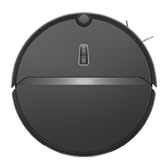</td>
      <td>Roborock E Series</td>
      <td>Sap Lite C, Roborock E2 Pure, mass production model</td>
      <td>roborock.vacuum.a01</td>
      <td></td>
    </tr>
    <tr>
      <th>672</th>
      <td></td>
      <td>Roborock P5</td>
      <td>Roborock P5, mass production model</td>
      <td>roborock.vacuum.p5</td>
      <td></td>
    </tr>
    <tr>
      <th>673</th>
      <td></td>
      <td>Roborock S4</td>
      <td>Roborock S4, S4 overseas mass production model</td>
      <td>roborock.vacuum.s4</td>
      <td></td>
    </tr>
    <tr>
      <th>674</th>
      <td></td>
      <td>Roborock S4 Max</td>
      <td></td>
      <td>roborock.vacuum.a19</td>
      <td></td>
    </tr>
    <tr>
      <th>675</th>
      <td></td>
      <td>Roborock S5</td>
      <td>Roborock s5, production model</td>
      <td>roborock.vacuum.s5</td>
      <td></td>
    </tr>
    <tr>
      <th>676</th>
      <td></td>
      <td>Roborock S5 Max</td>
      <td></td>
      <td>roborock.vacuum.s5e</td>
      <td></td>
    </tr>
    <tr>
      <th>677</th>
      <td></td>
      <td>Roborock S6</td>
      <td>Roborock s6, mass production model</td>
      <td>roborock.vacuum.s6</td>
      <td></td>
    </tr>
    <tr>
      <th>678</th>
      <td></td>
      <td>Roborock S6 MaxV</td>
      <td>Mass production model</td>
      <td>roborock.vacuum.a10</td>
      <td></td>
    </tr>
    <tr>
      <th>679</th>
      <td></td>
      <td>Roborock S6 Pure</td>
      <td>RubySC overseas, mass production model</td>
      <td>roborock.vacuum.a08</td>
      <td></td>
    </tr>
    <tr>
      <th>680</th>
      <td></td>
      <td>Roborock T4</td>
      <td></td>
      <td>roborock.vacuum.t4</td>
      <td></td>
    </tr>
    <tr>
      <th>681</th>
      <td></td>
      <td>Roborock T6</td>
      <td>Roborock t6 (Tanos), mass production model</td>
      <td>roborock.vacuum.t6</td>
      <td></td>
    </tr>
    <tr>
      <th>682</th>
      <td></td>
      <td>Roborock T7</td>
      <td></td>
      <td>roborock.vacuum.a11</td>
      <td></td>
    </tr>
    <tr>
      <th>683</th>
      <td></td>
      <td>Roborock T7 Pro</td>
      <td></td>
      <td>roborock.vacuum.a09</td>
      <td></td>
    </tr>
    <tr>
      <th>684</th>
      <td></td>
      <td>Stone Intelligence</td>
      <td>Cloud-to-cloud access, self-developed app access Xiaoai speakers</td>
      <td>roborock.vacuum.cloud</td>
      <td></td>
    </tr>
    <tr>
      <th>685</th>
      <td></td>
      <td>Sweeping robot</td>
      <td></td>
      <td>ghome.vacuum.sf013</td>
      <td></td>
    </tr>
    <tr>
      <th>686</th>
      <td></td>
      <td>Sweeping robot</td>
      <td></td>
      <td>scinan.vacuum.psw01</td>
      <td></td>
    </tr>
    <tr>
      <th>687</th>
      <td></td>
      <td>Sweeping robot</td>
      <td>Sweeping robot</td>
      <td>xzh.vacuum.vacuum</td>
      <td></td>
    </tr>
    <tr>
      <th>688</th>
      <td></td>
      <td>Sweeping robot</td>
      <td></td>
      <td>yuerzj.vacuum.rc01</td>
      <td></td>
    </tr>
    <tr>
      <th>689</th>
      <td></td>
      <td>Tatajia Vacuum</td>
      <td></td>
      <td>tab.vacuum.robot</td>
      <td></td>
    </tr>
    <tr>
      <th>690</th>
      <td></td>
      <td>Trouver Robot LDS Vacuum-Mop Finder</td>
      <td></td>
      <td>dreame.vacuum.p2036</td>
      <td></td>
    </tr>
    <tr>
      <th>691</th>
      <td></td>
      <td>VIOMI ALPHA-UV</td>
      <td></td>
      <td>viomi.vacuum.v21</td>
      <td></td>
    </tr>
    <tr>
      <th>692</th>
      <td></td>
      <td>VIOMI FIERCE-UV</td>
      <td></td>
      <td>viomi.vacuum.v20</td>
      <td></td>
    </tr>
    <tr>
      <th>693</th>
      <td></td>
      <td>Viomi Cleaning Robot</td>
      <td>Yunmi overseas sweeper</td>
      <td>viomi.vacuum.v6</td>
      <td></td>
    </tr>
    <tr>
      <th>694</th>
      <td></td>
      <td>Viomi Cleanning Robot X2</td>
      <td></td>
      <td>viomi.vacuum.v12</td>
      <td></td>
    </tr>
    <tr>
      <th>695</th>
      <td></td>
      <td>Viomi Robot Vacuum-Mop JC</td>
      <td>MIoT-Spec access</td>
      <td>viomi.vacuum.v17</td>
      <td></td>
    </tr>
    <tr>
      <th>696</th>
      <td></td>
      <td>Viomi S9</td>
      <td>MIoT SPEC protocol</td>
      <td>viomi.vacuum.v18</td>
      <td></td>
    </tr>
    <tr>
      <th>697</th>
      <td></td>
      <td>Viomi SE</td>
      <td>MIoT SPEC protocol</td>
      <td>viomi.vacuum.v19</td>
      <td>V-RVCLM21A (EU)</td>
    </tr>
    <tr>
      <th>698</th>
      <td></td>
      <td>Viomi V-SLAM Robot Vacuum</td>
      <td></td>
      <td>viomi.vacuum.v11</td>
      <td>VXVC05-SJ</td>
    </tr>
    <tr>
      <th>699</th>
      <td></td>
      <td>Viomi V3</td>
      <td>MIoT-Spec access</td>
      <td>viomi.vacuum.v13</td>
      <td></td>
    </tr>
    <tr>
      <th>700</th>
      <td></td>
      <td>Viomi sweeper PRO</td>
      <td>Yunmi v3 sweeper Pro</td>
      <td>viomi.vacuum.v3</td>
      <td></td>
    </tr>
    <tr>
      <th>701</th>
      <td></td>
      <td>Xiaowa C1</td>
      <td>Roborock c1, Sapphire -C product, production model</td>
      <td>roborock.vacuum.c1</td>
      <td></td>
    </tr>
    <tr>
      <th>702</th>
      <td></td>
      <td>Xiaowa E Series</td>
      <td>Roborock sweeping robot e2, production model</td>
      <td>roborock.vacuum.e2</td>
      <td></td>
    </tr>
    <tr>
      <th>703</th>
      <td></td>
      <td>Zigma sweeper series</td>
      <td>spark-980 laser sweeper</td>
      <td>zigma.vacuum.laser</td>
      <td></td>
    </tr>
    <tr>
      <th>704</th>
      <td></td>
      <td>puppy vacuum</td>
      <td>A smart sweeper, which can be controlled by Puppy APP and Xiaoai audio</td>
      <td>puppy.vacuum.r3x</td>
      <td></td>
    </tr>
    <tr>
      <th>705</th>
      <td></td>
      <td>vaccum</td>
      <td></td>
      <td>girt.vacuum.cleanrobot</td>
      <td></td>
    </tr>
    <tr>
      <th>706</th>
      <td></td>
      <td>vacuum</td>
      <td>Sweeping robot</td>
      <td>cgzn.vacuum.vacuum</td>
      <td></td>
    </tr>
    <tr>
      <th>707</th>
      <td></td>
      <td>yeedi-k650</td>
      <td></td>
      <td>yeedi.vacuum.k650</td>
      <td></td>
    </tr>
    <tr>
      <th>708</th>
      <td></td>
      <td>yeedi-k750</td>
      <td></td>
      <td>yeedi.vacuum.750</td>
      <td></td>
    </tr>
    <tr>
      <th>709</th>
      <td></td>
      <td>yeedi-k801</td>
      <td></td>
      <td>yeedi.vacuum.k801</td>
      <td></td>
    </tr>
    <tr>
      <th>710</th>
      <td></td>
      <td>yeedi-k802</td>
      <td></td>
      <td>yeedi.vacuum.k802</td>
      <td></td>
    </tr>
    <tr>
      <th>711</th>
      <td></td>
      <td>yeedi-k803</td>
      <td></td>
      <td>yeedi.vacuum.k803</td>
      <td></td>
    </tr>
    <tr>
      <th>712</th>
      <td></td>
      <td>yeedi-k804</td>
      <td></td>
      <td>yeedi.vacuum.k804</td>
      <td></td>
    </tr>
  </tbody>
</table>

## Thermostat
<table border="1" class="dataframe">
  <thead>
    <tr style="text-align: right;">
      <th></th>
      <th>Pic</th>
      <th>Name</th>
      <th>Description</th>
      <th>Model</th>
      <th>Product Number</th>
    </tr>
  </thead>
  <tbody>
    <tr>
      <th>713</th>
      <td></td>
      <td>Bus hydropower floor heating thermostat</td>
      <td>Bus Hydropower Floor Heating Thermostat</td>
      <td>simon.airrtc.bht</td>
      <td></td>
    </tr>
    <tr>
      <th>714</th>
      <td></td>
      <td>Denmark Grand Air Conditioning</td>
      <td>Air conditioning controller</td>
      <td>nhy.rtc.pexrtc730</td>
      <td></td>
    </tr>
    <tr>
      <th>715</th>
      <td></td>
      <td>FOWAD Floorheating Thermostat</td>
      <td>FOWAD floor heating thermostat</td>
      <td>fawad.airrtc.40011</td>
      <td></td>
    </tr>
    <tr>
      <th>716</th>
      <td></td>
      <td>FOWAD thermostat controller</td>
      <td>FOWAD central air conditioning thermostat</td>
      <td>fawad.airrtc.fwd20011</td>
      <td></td>
    </tr>
    <tr>
      <th>717</th>
      <td></td>
      <td>Fresh air thermostat</td>
      <td>This product is discarded because Xiaoai Voice Control does not support the thermostat category</td>
      <td>simon.airrtc.xfwk</td>
      <td></td>
    </tr>
    <tr>
      <th>718</th>
      <td></td>
      <td>Golan Denmark Heating</td>
      <td>Open platform access</td>
      <td>nhy.airrtc.v1</td>
      <td></td>
    </tr>
    <tr>
      <th>719</th>
      <td></td>
      <td>Heatcold FCU thermostat</td>
      <td>Air conditioning controller</td>
      <td>cubee.airrtc.th125a</td>
      <td>TH125A</td>
    </tr>
    <tr>
      <th>720</th>
      <td></td>
      <td>Heatcold Heat Pump Thermostat</td>
      <td></td>
      <td>cubee.airrtc.th125t</td>
      <td>TH125T</td>
    </tr>
    <tr>
      <th>721</th>
      <td></td>
      <td>Heatcold Heating Thermostat (Electric)</td>
      <td>Electric heating thermostat</td>
      <td>cubee.airrtc.th123e</td>
      <td>TH123E</td>
    </tr>
    <tr>
      <th>722</th>
      <td></td>
      <td>Heatcold UFH Thermostat</td>
      <td>Water heating thermostat</td>
      <td>cubee.airrtc.th123w</td>
      <td>TH123W</td>
    </tr>
    <tr>
      <th>723</th>
      <td></td>
      <td>Hydroelectric floor heating thermostat</td>
      <td></td>
      <td>simon.airrtc.wk</td>
      <td></td>
    </tr>
    <tr>
      <th>724</th>
      <td></td>
      <td>PTC10</td>
      <td></td>
      <td>poer19.airrtc.ptc10</td>
      <td></td>
    </tr>
    <tr>
      <th>725</th>
      <td></td>
      <td>PTC20</td>
      <td></td>
      <td>poer19.airrtc.ptc20</td>
      <td></td>
    </tr>
    <tr>
      <th>726</th>
      <td></td>
      <td>PTV30</td>
      <td></td>
      <td>poer19.airrtc.ptv30</td>
      <td></td>
    </tr>
    <tr>
      <th>727</th>
      <td></td>
      <td>Smart thermostat</td>
      <td>KD5P1</td>
      <td>ikecin.airrtc.29</td>
      <td></td>
    </tr>
    <tr>
      <th>728</th>
      <td></td>
      <td>Smart thermostat</td>
      <td>KP01C1510</td>
      <td>ikecin.airrtc.87</td>
      <td>KP01C1510</td>
    </tr>
    <tr>
      <th>729</th>
      <td></td>
      <td>Smart thermostat</td>
      <td>KP01C1520</td>
      <td>ikecin.airrtc.90</td>
      <td>KP01C1520</td>
    </tr>
    <tr>
      <th>730</th>
      <td></td>
      <td>Smart thermostat</td>
      <td>KD5P602</td>
      <td>ikecin.airrtc.93</td>
      <td></td>
    </tr>
    <tr>
      <th>731</th>
      <td></td>
      <td>Smart thermostat</td>
      <td>KP01C1630/KP01C1680/KP01C1690</td>
      <td>ikecin.airrtc.96</td>
      <td>KP01C1630/KP01C1680/KP01C1690</td>
    </tr>
    <tr>
      <th>732</th>
      <td></td>
      <td>Smart thermostat</td>
      <td>KP01C1501</td>
      <td>ikecin.airrtc.99</td>
      <td>KP01C1501</td>
    </tr>
    <tr>
      <th>733</th>
      <td></td>
      <td>Thermostat</td>
      <td>An air conditioner control panel with display that can control the central air conditioner.</td>
      <td>lumi.airrtc.tcpecn01</td>
      <td></td>
    </tr>
    <tr>
      <th>734</th>
      <td></td>
      <td>Thermostat S2</td>
      <td>The second-generation central air-conditioning temperature control panel enhances adaptability.</td>
      <td>lumi.airrtc.tcpecn02</td>
      <td>KTWKQ03ES</td>
    </tr>
    <tr>
      <th>735</th>
      <td></td>
      <td>VRF Air Conditioning Controller</td>
      <td>Variable refrigerant flow multi-connected air conditioning system (referred to as multi-line) controller.</td>
      <td>lumi.airrtc.vrfegl01</td>
      <td>KTBL01LM</td>
    </tr>
  </tbody>
</table>

## Vacuum cleaner
<table border="1" class="dataframe">
  <thead>
    <tr style="text-align: right;">
      <th></th>
      <th>Pic</th>
      <th>Name</th>
      <th>Description</th>
      <th>Model</th>
      <th>Product Number</th>
    </tr>
  </thead>
  <tbody>
    <tr>
      <th>736</th>
      <td></td>
      <td>ROIDMI Cordless Vacuum Cleaner F8 Pro</td>
      <td>Ruimi Wireless Vacuum Cleaner F8 Pro</td>
      <td>roidmi.cleaner.f8pro</td>
      <td></td>
    </tr>
    <tr>
      <th>737</th>
      <td></td>
      <td>ROIDMI Cordless Vacuum Cleaner NEX2</td>
      <td>Ruimi Wireless Vacuum Cleaner NEX2</td>
      <td>roidmi.cleaner.v2</td>
      <td></td>
    </tr>
    <tr>
      <th>738</th>
      <td></td>
      <td>ROIDMI Cordless Vacuum Cleaner NEX2 Pro</td>
      <td>Wireless handheld vacuum cleaner</td>
      <td>roidmi.cleaner.v382</td>
      <td></td>
    </tr>
    <tr>
      <th>739</th>
      <td></td>
      <td>ROIDMI Handheld Vacuum Cleaner</td>
      <td>Portable rechargeable vacuum cleaner</td>
      <td>roidmi.vacuum.v1</td>
      <td></td>
    </tr>
    <tr>
      <th>740</th>
      <td></td>
      <td>ROIDMI NEX Vacuum</td>
      <td>Portable rechargeable vacuum cleaner</td>
      <td>roidmi.cleaner.v1</td>
      <td></td>
    </tr>
  </tbody>
</table>

---
# Home security
## Bedside lamp
<table border="1" class="dataframe">
  <thead>
    <tr style="text-align: right;">
      <th></th>
      <th>Pic</th>
      <th>Name</th>
      <th>Description</th>
      <th>Model</th>
      <th>Product Number</th>
    </tr>
  </thead>
  <tbody>
    <tr>
      <th>741</th>
      <td></td>
      <td>Mi Bedside Lamp</td>
      <td>Mijia bedside lamp</td>
      <td>yeelink.light.bslamp1</td>
      <td>MJCTD01YL</td>
    </tr>
    <tr>
      <th>742</th>
      <td></td>
      <td>Mi Bedside Lamp 2</td>
      <td>Dysis</td>
      <td>yeelink.light.bslamp2</td>
      <td>MJCTD02YL</td>
    </tr>
    <tr>
      <th>743</th>
      <td></td>
      <td>Midian Intelligent Bedside Healthy Lamp</td>
      <td>This product is a bedside lamp for healthy lighting and sleep aid.Using the self-developed silicon substrate long-wavelength LED core technology, it is 100% blue-free, does not hurt the eyes, helps sleep, and also has the function of waking up users regularly, and intelligently controlled through the Mijia APP to form a complete set of sleep-wake-upSolutions to provide users with the most comfortable sleeping environment.</td>
      <td>noc196.light.mdctd9</td>
      <td></td>
    </tr>
    <tr>
      <th>744</th>
      <td></td>
      <td>Philips ZhiRui bedside lamp</td>
      <td>Philips Zhi Rui bedside lamp</td>
      <td>philips.light.moonlight</td>
      <td>9290019202</td>
    </tr>
    <tr>
      <th>745</th>
      <td></td>
      <td>Yeelight Bedside Lamp</td>
      <td>Yeelight Bluetooth light</td>
      <td>yeelink.light.ble1</td>
      <td>(XMCTD01YL) (MUE4028RT/MUE4064GL)</td>
    </tr>
    <tr>
      <th>746</th>
      <td></td>
      <td>Yeelight Bedside Lamp II</td>
      <td>Dysis LE</td>
      <td>yeelink.light.bslamp3</td>
      <td>YLCT01YL</td>
    </tr>
  </tbody>
</table>

## Ceiling light
<table border="1" class="dataframe">
  <thead>
    <tr style="text-align: right;">
      <th></th>
      <th>Pic</th>
      <th>Name</th>
      <th>Description</th>
      <th>Model</th>
      <th>Product Number</th>
    </tr>
  </thead>
  <tbody>
    <tr>
      <th>747</th>
      <td></td>
      <td>1 position dimmer switch</td>
      <td>I7 1 position dimmer switch</td>
      <td>simon.light.1light</td>
      <td></td>
    </tr>
    <tr>
      <th>748</th>
      <td></td>
      <td>1 position dimmer switch</td>
      <td>E3 1 position dimmer switch</td>
      <td>simon.light.e1lsw</td>
      <td></td>
    </tr>
    <tr>
      <th>749</th>
      <td></td>
      <td>2-position dimmer switch</td>
      <td>I7 2-position dimmer switch</td>
      <td>simon.light.2light</td>
      <td></td>
    </tr>
    <tr>
      <th>750</th>
      <td></td>
      <td>2-position dimmer switch</td>
      <td>E3 2-position dimmer switch</td>
      <td>simon.light.e2lsw</td>
      <td></td>
    </tr>
    <tr>
      <th>751</th>
      <td></td>
      <td>5w dimming color downlight</td>
      <td></td>
      <td>sfl.light.wl215</td>
      <td></td>
    </tr>
    <tr>
      <th>752</th>
      <td></td>
      <td>Adjustable dual color temperature lamp</td>
      <td>Adjustable brightness and color temperature</td>
      <td>pair.light.5</td>
      <td></td>
    </tr>
    <tr>
      <th>753</th>
      <td></td>
      <td>Adjustable lights</td>
      <td>Adjustable lights</td>
      <td>tc0756.light.7</td>
      <td></td>
    </tr>
    <tr>
      <th>754</th>
      <td></td>
      <td>Adjustable lights</td>
      <td>Adjustable light (b)</td>
      <td>tc0756.light.7b</td>
      <td></td>
    </tr>
    <tr>
      <th>755</th>
      <td></td>
      <td>Air Surface ceiling light</td>
      <td></td>
      <td>cchip.light.l1</td>
      <td></td>
    </tr>
    <tr>
      <th>756</th>
      <td></td>
      <td>All the way light panel-S</td>
      <td>All the way light panel-S FT179_WallSwitch_Single</td>
      <td>linked.light.ft179</td>
      <td></td>
    </tr>
    <tr>
      <th>757</th>
      <td></td>
      <td>AllCenter Light Series</td>
      <td>AllCenter Smart Dimming Color Light Series</td>
      <td>umiot.light.ums</td>
      <td></td>
    </tr>
    <tr>
      <th>758</th>
      <td></td>
      <td>Altron Dimming Light</td>
      <td></td>
      <td>orz.light.clight</td>
      <td></td>
    </tr>
    <tr>
      <th>759</th>
      <td></td>
      <td>Altron lamp</td>
      <td></td>
      <td>orz.light.light</td>
      <td></td>
    </tr>
    <tr>
      <th>760</th>
      <td></td>
      <td>Anti-glare high-display spotlight pro 1</td>
      <td>Valin</td>
      <td>crzm.light.wy0a02</td>
      <td></td>
    </tr>
    <tr>
      <th>761</th>
      <td></td>
      <td>Aqara Smart Constant Current Driver</td>
      <td></td>
      <td>lumi.light.cbacn</td>
      <td></td>
    </tr>
    <tr>
      <th>762</th>
      <td></td>
      <td>Aqara Smart Constant Current Driver T1-1</td>
      <td></td>
      <td>lumi.light.cbacn1</td>
      <td>HLQDQ01LM</td>
    </tr>
    <tr>
      <th>763</th>
      <td></td>
      <td>Aqara Smart Constant Current Driver T1-2</td>
      <td></td>
      <td>lumi.light.cbacn2</td>
      <td></td>
    </tr>
    <tr>
      <th>764</th>
      <td></td>
      <td>Aqara Smart Dimming Module T1</td>
      <td></td>
      <td>lumi.light.rgbac1</td>
      <td>ZNTGMK11LM</td>
    </tr>
    <tr>
      <th>765</th>
      <td></td>
      <td>Aqara Smart Dimming Module T1 (0-10V)</td>
      <td></td>
      <td>lumi.light.t110</td>
      <td></td>
    </tr>
    <tr>
      <th>766</th>
      <td></td>
      <td>BLE Night-light</td>
      <td>Philips Smart Bluetooth Sensor Night Light</td>
      <td>philips.light.zynl</td>
      <td></td>
    </tr>
    <tr>
      <th>767</th>
      <td></td>
      <td>Bafa</td>
      <td></td>
      <td>bemfa.light.be01</td>
      <td></td>
    </tr>
    <tr>
      <th>768</th>
      <td></td>
      <td>Bafayun</td>
      <td>Bafa Cloud Smart Home</td>
      <td>bemfa.light.bemfa</td>
      <td></td>
    </tr>
    <tr>
      <th>769</th>
      <td></td>
      <td>Baopu (DIM PP-Wired Version)</td>
      <td></td>
      <td>ldsn.light.2bpd18</td>
      <td></td>
    </tr>
    <tr>
      <th>770</th>
      <td></td>
      <td>Big Fish Intelligence</td>
      <td>New access platform</td>
      <td>yiduo.light.v1</td>
      <td></td>
    </tr>
    <tr>
      <th>771</th>
      <td></td>
      <td>Bigger than smart lights</td>
      <td></td>
      <td>aimore.light.led01</td>
      <td></td>
    </tr>
    <tr>
      <th>772</th>
      <td></td>
      <td>Bit light</td>
      <td></td>
      <td>btzn.light.v1</td>
      <td></td>
    </tr>
    <tr>
      <th>773</th>
      <td></td>
      <td>Bulb</td>
      <td>Smart bulb, support switch, adjust brightness, adjust color temperature, timing, delay</td>
      <td>konke2.light.kbulb</td>
      <td></td>
    </tr>
    <tr>
      <th>774</th>
      <td></td>
      <td>Bulb</td>
      <td></td>
      <td>zengge.light.bulb</td>
      <td></td>
    </tr>
    <tr>
      <th>775</th>
      <td></td>
      <td>CCT Bulb</td>
      <td>CCT Bulb, color temperature high pressure controller, high pressure module WC</td>
      <td>cydj.light.v6</td>
      <td></td>
    </tr>
    <tr>
      <th>776</th>
      <td></td>
      <td>CCT Bulb</td>
      <td></td>
      <td>zengge.light.cct</td>
      <td></td>
    </tr>
    <tr>
      <th>777</th>
      <td></td>
      <td>CCT LED Controller</td>
      <td></td>
      <td>zengge.light.cctc</td>
      <td></td>
    </tr>
    <tr>
      <th>778</th>
      <td></td>
      <td>CW NVC ceiling light</td>
      <td></td>
      <td>ddwl.light.040015</td>
      <td></td>
    </tr>
    <tr>
      <th>779</th>
      <td></td>
      <td>CW NVC ceiling light</td>
      <td></td>
      <td>nvcls.light.040015</td>
      <td></td>
    </tr>
    <tr>
      <th>780</th>
      <td></td>
      <td>CW NVC ceiling light</td>
      <td></td>
      <td>sykj.light.040015</td>
      <td></td>
    </tr>
    <tr>
      <th>781</th>
      <td></td>
      <td>CW bulb light</td>
      <td></td>
      <td>ddwl.light.040004</td>
      <td></td>
    </tr>
    <tr>
      <th>782</th>
      <td></td>
      <td>CW bulb light</td>
      <td></td>
      <td>sykj.light.040004</td>
      <td></td>
    </tr>
    <tr>
      <th>783</th>
      <td></td>
      <td>CW bulb light</td>
      <td></td>
      <td>szsy.light.040004</td>
      <td></td>
    </tr>
    <tr>
      <th>784</th>
      <td></td>
      <td>CW downlight</td>
      <td></td>
      <td>sykj.light.040012</td>
      <td></td>
    </tr>
    <tr>
      <th>785</th>
      <td></td>
      <td>CW downlight</td>
      <td></td>
      <td>szsy.light.040012</td>
      <td></td>
    </tr>
    <tr>
      <th>786</th>
      <td></td>
      <td>CWRGB bulb light</td>
      <td></td>
      <td>ddwl.light.04000e</td>
      <td></td>
    </tr>
    <tr>
      <th>787</th>
      <td></td>
      <td>CWRGB bulb light</td>
      <td></td>
      <td>mpkx.light.04000e</td>
      <td></td>
    </tr>
    <tr>
      <th>788</th>
      <td></td>
      <td>CWRGB bulb light</td>
      <td></td>
      <td>nvcls.light.04000e</td>
      <td></td>
    </tr>
    <tr>
      <th>789</th>
      <td></td>
      <td>CWRGB bulb light</td>
      <td></td>
      <td>sykj.light.04000e</td>
      <td></td>
    </tr>
    <tr>
      <th>790</th>
      <td></td>
      <td>CWRGB bulb light</td>
      <td></td>
      <td>szsy.light.04000e</td>
      <td></td>
    </tr>
    <tr>
      <th>791</th>
      <td></td>
      <td>CWRGB downlight</td>
      <td></td>
      <td>ddwl.light.040011</td>
      <td></td>
    </tr>
    <tr>
      <th>792</th>
      <td></td>
      <td>CWRGB downlight</td>
      <td></td>
      <td>mpkx.light.040011</td>
      <td></td>
    </tr>
    <tr>
      <th>793</th>
      <td></td>
      <td>CWRGB downlight</td>
      <td></td>
      <td>nvcls.light.040011</td>
      <td></td>
    </tr>
    <tr>
      <th>794</th>
      <td></td>
      <td>CWRGB downlight</td>
      <td></td>
      <td>sykj.light.040011</td>
      <td></td>
    </tr>
    <tr>
      <th>795</th>
      <td></td>
      <td>CWRGB downlight</td>
      <td></td>
      <td>szsy.light.040011</td>
      <td></td>
    </tr>
    <tr>
      <th>796</th>
      <td></td>
      <td>Ceiling Light MX480 (Adjustable Color Temperature)</td>
      <td>A ceiling lamp with adjustable brightness and color temperature is generally suitable for bedrooms. It is connected to the gateway through the Zigbee 3.0 module and is interconnected.Need to realize the distributed networking function.</td>
      <td>lumi.light.cwopcn03</td>
      <td>XDD13LM</td>
    </tr>
    <tr>
      <th>797</th>
      <td></td>
      <td>Ceiling Light MX650 (Adjustable Color Temperature)</td>
      <td>A ceiling lamp with adjustable brightness and color temperature is generally suitable for small living rooms. It is connected to the gateway through the Zigbee 3.0 module and interconnected.Need to realize the distributed networking function.</td>
      <td>lumi.light.cwopcn02</td>
      <td>XDD12LM</td>
    </tr>
    <tr>
      <th>798</th>
      <td></td>
      <td>Ceiling Light MX960 (Adjustable Color Temperature)</td>
      <td>A ceiling lamp with adjustable brightness and color temperature is generally suitable for large living rooms. It is connected to the gateway through the Zigbee 3.0 module and interconnected.Need to realize the distributed networking function.</td>
      <td>lumi.light.cwopcn01</td>
      <td></td>
    </tr>
    <tr>
      <th>799</th>
      <td></td>
      <td>Ceiling light</td>
      <td></td>
      <td>lwkj.light.2110</td>
      <td></td>
    </tr>
    <tr>
      <th>800</th>
      <td></td>
      <td>Ceiling light</td>
      <td>Smart ceiling lamp supports brightness and color temperature adjustment</td>
      <td>yszj.light.2110</td>
      <td></td>
    </tr>
    <tr>
      <th>801</th>
      <td></td>
      <td>Cloud access light</td>
      <td>Cloud access universal lights</td>
      <td>ezhome.light.yy0002</td>
      <td></td>
    </tr>
    <tr>
      <th>802</th>
      <td></td>
      <td>Cold and warm two-color light (103)</td>
      <td></td>
      <td>coolki.light.uid103</td>
      <td></td>
    </tr>
    <tr>
      <th>803</th>
      <td></td>
      <td>Color temperature lamp</td>
      <td></td>
      <td>edaltd.light.moral</td>
      <td></td>
    </tr>
    <tr>
      <th>804</th>
      <td></td>
      <td>Color temperature lamp</td>
      <td></td>
      <td>giz.light.light</td>
      <td></td>
    </tr>
    <tr>
      <th>805</th>
      <td></td>
      <td>Color temperature lamp</td>
      <td></td>
      <td>hsmart.light.mhs2lg</td>
      <td></td>
    </tr>
    <tr>
      <th>806</th>
      <td></td>
      <td>Color temperature lamp with controller</td>
      <td>Color temperature lamp with controller</td>
      <td>xqh.light.z20731</td>
      <td></td>
    </tr>
    <tr>
      <th>807</th>
      <td></td>
      <td>Colored lights</td>
      <td></td>
      <td>lwkj.light.2010</td>
      <td></td>
    </tr>
    <tr>
      <th>808</th>
      <td></td>
      <td>Colored lights</td>
      <td>Smart colored lights support brightness adjustment and color settings</td>
      <td>yszj.light.2010</td>
      <td></td>
    </tr>
    <tr>
      <th>809</th>
      <td></td>
      <td>Colorful lights</td>
      <td>Support switch, adjust brightness, adjust color, timing, delay</td>
      <td>konke2.light.cobulb</td>
      <td></td>
    </tr>
    <tr>
      <th>810</th>
      <td></td>
      <td>Crackle smart anti glare lamp (mesh)</td>
      <td>Crackling smart anti-glare light</td>
      <td>090615.light.pipatd</td>
      <td></td>
    </tr>
    <tr>
      <th>811</th>
      <td></td>
      <td>Crackle smart light band (mesh)</td>
      <td>Crackling Smart Light Strip</td>
      <td>090615.light.pipadd</td>
      <td></td>
    </tr>
    <tr>
      <th>812</th>
      <td></td>
      <td>DGMB1</td>
      <td>Light panel all the way to zero fire</td>
      <td>linked.light.ft153</td>
      <td></td>
    </tr>
    <tr>
      <th>813</th>
      <td></td>
      <td>DGMB2</td>
      <td>Light panel two-way zero fire</td>
      <td>linked.light.ft154</td>
      <td></td>
    </tr>
    <tr>
      <th>814</th>
      <td></td>
      <td>DGMB4</td>
      <td>Light panel four-way zero fire</td>
      <td>linked.light.ft155</td>
      <td></td>
    </tr>
    <tr>
      <th>815</th>
      <td></td>
      <td>DGMK1</td>
      <td>Embedded module</td>
      <td>linked.light.ft116</td>
      <td></td>
    </tr>
    <tr>
      <th>816</th>
      <td></td>
      <td>DGMK2</td>
      <td>Embedded module 2 way</td>
      <td>linked.light.ft132</td>
      <td></td>
    </tr>
    <tr>
      <th>817</th>
      <td></td>
      <td>DMS Smart downlight</td>
      <td>Realtek 07P</td>
      <td>dmq.light.wy0a01</td>
      <td></td>
    </tr>
    <tr>
      <th>818</th>
      <td></td>
      <td>Dan Fei Nuo Smart Light</td>
      <td>Le Public Version-Debaishi Non-Isolated</td>
      <td>dikair.light.wy0a01</td>
      <td></td>
    </tr>
    <tr>
      <th>819</th>
      <td></td>
      <td>DanceLight I Series Ceiling Lamp</td>
      <td>Xiamen Topstar Co., Ltd. ceiling lamp project, using ESP-12S module, as a customer of Shenzhen Anxinke Technology Co., Ltd.</td>
      <td>tsd.light.tp1</td>
      <td></td>
    </tr>
    <tr>
      <th>820</th>
      <td></td>
      <td>Danfino Intelligent Roof Suction Lamp</td>
      <td>Danfino Smart Ceiling Lamp</td>
      <td>jsc.light.wydfn1</td>
      <td></td>
    </tr>
    <tr>
      <th>821</th>
      <td></td>
      <td>Dengbushangshu Picturesque lamp</td>
      <td>MiMK277-33317-2943</td>
      <td>scds.light.wy0a01</td>
      <td></td>
    </tr>
    <tr>
      <th>822</th>
      <td></td>
      <td>Diandian24w</td>
      <td></td>
      <td>dotdot.light.dian24</td>
      <td></td>
    </tr>
    <tr>
      <th>823</th>
      <td></td>
      <td>Diandian45w</td>
      <td></td>
      <td>dotdot.light.dian45</td>
      <td></td>
    </tr>
    <tr>
      <th>824</th>
      <td></td>
      <td>Diandian90w</td>
      <td></td>
      <td>dotdot.light.dian90</td>
      <td></td>
    </tr>
    <tr>
      <th>825</th>
      <td></td>
      <td>Dimmable Bulb</td>
      <td>Bulb single color, high voltage module W, single color high voltage controller on sale</td>
      <td>cydj.light.v7</td>
      <td></td>
    </tr>
    <tr>
      <th>826</th>
      <td></td>
      <td>Dimmable Controller</td>
      <td>LED Controller monochrome controller on sale</td>
      <td>cydj.light.v3</td>
      <td></td>
    </tr>
    <tr>
      <th>827</th>
      <td></td>
      <td>Dimmer switch</td>
      <td>Dimmer switch</td>
      <td>kuju.light.2</td>
      <td></td>
    </tr>
    <tr>
      <th>828</th>
      <td></td>
      <td>Dimmer switch</td>
      <td>Dimmer color switch V2 version</td>
      <td>scmkcz.light.cr2pv2</td>
      <td></td>
    </tr>
    <tr>
      <th>829</th>
      <td></td>
      <td>Dimmer switch (0-10v)</td>
      <td>Dimmer switch (0-10v)</td>
      <td>kuju.light.39</td>
      <td></td>
    </tr>
    <tr>
      <th>830</th>
      <td></td>
      <td>Dimming light</td>
      <td></td>
      <td>eide.light.tiaog</td>
      <td></td>
    </tr>
    <tr>
      <th>831</th>
      <td></td>
      <td>Dimming light</td>
      <td></td>
      <td>fine.light.light1</td>
      <td></td>
    </tr>
    <tr>
      <th>832</th>
      <td></td>
      <td>Dimming light</td>
      <td></td>
      <td>juzi.light.010201</td>
      <td></td>
    </tr>
    <tr>
      <th>833</th>
      <td></td>
      <td>Dimming light</td>
      <td></td>
      <td>p2c.light.dimmer</td>
      <td></td>
    </tr>
    <tr>
      <th>834</th>
      <td></td>
      <td>Dimming light</td>
      <td>Adjustable brightness</td>
      <td>pair.light.4</td>
      <td></td>
    </tr>
    <tr>
      <th>835</th>
      <td></td>
      <td>Dimming light</td>
      <td></td>
      <td>wlank.light.001</td>
      <td></td>
    </tr>
    <tr>
      <th>836</th>
      <td></td>
      <td>Dimming panel</td>
      <td>DIMMER_SWITCH_MCU+SoC</td>
      <td>yaguan.light.dimmer</td>
      <td></td>
    </tr>
    <tr>
      <th>837</th>
      <td>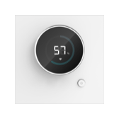</td>
      <td>Dimming panel (Chopin)</td>
      <td>Dimming panel (Chopin)</td>
      <td>kongke.light.kkdim</td>
      <td></td>
    </tr>
    <tr>
      <th>838</th>
      <td></td>
      <td>Dimming-Lamp</td>
      <td>Dimming light</td>
      <td>ezhome.light.zhyapp08</td>
      <td></td>
    </tr>
    <tr>
      <th>839</th>
      <td></td>
      <td>Domoticz-lamp</td>
      <td>light</td>
      <td>xkwl.light.dlight</td>
      <td></td>
    </tr>
    <tr>
      <th>840</th>
      <td></td>
      <td>DongDong Babysbreath LED Ceiling Lamp</td>
      <td>Dongdong Gypsophila LED Ceiling Light</td>
      <td>leishi.light.eps113</td>
      <td></td>
    </tr>
    <tr>
      <th>841</th>
      <td></td>
      <td>Downlight (adjustable temperature)</td>
      <td></td>
      <td>lumi.light.cwjwcn02</td>
      <td>JWDL001A</td>
    </tr>
    <tr>
      <th>842</th>
      <td></td>
      <td>EMG Top halo ceiling lamp</td>
      <td>EMG upper halo ceiling light</td>
      <td>ymj.light.wyymj1</td>
      <td></td>
    </tr>
    <tr>
      <th>843</th>
      <td></td>
      <td>Electric light</td>
      <td>Lighting products</td>
      <td>szlxz.light.v1</td>
      <td></td>
    </tr>
    <tr>
      <th>844</th>
      <td></td>
      <td>Electric light</td>
      <td>Electric light</td>
      <td>tc0756.light.test</td>
      <td></td>
    </tr>
    <tr>
      <th>845</th>
      <td></td>
      <td>FSL AI ceiling lamp</td>
      <td></td>
      <td>sfl.light.aaas</td>
      <td></td>
    </tr>
    <tr>
      <th>846</th>
      <td></td>
      <td>Fan light</td>
      <td></td>
      <td>coolki.light.uid34</td>
      <td></td>
    </tr>
    <tr>
      <th>847</th>
      <td></td>
      <td>Fan light</td>
      <td></td>
      <td>edaltd.light.f300</td>
      <td></td>
    </tr>
    <tr>
      <th>848</th>
      <td></td>
      <td>Fan light</td>
      <td>Fan light MWL2M</td>
      <td>scmkcz.light.mwl2m</td>
      <td></td>
    </tr>
    <tr>
      <th>849</th>
      <td></td>
      <td>FanLight</td>
      <td>Intelligent stepless dimming fan light, can switch the fan, turn on the light, adjust the light color</td>
      <td>aihome.light.m93</td>
      <td></td>
    </tr>
    <tr>
      <th>850</th>
      <td></td>
      <td>Fantong Intelligent Lamp</td>
      <td>Fantong Smart Light</td>
      <td>ftds.light.wyft1</td>
      <td></td>
    </tr>
    <tr>
      <th>851</th>
      <td></td>
      <td>Feihong lighting</td>
      <td>Philippine bluetooth two-color light</td>
      <td>yhzm.light.wyfh01</td>
      <td></td>
    </tr>
    <tr>
      <th>852</th>
      <td></td>
      <td>Feipujia Intelligent lamps and lanterns</td>
      <td>Philip's smart lamps</td>
      <td>asdds.light.wyfpj1</td>
      <td></td>
    </tr>
    <tr>
      <th>853</th>
      <td></td>
      <td>Five Color Bulb</td>
      <td>Smart lighting</td>
      <td>tuya.light.tywl05</td>
      <td></td>
    </tr>
    <tr>
      <th>854</th>
      <td></td>
      <td>Five-color bulb light (104)</td>
      <td></td>
      <td>coolki.light.uid104</td>
      <td></td>
    </tr>
    <tr>
      <th>855</th>
      <td></td>
      <td>Flash excellent color light</td>
      <td>Smyoo IoT smart color light</td>
      <td>smyoo.light.04</td>
      <td></td>
    </tr>
    <tr>
      <th>856</th>
      <td></td>
      <td>Flower wheel (DIM11 head-remote control version)</td>
      <td></td>
      <td>ldsn.light.2hld20</td>
      <td></td>
    </tr>
    <tr>
      <th>857</th>
      <td></td>
      <td>Four-way lighting panel-S</td>
      <td>Four-way lighting panel-S FT155_WallSwitch_Quad_S0</td>
      <td>linked.light.ft155q</td>
      <td></td>
    </tr>
    <tr>
      <th>858</th>
      <td></td>
      <td>Gomanni G1 series ceiling lamp</td>
      <td>Comanni G1 series ceiling lamp-Realtek8762</td>
      <td>gmn.light.wy0a01</td>
      <td></td>
    </tr>
    <tr>
      <th>859</th>
      <td></td>
      <td>Gomanni Scene two color ceiling lamp</td>
      <td>wifi double color light</td>
      <td>gmn.light.wy0w01</td>
      <td></td>
    </tr>
    <tr>
      <th>860</th>
      <td></td>
      <td>Gosund Light strip</td>
      <td>Smart light strip</td>
      <td>cuco.light.sl4</td>
      <td></td>
    </tr>
    <tr>
      <th>861</th>
      <td></td>
      <td>Guangzhou Zhunde</td>
      <td>Control the light on and off, adjust the brightness, adjust the color, adjust the color temperature.</td>
      <td>zdzn.light.zun222</td>
      <td></td>
    </tr>
    <tr>
      <th>862</th>
      <td></td>
      <td>Guangzhou Zhunde Lighting</td>
      <td>Control the light on and off, dimming and brightness adjustment</td>
      <td>zdzn.light.66743</td>
      <td></td>
    </tr>
    <tr>
      <th>863</th>
      <td></td>
      <td>Guangzhou Zhunde Lighting Class 2</td>
      <td>Control the light on and off, dimming and brightness</td>
      <td>zdzn.light.zun111</td>
      <td></td>
    </tr>
    <tr>
      <th>864</th>
      <td></td>
      <td>HUAYI LIGHTING COMMON CEILING LIGHT</td>
      <td>huayi.light.wy002 Huayi Lighting Ceiling Light General Series 002</td>
      <td>huayi.light.wy002</td>
      <td></td>
    </tr>
    <tr>
      <th>865</th>
      <td></td>
      <td>HUIZUO AQUARIUS Bulb</td>
      <td>huayi.light.aqu114 Huizuo Water Bottle Star Color Bubble</td>
      <td>huayi.light.aqu114</td>
      <td></td>
    </tr>
    <tr>
      <th>866</th>
      <td></td>
      <td>HUIZUO ARIES For Bedroom</td>
      <td>Aries Star Bedroom Series by Hua Yihui</td>
      <td>huayi.light.ari013</td>
      <td></td>
    </tr>
    <tr>
      <th>867</th>
      <td></td>
      <td>HUIZUO ARIES For Living Room</td>
      <td>Huayihui made Aries living room series-ZT-light-square 72W</td>
      <td>huayi.light.aries</td>
      <td></td>
    </tr>
    <tr>
      <th>868</th>
      <td></td>
      <td>HUIZUO Ceiling Light</td>
      <td></td>
      <td>huayi.light.wy</td>
      <td></td>
    </tr>
    <tr>
      <th>869</th>
      <td></td>
      <td>HUIZUO Fan Light (2020)</td>
      <td>Huizuo 2020 version of new wind lighting huayi.light.fanwy2</td>
      <td>huayi.light.fanwy2</td>
      <td></td>
    </tr>
    <tr>
      <th>870</th>
      <td></td>
      <td>HUIZUO Heating Lamp</td>
      <td></td>
      <td>huayi.light.wyheat</td>
      <td></td>
    </tr>
    <tr>
      <th>871</th>
      <td></td>
      <td>HUIZUO Light Board</td>
      <td></td>
      <td>huayi.light.rgb205</td>
      <td></td>
    </tr>
    <tr>
      <th>872</th>
      <td></td>
      <td>HUIZUO PEGASUS For Bedroom</td>
      <td>Huayihui made Tianmaxing bedroom series-huayi.light.peg093</td>
      <td>huayi.light.peg093</td>
      <td></td>
    </tr>
    <tr>
      <th>873</th>
      <td></td>
      <td>HUIZUO PEGASUS For Living Room</td>
      <td>Huayihui made Tianmaxing living room series-huayi.light.peg091</td>
      <td>huayi.light.peg091</td>
      <td></td>
    </tr>
    <tr>
      <th>874</th>
      <td></td>
      <td>HUIZUO PISCES For Bedroom</td>
      <td>Huayihui made Pisces bedroom series-ZA</td>
      <td>huayi.light.pis123</td>
      <td></td>
    </tr>
    <tr>
      <th>875</th>
      <td></td>
      <td>HUIZUO TAURUS For Bedroom</td>
      <td>Taurus bedroom series made by Huayihui-023-ZA</td>
      <td>huayi.light.tau023</td>
      <td></td>
    </tr>
    <tr>
      <th>876</th>
      <td></td>
      <td>HUIZUO TAURUS For Living Room</td>
      <td>Huayihui made Taurus living room series -021-ZA</td>
      <td>huayi.light.taurus</td>
      <td></td>
    </tr>
    <tr>
      <th>877</th>
      <td></td>
      <td>HUIZUO VIRGO For Bedroom</td>
      <td>Virgo Bedroom Series by Huayihui-ZA</td>
      <td>huayi.light.vir063</td>
      <td></td>
    </tr>
    <tr>
      <th>878</th>
      <td></td>
      <td>HUIZUO VIRGO For Living Room</td>
      <td>Huayihui virgin living room series-ZA</td>
      <td>huayi.light.virgo</td>
      <td></td>
    </tr>
    <tr>
      <th>879</th>
      <td></td>
      <td>HUIZUO YONG Downlight (BLE Mesh)</td>
      <td></td>
      <td>huayi.light.wy203</td>
      <td></td>
    </tr>
    <tr>
      <th>880</th>
      <td></td>
      <td>HUIZUO ZIWEI Ceiling Lamp</td>
      <td>Ziwei Star Series by Huayihui (huayi.light.zw131)</td>
      <td>huayi.light.zw131</td>
      <td></td>
    </tr>
    <tr>
      <th>881</th>
      <td></td>
      <td>Hadaman intelligent LED ceiling lamp</td>
      <td>Hadaman Smart LED Ceiling Light</td>
      <td>hdm.light.wy08a</td>
      <td></td>
    </tr>
    <tr>
      <th>882</th>
      <td></td>
      <td>Huai Su (DIM Single Head-Touch & Remote Control Version)</td>
      <td></td>
      <td>ldsn.light.2hsd15</td>
      <td></td>
    </tr>
    <tr>
      <th>883</th>
      <td></td>
      <td>Huai Su Ceiling Light</td>
      <td>C3 Huai Su Ceiling Light</td>
      <td>ldsn.light.hsxd01</td>
      <td></td>
    </tr>
    <tr>
      <th>884</th>
      <td></td>
      <td>Huai Su Ceiling Light</td>
      <td>C3 Huai Su Ceiling Light</td>
      <td>ldsn.light.hsxd02</td>
      <td></td>
    </tr>
    <tr>
      <th>885</th>
      <td></td>
      <td>Huangde Smart Lamp</td>
      <td>Huang's Smart Light</td>
      <td>hbc.light.wy0a01</td>
      <td></td>
    </tr>
    <tr>
      <th>886</th>
      <td></td>
      <td>IMILAB Eye-caring Table Lamp</td>
      <td></td>
      <td>chuangmi.light.028a01</td>
      <td></td>
    </tr>
    <tr>
      <th>887</th>
      <td></td>
      <td>Infrared ceiling light</td>
      <td>Infrared ceiling light</td>
      <td>konke2.light.rmligh</td>
      <td></td>
    </tr>
    <tr>
      <th>888</th>
      <td></td>
      <td>Intelligent light control (1 channel single brightness version)</td>
      <td>Linkage HA</td>
      <td>hxiot.light.ha1</td>
      <td></td>
    </tr>
    <tr>
      <th>889</th>
      <td></td>
      <td>LED Ceiling Light Crystal Plus</td>
      <td>Nox Plus</td>
      <td>yeelink.light.ceiling8</td>
      <td>YLXD10YL</td>
    </tr>
    <tr>
      <th>890</th>
      <td></td>
      <td>LED Controller</td>
      <td></td>
      <td>zengge.light.ctrler</td>
      <td></td>
    </tr>
    <tr>
      <th>891</th>
      <td></td>
      <td>LED bulb (adjustable temperature)</td>
      <td></td>
      <td>lumi.light.aqcn01</td>
      <td></td>
    </tr>
    <tr>
      <th>892</th>
      <td></td>
      <td>LED driver</td>
      <td>LED drive controller</td>
      <td>aiicn.light.pwm2</td>
      <td></td>
    </tr>
    <tr>
      <th>893</th>
      <td></td>
      <td>LED lights</td>
      <td></td>
      <td>future.light.led</td>
      <td></td>
    </tr>
    <tr>
      <th>894</th>
      <td></td>
      <td>LED strip with controller</td>
      <td>LED dimming controller LED strip controller 8 5</td>
      <td>uiot.light.light7</td>
      <td></td>
    </tr>
    <tr>
      <th>895</th>
      <td></td>
      <td>LUNO Lvneng Mijia intelligent lamp</td>
      <td>LUNO Green Energy Mijia Smart Light (Le-style Neutral)</td>
      <td>lndq.light.wy0a01</td>
      <td></td>
    </tr>
    <tr>
      <th>896</th>
      <td></td>
      <td>Lamps</td>
      <td></td>
      <td>etlink.light.sl001</td>
      <td></td>
    </tr>
    <tr>
      <th>897</th>
      <td></td>
      <td>Langli intelligent LED ceiling lamp</td>
      <td>Ying Li LED Ceiling Light</td>
      <td>hcznjj.light.wyll01</td>
      <td></td>
    </tr>
    <tr>
      <th>898</th>
      <td></td>
      <td>Lantern</td>
      <td></td>
      <td>jyx.light.021002</td>
      <td></td>
    </tr>
    <tr>
      <th>899</th>
      <td></td>
      <td>Lantern</td>
      <td>YG_LIGHT_COLOR</td>
      <td>yaguan.light.bulb</td>
      <td></td>
    </tr>
    <tr>
      <th>900</th>
      <td></td>
      <td>Leiyuan Intelligent Living Room Lamp</td>
      <td>Leiyuan Smart Living Room Lamp</td>
      <td>ylzm.light.wyly01</td>
      <td></td>
    </tr>
    <tr>
      <th>901</th>
      <td></td>
      <td>Lemeng lighting bedroom ceiling lamp</td>
      <td>DBS non-isolated</td>
      <td>lmds.light.wy0a02</td>
      <td></td>
    </tr>
    <tr>
      <th>902</th>
      <td></td>
      <td>Lemeng lighting living room ceiling lamp</td>
      <td>DBS non-isolated</td>
      <td>lmds.light.wy0a01</td>
      <td></td>
    </tr>
    <tr>
      <th>903</th>
      <td></td>
      <td>Lifan Nordic Intelligent Lamp</td>
      <td>Lifan Nordic Smart Light</td>
      <td>hyzm.light.wymy1</td>
      <td></td>
    </tr>
    <tr>
      <th>904</th>
      <td></td>
      <td>Lige lighting</td>
      <td>Lige Lighting</td>
      <td>ltdzsw.light.wylg1</td>
      <td></td>
    </tr>
    <tr>
      <th>905</th>
      <td></td>
      <td>Light</td>
      <td>Smart Bulb Lights are a smart LED lamp product that our company uses WiFi control technology independently developed.The smart bulb lamp is mainly for adults with certain requirements for life and a young man who has certain exploration capabilities for fresh things. She can be flexible in the living room, study, bedroom and other home scene, with different styles of lampshade, suitableIn different homes, effectively improve the quality of life, soothing atmosphere, so that users can better enjoy the fun of smart products to our lives, and users can implement many functions in the smart terminal to install the corresponding APP, truly understand the intelligenceThe product is comfortable and convenient for life. The APP supports the heart control, the game interacts multiple functions, combines traditional switch to switch light scene, which is very convenient and fast.</td>
      <td>chuan.light.0800</td>
      <td></td>
    </tr>
    <tr>
      <th>906</th>
      <td>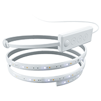</td>
      <td>Light Strips</td>
      <td></td>
      <td>nnleaf.light.strips</td>
      <td></td>
    </tr>
    <tr>
      <th>907</th>
      <td>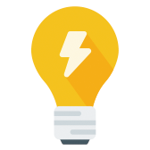</td>
      <td>Light control</td>
      <td>use</td>
      <td>mjj.light.mode3</td>
      <td></td>
    </tr>
    <tr>
      <th>908</th>
      <td></td>
      <td>Light control board</td>
      <td></td>
      <td>ufun.light.board</td>
      <td></td>
    </tr>
    <tr>
      <th>909</th>
      <td></td>
      <td>Light modulator</td>
      <td></td>
      <td>edaltd.light.dimmer</td>
      <td></td>
    </tr>
    <tr>
      <th>910</th>
      <td></td>
      <td>Light strip</td>
      <td></td>
      <td>ddwl.light.04000a</td>
      <td></td>
    </tr>
    <tr>
      <th>911</th>
      <td></td>
      <td>Light strip</td>
      <td></td>
      <td>mpkx.light.04000a</td>
      <td></td>
    </tr>
    <tr>
      <th>912</th>
      <td></td>
      <td>Light strip</td>
      <td></td>
      <td>nvcls.light.04000a</td>
      <td></td>
    </tr>
    <tr>
      <th>913</th>
      <td></td>
      <td>Light strip</td>
      <td></td>
      <td>sykj.light.04000a</td>
      <td></td>
    </tr>
    <tr>
      <th>914</th>
      <td></td>
      <td>Light strip</td>
      <td></td>
      <td>szsy.light.04000a</td>
      <td></td>
    </tr>
    <tr>
      <th>915</th>
      <td></td>
      <td>Light strip</td>
      <td>Wi-Fi light strip</td>
      <td>yaguan.light.light</td>
      <td></td>
    </tr>
    <tr>
      <th>916</th>
      <td></td>
      <td>Light strip</td>
      <td>YG_Light_Strip_RGBCW_WiFi</td>
      <td>yaguan.light.strip</td>
      <td></td>
    </tr>
    <tr>
      <th>917</th>
      <td></td>
      <td>MIDIAN NO BLUE LIGHT MUSIC LAMP</td>
      <td>This product is a bedside lamp for healthy lighting and sleep aid.Using the self-developed silicon substrate zero blue LED core technology, it is 100% blue-free, does not hurt the eyes, and helps sleep. At the same time, it has the function of Bluetooth audio. It uses wonderful music and zero blue light to create a comfortable sleeping environment for users.</td>
      <td>noc196.light.mdyctd</td>
      <td>MDJKDH110</td>
    </tr>
    <tr>
      <th>918</th>
      <td></td>
      <td>MZXlight</td>
      <td>Smart home</td>
      <td>jksx.light.mzx</td>
      <td></td>
    </tr>
    <tr>
      <th>919</th>
      <td></td>
      <td>MZXlight</td>
      <td>Control smart lights by voice</td>
      <td>jksx.light.mzx01</td>
      <td></td>
    </tr>
    <tr>
      <th>920</th>
      <td></td>
      <td>Meiyou Smart</td>
      <td>Connect to Xiaoai speakers</td>
      <td>miyooo.light.x32</td>
      <td></td>
    </tr>
    <tr>
      <th>921</th>
      <td></td>
      <td>Mi & Philips Ceiling Lamp Lamina 33W</td>
      <td>Mijia Philips bedroom ceiling lamp elegant version</td>
      <td>philips.light.ceil33</td>
      <td></td>
    </tr>
    <tr>
      <th>922</th>
      <td></td>
      <td>Mi & Philips Ceiling Lamp Lamina 80W</td>
      <td>Mijia Philips Living Room Ceiling Lamp Elegant Edition</td>
      <td>philips.light.ceilp</td>
      <td></td>
    </tr>
    <tr>
      <th>923</th>
      <td></td>
      <td>Mi LED Ceiling Light</td>
      <td>Cycle</td>
      <td>yeelink.light.ceiling5</td>
      <td></td>
    </tr>
    <tr>
      <th>924</th>
      <td></td>
      <td>Mi LED Smart Color Bulb (B22)</td>
      <td>wondet-lite-india</td>
      <td>yeelink.light.color7</td>
      <td></td>
    </tr>
    <tr>
      <th>925</th>
      <td></td>
      <td>Mi Lai (DIM Five Heads-Ceramic-Remote Control Version)</td>
      <td></td>
      <td>ldsn.light.2mld13</td>
      <td></td>
    </tr>
    <tr>
      <th>926</th>
      <td></td>
      <td>Mi Lai (DIM Five Heads-PP-Remote Control Version)</td>
      <td></td>
      <td>ldsn.light.2mld12</td>
      <td></td>
    </tr>
    <tr>
      <th>927</th>
      <td></td>
      <td>Mi Smart LED Bulb</td>
      <td>Mijia white light bulb</td>
      <td>yeelink.light.mono6</td>
      <td></td>
    </tr>
    <tr>
      <th>928</th>
      <td></td>
      <td>Mi Smart LED Bulb Essential (White and Color)</td>
      <td>wonder lite</td>
      <td>yeelink.light.color5</td>
      <td>MJDPL01YL</td>
    </tr>
    <tr>
      <th>929</th>
      <td></td>
      <td>Mi Smart LED Ceiling Light</td>
      <td>Cycle 450</td>
      <td>yeelink.light.ceiling22</td>
      <td>MJXDD01YL (CN) / MJXDD01SYL (EU)</td>
    </tr>
    <tr>
      <th>930</th>
      <td></td>
      <td>Mi Smart LED Ceiling Light (350mm)</td>
      <td></td>
      <td>yeelink.light.ceil34</td>
      <td></td>
    </tr>
    <tr>
      <th>931</th>
      <td></td>
      <td>Mi Smart LED Ceiling Light (350mm)</td>
      <td>Cycle 350</td>
      <td>yeelink.light.ceiling23</td>
      <td></td>
    </tr>
    <tr>
      <th>932</th>
      <td></td>
      <td>Mi Smart LED Living Room Ceiling Light</td>
      <td>Cycle pro</td>
      <td>yeelink.light.ceiling21</td>
      <td></td>
    </tr>
    <tr>
      <th>933</th>
      <td></td>
      <td>Mijia Philips Desk Lamp 3</td>
      <td>Mijia Philips Zhirui Table Lamp 3rd Generation</td>
      <td>philips.light.sread3</td>
      <td></td>
    </tr>
    <tr>
      <th>934</th>
      <td></td>
      <td>Mini Smart Light</td>
      <td></td>
      <td>mnc.light.wy0a01</td>
      <td></td>
    </tr>
    <tr>
      <th>935</th>
      <td></td>
      <td>Monochrome Bulb (57)</td>
      <td></td>
      <td>coolki.light.uid57</td>
      <td></td>
    </tr>
    <tr>
      <th>936</th>
      <td></td>
      <td>Monochrome lamp</td>
      <td></td>
      <td>lwkj.light.2210</td>
      <td></td>
    </tr>
    <tr>
      <th>937</th>
      <td></td>
      <td>Monochrome lamp</td>
      <td>2.4G monochromatic lamp will be obsolete</td>
      <td>scmkcz.light.crsl</td>
      <td></td>
    </tr>
    <tr>
      <th>938</th>
      <td></td>
      <td>Monochrome lamp</td>
      <td>Monochrome lamp V2 version</td>
      <td>scmkcz.light.crslv2</td>
      <td></td>
    </tr>
    <tr>
      <th>939</th>
      <td></td>
      <td>Monochrome lamp</td>
      <td>Smart monochromatic light, supports adjusting the brightness and color temperature of the light.</td>
      <td>yszj.light.2210</td>
      <td></td>
    </tr>
    <tr>
      <th>940</th>
      <td></td>
      <td>Music lights</td>
      <td>Music lights</td>
      <td>smyoo.light.music</td>
      <td></td>
    </tr>
    <tr>
      <th>941</th>
      <td></td>
      <td>Muzi Intelligent Light</td>
      <td>Muzi lighting bluetooth mesh two-color light</td>
      <td>cxds.light.wymz01</td>
      <td></td>
    </tr>
    <tr>
      <th>942</th>
      <td></td>
      <td>NIOYE full color LED lamp</td>
      <td>WY+RGB</td>
      <td>ddk.light.wyra01</td>
      <td></td>
    </tr>
    <tr>
      <th>943</th>
      <td></td>
      <td>NVC DieYing LED ceiling lamp</td>
      <td></td>
      <td>leishi.light.esp114</td>
      <td></td>
    </tr>
    <tr>
      <th>944</th>
      <td></td>
      <td>NVC Intelligent Lighting</td>
      <td></td>
      <td>leishi.light.wy0a06</td>
      <td></td>
    </tr>
    <tr>
      <th>945</th>
      <td></td>
      <td>NVC LED Nest Ceiling Lamp</td>
      <td>NVC Bird's Nest Series LED Ceiling Light</td>
      <td>leishi.light.nest</td>
      <td></td>
    </tr>
    <tr>
      <th>946</th>
      <td>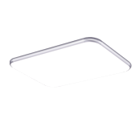</td>
      <td>NVC LED Smart Ceiling Lamp</td>
      <td></td>
      <td>leishi.light.eps112</td>
      <td></td>
    </tr>
    <tr>
      <th>947</th>
      <td></td>
      <td>NVC LED Smart Ceiling Lamp</td>
      <td>Non-isolated superimposed not superimposed</td>
      <td>leishi.light.eps118</td>
      <td></td>
    </tr>
    <tr>
      <th>948</th>
      <td></td>
      <td>NVC Nordic Style Light</td>
      <td></td>
      <td>leishi.light.eps115</td>
      <td></td>
    </tr>
    <tr>
      <th>949</th>
      <td></td>
      <td>NVC Pendant lamp</td>
      <td></td>
      <td>leishi.light.eps116</td>
      <td></td>
    </tr>
    <tr>
      <th>950</th>
      <td></td>
      <td>NVC Smart Ceiling Lamp (ZhiRui)</td>
      <td>Living room series-X1</td>
      <td>leishi.light.wy0c01</td>
      <td></td>
    </tr>
    <tr>
      <th>951</th>
      <td></td>
      <td>NVC Smart Ceiling Lamp (ZhiZhen)</td>
      <td>W dimming Y color-bedroom series-X2</td>
      <td>leishi.light.wy0c02</td>
      <td></td>
    </tr>
    <tr>
      <th>952</th>
      <td></td>
      <td>NVC Smart panel light</td>
      <td>W dimming Y color</td>
      <td>leishi.light.wy0a05</td>
      <td></td>
    </tr>
    <tr>
      <th>953</th>
      <td></td>
      <td>NVC Spotlight</td>
      <td></td>
      <td>leishi.light.eps117</td>
      <td></td>
    </tr>
    <tr>
      <th>954</th>
      <td></td>
      <td>NVC YueYing LED ceiling lamp</td>
      <td>NVC Moon Shadow Series LED Ceiling Light</td>
      <td>leishi.light.yying</td>
      <td></td>
    </tr>
    <tr>
      <th>955</th>
      <td></td>
      <td>NVC ceiling light</td>
      <td></td>
      <td>ddwl.light.c209</td>
      <td></td>
    </tr>
    <tr>
      <th>956</th>
      <td></td>
      <td>NVC ceiling light</td>
      <td></td>
      <td>nvc.light.c209</td>
      <td></td>
    </tr>
    <tr>
      <th>957</th>
      <td></td>
      <td>NVC ceiling light</td>
      <td></td>
      <td>nvcls.light.040001</td>
      <td></td>
    </tr>
    <tr>
      <th>958</th>
      <td></td>
      <td>NVC ceiling light</td>
      <td></td>
      <td>nvcls.light.c209</td>
      <td></td>
    </tr>
    <tr>
      <th>959</th>
      <td></td>
      <td>NVC ceiling light</td>
      <td></td>
      <td>sykj.light.040001</td>
      <td></td>
    </tr>
    <tr>
      <th>960</th>
      <td></td>
      <td>NVC ceiling light</td>
      <td></td>
      <td>sykj.light.c209</td>
      <td></td>
    </tr>
    <tr>
      <th>961</th>
      <td></td>
      <td>Nanoleaf ULP</td>
      <td></td>
      <td>nnleaf.light.ulp</td>
      <td></td>
    </tr>
    <tr>
      <th>962</th>
      <td></td>
      <td>Nnuodu Intelligent Living Room Lamp</td>
      <td>Nuodu Smart Living Room Lamp</td>
      <td>app.light.wynd1</td>
      <td></td>
    </tr>
    <tr>
      <th>963</th>
      <td></td>
      <td>Nordic ceiling light</td>
      <td></td>
      <td>ddwl.light.040017</td>
      <td></td>
    </tr>
    <tr>
      <th>964</th>
      <td></td>
      <td>Nordic ceiling light</td>
      <td></td>
      <td>nvcls.light.040017</td>
      <td></td>
    </tr>
    <tr>
      <th>965</th>
      <td></td>
      <td>Nordic ceiling light</td>
      <td></td>
      <td>sykj.light.040017</td>
      <td></td>
    </tr>
    <tr>
      <th>966</th>
      <td></td>
      <td>OPPLE Light Strip Mode A</td>
      <td></td>
      <td>opple.light.lgtstr</td>
      <td></td>
    </tr>
    <tr>
      <th>967</th>
      <td></td>
      <td>OPPLE Smartlamp Mode B</td>
      <td>Support color temperature adjustment</td>
      <td>opple.light.tabcol</td>
      <td></td>
    </tr>
    <tr>
      <th>968</th>
      <td></td>
      <td>OPPLE Smartlamp Mode C</td>
      <td>Op smart table lamp Mode C, corresponding to big arms and MiG table lamp</td>
      <td>opple.light.tabcw</td>
      <td></td>
    </tr>
    <tr>
      <th>969</th>
      <td></td>
      <td>One Party (DIM)</td>
      <td></td>
      <td>ldsn.light.2yfd19</td>
      <td></td>
    </tr>
    <tr>
      <th>970</th>
      <td></td>
      <td>Opple BEYOND Ceiling</td>
      <td>Sunrise/Sunset/Sleep Ceiling Light</td>
      <td>opple.light.bydceiling</td>
      <td></td>
    </tr>
    <tr>
      <th>971</th>
      <td></td>
      <td>Opple Smart Lamp Board Mode A</td>
      <td></td>
      <td>opple.light.barelp</td>
      <td></td>
    </tr>
    <tr>
      <th>972</th>
      <td></td>
      <td>Ordinary light</td>
      <td></td>
      <td>eide.light.adds21</td>
      <td></td>
    </tr>
    <tr>
      <th>973</th>
      <td></td>
      <td>Ougenuo Intelligent lamp</td>
      <td>DBS non-isolated two-color 33307</td>
      <td>ougn.light.wy0a01</td>
      <td></td>
    </tr>
    <tr>
      <th>974</th>
      <td></td>
      <td>PTX intelligent downlight (mesh)</td>
      <td>PTX Smart Downlight (Mesh), with Atom function.</td>
      <td>090615.light.mlig01</td>
      <td></td>
    </tr>
    <tr>
      <th>975</th>
      <td></td>
      <td>PTX intelligent heating and cooling lamp belt (mesh)</td>
      <td>Smart Cool and Warm Color Strip (Mesh)</td>
      <td>090615.light.demo2</td>
      <td></td>
    </tr>
    <tr>
      <th>976</th>
      <td></td>
      <td>Pak LED Smart Ceiling Lamp</td>
      <td>Star Jane series (isolated)</td>
      <td>pak.light.pak01</td>
      <td></td>
    </tr>
    <tr>
      <th>977</th>
      <td></td>
      <td>Peihong ceiling lamp</td>
      <td>Xiaomi WiFi-DBS non-isolated</td>
      <td>yhph.light.wy0a01</td>
      <td></td>
    </tr>
    <tr>
      <th>978</th>
      <td></td>
      <td>Philips ZhiYi Ceiling lamp FL 28W</td>
      <td>Fleeting ceiling light bedroom 350</td>
      <td>philips.light.lnblight2</td>
      <td></td>
    </tr>
    <tr>
      <th>979</th>
      <td></td>
      <td>Philips ZhiYi Ceiling lamp FL 40W</td>
      <td>Fleeting ceiling light bedroom 460</td>
      <td>philips.light.lnblight1</td>
      <td></td>
    </tr>
    <tr>
      <th>980</th>
      <td>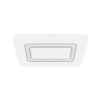</td>
      <td>Philips ZhiYi Ceiling lamp FL 80W</td>
      <td>Fleeting ceiling light living room version</td>
      <td>philips.light.lnlrlight</td>
      <td></td>
    </tr>
    <tr>
      <th>981</th>
      <td></td>
      <td>Philips ZhiYi ceiling lamp</td>
      <td>Zhiyi Ceiling Light</td>
      <td>philips.light.zyceiling</td>
      <td></td>
    </tr>
    <tr>
      <th>982</th>
      <td></td>
      <td>Philips Zhirui Ceiling Lamp Bedroom 28W</td>
      <td>Philips Smart Ceiling Light 350</td>
      <td>philips.light.bceiling2</td>
      <td></td>
    </tr>
    <tr>
      <th>983</th>
      <td></td>
      <td>Philips Zhirui Ceiling Lamp Bedroom 40W</td>
      <td>Philips bedroom 460</td>
      <td>philips.light.bceiling1</td>
      <td></td>
    </tr>
    <tr>
      <th>984</th>
      <td></td>
      <td>Philips Zhirui Ceiling Lamp Living room 80W</td>
      <td>Philips Zhirui living room ceiling lamp</td>
      <td>philips.light.lrceiling</td>
      <td></td>
    </tr>
    <tr>
      <th>985</th>
      <td></td>
      <td>Philips connected ceiling</td>
      <td>Philips Zhirui ceiling light</td>
      <td>philips.light.ceiling</td>
      <td></td>
    </tr>
    <tr>
      <th>986</th>
      <td></td>
      <td>Philips hue Light</td>
      <td>Dimming light Philips hue light</td>
      <td>uiot.light.light4</td>
      <td></td>
    </tr>
    <tr>
      <th>987</th>
      <td></td>
      <td>Pin Feng (DIM Short Version)</td>
      <td></td>
      <td>ldsn.light.2pfd16</td>
      <td></td>
    </tr>
    <tr>
      <th>988</th>
      <td></td>
      <td>Pinfeng (DIM high version)</td>
      <td></td>
      <td>ldsn.light.2pfd17</td>
      <td></td>
    </tr>
    <tr>
      <th>989</th>
      <td></td>
      <td>Power monitor box</td>
      <td></td>
      <td>xxzn.light.bebe0001</td>
      <td></td>
    </tr>
    <tr>
      <th>990</th>
      <td></td>
      <td>Puzhuoer Smart Light</td>
      <td>Puzhuoer mesh two-color light</td>
      <td>pze.light.wy0a01</td>
      <td></td>
    </tr>
    <tr>
      <th>991</th>
      <td></td>
      <td>Qinghe Smart Light</td>
      <td>DBS non-isolated</td>
      <td>qhzm.light.wy0a01</td>
      <td></td>
    </tr>
    <tr>
      <th>992</th>
      <td></td>
      <td>RBE wisdow living room lamp</td>
      <td>Riboer Smart Living Room Lamp</td>
      <td>rbe.light.wy0a01</td>
      <td></td>
    </tr>
    <tr>
      <th>993</th>
      <td></td>
      <td>RGB Bulb</td>
      <td>RGB Bulb, RGBW bulb, RGB high voltage controller, don't do it temporarily, we will talk about it later</td>
      <td>cydj.light.rgb</td>
      <td></td>
    </tr>
    <tr>
      <th>994</th>
      <td></td>
      <td>RGB LED Controller</td>
      <td>RGB LED Controller</td>
      <td>cydj.light.v2</td>
      <td></td>
    </tr>
    <tr>
      <th>995</th>
      <td></td>
      <td>RGB LED Controller</td>
      <td></td>
      <td>zengge.light.rgb</td>
      <td></td>
    </tr>
    <tr>
      <th>996</th>
      <td></td>
      <td>RGB light</td>
      <td></td>
      <td>future.light.rgb246</td>
      <td></td>
    </tr>
    <tr>
      <th>997</th>
      <td></td>
      <td>RGB light</td>
      <td>Adjustable brightness</td>
      <td>pair.light.2</td>
      <td></td>
    </tr>
    <tr>
      <th>998</th>
      <td></td>
      <td>RGB light</td>
      <td></td>
      <td>wlank.light.002</td>
      <td></td>
    </tr>
    <tr>
      <th>999</th>
      <td>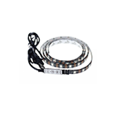</td>
      <td>RGB-LED</td>
      <td>RGB light</td>
      <td>ezhome.light.zhyapp09</td>
      <td></td>
    </tr>
    <tr>
      <th>1000</th>
      <td></td>
      <td>RGBCW Bulb</td>
      <td>RGBCW Bulb, RGBWC high voltage controller</td>
      <td>cydj.light.v8</td>
      <td></td>
    </tr>
    <tr>
      <th>1001</th>
      <td></td>
      <td>RGBCW Bulb</td>
      <td></td>
      <td>zengge.light.rgbw</td>
      <td></td>
    </tr>
    <tr>
      <th>1002</th>
      <td></td>
      <td>RGBCW LED Controller</td>
      <td></td>
      <td>zengge.light.rgbwc</td>
      <td></td>
    </tr>
    <tr>
      <th>1003</th>
      <td></td>
      <td>Remote control master-wifi to infrared-smart light</td>
      <td>Remote control master-wifi to infrared-smart light</td>
      <td>coolki.light.yk0008</td>
      <td></td>
    </tr>
    <tr>
      <th>1004</th>
      <td></td>
      <td>Remote control master-wifi to infrared-smart light</td>
      <td>Remote control master-wifi to infrared-smart light</td>
      <td>zhihw.light.yk0008</td>
      <td></td>
    </tr>
    <tr>
      <th>1005</th>
      <td></td>
      <td>Resistant to simple point high display magnetic atmosphere lamp pro1</td>
      <td></td>
      <td>crzm.light.wy0a03</td>
      <td></td>
    </tr>
    <tr>
      <th>1006</th>
      <td></td>
      <td>Rhythm light strip</td>
      <td></td>
      <td>coolki.light.uid59</td>
      <td></td>
    </tr>
    <tr>
      <th>1007</th>
      <td></td>
      <td>Romne Intelligent lamp</td>
      <td>CHQ non-isolated two-color 33303</td>
      <td>xgds.light.wy0a01</td>
      <td></td>
    </tr>
    <tr>
      <th>1008</th>
      <td></td>
      <td>Romne smart ceiling lamp</td>
      <td>DBS neutral</td>
      <td>xgds.light.wy0a02</td>
      <td></td>
    </tr>
    <tr>
      <th>1009</th>
      <td></td>
      <td>Ruiboer Intelligent Lamp</td>
      <td>33308-DBS isolation</td>
      <td>rbe.light.wy0b01</td>
      <td></td>
    </tr>
    <tr>
      <th>1010</th>
      <td></td>
      <td>SPOT</td>
      <td>LifeSmart Super Bowl is an infrared forwarding device with light function</td>
      <td>lfsmt.light.ls034sl</td>
      <td></td>
    </tr>
    <tr>
      <th>1011</th>
      <td></td>
      <td>Scenario WIFI dual color light</td>
      <td>Le-style neutral version</td>
      <td>leshi.light.wy0b01</td>
      <td></td>
    </tr>
    <tr>
      <th>1012</th>
      <td></td>
      <td>Scenario mesh color temperature lamp E series</td>
      <td>DBS-non-isolated-constant power</td>
      <td>lemesh.light.wy0c05</td>
      <td></td>
    </tr>
    <tr>
      <th>1013</th>
      <td></td>
      <td>Scene Ble mesh light</td>
      <td>Scenario Bluetooth mesh two-color light-DBS photoelectric isolation</td>
      <td>jsc.light.wyls02</td>
      <td></td>
    </tr>
    <tr>
      <th>1014</th>
      <td></td>
      <td>Scene Ble mesh light A</td>
      <td>Two-color mesh light</td>
      <td>lejia.light.33301</td>
      <td></td>
    </tr>
    <tr>
      <th>1015</th>
      <td></td>
      <td>Scene Color Light WIFI X</td>
      <td></td>
      <td>lemesh.light.wy</td>
      <td></td>
    </tr>
    <tr>
      <th>1016</th>
      <td></td>
      <td>Scene mesh color temperature lamp</td>
      <td>Dual color bluetooth mesh color temperature lamp-16k</td>
      <td>lemesh.light.wy0c02</td>
      <td></td>
    </tr>
    <tr>
      <th>1017</th>
      <td></td>
      <td>Scene mesh color temperature lamp</td>
      <td>Le-style standard two-color light-five in one</td>
      <td>lemesh.light.wy0c08</td>
      <td></td>
    </tr>
    <tr>
      <th>1018</th>
      <td></td>
      <td>Scene mesh color temperature lamp C</td>
      <td>CHQ non-isolated two-color</td>
      <td>lejia.light.wy02</td>
      <td></td>
    </tr>
    <tr>
      <th>1019</th>
      <td></td>
      <td>Scene mesh color temperature lamp D</td>
      <td>DBS non-isolated two-color</td>
      <td>lemesh.light.wy0c03</td>
      <td></td>
    </tr>
    <tr>
      <th>1020</th>
      <td></td>
      <td>Scene mesh color temperature lamp TM series</td>
      <td>Xiaomi Tmall two-in-one dual-color light</td>
      <td>lemesh.light.wy0c07</td>
      <td></td>
    </tr>
    <tr>
      <th>1021</th>
      <td></td>
      <td>Scene mesh color-temperature lamp K</td>
      <td>Kraton front-end two-color light, 33304-17</td>
      <td>lemesh.light.wy0c04</td>
      <td></td>
    </tr>
    <tr>
      <th>1022</th>
      <td></td>
      <td>Scene mesh lamp K</td>
      <td>Kraton front monochromatic lamp, 33311-17</td>
      <td>lemesh.light.w00d01</td>
      <td></td>
    </tr>
    <tr>
      <th>1023</th>
      <td></td>
      <td>Shake Light (DIM Large Version-Remote Control Version)</td>
      <td></td>
      <td>ldsn.light.2ygd05</td>
      <td></td>
    </tr>
    <tr>
      <th>1024</th>
      <td></td>
      <td>Shake Light (DIM Large Version-Remote Control Version)</td>
      <td></td>
      <td>ldsn.light.3ygd05</td>
      <td></td>
    </tr>
    <tr>
      <th>1025</th>
      <td></td>
      <td>Shaking ceiling light</td>
      <td>C1 panning ceiling light</td>
      <td>ldsn.light.ygxd01</td>
      <td></td>
    </tr>
    <tr>
      <th>1026</th>
      <td></td>
      <td>Shengteng Ceiling Light</td>
      <td>Shengteng Square Ceiling Light</td>
      <td>stds.light.wyst02</td>
      <td></td>
    </tr>
    <tr>
      <th>1027</th>
      <td></td>
      <td>Shengteng Lighting Ceiling Light</td>
      <td>Shengteng Lighting Ceiling Light</td>
      <td>stds.light.wyst01</td>
      <td></td>
    </tr>
    <tr>
      <th>1028</th>
      <td></td>
      <td>Shengxin Intelligent lamp</td>
      <td>DBS non-isolated two-color</td>
      <td>lsds.light.wy0a01</td>
      <td></td>
    </tr>
    <tr>
      <th>1029</th>
      <td></td>
      <td>Silver Fit Light Bulb Bluetooth Mesh Version</td>
      <td></td>
      <td>yht.light.wy0a01</td>
      <td></td>
    </tr>
    <tr>
      <th>1030</th>
      <td></td>
      <td>Single receiver</td>
      <td>Single circuit breaking controller</td>
      <td>aiicn.light.r01</td>
      <td></td>
    </tr>
    <tr>
      <th>1031</th>
      <td></td>
      <td>Smart Gateway (Night Light)</td>
      <td></td>
      <td>ddwl.light.040016</td>
      <td></td>
    </tr>
    <tr>
      <th>1032</th>
      <td></td>
      <td>Smart Gateway (Night Light)</td>
      <td></td>
      <td>nvcls.light.040016</td>
      <td></td>
    </tr>
    <tr>
      <th>1033</th>
      <td></td>
      <td>Smart Gateway (Night Light)</td>
      <td></td>
      <td>sykj.light.040016</td>
      <td></td>
    </tr>
    <tr>
      <th>1034</th>
      <td></td>
      <td>Smart LED bulb</td>
      <td></td>
      <td>lumi.light.aqcn01</td>
      <td></td>
    </tr>
    <tr>
      <th>1035</th>
      <td></td>
      <td>Smart LED light 3</td>
      <td></td>
      <td>zhuyun.light.zy22</td>
      <td></td>
    </tr>
    <tr>
      <th>1036</th>
      <td></td>
      <td>Smart LED lights</td>
      <td></td>
      <td>anlin.light.22</td>
      <td></td>
    </tr>
    <tr>
      <th>1037</th>
      <td></td>
      <td>Smart LED lights</td>
      <td></td>
      <td>zhuyun.light.22</td>
      <td></td>
    </tr>
    <tr>
      <th>1038</th>
      <td></td>
      <td>Smart Light Group</td>
      <td>Lamp group with [switch, brightness, color] function</td>
      <td>mijia.light.group5</td>
      <td></td>
    </tr>
    <tr>
      <th>1039</th>
      <td></td>
      <td>Smart Module for LED Strip</td>
      <td>The smart connector of the light strip is connected to the light strip. It can turn on and off the light strip, set the color and light mode of the light strip, and can also set the timing task to turn on and off the light strip.</td>
      <td>881878.light.ddznljq</td>
      <td></td>
    </tr>
    <tr>
      <th>1040</th>
      <td></td>
      <td>Smart ceiling lamp of Shuai Lighthouse</td>
      <td>DBS neutral</td>
      <td>ddjzm.light.wy0a01</td>
      <td></td>
    </tr>
    <tr>
      <th>1041</th>
      <td></td>
      <td>Smart chandelier</td>
      <td></td>
      <td>nvcls.light.040018</td>
      <td></td>
    </tr>
    <tr>
      <th>1042</th>
      <td></td>
      <td>Smart chandelier</td>
      <td></td>
      <td>sykj.light.040018</td>
      <td></td>
    </tr>
    <tr>
      <th>1043</th>
      <td></td>
      <td>Smart colorful lights</td>
      <td>Smart colorful light function: 1. 160 million colors 2. Brightness adjustment 3. Timing delay function 4. Adjustment of various scene modes</td>
      <td>ikonke.light.kklight</td>
      <td></td>
    </tr>
    <tr>
      <th>1044</th>
      <td></td>
      <td>Smart dimmer (uiid44)</td>
      <td></td>
      <td>coolki.light.uid44</td>
      <td></td>
    </tr>
    <tr>
      <th>1045</th>
      <td></td>
      <td>Smart eye protection lamp</td>
      <td>"Jieke AI" is a global intelligent platform that supports multiple intelligent devices such as lights, switches, sockets, and air conditioners.Connect "Jieke AI" smart devices to start smart life</td>
      <td>giec.light.sl1501</td>
      <td></td>
    </tr>
    <tr>
      <th>1046</th>
      <td>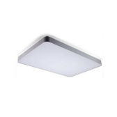</td>
      <td>Smart lamps</td>
      <td></td>
      <td>gtop.light.xl6601</td>
      <td></td>
    </tr>
    <tr>
      <th>1047</th>
      <td></td>
      <td>Smart lantern</td>
      <td></td>
      <td>hsmart.light.hhs2lg</td>
      <td></td>
    </tr>
    <tr>
      <th>1048</th>
      <td></td>
      <td>Smart light</td>
      <td></td>
      <td>alive.light.alive1</td>
      <td></td>
    </tr>
    <tr>
      <th>1049</th>
      <td></td>
      <td>Smart light</td>
      <td></td>
      <td>tbsy.light.1221</td>
      <td></td>
    </tr>
    <tr>
      <th>1050</th>
      <td></td>
      <td>Smart light</td>
      <td>Smart light</td>
      <td>yuansh.light.lysp</td>
      <td></td>
    </tr>
    <tr>
      <th>1051</th>
      <td></td>
      <td>Smart lighting</td>
      <td>Smart lighting</td>
      <td>ecloud.light.eq</td>
      <td></td>
    </tr>
    <tr>
      <th>1052</th>
      <td></td>
      <td>Smart lighting</td>
      <td>No certification trademark required</td>
      <td>ihome.light.estk</td>
      <td></td>
    </tr>
    <tr>
      <th>1053</th>
      <td></td>
      <td>Smart switch</td>
      <td></td>
      <td>thing.light.light</td>
      <td></td>
    </tr>
    <tr>
      <th>1054</th>
      <td></td>
      <td>Smart switch three positions</td>
      <td></td>
      <td>thing.light.light3</td>
      <td></td>
    </tr>
    <tr>
      <th>1055</th>
      <td></td>
      <td>Smart switch two positions</td>
      <td></td>
      <td>thing.light.light2</td>
      <td></td>
    </tr>
    <tr>
      <th>1056</th>
      <td></td>
      <td>SmartJoy Zhizhen Dimmer (Bluetooth Mesh version)</td>
      <td></td>
      <td>smartj.light.sjdlds</td>
      <td></td>
    </tr>
    <tr>
      <th>1057</th>
      <td></td>
      <td>SmartLight</td>
      <td>Smart Bulb Lights are a smart LED lamp product that our company uses WiFi control technology independently developed.The smart bulb lamp is mainly for adults with certain requirements for life and a young man who has certain exploration capabilities for fresh things. She can be flexible in the living room, study, bedroom and other home scene, with different styles of lampshade, suitableIn different homes, effectively improve the quality of life, soothing atmosphere, so that users can better enjoy the fun of smart products to our lives, and users can implement many functions in the smart terminal to install the corresponding APP, truly understand the intelligenceThe product is comfortable and convenient for life. The APP supports the heart control, the game interacts multiple functions, combines traditional switch to switch light scene, which is very convenient and fast.</td>
      <td>oge.light.seetime0800</td>
      <td></td>
    </tr>
    <tr>
      <th>1058</th>
      <td></td>
      <td>Sound control wizard lighting 2</td>
      <td>Control the light switch, brightness, color, color temperature, etc.</td>
      <td>zunder.light.66744</td>
      <td></td>
    </tr>
    <tr>
      <th>1059</th>
      <td></td>
      <td>Sound control wizard lighting 4</td>
      <td>Control the light on, brightness, color, color temperature, mode</td>
      <td>zunder.light.zun222</td>
      <td></td>
    </tr>
    <tr>
      <th>1060</th>
      <td></td>
      <td>Spotlight</td>
      <td></td>
      <td>lumi.light.wjwcn01</td>
      <td></td>
    </tr>
    <tr>
      <th>1061</th>
      <td></td>
      <td>Spotlight (adjustable brightness)</td>
      <td></td>
      <td>lumi.light.wjwcn01</td>
      <td></td>
    </tr>
    <tr>
      <th>1062</th>
      <td></td>
      <td>Spotlight (adjustable temperature)</td>
      <td></td>
      <td>lumi.light.cwjwcn01</td>
      <td>JWSP001A</td>
    </tr>
    <tr>
      <th>1063</th>
      <td></td>
      <td>Stars LED Light</td>
      <td>Smart hall ceiling light closer to life.</td>
      <td>397.light.hallight</td>
      <td></td>
    </tr>
    <tr>
      <th>1064</th>
      <td></td>
      <td>Sumi Bulb Light Lite</td>
      <td></td>
      <td>xhuan.light.wy0a08</td>
      <td></td>
    </tr>
    <tr>
      <th>1065</th>
      <td></td>
      <td>Sumi Downlight Lite</td>
      <td></td>
      <td>xhuan.light.wy0a02</td>
      <td></td>
    </tr>
    <tr>
      <th>1066</th>
      <td></td>
      <td>Sumi Magnetic Floodlight</td>
      <td></td>
      <td>xhuan.light.wy0a03</td>
      <td></td>
    </tr>
    <tr>
      <th>1067</th>
      <td></td>
      <td>Sumi Magnetic Spotlight</td>
      <td></td>
      <td>xhuan.light.wy0a05</td>
      <td></td>
    </tr>
    <tr>
      <th>1068</th>
      <td></td>
      <td>Sumi Ruguang Downlight</td>
      <td></td>
      <td>xhuan.light.wy0a06</td>
      <td></td>
    </tr>
    <tr>
      <th>1069</th>
      <td></td>
      <td>Sumi Ruguang Spotlight</td>
      <td></td>
      <td>xhuan.light.wy0a07</td>
      <td></td>
    </tr>
    <tr>
      <th>1070</th>
      <td></td>
      <td>Sumi Ruying Light Strip</td>
      <td></td>
      <td>xhuan.light.wy0a01</td>
      <td></td>
    </tr>
    <tr>
      <th>1071</th>
      <td></td>
      <td>Symphony lights</td>
      <td></td>
      <td>sykj.light.040014</td>
      <td></td>
    </tr>
    <tr>
      <th>1072</th>
      <td></td>
      <td>Symphony lights</td>
      <td></td>
      <td>szsy.light.040014</td>
      <td></td>
    </tr>
    <tr>
      <th>1073</th>
      <td></td>
      <td>TAIFOO Light Controler</td>
      <td></td>
      <td>babai.light.tf31a</td>
      <td></td>
    </tr>
    <tr>
      <th>1074</th>
      <td></td>
      <td>TCL LED Ceiling Lamp</td>
      <td></td>
      <td>tcll.light.xl6601</td>
      <td></td>
    </tr>
    <tr>
      <th>1075</th>
      <td></td>
      <td>TCL Modern room lamp</td>
      <td></td>
      <td>tcll.light.xl6602</td>
      <td></td>
    </tr>
    <tr>
      <th>1076</th>
      <td></td>
      <td>TCL Zhirui ceiling lamp</td>
      <td></td>
      <td>tcll.light.wy0a01</td>
      <td></td>
    </tr>
    <tr>
      <th>1077</th>
      <td></td>
      <td>TOSPO LED Module</td>
      <td>Dimming and color mixing ceiling lamp replacement light source module</td>
      <td>tospo1.light.rpc01</td>
      <td></td>
    </tr>
    <tr>
      <th>1078</th>
      <td></td>
      <td>Taiwo Magnetic attraction lamp</td>
      <td>Xiaomi mesh two-color light-Realtek</td>
      <td>twzm.light.wy0a01</td>
      <td></td>
    </tr>
    <tr>
      <th>1079</th>
      <td></td>
      <td>Technology life</td>
      <td></td>
      <td>364656.light.sm01a</td>
      <td></td>
    </tr>
    <tr>
      <th>1080</th>
      <td></td>
      <td>Three-wire two-way switch (1 way)</td>
      <td>Three-wire two-way switch (1 way)</td>
      <td>kuju.light.5201</td>
      <td></td>
    </tr>
    <tr>
      <th>1081</th>
      <td></td>
      <td>Three-wire two-way switch (2 way)</td>
      <td>Three-wire two-way switch (2 way)</td>
      <td>kuju.light.5202</td>
      <td></td>
    </tr>
    <tr>
      <th>1082</th>
      <td></td>
      <td>Toning light</td>
      <td></td>
      <td>juzi.light.010301</td>
      <td></td>
    </tr>
    <tr>
      <th>1083</th>
      <td></td>
      <td>Tospo A60 Bulb</td>
      <td></td>
      <td>tospo1.light.bpzp01</td>
      <td></td>
    </tr>
    <tr>
      <th>1084</th>
      <td></td>
      <td>Tospo A70 Bulb</td>
      <td></td>
      <td>tospo1.light.bpzp02</td>
      <td></td>
    </tr>
    <tr>
      <th>1085</th>
      <td></td>
      <td>Two way light panel-S</td>
      <td>Two way light panel-S FT154_WallSwitch_Dual</td>
      <td>linked.light.ft154d</td>
      <td></td>
    </tr>
    <tr>
      <th>1086</th>
      <td></td>
      <td>Two way switch (1 way)</td>
      <td>Two way switch (1 way)</td>
      <td>kuju.light.1501</td>
      <td></td>
    </tr>
    <tr>
      <th>1087</th>
      <td></td>
      <td>Two way switch (2 way)</td>
      <td>Two way switch (2 way)</td>
      <td>kuju.light.1502</td>
      <td></td>
    </tr>
    <tr>
      <th>1088</th>
      <td></td>
      <td>Two-color light</td>
      <td>Two-color light cr2l will be obsolete</td>
      <td>scmkcz.light.cr2l</td>
      <td></td>
    </tr>
    <tr>
      <th>1089</th>
      <td></td>
      <td>Two-color light</td>
      <td>Two-color light V2 version</td>
      <td>scmkcz.light.cr2lv2</td>
      <td></td>
    </tr>
    <tr>
      <th>1090</th>
      <td></td>
      <td>WiFi 60W dimming color light</td>
      <td>wifi cct</td>
      <td>arnoo.light.cct01</td>
      <td></td>
    </tr>
    <tr>
      <th>1091</th>
      <td></td>
      <td>WiFi 60W dimming color light</td>
      <td>wifi rgbw</td>
      <td>arnoo.light.rgbw01</td>
      <td></td>
    </tr>
    <tr>
      <th>1092</th>
      <td></td>
      <td>WiFi 60W dimming light</td>
      <td>wifi dim</td>
      <td>arnoo.light.dim01</td>
      <td></td>
    </tr>
    <tr>
      <th>1093</th>
      <td>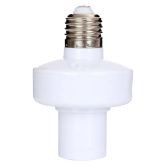</td>
      <td>WiFi smart lamp holder</td>
      <td></td>
      <td>mhiot.light.me27w</td>
      <td></td>
    </tr>
    <tr>
      <th>1094</th>
      <td></td>
      <td>WuZuoTiLan</td>
      <td></td>
      <td>clk.light.basket</td>
      <td></td>
    </tr>
    <tr>
      <th>1095</th>
      <td></td>
      <td>Xi Zhi Xi Intelligent Lamp</td>
      <td>Xizhixi Smart Light</td>
      <td>xzx.light.wyxzx1</td>
      <td></td>
    </tr>
    <tr>
      <th>1096</th>
      <td></td>
      <td>Xiangyu intelligent LED ceiling lamp</td>
      <td>Xiangyu Smart LED Ceiling Light</td>
      <td>jxgc.light.wyxy1</td>
      <td></td>
    </tr>
    <tr>
      <th>1097</th>
      <td></td>
      <td>Xiao ran all copper Smart Light</td>
      <td></td>
      <td>zichen.light.wy0a01</td>
      <td></td>
    </tr>
    <tr>
      <th>1098</th>
      <td></td>
      <td>Xiaohui Electric Light</td>
      <td>Lights with only switches</td>
      <td>maxway.light.l02</td>
      <td></td>
    </tr>
    <tr>
      <th>1099</th>
      <td></td>
      <td>Xiaoyan smart lamp holder</td>
      <td></td>
      <td>terncy.light.tls01</td>
      <td></td>
    </tr>
    <tr>
      <th>1100</th>
      <td></td>
      <td>Xiaoyan two-color temperature dimmer</td>
      <td></td>
      <td>terncy.light.lt01</td>
      <td></td>
    </tr>
    <tr>
      <th>1101</th>
      <td></td>
      <td>Xihui smart ceiling lamp</td>
      <td>Xihui Smart Ceiling Light-314-34</td>
      <td>hwzn.light.wy0a01</td>
      <td></td>
    </tr>
    <tr>
      <th>1102</th>
      <td></td>
      <td>Xinhong ceiling lamp</td>
      <td>non-isolated</td>
      <td>xhzm.light.wy0a01</td>
      <td></td>
    </tr>
    <tr>
      <th>1103</th>
      <td></td>
      <td>Xuan Yi Smart Light</td>
      <td></td>
      <td>dikair.light.wy0a02</td>
      <td></td>
    </tr>
    <tr>
      <th>1104</th>
      <td></td>
      <td>YOOLED smart ceiling light</td>
      <td></td>
      <td>yooled.light.light</td>
      <td></td>
    </tr>
    <tr>
      <th>1105</th>
      <td></td>
      <td>Yan Tai Scene Smart Llight</td>
      <td></td>
      <td>dikair.light.wy0a03</td>
      <td></td>
    </tr>
    <tr>
      <th>1106</th>
      <td></td>
      <td>Yantai Intelligent Lamp</td>
      <td>Yantai Smart Light</td>
      <td>jsc.light.wyyt01</td>
      <td></td>
    </tr>
    <tr>
      <th>1107</th>
      <td></td>
      <td>Yeelight Arwen Ceiling Light 450C/550C</td>
      <td>Arwen450C, Arwen550C (the difference from ceilb is that ceilc does not carry homekit)</td>
      <td>yeelink.light.ceilc</td>
      <td>YLXD013-B / YLXD013-C</td>
    </tr>
    <tr>
      <th>1108</th>
      <td></td>
      <td>Yeelight Arwen Ceiling Light 450S/550S</td>
      <td>Arwen450S, Arwen550S series</td>
      <td>yeelink.light.ceilb</td>
      <td>YLXD013 / YLXD013-A</td>
    </tr>
    <tr>
      <th>1109</th>
      <td></td>
      <td>Yeelight Ceiling Light</td>
      <td>Yeelight LED ceiling light</td>
      <td>yeelink.light.ceiling1</td>
      <td>YLXD01YL</td>
    </tr>
    <tr>
      <th>1110</th>
      <td></td>
      <td>Yeelight Ceiling Light</td>
      <td>Stylized ceiling light</td>
      <td>yeelink.light.ceiling13</td>
      <td></td>
    </tr>
    <tr>
      <th>1111</th>
      <td></td>
      <td>Yeelight Ceiling Light</td>
      <td>Halo atmosphere 450 50W non-isolated power supply, medium size, with backlight, atmosphere series of bedroom lights</td>
      <td>yeelink.light.ceiling20</td>
      <td>YLXD50YL</td>
    </tr>
    <tr>
      <th>1112</th>
      <td></td>
      <td>Yeelight Ceiling Light 320 1S</td>
      <td>Luna 1S Homekit</td>
      <td>yeelink.light.ceiling11</td>
      <td>YLXD41YL</td>
    </tr>
    <tr>
      <th>1113</th>
      <td></td>
      <td>Yeelight Ceiling Light 480 1S</td>
      <td>EOS480 1S Homekit</td>
      <td>yeelink.light.ceiling15</td>
      <td>YLXD42YL</td>
    </tr>
    <tr>
      <th>1114</th>
      <td></td>
      <td>Yeelight Ceiling Light E2001</td>
      <td></td>
      <td>yeelink.light.ceil32</td>
      <td></td>
    </tr>
    <tr>
      <th>1115</th>
      <td></td>
      <td>Yeelight Ceiling Light Mini</td>
      <td>Stylized ceiling light Mini</td>
      <td>yeelink.light.ceiling14</td>
      <td>YLXD09YL</td>
    </tr>
    <tr>
      <th>1116</th>
      <td></td>
      <td>Yeelight Ceiling Light Pro</td>
      <td>Hope Pro living room light 160W non-isolated power supply solution Pro size series ceiling lamp)</td>
      <td>yeelink.light.ceiling18</td>
      <td>YLXD08YL</td>
    </tr>
    <tr>
      <th>1117</th>
      <td></td>
      <td>Yeelight Ceiling Light Pro</td>
      <td>Halo Pro 160W non-isolated power solution Pro size with color backlight Atmosphere series of living room lights</td>
      <td>yeelink.light.ceiling19</td>
      <td></td>
    </tr>
    <tr>
      <th>1118</th>
      <td></td>
      <td>Yeelight Ceiling Light SE</td>
      <td>Yeelight LED Ceiling Light SE</td>
      <td>yeelink.light.ceiling2</td>
      <td></td>
    </tr>
    <tr>
      <th>1119</th>
      <td></td>
      <td>Yeelight Ceiling Light for Children C2002</td>
      <td></td>
      <td>yeelink.light.ceil33</td>
      <td></td>
    </tr>
    <tr>
      <th>1120</th>
      <td>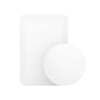</td>
      <td>Yeelight Chuxin Ceiling Light A2001</td>
      <td>Yeelight Ceiling Light A2001</td>
      <td>yeelink.light.ceil29</td>
      <td></td>
    </tr>
    <tr>
      <th>1121</th>
      <td></td>
      <td>Yeelight GU10 Smart Bulb W1 (dimmable)</td>
      <td>Frog/GU10</td>
      <td>yeelink.light.monob</td>
      <td>YLDP004</td>
    </tr>
    <tr>
      <th>1122</th>
      <td></td>
      <td>Yeelight GU10 smart bulb W1 (multicolor)</td>
      <td>Frog/GU10</td>
      <td>yeelink.light.colorc</td>
      <td>YLDP004-A</td>
    </tr>
    <tr>
      <th>1123</th>
      <td></td>
      <td>Yeelight HaoShi LED Ceiling Lamp Pro</td>
      <td>Nox Pro</td>
      <td>yeelink.light.ceiling6</td>
      <td></td>
    </tr>
    <tr>
      <th>1124</th>
      <td></td>
      <td>Yeelight HaoShi LED Ceiling Lamp Pro</td>
      <td>Nox Pro ESP32 version</td>
      <td>yeelink.light.ceiling9</td>
      <td></td>
    </tr>
    <tr>
      <th>1125</th>
      <td></td>
      <td>Yeelight Haobai LED Panel light Pro</td>
      <td>Yeelight Haobai Smart Panel Light Pro</td>
      <td>yeelink.light.panel3</td>
      <td></td>
    </tr>
    <tr>
      <th>1126</th>
      <td></td>
      <td>Yeelight Haoshi Ceiling Lamp</td>
      <td>Nox</td>
      <td>yeelink.light.ceiling7</td>
      <td></td>
    </tr>
    <tr>
      <th>1127</th>
      <td></td>
      <td>Yeelight Jade Smart LED Ceiling Light C2001</td>
      <td>Slim jade quick loading chassis C450/C550/S500/R900</td>
      <td>yeelink.light.ceil26</td>
      <td></td>
    </tr>
    <tr>
      <th>1128</th>
      <td></td>
      <td>Yeelight Jiaoyue LED ceiling light 260</td>
      <td>Bright Moon 260</td>
      <td>yeelink.light.ceiling24</td>
      <td>YLXD61YL</td>
    </tr>
    <tr>
      <th>1129</th>
      <td></td>
      <td>Yeelight LED Ceiling Light</td>
      <td>Yeelight LED ceiling light EOS</td>
      <td>yeelink.light.ceiling3</td>
      <td>YLXD04YL/YLXD05YL/YLXD17YL</td>
    </tr>
    <tr>
      <th>1130</th>
      <td>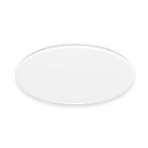</td>
      <td>Yeelight LED Ceiling Light</td>
      <td>Yeelight LED ceiling light EOS Pro</td>
      <td>yeelink.light.ceiling4</td>
      <td>YLXD02YL</td>
    </tr>
    <tr>
      <th>1131</th>
      <td>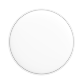</td>
      <td>Yeelight LED Ceiling Light Pro</td>
      <td>Luna CD Overseas Edition</td>
      <td>yeelink.light.ceila</td>
      <td></td>
    </tr>
    <tr>
      <th>1132</th>
      <td></td>
      <td>Yeelight LED Lightstrip 1S</td>
      <td>Pitaya Plus 1S (support homekit)</td>
      <td>yeelink.light.strip6</td>
      <td>YLDD05YL</td>
    </tr>
    <tr>
      <th>1133</th>
      <td></td>
      <td>Yeelight LED Lightstrip 1S</td>
      <td>pitaya plus 1s</td>
      <td>yeelink.light.stripa</td>
      <td></td>
    </tr>
    <tr>
      <th>1134</th>
      <td></td>
      <td>Yeelight LED Smart Pendant Light</td>
      <td>Yeelight LED Smart Chandelier</td>
      <td>yeelink.light.ceil30</td>
      <td></td>
    </tr>
    <tr>
      <th>1135</th>
      <td></td>
      <td>Yeelight LED smart bulb W3 (Multicolor)</td>
      <td>lemon3 color light version</td>
      <td>yeelink.light.colorb</td>
      <td></td>
    </tr>
    <tr>
      <th>1136</th>
      <td></td>
      <td>Yeelight LED smart bulb W3 (dimmable)</td>
      <td>lemon3 white light</td>
      <td>yeelink.light.monoa</td>
      <td></td>
    </tr>
    <tr>
      <th>1137</th>
      <td>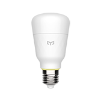</td>
      <td>Yeelight LED smart bulb W3 (tunable white)</td>
      <td>lemon3 color temperature version</td>
      <td>yeelink.light.cta</td>
      <td>YLDP05YL</td>
    </tr>
    <tr>
      <th>1138</th>
      <td></td>
      <td>Yeelight Screen Light Bar</td>
      <td></td>
      <td>yeelink.light.lamp15</td>
      <td></td>
    </tr>
    <tr>
      <th>1139</th>
      <td></td>
      <td>Yeelight ShaoHua Celing Light</td>
      <td>Yilai Shaohua Ceiling Light</td>
      <td>yeelink.light.ceiling17</td>
      <td></td>
    </tr>
    <tr>
      <th>1140</th>
      <td></td>
      <td>Yeelight Shaohua Ceiling Light A2002</td>
      <td></td>
      <td>yeelink.light.ceil31</td>
      <td></td>
    </tr>
    <tr>
      <th>1141</th>
      <td></td>
      <td>Yeelight Smart Ceiling Fan C1060</td>
      <td>DC 42</td>
      <td>yeelink.light.fancl6</td>
      <td></td>
    </tr>
    <tr>
      <th>1142</th>
      <td></td>
      <td>Yeelight Smart Ceiling Fan C900</td>
      <td>DC 36</td>
      <td>yeelink.light.fancl5</td>
      <td></td>
    </tr>
    <tr>
      <th>1143</th>
      <td></td>
      <td>Yeelight Smart LED Bulb 1SE (color)</td>
      <td>color5 inheritance</td>
      <td>yeelink.light.colora</td>
      <td>YLDP001</td>
    </tr>
    <tr>
      <th>1144</th>
      <td></td>
      <td>Yeelight Smart Living Room Ceiling Light</td>
      <td>Ceiling Pro all-in-one (non-spec)</td>
      <td>yeelink.light.ceil27</td>
      <td></td>
    </tr>
    <tr>
      <th>1145</th>
      <td></td>
      <td>Yeelight Surface mounted downlight M1</td>
      <td></td>
      <td>yeelink.light.ml3</td>
      <td></td>
    </tr>
    <tr>
      <th>1146</th>
      <td>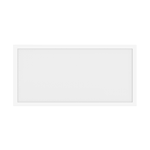</td>
      <td>Yeelight Whiteglow Panel Light</td>
      <td>Selene Pro</td>
      <td>yeelink.light.panel1</td>
      <td></td>
    </tr>
    <tr>
      <th>1147</th>
      <td></td>
      <td>Yeelight Wireless Charging Table Lamp</td>
      <td></td>
      <td>yeelink.light.lamp17</td>
      <td>YLYD04YI</td>
    </tr>
    <tr>
      <th>1148</th>
      <td></td>
      <td>Yeelight Xingyu Ceiling Light</td>
      <td>Yilai Xingyu Ceiling Light</td>
      <td>yeelink.light.ceiling16</td>
      <td></td>
    </tr>
    <tr>
      <th>1149</th>
      <td></td>
      <td>Yeelight stylized Ceiling Light Pro</td>
      <td>Stylized ceiling light Pro</td>
      <td>yeelink.light.ceiling12</td>
      <td></td>
    </tr>
    <tr>
      <th>1150</th>
      <td></td>
      <td>Yi Tang Smart Light</td>
      <td></td>
      <td>dikair.light.wy0a04</td>
      <td></td>
    </tr>
    <tr>
      <th>1151</th>
      <td></td>
      <td>Yilai Ceiling Lamp Hefeng 430</td>
      <td>Yilai Hefeng Round Ceiling Light</td>
      <td>yilai.light.ceiling2</td>
      <td></td>
    </tr>
    <tr>
      <th>1152</th>
      <td>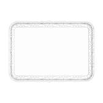</td>
      <td>Yilai Ceiling Lamp Hefeng Pro</td>
      <td>Yilai Hefeng Square Ceiling Light</td>
      <td>yilai.light.ceiling3</td>
      <td></td>
    </tr>
    <tr>
      <th>1153</th>
      <td></td>
      <td>Yilai Ceiling Light Aiyue 480</td>
      <td>Yi Lai Ceiling Light Snow Moon 480</td>
      <td>yilai.light.ceiling1</td>
      <td></td>
    </tr>
    <tr>
      <th>1154</th>
      <td></td>
      <td>Yilai color temperature lamp</td>
      <td></td>
      <td>yeelink.light.proct1</td>
      <td></td>
    </tr>
    <tr>
      <th>1155</th>
      <td></td>
      <td>Yilai color temperature lamp</td>
      <td></td>
      <td>yeelink.light.proct2</td>
      <td></td>
    </tr>
    <tr>
      <th>1156</th>
      <td></td>
      <td>ZSZM Intelligent ceiling lamp</td>
      <td>Tree planting lighting Bluetooth mesh ceiling light</td>
      <td>zszm.light.wy0a03</td>
      <td></td>
    </tr>
    <tr>
      <th>1157</th>
      <td></td>
      <td>ZSZM Intelligent spotlight</td>
      <td>Tree planting bluetooth mesh spotlight</td>
      <td>zszm.light.wy0a02</td>
      <td></td>
    </tr>
    <tr>
      <th>1158</th>
      <td></td>
      <td>Zhanxiu Crystal Love intelligent lamp</td>
      <td>DBS-non-isolated</td>
      <td>odds.light.wy0a01</td>
      <td></td>
    </tr>
    <tr>
      <th>1159</th>
      <td></td>
      <td>ZhiRui RGB strip</td>
      <td>Zhirui colorful light strip</td>
      <td>philips.light.strip2</td>
      <td></td>
    </tr>
    <tr>
      <th>1160</th>
      <td></td>
      <td>ZhiRui read & write Desk Lamp Wi-Fi</td>
      <td>Zhirui Reading and Writing Table Lamp Wi-Fi Version</td>
      <td>philips.light.sread4</td>
      <td></td>
    </tr>
    <tr>
      <th>1161</th>
      <td>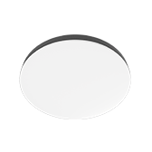</td>
      <td>Zhirui Ceiling Lamp Black 28W</td>
      <td>Zhirui Ceiling Light Obsidian Bedroom 28W</td>
      <td>philips.light.obceis</td>
      <td></td>
    </tr>
    <tr>
      <th>1162</th>
      <td></td>
      <td>Zhirui Ceiling Lamp Black 40W</td>
      <td>Zhirui Ceiling Light Obsidian Bedroom 40W</td>
      <td>philips.light.obceim</td>
      <td></td>
    </tr>
    <tr>
      <th>1163</th>
      <td></td>
      <td>Zhirui Ceiling Lamp Black 80W</td>
      <td>Zhirui Ceiling Light Obsidian Living Room 80W</td>
      <td>philips.light.obceil</td>
      <td></td>
    </tr>
    <tr>
      <th>1164</th>
      <td></td>
      <td>Zhirui Ceiling Lamp Gorgeous 28W</td>
      <td>Zhirui Ceiling Light Star Diamond Bedroom 28W</td>
      <td>philips.light.xzceis</td>
      <td></td>
    </tr>
    <tr>
      <th>1165</th>
      <td></td>
      <td>Zhirui Ceiling Lamp Gorgeous 40W</td>
      <td>Zhirui Ceiling Light Star Diamond Bedroom 40W</td>
      <td>philips.light.xzceim</td>
      <td></td>
    </tr>
    <tr>
      <th>1166</th>
      <td></td>
      <td>Zhirui Ceiling Lamp Gorgeous 80W</td>
      <td>Zhirui Ceiling Light Star Diamond Living Room 80W</td>
      <td>philips.light.xzceil</td>
      <td></td>
    </tr>
    <tr>
      <th>1167</th>
      <td></td>
      <td>Zhirui Ceiling Lamp Nordic 28W</td>
      <td>Zhirui Ceiling Light Nordic Style Bedroom 28W</td>
      <td>philips.light.mceils</td>
      <td></td>
    </tr>
    <tr>
      <th>1168</th>
      <td></td>
      <td>Zhirui Ceiling Lamp Nordic 40W</td>
      <td>Zhirui Ceiling Light Nordic Style Bedroom 40W</td>
      <td>philips.light.mceilm</td>
      <td></td>
    </tr>
    <tr>
      <th>1169</th>
      <td></td>
      <td>Zhirui Ceiling Lamp Nordic 80W</td>
      <td>Mijia Zhirui Ceiling Light</td>
      <td>philips.light.mceil</td>
      <td></td>
    </tr>
    <tr>
      <th>1170</th>
      <td></td>
      <td>Zhirui Ceiling Lamp Starry 28W</td>
      <td>Zhirui Ceiling Light Flowing Fluorescent Bedroom 28W</td>
      <td>philips.light.sceils</td>
      <td></td>
    </tr>
    <tr>
      <th>1171</th>
      <td></td>
      <td>Zhirui Ceiling Lamp Starry 40W</td>
      <td>Zhirui Ceiling Light Flowing Fluorescent Bedroom 40W</td>
      <td>philips.light.sceilm</td>
      <td></td>
    </tr>
    <tr>
      <th>1172</th>
      <td></td>
      <td>Zhirui Ceiling Lamp Starry 80W</td>
      <td>Zhirui Ceiling Light Flowing Fluorescent 80W Living Room</td>
      <td>philips.light.sceil</td>
      <td></td>
    </tr>
    <tr>
      <th>1173</th>
      <td></td>
      <td>Zhiyun IOT Aquatic Lantern</td>
      <td>Use Xiao Ai to easily control your water plant lights, smart lights, execute switches, adjust brightness, etc.</td>
      <td>espush.light.es02</td>
      <td></td>
    </tr>
    <tr>
      <th>1174</th>
      <td></td>
      <td>bulb</td>
      <td>Bulb</td>
      <td>golden.light.m002</td>
      <td></td>
    </tr>
    <tr>
      <th>1175</th>
      <td></td>
      <td>ceilinglight</td>
      <td>Op smart ceiling light, support small AI speaker voice control</td>
      <td>opple.light.ceiling</td>
      <td></td>
    </tr>
    <tr>
      <th>1176</th>
      <td></td>
      <td>colourful ceiling lamp</td>
      <td></td>
      <td>jmls.light.ls001</td>
      <td></td>
    </tr>
    <tr>
      <th>1177</th>
      <td></td>
      <td>cw magnetic lamp</td>
      <td></td>
      <td>sykj.light.040013</td>
      <td></td>
    </tr>
    <tr>
      <th>1178</th>
      <td></td>
      <td>cw magnetic lamp</td>
      <td></td>
      <td>szsy.light.040013</td>
      <td></td>
    </tr>
    <tr>
      <th>1179</th>
      <td></td>
      <td>dimmer</td>
      <td>1. Remote control switch 2. Remotely adjust the light brightness</td>
      <td>kongke.light.dimmer</td>
      <td></td>
    </tr>
    <tr>
      <th>1180</th>
      <td></td>
      <td>julun smart light</td>
      <td></td>
      <td>julun.light.jl0002</td>
      <td></td>
    </tr>
    <tr>
      <th>1181</th>
      <td>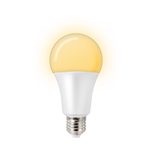</td>
      <td>julun smart light (CW)</td>
      <td></td>
      <td>julun.light.jlcw</td>
      <td></td>
    </tr>
    <tr>
      <th>1182</th>
      <td></td>
      <td>light</td>
      <td></td>
      <td>amtt.light.r</td>
      <td></td>
    </tr>
    <tr>
      <th>1183</th>
      <td></td>
      <td>light</td>
      <td></td>
      <td>bgdz.light.test3</td>
      <td></td>
    </tr>
    <tr>
      <th>1184</th>
      <td></td>
      <td>light</td>
      <td></td>
      <td>bright.light.light</td>
      <td></td>
    </tr>
    <tr>
      <th>1185</th>
      <td></td>
      <td>light</td>
      <td>General lighting equipment</td>
      <td>dctrls.light.common</td>
      <td></td>
    </tr>
    <tr>
      <th>1186</th>
      <td></td>
      <td>light</td>
      <td></td>
      <td>deocea.light.cq</td>
      <td></td>
    </tr>
    <tr>
      <th>1187</th>
      <td></td>
      <td>light</td>
      <td></td>
      <td>dnake.light.da123</td>
      <td></td>
    </tr>
    <tr>
      <th>1188</th>
      <td></td>
      <td>light</td>
      <td></td>
      <td>dnake.light.light</td>
      <td></td>
    </tr>
    <tr>
      <th>1189</th>
      <td></td>
      <td>light</td>
      <td>light</td>
      <td>ecloud.light.elight</td>
      <td></td>
    </tr>
    <tr>
      <th>1190</th>
      <td></td>
      <td>light</td>
      <td>light</td>
      <td>fine.light.light</td>
      <td></td>
    </tr>
    <tr>
      <th>1191</th>
      <td></td>
      <td>light</td>
      <td>The wrong attribute is selected and is deprecated</td>
      <td>future.light.asp1</td>
      <td></td>
    </tr>
    <tr>
      <th>1192</th>
      <td></td>
      <td>light</td>
      <td></td>
      <td>future.light.light</td>
      <td></td>
    </tr>
    <tr>
      <th>1193</th>
      <td></td>
      <td>light</td>
      <td></td>
      <td>ghome.light.sf001</td>
      <td></td>
    </tr>
    <tr>
      <th>1194</th>
      <td></td>
      <td>light</td>
      <td></td>
      <td>giz.light.clight</td>
      <td></td>
    </tr>
    <tr>
      <th>1195</th>
      <td></td>
      <td>light</td>
      <td></td>
      <td>hbkj1.light.v1</td>
      <td></td>
    </tr>
    <tr>
      <th>1196</th>
      <td></td>
      <td>light</td>
      <td>light</td>
      <td>hosjoy.light.hlig</td>
      <td></td>
    </tr>
    <tr>
      <th>1197</th>
      <td></td>
      <td>light</td>
      <td></td>
      <td>jusval.light.1</td>
      <td></td>
    </tr>
    <tr>
      <th>1198</th>
      <td></td>
      <td>light</td>
      <td>Morgan lamp</td>
      <td>landib.light.kd85</td>
      <td></td>
    </tr>
    <tr>
      <th>1199</th>
      <td></td>
      <td>light</td>
      <td>light</td>
      <td>ltcn.light.light</td>
      <td></td>
    </tr>
    <tr>
      <th>1200</th>
      <td></td>
      <td>light</td>
      <td></td>
      <td>milamp.light.light</td>
      <td></td>
    </tr>
    <tr>
      <th>1201</th>
      <td></td>
      <td>light</td>
      <td></td>
      <td>mkzn.light.mglh</td>
      <td></td>
    </tr>
    <tr>
      <th>1202</th>
      <td></td>
      <td>light</td>
      <td></td>
      <td>p2c.light.lamp</td>
      <td></td>
    </tr>
    <tr>
      <th>1203</th>
      <td></td>
      <td>light</td>
      <td></td>
      <td>songyi.light.light</td>
      <td></td>
    </tr>
    <tr>
      <th>1204</th>
      <td></td>
      <td>light</td>
      <td></td>
      <td>tyzhjt.light.d00001</td>
      <td></td>
    </tr>
    <tr>
      <th>1205</th>
      <td></td>
      <td>light</td>
      <td></td>
      <td>wfiot.light.default</td>
      <td></td>
    </tr>
    <tr>
      <th>1206</th>
      <td></td>
      <td>light</td>
      <td></td>
      <td>wlank.light.light</td>
      <td></td>
    </tr>
    <tr>
      <th>1207</th>
      <td></td>
      <td>light</td>
      <td>light</td>
      <td>xzh.light.light</td>
      <td></td>
    </tr>
    <tr>
      <th>1208</th>
      <td></td>
      <td>light</td>
      <td></td>
      <td>yonsz.light.1</td>
      <td></td>
    </tr>
    <tr>
      <th>1209</th>
      <td></td>
      <td>light</td>
      <td></td>
      <td>zeroy.light.m930</td>
      <td></td>
    </tr>
    <tr>
      <th>1210</th>
      <td></td>
      <td>pak ceiling lamp</td>
      <td>non-isolated</td>
      <td>pak.light.pak002</td>
      <td></td>
    </tr>
    <tr>
      <th>1211</th>
      <td></td>
      <td>switch</td>
      <td>Control on and off</td>
      <td>pair.light.3</td>
      <td></td>
    </tr>
  </tbody>
</table>

## Cube sensor
<table border="1" class="dataframe">
  <thead>
    <tr style="text-align: right;">
      <th></th>
      <th>Pic</th>
      <th>Name</th>
      <th>Description</th>
      <th>Model</th>
      <th>Product Number</th>
    </tr>
  </thead>
  <tbody>
    <tr>
      <th>1212</th>
      <td></td>
      <td>Mi Cube</td>
      <td></td>
      <td>lumi.sensor_cube.v1</td>
      <td>XMMF01JQD</td>
    </tr>
  </tbody>
</table>

## Curtain
<table border="1" class="dataframe">
  <thead>
    <tr style="text-align: right;">
      <th></th>
      <th>Pic</th>
      <th>Name</th>
      <th>Description</th>
      <th>Model</th>
      <th>Product Number</th>
    </tr>
  </thead>
  <tbody>
    <tr>
      <th>1213</th>
      <td></td>
      <td>Aqara Curtain Controller</td>
      <td></td>
      <td>lumi.curtain.v1</td>
      <td></td>
    </tr>
    <tr>
      <th>1214</th>
      <td></td>
      <td>Curtain Motor (WIFI)</td>
      <td></td>
      <td>babai.curtain.ad5810</td>
      <td></td>
    </tr>
    <tr>
      <th>1215</th>
      <td></td>
      <td>Dooya Curtain</td>
      <td></td>
      <td>dooya.curtain.m5</td>
      <td></td>
    </tr>
    <tr>
      <th>1216</th>
      <td></td>
      <td>Geeklink_Curtain</td>
      <td>Intelligent feedback curtains, which can be controlled manually or through APP sliding control. With the thinker mini, you can set the timing to open and close the curtains, and other linkage scenes</td>
      <td>jilian.curtain.fm1</td>
      <td></td>
    </tr>
    <tr>
      <th>1217</th>
      <td></td>
      <td>LANBOO Smart Curtain</td>
      <td></td>
      <td>babai.curtain.lb100a</td>
      <td></td>
    </tr>
    <tr>
      <th>1218</th>
      <td></td>
      <td>Mi Smart Motorized Curtain</td>
      <td>Mijia Smart Curtain is a smart curtain motor for the Internet of Things, which can realize the intelligent opening and closing of ordinary curtains. It is powered by 100-240V~ input. It has a built-in Wi-Fi + Bluetooth wireless communication module and is connected to MIOT.After connecting to the network through the app, it can realize remote control, timing, voice control of curtains, and intelligent linkage with Xiaomi and other smart devices connected to Mijia.</td>
      <td>lumi.curtain.hmcn01</td>
      <td></td>
    </tr>
    <tr>
      <th>1219</th>
      <td></td>
      <td>Syniot Curtain</td>
      <td>Electric curtain motor supports forward and reverse rotation, stroke definition, soft start, and stop function.</td>
      <td>syniot.curtain.syc1</td>
      <td>DJ0382-XM</td>
    </tr>
    <tr>
      <th>1220</th>
      <td></td>
      <td>WIFI Smart Curtain</td>
      <td></td>
      <td>666.curtain.id92</td>
      <td></td>
    </tr>
    <tr>
      <th>1221</th>
      <td></td>
      <td>WiFi intelligent curtain motor</td>
      <td>WiFi smart curtain motor: intelligent app remote control, Input voltage: 220V, Power 48W.</td>
      <td>090615.curtain.sidt82</td>
      <td></td>
    </tr>
    <tr>
      <th>1222</th>
      <td></td>
      <td>Yi-LOCK Intelligent Curtain</td>
      <td></td>
      <td>yilock.curtain.yilc3</td>
      <td></td>
    </tr>
    <tr>
      <th>1223</th>
      <td></td>
      <td>Yi-LOCK Smart Curtain C3</td>
      <td></td>
      <td>babai.curtain.yilc3</td>
      <td></td>
    </tr>
    <tr>
      <th>1224</th>
      <td></td>
      <td>curtain</td>
      <td></td>
      <td>kongke.curtain.kzc</td>
      <td></td>
    </tr>
    <tr>
      <th>1225</th>
      <td></td>
      <td>curtain</td>
      <td>curtain</td>
      <td>scmkcz.curtain.chcl</td>
      <td></td>
    </tr>
    <tr>
      <th>1226</th>
      <td></td>
      <td>smart curtains</td>
      <td>Smart curtain</td>
      <td>orvibo.curtain.v01</td>
      <td></td>
    </tr>
    <tr>
      <th>1227</th>
      <td></td>
      <td>smartcurtain</td>
      <td></td>
      <td>asunga.curtain.ct01s</td>
      <td></td>
    </tr>
  </tbody>
</table>

## Desk lamp
<table border="1" class="dataframe">
  <thead>
    <tr style="text-align: right;">
      <th></th>
      <th>Pic</th>
      <th>Name</th>
      <th>Description</th>
      <th>Model</th>
      <th>Product Number</th>
    </tr>
  </thead>
  <tbody>
    <tr>
      <th>1228</th>
      <td></td>
      <td>AI Meiju intelligent lamp</td>
      <td></td>
      <td>wdc.light.wy0a01</td>
      <td></td>
    </tr>
    <tr>
      <th>1229</th>
      <td></td>
      <td>BlinkerSmartLight</td>
      <td></td>
      <td>blink.light.bl0001</td>
      <td></td>
    </tr>
    <tr>
      <th>1230</th>
      <td></td>
      <td>JIHISI Intelligent lamp</td>
      <td>Table lamp-33321-17, MK323</td>
      <td>jihisi.light.wy0a01</td>
      <td></td>
    </tr>
    <tr>
      <th>1231</th>
      <td></td>
      <td>Jya Smart Cordless LED Desk Lamp</td>
      <td>LED smart table lamp</td>
      <td>jya.light.sla1</td>
      <td></td>
    </tr>
    <tr>
      <th>1232</th>
      <td></td>
      <td>Mi LED Desk Lamp</td>
      <td>Mijia table lamp</td>
      <td>yeelink.light.lamp1</td>
      <td></td>
    </tr>
    <tr>
      <th>1233</th>
      <td></td>
      <td>Mi LED Desk Lamp 1S</td>
      <td>DORIS</td>
      <td>yeelink.light.lamp4</td>
      <td>MJTD01SYL / MUE4105GL</td>
    </tr>
    <tr>
      <th>1234</th>
      <td></td>
      <td>Mi Smart LED Desk Lamp Pro</td>
      <td>ELF</td>
      <td>yeelink.light.lamp2</td>
      <td></td>
    </tr>
    <tr>
      <th>1235</th>
      <td></td>
      <td>Mijia Philips Desk Lamp 2S</td>
      <td>Second generation table lamp S</td>
      <td>philips.light.sread2</td>
      <td></td>
    </tr>
    <tr>
      <th>1236</th>
      <td></td>
      <td>Mijia Philips Study Desk Lamp</td>
      <td>Philips reading and writing desk lamp</td>
      <td>philips.light.rwread</td>
      <td></td>
    </tr>
    <tr>
      <th>1237</th>
      <td></td>
      <td>NIOYE Intelligent lamp</td>
      <td>Two-color isolation lamp 33302</td>
      <td>ddk.light.wy0a01</td>
      <td></td>
    </tr>
    <tr>
      <th>1238</th>
      <td></td>
      <td>NVC Smart Desk lamp</td>
      <td></td>
      <td>leishi.light.wy0b01</td>
      <td></td>
    </tr>
    <tr>
      <th>1239</th>
      <td></td>
      <td>OPPLE Smartlamp Mode A</td>
      <td>Only supports dimming</td>
      <td>opple.light.tablgt</td>
      <td></td>
    </tr>
    <tr>
      <th>1240</th>
      <td></td>
      <td>Philips EyeCare connected desk lamp gen2.</td>
      <td>Round base</td>
      <td>philips.light.sread1</td>
      <td></td>
    </tr>
    <tr>
      <th>1241</th>
      <td></td>
      <td>Philips Smart Lamp</td>
      <td>Philips Smart Lamp</td>
      <td>philips.light.mono1</td>
      <td></td>
    </tr>
    <tr>
      <th>1242</th>
      <td></td>
      <td>Philips ZhiYi desk lamp</td>
      <td>Philips Zhiyi black table lamp</td>
      <td>philips.light.zysread</td>
      <td></td>
    </tr>
    <tr>
      <th>1243</th>
      <td>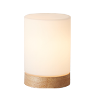</td>
      <td>Qianzhongyi intelligent lamp</td>
      <td>33302</td>
      <td>qyds.light.wy0a01</td>
      <td></td>
    </tr>
    <tr>
      <th>1244</th>
      <td></td>
      <td>Yeelight LED Lamp</td>
      <td>Muse/Muse Pro</td>
      <td>yeelink.light.lamp3</td>
      <td>YLTD03YL / YLTD04YL</td>
    </tr>
    <tr>
      <th>1245</th>
      <td></td>
      <td>Yeelight LED Light Sensor Desk Lamp V1</td>
      <td>Vision/ Vision Pro</td>
      <td>yeelink.light.lamp7</td>
      <td></td>
    </tr>
    <tr>
      <th>1246</th>
      <td></td>
      <td>Yeelight Smart Desk Lamp Prime</td>
      <td>Muse LE</td>
      <td>yeelink.light.lamp5</td>
      <td></td>
    </tr>
    <tr>
      <th>1247</th>
      <td></td>
      <td>Yeelight Star LED Table Lamp</td>
      <td>Doris</td>
      <td>yeelink.light.lamp9</td>
      <td>YLCT03YL</td>
    </tr>
    <tr>
      <th>1248</th>
      <td></td>
      <td>Zhiru Yiyun docking light</td>
      <td>Zhiru Yiyun docking light</td>
      <td>roome.light.v1</td>
      <td></td>
    </tr>
    <tr>
      <th>1249</th>
      <td></td>
      <td>desklight</td>
      <td>Op smart desk lamp, support small AI speaker voice control</td>
      <td>opple.light.desk</td>
      <td></td>
    </tr>
  </tbody>
</table>

## Door and window sensor
<table border="1" class="dataframe">
  <thead>
    <tr style="text-align: right;">
      <th></th>
      <th>Pic</th>
      <th>Name</th>
      <th>Description</th>
      <th>Model</th>
      <th>Product Number</th>
    </tr>
  </thead>
  <tbody>
    <tr>
      <th>1250</th>
      <td></td>
      <td>Aqara Door and Window Sensor</td>
      <td>Detect the switch of doors and windows</td>
      <td>lumi.sensor_magnet.aq2</td>
      <td>MCCGQ11LM</td>
    </tr>
    <tr>
      <th>1251</th>
      <td></td>
      <td>Aqara Door and Window Sensor T1</td>
      <td>Detect the switch of doors and windows</td>
      <td>lumi.magnet.agl02</td>
      <td>MCCGQ12LM</td>
    </tr>
    <tr>
      <th>1252</th>
      <td></td>
      <td>Bit door sensor</td>
      <td></td>
      <td>btzn.magnet.v1</td>
      <td></td>
    </tr>
    <tr>
      <th>1253</th>
      <td></td>
      <td>Door & window sensor</td>
      <td>Door and window sensor</td>
      <td>lumi.sensor_magnet.v1</td>
      <td>MCCGQ01LM (YTC4039GL)</td>
    </tr>
    <tr>
      <th>1254</th>
      <td></td>
      <td>Door sensor</td>
      <td></td>
      <td>bright.magnet.gate</td>
      <td></td>
    </tr>
    <tr>
      <th>1255</th>
      <td></td>
      <td>Door sensor</td>
      <td></td>
      <td>ghome.magnet.sf007</td>
      <td></td>
    </tr>
    <tr>
      <th>1256</th>
      <td></td>
      <td>Mi Door and Window Sensor 2</td>
      <td>Xiaomi door and window sensor 2</td>
      <td>isa.magnet.dw2hl</td>
      <td>MCCGQ02HL</td>
    </tr>
    <tr>
      <th>1257</th>
      <td></td>
      <td>Mi Window and Door Sensor</td>
      <td>Door and window sensor 2</td>
      <td>lumi.sensor_magnet.v2</td>
      <td></td>
    </tr>
    <tr>
      <th>1258</th>
      <td>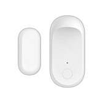</td>
      <td>Qingping Door/Window Contact Sensor</td>
      <td>Hodor</td>
      <td>cgllc.magnet.hodor</td>
      <td></td>
    </tr>
    <tr>
      <th>1259</th>
      <td></td>
      <td>window</td>
      <td>Universal window</td>
      <td>dctrls.magnet.window</td>
      <td></td>
    </tr>
  </tbody>
</table>

## Door lock
<table border="1" class="dataframe">
  <thead>
    <tr style="text-align: right;">
      <th></th>
      <th>Pic</th>
      <th>Name</th>
      <th>Description</th>
      <th>Model</th>
      <th>Product Number</th>
    </tr>
  </thead>
  <tbody>
    <tr>
      <th>1260</th>
      <td></td>
      <td>Advantages of smart lock M2 Pro</td>
      <td>Automatic lock body</td>
      <td>ydhome.lock.m2p</td>
      <td></td>
    </tr>
    <tr>
      <th>1261</th>
      <td></td>
      <td>Advantages of smart lock M2Lite</td>
      <td>Semi-automatic lock body</td>
      <td>ydhome.lock.m2lite</td>
      <td></td>
    </tr>
    <tr>
      <th>1262</th>
      <td></td>
      <td>Aqara Door Lock</td>
      <td>This product is a home smart door lock with password opening, key opening and APP authorization opening functions. At the same time, the APP can realize the authorization of the key, report the loss and recovery, and can push all unlocking event reminders to the user in real time</td>
      <td>lumi.lock.aq1</td>
      <td>ZNMS11LM</td>
    </tr>
    <tr>
      <th>1263</th>
      <td></td>
      <td>Aqara Door Lock S2</td>
      <td>A Zigbee smart door lock with fingerprint and password unlock function.</td>
      <td>lumi.lock.acn02</td>
      <td>ZNMS12LM</td>
    </tr>
    <tr>
      <th>1264</th>
      <td></td>
      <td>Aqara Door lock S2 Pro</td>
      <td>The upgraded version of Aqara smart door lock S2 can be unlocked by fingerprints, passwords, and electronic keys, and can detect the status of the door, and can be linked with other smart devices through a wealth of automated events.</td>
      <td>lumi.lock.acn03</td>
      <td>ZNMS13LM</td>
    </tr>
    <tr>
      <th>1265</th>
      <td></td>
      <td>Aqara Full-auto Smart Door Lock D100</td>
      <td>Smart door lock DP1 is a fully automatic smart door lock with a full handle design.At the same time, combined with the automatic lock body, the door can be opened as soon as the door is closed.Support fingerprint, password, temporary password, key, NFC, mobile phone Bluetooth unlocking methods, and two-factor authentication unlocking methods.</td>
      <td>lumi.lock.bacn01</td>
      <td></td>
    </tr>
    <tr>
      <th>1266</th>
      <td></td>
      <td>Aqara smart door lock N100</td>
      <td>Aqara Smart Door Lock R1 is a smart lock featuring the ultimate cost-effectiveness. It supports fingerprint, password, key, NFC, Bluetooth and other unlocking methods.</td>
      <td>lumi.lock.bzacn2</td>
      <td>ZNMS16LM</td>
    </tr>
    <tr>
      <th>1267</th>
      <td></td>
      <td>Aqara smart door lock N200</td>
      <td>The Pisces Aqara smart door lock N200 is a smart door lock that focuses on security and is easy to use.In terms of ease of use, the Pisces smart door lock integrates the mainstream unlocking methods of high-end smart door locks on the market, with multiple unlocking methods such as fingerprints, passwords, Bluetooth, keys, NFC and dual authentication.</td>
      <td>lumi.lock.bzacn1</td>
      <td>ZNMS17LM</td>
    </tr>
    <tr>
      <th>1268</th>
      <td></td>
      <td>Berson Digital Door Lock JW-P</td>
      <td></td>
      <td>jiwu.lock.jwp01</td>
      <td></td>
    </tr>
    <tr>
      <th>1269</th>
      <td></td>
      <td>DESSMANN Facial recognition smart lock-Di R5</td>
      <td>R5 smart door lock</td>
      <td>dsm.lock.r5</td>
      <td></td>
    </tr>
    <tr>
      <th>1270</th>
      <td></td>
      <td>DESSMANN smart lock-Di H3</td>
      <td>H3 smart door lock</td>
      <td>dsm.lock.h3</td>
      <td></td>
    </tr>
    <tr>
      <th>1271</th>
      <td></td>
      <td>Door lock</td>
      <td>This product is a smart lock cylinder that supports electronic key unlocking</td>
      <td>lumi.lock.v1</td>
      <td>A6121</td>
    </tr>
    <tr>
      <th>1272</th>
      <td></td>
      <td>Door lock sensor</td>
      <td>Detection of door open/close and door lock status</td>
      <td>lumi.sensor_dlock.v1</td>
      <td></td>
    </tr>
    <tr>
      <th>1273</th>
      <td></td>
      <td>Huitailong ultra-thin screen fingerprint intelligent lock U1</td>
      <td>Smart door lock</td>
      <td>hutlon.lock.v0001</td>
      <td></td>
    </tr>
    <tr>
      <th>1274</th>
      <td></td>
      <td>IMI Home Security Smart Lock J16</td>
      <td></td>
      <td>chuangmi.lock.hmi503a01</td>
      <td></td>
    </tr>
    <tr>
      <th>1275</th>
      <td></td>
      <td>IMI Home Security Smart Lock X7</td>
      <td></td>
      <td>chuangmi.lock.hmi505a01</td>
      <td></td>
    </tr>
    <tr>
      <th>1276</th>
      <td></td>
      <td>IMI Security Smart Lock C1</td>
      <td>Smart door lock</td>
      <td>chuangmi.lock.hmi501</td>
      <td></td>
    </tr>
    <tr>
      <th>1277</th>
      <td></td>
      <td>Justree Smart Lock Kx</td>
      <td>A smart door lock with Bluetooth, fingerprint, password and mechanical key unlocking capabilities, hidden fingerprints, open the door in one step!</td>
      <td>shjszn.lock.kx</td>
      <td></td>
    </tr>
    <tr>
      <th>1278</th>
      <td></td>
      <td>LOOCK Classic 2S</td>
      <td>Luke smart door lock Classic 2S, self-elastic lock body</td>
      <td>loock.lock.v8</td>
      <td></td>
    </tr>
    <tr>
      <th>1279</th>
      <td></td>
      <td>LOOCK Classic 2X</td>
      <td>Luke Smart Door Lock Classic 2, Double Quick Lock Body</td>
      <td>loock.lock.v7</td>
      <td></td>
    </tr>
    <tr>
      <th>1280</th>
      <td></td>
      <td>Loock Classic</td>
      <td>Smart door lock-v1</td>
      <td>loock.lock.v1</td>
      <td></td>
    </tr>
    <tr>
      <th>1281</th>
      <td></td>
      <td>Loock Q2</td>
      <td>Luke Smart Door Lock-v3</td>
      <td>loock.lock.v3</td>
      <td></td>
    </tr>
    <tr>
      <th>1282</th>
      <td></td>
      <td>Loock Smart</td>
      <td>Luke smart door lock Smart, self-elastic lock body</td>
      <td>loock.lock.v9</td>
      <td></td>
    </tr>
    <tr>
      <th>1283</th>
      <td>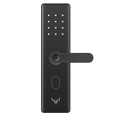</td>
      <td>Loock Smart Lock Classic 2</td>
      <td>Luke Smart Door Lock Classic 2, second-generation hardware</td>
      <td>loock.lock.cc2s</td>
      <td></td>
    </tr>
    <tr>
      <th>1284</th>
      <td></td>
      <td>Loock Smart Lock Classic 2X Pro</td>
      <td>Luke Smart Door Lock Classic 2X Pro</td>
      <td>loock.lock.cc2xpro</td>
      <td></td>
    </tr>
    <tr>
      <th>1285</th>
      <td></td>
      <td>Loock Smart Lock S30</td>
      <td>Luke automatic sliding door lock S30</td>
      <td>loock.lock.s30v2</td>
      <td></td>
    </tr>
    <tr>
      <th>1286</th>
      <td></td>
      <td>Loock Smart Lock S30 Pro</td>
      <td>Luke Automatic Smart Door Lock S30 Pro</td>
      <td>loock.lock.s30</td>
      <td></td>
    </tr>
    <tr>
      <th>1287</th>
      <td></td>
      <td>Loock Spider-Man Series Limited Edition</td>
      <td>Luke Smart Door Lock Spiderman series limited edition, self-elastic lock body</td>
      <td>loock.lock.v14</td>
      <td></td>
    </tr>
    <tr>
      <th>1288</th>
      <td></td>
      <td>M1Lock</td>
      <td>1. There are four unlocking methods including password, fingerprint, Bluetooth and key. 2. Support long-term password and one-time password unlocking. 3. Long battery life, worry-free and durable.</td>
      <td>huohe.lock.m1</td>
      <td></td>
    </tr>
    <tr>
      <th>1289</th>
      <td></td>
      <td>Mi Automatic Smart Door Lock</td>
      <td>Xiaomi automatic smart door lock T1, automatic lock body</td>
      <td>loock.lock.t1</td>
      <td></td>
    </tr>
    <tr>
      <th>1290</th>
      <td></td>
      <td>Mi Push-Pull Smart Door Lock</td>
      <td>Xiaomi Mijias first push-pull smart door lock, extremely cost-effective.</td>
      <td>loock.lock.v5</td>
      <td></td>
    </tr>
    <tr>
      <th>1291</th>
      <td></td>
      <td>Mi Smart Door Lock</td>
      <td>The Capricorn 2.0 smart lock is a re-optimized product based on the appearance and functions of the original Capricorn generation. It is a smart lock that focuses on ultimate security and convenience. It supports fingerprints, passwords, temporary passwords, keys, NFC, and mobile Bluetooth unlocking methods., And two-factor authentication unlocking method.Through the in-depth customization of the fingerprint module and the in-depth optimization algorithm, a smooth fingerprint unlocking and opening experience is realized.At the same time, the user can view the unlocking history through the app anytime and anywhere, and automatically push the alarm information to the mobile phone when the door lock has an abnormal alarm.</td>
      <td>lumi.lock.bmcn02</td>
      <td></td>
    </tr>
    <tr>
      <th>1292</th>
      <td></td>
      <td>Mi Smart Door Lock</td>
      <td></td>
      <td>lumi.lock.mcn01</td>
      <td></td>
    </tr>
    <tr>
      <th>1293</th>
      <td></td>
      <td>Mi Smart Door Lock E</td>
      <td>Competitive bluetooth smart door lock for thousands of dollars, with doorbell, without NFC.</td>
      <td>lumi.lock.bmcn03</td>
      <td></td>
    </tr>
    <tr>
      <th>1294</th>
      <td></td>
      <td>Mi Smart Door Lock Essential</td>
      <td>Xiaomi Mijias first smart door lock for less than 1,000 yuan, the first smart door lock for young people, to create the ultimate cost-effective.</td>
      <td>loock.lock.v6</td>
      <td></td>
    </tr>
    <tr>
      <th>1295</th>
      <td></td>
      <td>Mi Smart Door Lock Pro</td>
      <td></td>
      <td>lumi.lock.wbmcn1</td>
      <td></td>
    </tr>
    <tr>
      <th>1296</th>
      <td></td>
      <td>Noc Loc Smart Door Lock - Stainless Steel Version</td>
      <td>Simple smart door lock-stainless steel version, firmware and simple smart door lock-there is no difference in custom made</td>
      <td>zhimi.lock.da2</td>
      <td></td>
    </tr>
    <tr>
      <th>1297</th>
      <td></td>
      <td>OJJ X1</td>
      <td>X1 is the first product of the new brand OJJ under Luke. It is mainly cost-effective and hopes that smart door locks will benefit more ordinary people.</td>
      <td>loock.lock.v4</td>
      <td></td>
    </tr>
    <tr>
      <th>1298</th>
      <td></td>
      <td>OJJ Z1</td>
      <td>Derived from Classic (F3M)</td>
      <td>loock.lock.ojjz1</td>
      <td></td>
    </tr>
    <tr>
      <th>1299</th>
      <td></td>
      <td>Ola Mars</td>
      <td>The wooden door fingerprint lock provides fingerprint, mobile phone and key unlocking methods.The appearance is brief and easy to use.</td>
      <td>ola.lock.i3</td>
      <td></td>
    </tr>
    <tr>
      <th>1300</th>
      <td></td>
      <td>Q3</td>
      <td>Fully automatic products</td>
      <td>dsm.lock.q3</td>
      <td></td>
    </tr>
    <tr>
      <th>1301</th>
      <td></td>
      <td>SherLock M1</td>
      <td>Sherlock Smart Sticker Lock M1 is a smart lock that can be affixed, using short-range Bluetooth communication to work with smartphones.There is no need to replace the original anti-theft lock, the smart lock is posted indoors, the installation is extremely fast, the original key can still be used, and the mechanical lock can be easily upgraded to a smart door lock.</td>
      <td>yunshi.lock.s2</td>
      <td></td>
    </tr>
    <tr>
      <th>1302</th>
      <td></td>
      <td>Uodi Smart Lock C1P</td>
      <td>Semi-automatic lock body</td>
      <td>ydhome.lock.c1p</td>
      <td></td>
    </tr>
    <tr>
      <th>1303</th>
      <td></td>
      <td>VIOMI door lock Link (Bluetooth)</td>
      <td>Yunmi Internet Smart Door Lock Link (Bluetooth Version)</td>
      <td>viomi.lock.link1</td>
      <td></td>
    </tr>
    <tr>
      <th>1304</th>
      <td></td>
      <td>Viomi Door Lock Link (Long endurance version)</td>
      <td>Yunmi Internet Smart Door Lock Link (long battery life version)</td>
      <td>viomi.lock.link2</td>
      <td></td>
    </tr>
    <tr>
      <th>1305</th>
      <td></td>
      <td>Xiaobai Smart Door Lock G1</td>
      <td></td>
      <td>chuangmi.lock.hmi501b01</td>
      <td></td>
    </tr>
    <tr>
      <th>1306</th>
      <td></td>
      <td>Xiaomiyoupin Smart Door Lock</td>
      <td>Smart door lock</td>
      <td>zhimi.lock.da1</td>
      <td></td>
    </tr>
    <tr>
      <th>1307</th>
      <td></td>
      <td>Youdian Smart Lock M2</td>
      <td>Fully automatic sliding lock</td>
      <td>ydhome.lock.m2silver</td>
      <td></td>
    </tr>
    <tr>
      <th>1308</th>
      <td></td>
      <td>Zelkova Lock</td>
      <td>Smart door locks with Bluetooth, fingerprint, password and mechanical password unlocking capabilities completely abandon traditional mechanical keys!</td>
      <td>shjszn.lock.c1</td>
      <td></td>
    </tr>
  </tbody>
</table>

## Downlight
<table border="1" class="dataframe">
  <thead>
    <tr style="text-align: right;">
      <th></th>
      <th>Pic</th>
      <th>Name</th>
      <th>Description</th>
      <th>Model</th>
      <th>Product Number</th>
    </tr>
  </thead>
  <tbody>
    <tr>
      <th>1309</th>
      <td></td>
      <td>Dancelight I Series Downlight</td>
      <td>Xiamen Topstar Co., Ltd. ceiling lamp project, using ESP-12S module, as a customer of Shenzhen Anxinke Technology Co., Ltd.</td>
      <td>tsd.light.tsl001</td>
      <td></td>
    </tr>
    <tr>
      <th>1310</th>
      <td></td>
      <td>Gomanni Scene two color downlight</td>
      <td>Comanni scene two-color downlight-Realtek</td>
      <td>gmn.light.wy0a02</td>
      <td></td>
    </tr>
    <tr>
      <th>1311</th>
      <td></td>
      <td>HUIZUO PISCES For Living Room</td>
      <td>Huayihui made Pisces Living Room Series-ZA</td>
      <td>huayi.light.pisces</td>
      <td></td>
    </tr>
    <tr>
      <th>1312</th>
      <td></td>
      <td>Lettin Essential Downlight</td>
      <td>Lettin Smart Downlight</td>
      <td>lettin.light.downlight</td>
      <td></td>
    </tr>
    <tr>
      <th>1313</th>
      <td></td>
      <td>Mi Smart Bluetooth Mesh LED Downlight</td>
      <td>Mijia LED downlight Bluetooth MESH version</td>
      <td>yeelink.light.light3</td>
      <td></td>
    </tr>
    <tr>
      <th>1314</th>
      <td></td>
      <td>NVC Smart down lamp</td>
      <td></td>
      <td>leishi.light.wy0a02</td>
      <td></td>
    </tr>
    <tr>
      <th>1315</th>
      <td></td>
      <td>Philips ZhiRui downlight</td>
      <td>Philips Smart Downlight</td>
      <td>philips.light.downlight</td>
      <td></td>
    </tr>
    <tr>
      <th>1316</th>
      <td></td>
      <td>Yeelight Crystal Pendant Lamp</td>
      <td>Nox DL</td>
      <td>yeelink.light.ceiling10</td>
      <td>YLDL01YL</td>
    </tr>
    <tr>
      <th>1317</th>
      <td></td>
      <td>Yeelight Mesh LED Downlight</td>
      <td>Mesh downlight</td>
      <td>yeelink.light.dnlight2</td>
      <td>YLSD01YL / MJTS01YL</td>
    </tr>
    <tr>
      <th>1318</th>
      <td></td>
      <td>Yeelight tunable white downlight & spotlight M2</td>
      <td>MESH Bell Lamp II, MESH Melometer II PRO, MESH Mode Light II</td>
      <td>yeelink.light.ml1</td>
      <td></td>
    </tr>
    <tr>
      <th>1319</th>
      <td></td>
      <td>ZhiRui dimmable downlight</td>
      <td>Zhirui LED downlight dimming version</td>
      <td>philips.light.dlight</td>
      <td></td>
    </tr>
  </tbody>
</table>

## Electric cat
<table border="1" class="dataframe">
  <thead>
    <tr style="text-align: right;">
      <th></th>
      <th>Pic</th>
      <th>Name</th>
      <th>Description</th>
      <th>Model</th>
      <th>Product Number</th>
    </tr>
  </thead>
  <tbody>
    <tr>
      <th>1320</th>
      <td></td>
      <td>Mi electricity WiFi extender</td>
      <td>Xiaomi WiFi Power Cat</td>
      <td>xiaomi.plc.v1</td>
      <td></td>
    </tr>
  </tbody>
</table>

## Fan light
<table border="1" class="dataframe">
  <thead>
    <tr style="text-align: right;">
      <th></th>
      <th>Pic</th>
      <th>Name</th>
      <th>Description</th>
      <th>Model</th>
      <th>Product Number</th>
    </tr>
  </thead>
  <tbody>
    <tr>
      <th>1321</th>
      <td></td>
      <td>Gomanni G1 series bedroom fan lamp</td>
      <td>Gemani G1 series bedroom fan light</td>
      <td>gmn.light.wyfan1</td>
      <td></td>
    </tr>
    <tr>
      <th>1322</th>
      <td></td>
      <td>HUIZUO Fan Light</td>
      <td></td>
      <td>huayi.light.fanwy</td>
      <td></td>
    </tr>
    <tr>
      <th>1323</th>
      <td></td>
      <td>NVC Fan Light</td>
      <td></td>
      <td>leishi.light.fan01</td>
      <td></td>
    </tr>
    <tr>
      <th>1324</th>
      <td></td>
      <td>NVC Smart fan lamp (ZhiYa)</td>
      <td>Fan Light-Hidden Leaf</td>
      <td>leishi.light.wyfao1</td>
      <td></td>
    </tr>
    <tr>
      <th>1325</th>
      <td></td>
      <td>NVC Smart fan lamp (ZhiYi)</td>
      <td>Fan light-open leaf</td>
      <td>leishi.light.wyfa02</td>
      <td></td>
    </tr>
    <tr>
      <th>1326</th>
      <td></td>
      <td>OPPLE FANLIGHT</td>
      <td>OPPLE Smart Fan Light</td>
      <td>opple.light.fanlight</td>
      <td></td>
    </tr>
    <tr>
      <th>1327</th>
      <td></td>
      <td>Scene intelligent fan lamp WiFi</td>
      <td>Scenario Wisdom Fan Light WiFi Version</td>
      <td>leshi.light.wyfan</td>
      <td></td>
    </tr>
    <tr>
      <th>1328</th>
      <td></td>
      <td>Yeelight Smart Ceiling Fan</td>
      <td>AC version</td>
      <td>yeelink.light.fancl1</td>
      <td></td>
    </tr>
    <tr>
      <th>1329</th>
      <td></td>
      <td>Yeelight Smart Ceiling Fan S2001</td>
      <td>Yeelight DC Inverter Fan Light (DC)</td>
      <td>yeelink.light.fancl2</td>
      <td></td>
    </tr>
  </tbody>
</table>

## Floor light
<table border="1" class="dataframe">
  <thead>
    <tr style="text-align: right;">
      <th></th>
      <th>Pic</th>
      <th>Name</th>
      <th>Description</th>
      <th>Model</th>
      <th>Product Number</th>
    </tr>
  </thead>
  <tbody>
    <tr>
      <th>1330</th>
      <td></td>
      <td>Yeelight Star Floor Lamp</td>
      <td>Doris F</td>
      <td>yeelink.light.lamp10</td>
      <td>YLLD01YL</td>
    </tr>
  </tbody>
</table>

## Gas sensor
<table border="1" class="dataframe">
  <thead>
    <tr style="text-align: right;">
      <th></th>
      <th>Pic</th>
      <th>Name</th>
      <th>Description</th>
      <th>Model</th>
      <th>Product Number</th>
    </tr>
  </thead>
  <tbody>
    <tr>
      <th>1331</th>
      <td></td>
      <td>Gas alarm</td>
      <td></td>
      <td>mingpu.sensor_gas.det1</td>
      <td></td>
    </tr>
    <tr>
      <th>1332</th>
      <td></td>
      <td>Mi Smart Natural Gas Detector</td>
      <td>gas sensor</td>
      <td>lumi.sensor_natgas.v1</td>
      <td>JTQJ-BF-01LM/BW</td>
    </tr>
  </tbody>
</table>

## Gateway
<table border="1" class="dataframe">
  <thead>
    <tr style="text-align: right;">
      <th></th>
      <th>Pic</th>
      <th>Name</th>
      <th>Description</th>
      <th>Model</th>
      <th>Product Number</th>
    </tr>
  </thead>
  <tbody>
    <tr>
      <th>1333</th>
      <td></td>
      <td>Aqara Hub</td>
      <td></td>
      <td>lumi.gateway.aqhm01</td>
      <td>ZHWG11LM</td>
    </tr>
    <tr>
      <th>1334</th>
      <td></td>
      <td>Aqara Hub</td>
      <td>Aqara gateway is a Wi-Fi smart gateway that supports both Apple HomeKit and Mijia. It communicates with sub-devices through Zigbee. Users can add sub-devices to the gateway to achieve control and detection of switches, light bulbs, curtains and other devices.Temperature and humidity, door and window status, detection of human movement, detection of water leakage, sound and light alarm and other functions.Users can also create and manage various life scenarios through Apple's "Home" App and "Mijia" App.</td>
      <td>lumi.gateway.aqhm02</td>
      <td></td>
    </tr>
    <tr>
      <th>1335</th>
      <td></td>
      <td>Aqara Hub M1S</td>
      <td>The Aqara gateway M1S is a Zigbee3.0 gateway that can connect various Zigbee sub-devices, such as switches, sockets, motors, sensors, etc., to achieve rich intelligent scene linkage, and it has sound and light functions.</td>
      <td>lumi.gateway.acn01</td>
      <td>ZHWG15LM / AG013CNW01</td>
    </tr>
    <tr>
      <th>1336</th>
      <td></td>
      <td>Aqara Hub M1S</td>
      <td>The Aqara gateway M1S is a Zigbee3.0 gateway that can connect various Zigbee sub-devices, such as switches, sockets, motors, sensors, etc., to achieve rich intelligent scene linkage, and it has sound and light functions.</td>
      <td>lumi.gateway.aeu01</td>
      <td>HM1S-G01</td>
    </tr>
    <tr>
      <th>1337</th>
      <td></td>
      <td>Bit 307 Gateway</td>
      <td></td>
      <td>btzn.gateway.307v1</td>
      <td></td>
    </tr>
    <tr>
      <th>1338</th>
      <td></td>
      <td>Bit 569 Gateway</td>
      <td></td>
      <td>btzn.gateway.569v1</td>
      <td></td>
    </tr>
    <tr>
      <th>1339</th>
      <td></td>
      <td>Bit gateway</td>
      <td></td>
      <td>bt2019.gateway.rcuv1</td>
      <td></td>
    </tr>
    <tr>
      <th>1340</th>
      <td></td>
      <td>Chengyun Gateway mini</td>
      <td>Chengyun Gateway mini version</td>
      <td>xqh.gateway.a00001</td>
      <td></td>
    </tr>
    <tr>
      <th>1341</th>
      <td></td>
      <td>Enterprise Wired Smart Gateway</td>
      <td>Connect panels, sensors, curtain motors, air conditioners and other devices to miot through CAN, 485, KNX and other bus protocols</td>
      <td>bymiot.gateway.v1</td>
      <td></td>
    </tr>
    <tr>
      <th>1342</th>
      <td></td>
      <td>Enterprise Wired Smart Gateway Version 2.0</td>
      <td>Connect panels, sensors, curtain motors, air conditioners and other devices to miot through CAN, 485, KNX and other bus protocols</td>
      <td>bymiot.gateway.v2</td>
      <td></td>
    </tr>
    <tr>
      <th>1343</th>
      <td></td>
      <td>IMILAB EC2 Wireless Camera Gateway</td>
      <td>Used to mount low-power cameras</td>
      <td>chuangmi.gateway.ipc011</td>
      <td></td>
    </tr>
    <tr>
      <th>1344</th>
      <td></td>
      <td>Linptech RF Gateway</td>
      <td>Leader RF433 Sensor Gateway</td>
      <td>linp.gateway.n2</td>
      <td></td>
    </tr>
    <tr>
      <th>1345</th>
      <td></td>
      <td>Mi Control Hub</td>
      <td>The British version of Mijia Overseas Gateway supports alert, night light and sub-device management functions. It is the control center of the smart home system.</td>
      <td>lumi.gateway.lmuk01</td>
      <td></td>
    </tr>
    <tr>
      <th>1346</th>
      <td></td>
      <td>Mi Control Hub</td>
      <td>Mi Control Hub, Mijia European Standard Multifunctional Gateway</td>
      <td>lumi.gateway.mieu01</td>
      <td>ZHWG11LM-763 / DGNWG05LM</td>
    </tr>
    <tr>
      <th>1347</th>
      <td></td>
      <td>Mi Control Hub</td>
      <td>Mijia Multifunctional Smart Gateway (Hong Kong)</td>
      <td>lumi.gateway.mihk01</td>
      <td></td>
    </tr>
    <tr>
      <th>1348</th>
      <td></td>
      <td>Mi Control Hub</td>
      <td>Mijia Multifunction Gateway Taiwan Version</td>
      <td>lumi.gateway.mitw01</td>
      <td></td>
    </tr>
    <tr>
      <th>1349</th>
      <td></td>
      <td>Mi Control Hub</td>
      <td>Mi Multi-function Gateway</td>
      <td>lumi.gateway.v1</td>
      <td></td>
    </tr>
    <tr>
      <th>1350</th>
      <td></td>
      <td>Mi Control Hub</td>
      <td>Multifunctional Gateway v2</td>
      <td>lumi.gateway.v2</td>
      <td></td>
    </tr>
    <tr>
      <th>1351</th>
      <td></td>
      <td>Mi Control Hub</td>
      <td>Multi-function gateway</td>
      <td>lumi.gateway.v3</td>
      <td>DGNWG02LM</td>
    </tr>
    <tr>
      <th>1352</th>
      <td></td>
      <td>Mi Smart Home Hub</td>
      <td>A product with Wi-Fi, Zigbee and BLE modules can realize the interconnection of Wi-Fi, Zigbee and BLE devices.</td>
      <td>lumi.gateway.mgl03</td>
      <td>ZNDMWG03LM/BHR4105 (CN), ZNDMWG02LM/YTC4044GL (GL)</td>
    </tr>
    <tr>
      <th>1353</th>
      <td></td>
      <td>Qingping Bluetooth Gateway</td>
      <td>Qingping Bluetooth Gateway (sparrow)</td>
      <td>cgllc.gateway.s1</td>
      <td></td>
    </tr>
    <tr>
      <th>1354</th>
      <td></td>
      <td>Smart USB Wall Socket Panel H1 (Gateway Version)</td>
      <td>Smart USB wall socket panel H1 (Gateway version) is a gateway with socket and USB charging port. As a Zigbee gateway, the wall-mounted installation method can be applied to the B-end market such as hotels and buildings. The USB port provides convenient and beautiful hotel rooms.Charging method.With RJ45 network port, WiFi, Zigbee3.0.</td>
      <td>lumi.gateway.sacn01</td>
      <td></td>
    </tr>
    <tr>
      <th>1355</th>
      <td></td>
      <td>Smart gateway</td>
      <td></td>
      <td>hsmart.gateway.hs2sk</td>
      <td></td>
    </tr>
    <tr>
      <th>1356</th>
      <td></td>
      <td>Yeelight Mesh Hub</td>
      <td>BLE MESH Gateway</td>
      <td>yeelink.gateway.v1</td>
      <td>YLWG01YL</td>
    </tr>
    <tr>
      <th>1357</th>
      <td></td>
      <td>Yeelight Mesh Hub</td>
      <td>Harp domestic version of the new model shun cut</td>
      <td>yeelink.gateway.va</td>
      <td></td>
    </tr>
    <tr>
      <th>1358</th>
      <td></td>
      <td>Zelkova smart gateway</td>
      <td>Gateway used with smart door lock</td>
      <td>shjszn.gateway.c1</td>
      <td></td>
    </tr>
  </tbody>
</table>

## Gps tracker
<table border="1" class="dataframe">
  <thead>
    <tr style="text-align: right;">
      <th></th>
      <th>Pic</th>
      <th>Name</th>
      <th>Description</th>
      <th>Model</th>
      <th>Product Number</th>
    </tr>
  </thead>
  <tbody>
    <tr>
      <th>1359</th>
      <td></td>
      <td>Mi Bunny GPS Locator</td>
      <td>Real-time positioning of the device, while being able to make voice calls.</td>
      <td>xiaoxun.tracker.v1</td>
      <td></td>
    </tr>
    <tr>
      <th>1360</th>
      <td></td>
      <td>Miwa positioning beans</td>
      <td>Real-time positioning, accurate and fast positioning Track playback Electronic fence Low power consumption, long standby Environmental and healthy materials, green design, EU standards Low battery alarm Remote control shutdown Password reset and modification Satellite timing Built-in sim card</td>
      <td>insistek.tracker.wa620</td>
      <td></td>
    </tr>
    <tr>
      <th>1361</th>
      <td></td>
      <td>RANRES smart tracker</td>
      <td></td>
      <td>minuo.tracker.lm001</td>
      <td></td>
    </tr>
  </tbody>
</table>

## Insect repeller
<table border="1" class="dataframe">
  <thead>
    <tr style="text-align: right;">
      <th></th>
      <th>Pic</th>
      <th>Name</th>
      <th>Description</th>
      <th>Model</th>
      <th>Product Number</th>
    </tr>
  </thead>
  <tbody>
    <tr>
      <th>1362</th>
      <td></td>
      <td>Dakuo Mosquito Repellent</td>
      <td>The core function of Dakuo electric mosquito coil: intelligence + health.Through the Mijia APP, intelligently control the switch of the electric mosquito coil, monitor the burning progress of the mosquito coil liquid, and promptly remind when the liquid level is insufficient.At the same time, through the intelligent algorithm, the mosquito-repellent incense liquid is controlled to evaporate evenly, which is more healthy to use.</td>
      <td>ateai.mosq.dakuo</td>
      <td></td>
    </tr>
    <tr>
      <th>1363</th>
      <td></td>
      <td>Mijia smart mosquito repellent</td>
      <td>Mijia Mosquito Repellent Bluetooth Version</td>
      <td>zimi.mosq.v1</td>
      <td>WX08ZM</td>
    </tr>
    <tr>
      <th>1364</th>
      <td></td>
      <td>Mosquito lamp</td>
      <td></td>
      <td>dayang.mosq.dyt16s</td>
      <td></td>
    </tr>
  </tbody>
</table>

## Intelligent security system
<table border="1" class="dataframe">
  <thead>
    <tr style="text-align: right;">
      <th></th>
      <th>Pic</th>
      <th>Name</th>
      <th>Description</th>
      <th>Model</th>
      <th>Product Number</th>
    </tr>
  </thead>
  <tbody>
    <tr>
      <th>1365</th>
      <td></td>
      <td>LangYueSecurity</td>
      <td>The security system controls the water, electricity, natural gas and other facilities of the user's home through the control relay, and obtains the real-time status of the user's home through the sensor, and can take emergency measures and notify the user when an abnormal situation occurs.</td>
      <td>yyzhn.gateway.yn181126</td>
      <td></td>
    </tr>
  </tbody>
</table>

## Light bulb
<table border="1" class="dataframe">
  <thead>
    <tr style="text-align: right;">
      <th></th>
      <th>Pic</th>
      <th>Name</th>
      <th>Description</th>
      <th>Model</th>
      <th>Product Number</th>
    </tr>
  </thead>
  <tbody>
    <tr>
      <th>1366</th>
      <td></td>
      <td>Aqara LED Light Bulb (Tunable White)</td>
      <td>Aqara smart LED bulb (adjustable color temperature), connected to the gateway through zigbee, adjustable brightness and color temperature</td>
      <td>lumi.light.aqcn02</td>
      <td>ZNLDP12LM</td>
    </tr>
    <tr>
      <th>1367</th>
      <td></td>
      <td>Bulb Remote Control</td>
      <td>Mijia bulb infrared remote control</td>
      <td>miir.light.ir01</td>
      <td></td>
    </tr>
    <tr>
      <th>1368</th>
      <td></td>
      <td>Dancelight I Series Bulb</td>
      <td>Xiamen Topstar Co., Ltd. ceiling lamp project, using ESP-12S module, as a customer of Shenzhen Anxinke Technology Co., Ltd.</td>
      <td>tsd.light.test01</td>
      <td></td>
    </tr>
    <tr>
      <th>1369</th>
      <td></td>
      <td>IKEA E14 warm white</td>
      <td>IKEA Truphy E14 400lm 5.3W, warm white non-colorable Candle Bulb</td>
      <td>ikea.light.led1649c5</td>
      <td>LED1649C5</td>
    </tr>
    <tr>
      <th>1370</th>
      <td></td>
      <td>IKEA E14 white spectrum</td>
      <td>IKEA Trufi E14 400lm 5W color temperature adjustable</td>
      <td>ikea.light.led1536g5</td>
      <td>LED1536G5</td>
    </tr>
    <tr>
      <th>1371</th>
      <td></td>
      <td>IKEA E27 warm white</td>
      <td>IKEA Trufi E27 1000lm 12.5W warm white light</td>
      <td>ikea.light.led1623g12</td>
      <td>LED1623G12</td>
    </tr>
    <tr>
      <th>1372</th>
      <td></td>
      <td>IKEA E27 white spectrum clear</td>
      <td>IKEA Trufi E27 950lm 12W color temperature adjustable</td>
      <td>ikea.light.led1546g12</td>
      <td>LED1546G12</td>
    </tr>
    <tr>
      <th>1373</th>
      <td></td>
      <td>IKEA E27 white spectrum opal</td>
      <td>IKEA Trufi E27 980lm 12W color temperature adjustable</td>
      <td>ikea.light.led1545g12</td>
      <td>LED1545G12</td>
    </tr>
    <tr>
      <th>1374</th>
      <td></td>
      <td>IKEA GU10 warm white</td>
      <td>IKEA Trufi GU10 400lm 5.3W warm white light</td>
      <td>ikea.light.led1650r5</td>
      <td>LED1650R5</td>
    </tr>
    <tr>
      <th>1375</th>
      <td></td>
      <td>IKEA GU10 white spectrum</td>
      <td>IKEA Trufi GU10 400lm 6W color temperature adjustable</td>
      <td>ikea.light.led1537r6</td>
      <td>LED1537R6</td>
    </tr>
    <tr>
      <th>1376</th>
      <td></td>
      <td>JX Smart bulb</td>
      <td></td>
      <td>jxsoft.light.bump1</td>
      <td></td>
    </tr>
    <tr>
      <th>1377</th>
      <td></td>
      <td>LED</td>
      <td></td>
      <td>heiman.light.rc1</td>
      <td></td>
    </tr>
    <tr>
      <th>1378</th>
      <td></td>
      <td>Lettin Chroma BR30</td>
      <td>Lettin Smart Floodlight Full Color Version</td>
      <td>lettin.light.chromabr</td>
      <td></td>
    </tr>
    <tr>
      <th>1379</th>
      <td></td>
      <td>Lettin Chroma Bulb</td>
      <td>Lettin Smart Bulb Full Color Version Second Generation</td>
      <td>lettin.light.bulb2</td>
      <td></td>
    </tr>
    <tr>
      <th>1380</th>
      <td></td>
      <td>Lettin Essential Bulb</td>
      <td>Lettin Smart Bulb</td>
      <td>lettin.light.essenbulb</td>
      <td></td>
    </tr>
    <tr>
      <th>1381</th>
      <td></td>
      <td>Light Panels</td>
      <td>Each odd light board has 16 million colors for you to choose.The standard modular light board can be spliced into the shape you want like Lego bricks. Through the Rhythm magic sound device, the lights of the odd light board can show every song you like in dance.With it, you can visually enjoy the happiness brought by each note more deeply.</td>
      <td>nnleaf.light.panels</td>
      <td></td>
    </tr>
    <tr>
      <th>1382</th>
      <td></td>
      <td>Mi LED Smart Bulb (White and Color)</td>
      <td>Yeelight color light bulb third generation</td>
      <td>yeelink.light.color3</td>
      <td>MJDP02YL / GPX4013IN</td>
    </tr>
    <tr>
      <th>1383</th>
      <td></td>
      <td>Mi Smart Bluetooth Mesh LED Bulb</td>
      <td>Mijia LED Bulb Bluetooth MESH Version</td>
      <td>yeelink.light.mbulb3</td>
      <td></td>
    </tr>
    <tr>
      <th>1384</th>
      <td></td>
      <td>Mijia Philips Color Bulb</td>
      <td>Philips Zhirui Color Bulb Light</td>
      <td>philips.light.cbulb</td>
      <td></td>
    </tr>
    <tr>
      <th>1385</th>
      <td></td>
      <td>NVC Smart bulb</td>
      <td></td>
      <td>leishi.light.rgba03</td>
      <td></td>
    </tr>
    <tr>
      <th>1386</th>
      <td>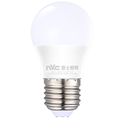</td>
      <td>NVC Smart bulb</td>
      <td></td>
      <td>leishi.light.wy0a01</td>
      <td></td>
    </tr>
    <tr>
      <th>1387</th>
      <td></td>
      <td>NVC Smart bulb</td>
      <td></td>
      <td>leishi.light.wy0a04</td>
      <td></td>
    </tr>
    <tr>
      <th>1388</th>
      <td></td>
      <td>Ordinary dimming light</td>
      <td>Dimmer switch Dual resistive dimmer switch 3 2</td>
      <td>uiot.light.light2</td>
      <td></td>
    </tr>
    <tr>
      <th>1389</th>
      <td></td>
      <td>Philips Wi-Fi bulb E27 White</td>
      <td>Philips Smart Bulb E27 Warm White</td>
      <td>philips.light.hbulb</td>
      <td></td>
    </tr>
    <tr>
      <th>1390</th>
      <td></td>
      <td>Philips ZhiRui E14 candle lamp Frosted version</td>
      <td>Philips Zhirui candle bulb small screw mouth frosted version</td>
      <td>philips.light.candle</td>
      <td></td>
    </tr>
    <tr>
      <th>1391</th>
      <td>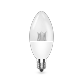</td>
      <td>Philips ZhiRui E14 candle lamp crystal version</td>
      <td>Philips Zhirui candle bulb small screw mouth crystal version</td>
      <td>philips.light.candle2</td>
      <td></td>
    </tr>
    <tr>
      <th>1392</th>
      <td></td>
      <td>Philips ZhiRui E27 bulb</td>
      <td>Philips Zhirui Bulb Light</td>
      <td>philips.light.bulb</td>
      <td></td>
    </tr>
    <tr>
      <th>1393</th>
      <td></td>
      <td>RGBC Lighting</td>
      <td>Support RGBC four-channel true color + cool white lighting control. Support various colorful modes, timing, scenes, music, night lights, etc. Support almost all mainstream smart speakers on the market. Supports interconnection and interaction with Ou Yi's full set of equipment.</td>
      <td>oeco.light.rgbc</td>
      <td></td>
    </tr>
    <tr>
      <th>1394</th>
      <td></td>
      <td>RGBCW Light</td>
      <td>Ordinary RGBCW lamp</td>
      <td>tuya.light.tywl03</td>
      <td></td>
    </tr>
    <tr>
      <th>1395</th>
      <td></td>
      <td>RGBCW Lighting</td>
      <td>Support RGBCW five-way full-color control. Support various colorful modes, timing, scenes, music, night lights, etc. Support almost all mainstream smart speakers on the market. Supports interconnection and interaction with Ou Yi's full set of equipment.</td>
      <td>oeco.light.rgbcw</td>
      <td></td>
    </tr>
    <tr>
      <th>1396</th>
      <td></td>
      <td>RGBW bulb</td>
      <td>Embedded zigbee standard protocol module, ultra-low power consumption, ultra-long standby, high stability, intelligent linkage scene, can automatically switch and color change according to environmental changes, and can also be remotely controlled by smart remote control or mobile phone APP.</td>
      <td>feibit.light.fzb8210</td>
      <td></td>
    </tr>
    <tr>
      <th>1397</th>
      <td></td>
      <td>Smart Light</td>
      <td>Intelligent lighting controller based on KNX/EIB</td>
      <td>knx.light.ktexxd</td>
      <td></td>
    </tr>
    <tr>
      <th>1398</th>
      <td></td>
      <td>Smart Plug</td>
      <td>LifeSmart smart bulbs use 1600W color LED lighting, which directly replaces traditional incandescent bulbs and energy-saving lamps to add luster to your life.</td>
      <td>lfsmt.light.ls024</td>
      <td></td>
    </tr>
    <tr>
      <th>1399</th>
      <td></td>
      <td>SmartLight</td>
      <td></td>
      <td>heiman.light.hs2lg</td>
      <td></td>
    </tr>
    <tr>
      <th>1400</th>
      <td></td>
      <td>Smyoo Light</td>
      <td>Smart light</td>
      <td>smyoo.light.light01</td>
      <td></td>
    </tr>
    <tr>
      <th>1401</th>
      <td></td>
      <td>Tunable And Color Ambiance Light</td>
      <td>Ordinary Wi-Fi Lantern</td>
      <td>tuya.light.tywl02</td>
      <td></td>
    </tr>
    <tr>
      <th>1402</th>
      <td></td>
      <td>Tuya Wi-Fi Light</td>
      <td>Ordinary Wi-Fi light</td>
      <td>tuya.light.tywl01</td>
      <td></td>
    </tr>
    <tr>
      <th>1403</th>
      <td></td>
      <td>X-Bulb smart bulb</td>
      <td>X-Bulb smart bulb</td>
      <td>ge.light.mono1</td>
      <td></td>
    </tr>
    <tr>
      <th>1404</th>
      <td></td>
      <td>Xinguang intelligent bulb</td>
      <td>Xinguang Smart Bulb, 33320-17, MK324 Reaktek,40611,MK399 (Gemanni)</td>
      <td>wainft.light.wy0a01</td>
      <td></td>
    </tr>
    <tr>
      <th>1405</th>
      <td></td>
      <td>Yeelight Bulb</td>
      <td>Yeelight white light bulb</td>
      <td>yeelink.light.mono1</td>
      <td>YLDP01YL</td>
    </tr>
    <tr>
      <th>1406</th>
      <td>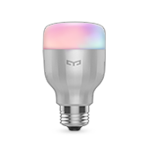</td>
      <td>Yeelight Color Bulb</td>
      <td>Yeelight color light bulb</td>
      <td>yeelink.light.color1</td>
      <td>YLDP02YL</td>
    </tr>
    <tr>
      <th>1407</th>
      <td></td>
      <td>Yeelight LED Bulb (Color)</td>
      <td>color2</td>
      <td>yeelink.light.color2</td>
      <td></td>
    </tr>
    <tr>
      <th>1408</th>
      <td></td>
      <td>Yeelight LED Bulb (Tunable)</td>
      <td>ct2</td>
      <td>yeelink.light.ct2</td>
      <td></td>
    </tr>
    <tr>
      <th>1409</th>
      <td></td>
      <td>Yeelight LED Bulb 1S (Color)</td>
      <td>lemon2 IPL</td>
      <td>yeelink.light.color4</td>
      <td>YLDP13YL</td>
    </tr>
    <tr>
      <th>1410</th>
      <td></td>
      <td>Yeelight LED Bulb 1S (Color)</td>
      <td>Yeelight LED bulb 1S (color light version) domestic version</td>
      <td>yeelink.light.color8</td>
      <td></td>
    </tr>
    <tr>
      <th>1411</th>
      <td></td>
      <td>Yeelight LED Bulb 1S (Dimmable)</td>
      <td>Yeelight white bulb version2</td>
      <td>yeelink.light.mono4</td>
      <td></td>
    </tr>
    <tr>
      <th>1412</th>
      <td></td>
      <td>Yeelight LED Filament Bulb</td>
      <td>Flute</td>
      <td>yeelink.light.mono5</td>
      <td>YLDP12YL</td>
    </tr>
    <tr>
      <th>1413</th>
      <td></td>
      <td>Yeelight Mesh LED Bulb</td>
      <td>Mesh E27 bulb</td>
      <td>yeelink.light.meshbulb1</td>
      <td></td>
    </tr>
    <tr>
      <th>1414</th>
      <td></td>
      <td>Yeelight Mesh LED Bulb</td>
      <td>Mesh E14 bulb</td>
      <td>yeelink.light.meshbulb2</td>
      <td></td>
    </tr>
    <tr>
      <th>1415</th>
      <td></td>
      <td>Yeelight Mesh LED Candle Bulb Group</td>
      <td>Mesh E14 Bulb Light Set</td>
      <td>yeelink.light.mb2grp</td>
      <td></td>
    </tr>
    <tr>
      <th>1416</th>
      <td></td>
      <td>Yeelight tunable white bulb M2</td>
      <td>Mesh-T43 (E14) ,Mesh-T43 (E27)</td>
      <td>yeelink.light.ml2</td>
      <td></td>
    </tr>
    <tr>
      <th>1417</th>
      <td></td>
      <td>bulb</td>
      <td>The functions of the smart bulb are as follows: 1. Remote control light switch 2. 2700k-6500k color temperature 3. Timing delay light 4. Brightness adjustment</td>
      <td>ikonke.light.kkbulb</td>
      <td></td>
    </tr>
    <tr>
      <th>1418</th>
      <td></td>
      <td>dohome</td>
      <td>Smart bulb, support WIFI distribution network, color adjustment, brightness adjustment, color temperature adjustment, switch control and other functions.</td>
      <td>doit.light.dohomelight</td>
      <td></td>
    </tr>
    <tr>
      <th>1419</th>
      <td></td>
      <td>gmwlznd</td>
      <td></td>
      <td>gmwl.light.cibdo0410ga</td>
      <td></td>
    </tr>
    <tr>
      <th>1420</th>
      <td></td>
      <td>inncap smart bulb distribution network</td>
      <td>Weiziyu five-way pwm light</td>
      <td>viewx.light.101001</td>
      <td></td>
    </tr>
    <tr>
      <th>1421</th>
      <td></td>
      <td>juming light</td>
      <td>A desk lamp that can be controlled by sticky switch, WeChat applet, and voice</td>
      <td>juming.light.lt1</td>
      <td></td>
    </tr>
    <tr>
      <th>1422</th>
      <td></td>
      <td>lamp</td>
      <td>light</td>
      <td>cgzn.light.light</td>
      <td></td>
    </tr>
    <tr>
      <th>1423</th>
      <td></td>
      <td>light</td>
      <td>Two dimming lights, can adjust yellow light and white light separately</td>
      <td>aihome.light.m85</td>
      <td></td>
    </tr>
    <tr>
      <th>1424</th>
      <td></td>
      <td>light</td>
      <td></td>
      <td>girt.light.light</td>
      <td></td>
    </tr>
    <tr>
      <th>1425</th>
      <td></td>
      <td>light</td>
      <td>Maike Smart RGB Light</td>
      <td>scmkcz.light.chll</td>
      <td></td>
    </tr>
    <tr>
      <th>1426</th>
      <td></td>
      <td>light5ch</td>
      <td></td>
      <td>girt.light.light5ch</td>
      <td></td>
    </tr>
    <tr>
      <th>1427</th>
      <td></td>
      <td>maxway_light</td>
      <td>The original system adds traditional lamps to the control system at the power supply control end. The control system is connected to form a network through a network cable, and the network is equipped with a networked host. Through the docking with Xiaomi Cloud, the cloud platform converts the voice commands of "Xiao Ai" into the existing platform instructions to the host, and the host completes the lighting control of the original equipment by issuing forwarding commands to the control system.</td>
      <td>maxway.light.mx101</td>
      <td></td>
    </tr>
    <tr>
      <th>1428</th>
      <td></td>
      <td>smart light</td>
      <td>Smart lights that can be controlled remotely</td>
      <td>sunsea.light.bulb</td>
      <td></td>
    </tr>
  </tbody>
</table>

## Light group
<table border="1" class="dataframe">
  <thead>
    <tr style="text-align: right;">
      <th></th>
      <th>Pic</th>
      <th>Name</th>
      <th>Description</th>
      <th>Model</th>
      <th>Product Number</th>
    </tr>
  </thead>
  <tbody>
    <tr>
      <th>1429</th>
      <td></td>
      <td>Mi BLE Mesh Bulb</td>
      <td>Mesh E27 Bulb Light Set</td>
      <td>yeelink.light.mb1grp</td>
      <td></td>
    </tr>
    <tr>
      <th>1430</th>
      <td></td>
      <td>Mi Mesh Downlight</td>
      <td>Mesh downlight lamp group</td>
      <td>yeelink.light.dn2grp</td>
      <td></td>
    </tr>
    <tr>
      <th>1431</th>
      <td></td>
      <td>Smart Light Group</td>
      <td>Lamp group with [switch] function only</td>
      <td>mijia.light.group1</td>
      <td></td>
    </tr>
    <tr>
      <th>1432</th>
      <td></td>
      <td>Smart Light Group</td>
      <td>Lamp group with [switch, brightness] function</td>
      <td>mijia.light.group2</td>
      <td></td>
    </tr>
    <tr>
      <th>1433</th>
      <td></td>
      <td>Smart Light Group</td>
      <td>Lamp group with [switch, brightness, color temperature] function</td>
      <td>mijia.light.group3</td>
      <td></td>
    </tr>
    <tr>
      <th>1434</th>
      <td></td>
      <td>Smart Light Group</td>
      <td>Lamp group with [switch, brightness, color temperature, color] function</td>
      <td>mijia.light.group4</td>
      <td></td>
    </tr>
    <tr>
      <th>1435</th>
      <td></td>
      <td>Yeelight Mesh LED Spotlight Group</td>
      <td>Mesh spotlight lamp group</td>
      <td>yeelink.light.sp1grp</td>
      <td></td>
    </tr>
  </tbody>
</table>

## Light strip
<table border="1" class="dataframe">
  <thead>
    <tr style="text-align: right;">
      <th></th>
      <th>Pic</th>
      <th>Name</th>
      <th>Description</th>
      <th>Model</th>
      <th>Product Number</th>
    </tr>
  </thead>
  <tbody>
    <tr>
      <th>1436</th>
      <td></td>
      <td>HUIZUO CNER BELT</td>
      <td>Cancer Light Strip by Hua Yihui Monochrome, dimmable</td>
      <td>huayi.light.kin1</td>
      <td></td>
    </tr>
    <tr>
      <th>1437</th>
      <td></td>
      <td>HUIZUO CNER BELT Pro</td>
      <td>Hua Yihui made Cancer Light Strip Pro Adjustable brightness, adjustable temperature</td>
      <td>huayi.light.kin2</td>
      <td></td>
    </tr>
    <tr>
      <th>1438</th>
      <td></td>
      <td>Lettin Chroma Lightstrip</td>
      <td>Lettin Smart Strip</td>
      <td>lettin.light.lightstrip</td>
      <td></td>
    </tr>
    <tr>
      <th>1439</th>
      <td></td>
      <td>NVC Smart color light strip</td>
      <td></td>
      <td>leishi.light.rgba02</td>
      <td></td>
    </tr>
    <tr>
      <th>1440</th>
      <td></td>
      <td>NW resistant simple point eye protection no stroboscopic single color intelligent light belt</td>
      <td>33301-Monochrome light strip</td>
      <td>crzm.light.w00a01</td>
      <td></td>
    </tr>
    <tr>
      <th>1441</th>
      <td></td>
      <td>NW resistant simple point eye protection no stroboscopic tricolor intelligent light belt</td>
      <td>33302-Two-color light strip</td>
      <td>crzm.light.wy0a01</td>
      <td></td>
    </tr>
    <tr>
      <th>1442</th>
      <td>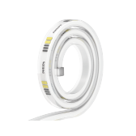</td>
      <td>Philips ZhiYi strip</td>
      <td>Zhiyi Light Strip</td>
      <td>philips.light.zystrip</td>
      <td></td>
    </tr>
    <tr>
      <th>1443</th>
      <td></td>
      <td>Smart Light Strip</td>
      <td>LifeSmart Symphony Light Strip uses LED lamp beads, has 16 million colors, and supports dynamic gradient effects.It can also be linked with other equipment, timed switches, and trigger various actions according to the environment and human actions, such as automatically turning on when dark, and automatically turning on when someone passes by.</td>
      <td>lfsmt.light.ls065</td>
      <td></td>
    </tr>
    <tr>
      <th>1444</th>
      <td></td>
      <td>Yeelight Lightstrip</td>
      <td>Yeelight light strip</td>
      <td>yeelink.light.strip1</td>
      <td>YLDD01YL/YLDD02YL</td>
    </tr>
    <tr>
      <th>1445</th>
      <td></td>
      <td>Yeelight Lightstrip Plus</td>
      <td>Pitaya Plus</td>
      <td>yeelink.light.strip2</td>
      <td></td>
    </tr>
    <tr>
      <th>1446</th>
      <td></td>
      <td>Yeelight Willow LED Lightstrip</td>
      <td>Cane</td>
      <td>yeelink.light.strip4</td>
      <td></td>
    </tr>
    <tr>
      <th>1447</th>
      <td></td>
      <td>rgbLight</td>
      <td>1. Control switch 2. Adjust the brightness 3. Adjust the color</td>
      <td>kongke.light.rgb</td>
      <td></td>
    </tr>
  </tbody>
</table>

## Motion sensor
<table border="1" class="dataframe">
  <thead>
    <tr style="text-align: right;">
      <th></th>
      <th>Pic</th>
      <th>Name</th>
      <th>Description</th>
      <th>Model</th>
      <th>Product Number</th>
    </tr>
  </thead>
  <tbody>
    <tr>
      <th>1448</th>
      <td></td>
      <td>Aqara High Precision Motion Sensor</td>
      <td>Human body illuminance sensor, which can detect infrared signal changes and collect illuminance</td>
      <td>lumi.motion.agl04</td>
      <td>RTCGQ13LM</td>
    </tr>
    <tr>
      <th>1449</th>
      <td></td>
      <td>Aqara Motion Sensor</td>
      <td>Human body illuminance sensor, which can detect infrared signal changes and collect illuminance</td>
      <td>lumi.sensor_motion.aq2</td>
      <td>RTCGQ11LM</td>
    </tr>
    <tr>
      <th>1450</th>
      <td></td>
      <td>Aqara Motion Sensor T1</td>
      <td>Human body illuminance sensor, which can detect infrared signal changes and collect illuminance</td>
      <td>lumi.motion.agl02</td>
      <td>RTCGQ12LM</td>
    </tr>
    <tr>
      <th>1451</th>
      <td></td>
      <td>Aqara Vibration Sensor</td>
      <td>Identify vibration</td>
      <td>lumi.vibration.aq1</td>
      <td>DJT11LM</td>
    </tr>
    <tr>
      <th>1452</th>
      <td></td>
      <td>Body sensor</td>
      <td>Human sensor</td>
      <td>lumi.sensor_motion.v1</td>
      <td></td>
    </tr>
    <tr>
      <th>1453</th>
      <td></td>
      <td>Human body movement sensor in the future</td>
      <td>Wired connection</td>
      <td>bymiot.motion.v1</td>
      <td></td>
    </tr>
    <tr>
      <th>1454</th>
      <td></td>
      <td>Human body sensor</td>
      <td></td>
      <td>cchome.motion.v1</td>
      <td></td>
    </tr>
    <tr>
      <th>1455</th>
      <td></td>
      <td>Mi Motion Sensor</td>
      <td>Human body sensor 2</td>
      <td>lumi.sensor_motion.v2</td>
      <td>RTCGQ01LM</td>
    </tr>
    <tr>
      <th>1456</th>
      <td></td>
      <td>Mi Motion Sensor 2</td>
      <td>Mi Human Sensor 2 uses passive infrared sensors to display the activities of people or pets at home by sensing the movement of the heat source, and can be linked with other smart devices.</td>
      <td>lumi.motion.bmgl01</td>
      <td>RTCGQ02LM</td>
    </tr>
    <tr>
      <th>1457</th>
      <td></td>
      <td>Qingping Motion & Ambient Light Sensor</td>
      <td>Mi Human Sensor 2 uses passive infrared sensors to display the activities of people or pets at home by sensing the movement of the heat source, and can be linked with other smart devices.</td>
      <td>cgllc.motion.cgpr1</td>
      <td></td>
    </tr>
  </tbody>
</table>

## Motorized curtain
<table border="1" class="dataframe">
  <thead>
    <tr style="text-align: right;">
      <th></th>
      <th>Pic</th>
      <th>Name</th>
      <th>Description</th>
      <th>Model</th>
      <th>Product Number</th>
    </tr>
  </thead>
  <tbody>
    <tr>
      <th>1458</th>
      <td></td>
      <td>1 position curtain switch</td>
      <td>E3 1 position curtain switch</td>
      <td>simon.curtain.e1cur</td>
      <td></td>
    </tr>
    <tr>
      <th>1459</th>
      <td></td>
      <td>1 position curtain switch</td>
      <td>I7 1 position curtain switch</td>
      <td>simon.curtain.i1cur</td>
      <td></td>
    </tr>
    <tr>
      <th>1460</th>
      <td></td>
      <td>2-position curtain switch</td>
      <td>E3 2 position curtain switch</td>
      <td>simon.curtain.e2cur</td>
      <td></td>
    </tr>
    <tr>
      <th>1461</th>
      <td></td>
      <td>2-position curtain switch</td>
      <td>I7 2 position curtain switch</td>
      <td>simon.curtain.i2cur</td>
      <td></td>
    </tr>
    <tr>
      <th>1462</th>
      <td></td>
      <td>A-OK Curtain Controller</td>
      <td></td>
      <td>666.curtain.em75</td>
      <td></td>
    </tr>
    <tr>
      <th>1463</th>
      <td></td>
      <td>AI_CURTAIN</td>
      <td>Juyi Smart Curtain</td>
      <td>syniot.curtain.syc11</td>
      <td></td>
    </tr>
    <tr>
      <th>1464</th>
      <td></td>
      <td>AOK AM50 intelligence curtain</td>
      <td>Dual mode</td>
      <td>aok98.curtain.am50pw</td>
      <td></td>
    </tr>
    <tr>
      <th>1465</th>
      <td></td>
      <td>AOK AM68 Smart Curtain</td>
      <td>Dual mode</td>
      <td>aok98.curtain.aok68</td>
      <td></td>
    </tr>
    <tr>
      <th>1466</th>
      <td></td>
      <td>AOK LM100 intelligence curtain</td>
      <td>Dual mode</td>
      <td>aok98.curtain.aok100</td>
      <td></td>
    </tr>
    <tr>
      <th>1467</th>
      <td></td>
      <td>AUTORAIL Curtain Motor (WIFI)</td>
      <td></td>
      <td>babai.curtain.at5810</td>
      <td></td>
    </tr>
    <tr>
      <th>1468</th>
      <td></td>
      <td>AllCenter Curtain Series</td>
      <td>AllCenter Smart Curtain Series</td>
      <td>umiot.curtain.curt</td>
      <td></td>
    </tr>
    <tr>
      <th>1469</th>
      <td></td>
      <td>Aqara Curtain Controller A1</td>
      <td>Aqara Smart Curtain Motor A1 is a Wi-Fi version of smart curtain motor (opening and closing curtain version). This is a device that can realize the intelligentization of traditional opening and closing curtains. It uses Wi-Fi + Bluetooth wireless communication mode to connectAccess to the MIoT, AIoT, and HomeKit platforms can be controlled through the app and intelligently linked with other smart devices connected to these three platforms. The brand is Lumis own brand "Aqara", which is sold as a single product.Equipped with BLE remote control for local control.</td>
      <td>lumi.curtain.hagl08</td>
      <td>ZNCLDJ21LM</td>
    </tr>
    <tr>
      <th>1470</th>
      <td></td>
      <td>Aqara Curtain Controller B1</td>
      <td>The smart curtain motor (opening and closing curtain) that conforms to the Zigbee HA1.2 protocol can be powered by a power adapter or a lithium battery.Realize functions such as remote control, timed opening and closing of curtains, and intelligent linkage of multiple devices.</td>
      <td>lumi.curtain.hagl04</td>
      <td>ZNCLDJ12LM</td>
    </tr>
    <tr>
      <th>1471</th>
      <td></td>
      <td>Aqara Roller Shade Controller</td>
      <td>Aqara smart roller blind, supports rolling up the curtain</td>
      <td>lumi.curtain.aq2</td>
      <td>ZNCLDJ11LM/ZNGZDJ11LM</td>
    </tr>
    <tr>
      <th>1472</th>
      <td></td>
      <td>Automatic opening and closing curtain CS06</td>
      <td></td>
      <td>lxk.curtain.cs06</td>
      <td></td>
    </tr>
    <tr>
      <th>1473</th>
      <td></td>
      <td>BINTHEN Smart Curtain</td>
      <td></td>
      <td>binthe.curtain.bcm</td>
      <td></td>
    </tr>
    <tr>
      <th>1474</th>
      <td></td>
      <td>Babuy Smart Curtain</td>
      <td></td>
      <td>babai.curtain.bb82mj</td>
      <td></td>
    </tr>
    <tr>
      <th>1475</th>
      <td></td>
      <td>Bit curtain motor controller</td>
      <td></td>
      <td>btzn.curtain.v1</td>
      <td></td>
    </tr>
    <tr>
      <th>1476</th>
      <td></td>
      <td>Cloud access curtain</td>
      <td>Cloud access universal curtain</td>
      <td>ezhome.curtain.yy0004</td>
      <td></td>
    </tr>
    <tr>
      <th>1477</th>
      <td></td>
      <td>Cloud access curtain</td>
      <td>Cloud access curtain</td>
      <td>ezhome.curtain.yy0005</td>
      <td></td>
    </tr>
    <tr>
      <th>1478</th>
      <td></td>
      <td>Cloud intelligent electric curtain</td>
      <td></td>
      <td>nbym.curtain.yznv1</td>
      <td></td>
    </tr>
    <tr>
      <th>1479</th>
      <td></td>
      <td>Curtain</td>
      <td>curtain</td>
      <td>ezhome.curtain.zhyapp04</td>
      <td></td>
    </tr>
    <tr>
      <th>1480</th>
      <td></td>
      <td>Curtain</td>
      <td>Curtain motor/curtain controller</td>
      <td>tuya.curtain.tycur02</td>
      <td></td>
    </tr>
    <tr>
      <th>1481</th>
      <td></td>
      <td>Curtain motor</td>
      <td></td>
      <td>bright.curtain.curtai</td>
      <td></td>
    </tr>
    <tr>
      <th>1482</th>
      <td></td>
      <td>Curtain motor</td>
      <td>Smart curtain motor</td>
      <td>bzhome.curtain.sz050</td>
      <td></td>
    </tr>
    <tr>
      <th>1483</th>
      <td></td>
      <td>Curtain motor</td>
      <td></td>
      <td>creiot.curtain.cldj</td>
      <td></td>
    </tr>
    <tr>
      <th>1484</th>
      <td></td>
      <td>Curtain motor</td>
      <td></td>
      <td>ghome.curtain.sf004</td>
      <td></td>
    </tr>
    <tr>
      <th>1485</th>
      <td></td>
      <td>Curtain motor</td>
      <td></td>
      <td>huazhu.curtain.v2</td>
      <td></td>
    </tr>
    <tr>
      <th>1486</th>
      <td></td>
      <td>Curtain motor</td>
      <td></td>
      <td>kiwik.curtain.kaw</td>
      <td></td>
    </tr>
    <tr>
      <th>1487</th>
      <td></td>
      <td>Curtain motor</td>
      <td>Curtain motor</td>
      <td>kuju.curtain.6</td>
      <td></td>
    </tr>
    <tr>
      <th>1488</th>
      <td></td>
      <td>Curtain motor</td>
      <td>Smart curtain motor</td>
      <td>lxk.curtain.dj01w</td>
      <td></td>
    </tr>
    <tr>
      <th>1489</th>
      <td>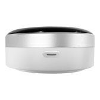</td>
      <td>Curtain motor RF version</td>
      <td>Curtain motor, using radio frequency control, needs to be equipped with a transponder</td>
      <td>xqh.curtain.r13011</td>
      <td></td>
    </tr>
    <tr>
      <th>1490</th>
      <td></td>
      <td>Curtain motor Wi-Fi version</td>
      <td></td>
      <td>xqh.curtain.a26211</td>
      <td></td>
    </tr>
    <tr>
      <th>1491</th>
      <td></td>
      <td>Curtain motor Zigbee version</td>
      <td></td>
      <td>xqh.curtain.a20311</td>
      <td></td>
    </tr>
    <tr>
      <th>1492</th>
      <td></td>
      <td>Curtain panel</td>
      <td>Single way curtain control panel</td>
      <td>lxk.curtain.clmb</td>
      <td></td>
    </tr>
    <tr>
      <th>1493</th>
      <td></td>
      <td>DT82TN/S</td>
      <td></td>
      <td>dooya.curtain.w1578</td>
      <td></td>
    </tr>
    <tr>
      <th>1494</th>
      <td></td>
      <td>Difeis D1 Motor</td>
      <td></td>
      <td>difeis.curtain.d1</td>
      <td></td>
    </tr>
    <tr>
      <th>1495</th>
      <td></td>
      <td>Dooya Curtain</td>
      <td></td>
      <td>dooya.curtain.m2</td>
      <td></td>
    </tr>
    <tr>
      <th>1496</th>
      <td></td>
      <td>DooyaCurtainController</td>
      <td>A smart roller shutter controller that can connect ordinary roller shutters to Mijia APP</td>
      <td>dooya.curtain.c1</td>
      <td></td>
    </tr>
    <tr>
      <th>1497</th>
      <td></td>
      <td>DooyaSmartCurtain</td>
      <td>A smart motor that can be controlled by the Mijia app and Xiao Ai</td>
      <td>dooya.curtain.m1</td>
      <td></td>
    </tr>
    <tr>
      <th>1498</th>
      <td></td>
      <td>Electric curtain track suit</td>
      <td></td>
      <td>ohh.curtain.ct01</td>
      <td></td>
    </tr>
    <tr>
      <th>1499</th>
      <td></td>
      <td>Future home electric curtain</td>
      <td>Wired connection</td>
      <td>bymiot.curtain.v2</td>
      <td></td>
    </tr>
    <tr>
      <th>1500</th>
      <td></td>
      <td>GMIRI Curtain GT30TV/P</td>
      <td>Live on January 26, 2021</td>
      <td>gmrii.curtain.gt30</td>
      <td></td>
    </tr>
    <tr>
      <th>1501</th>
      <td></td>
      <td>Genwits Smart Curtain</td>
      <td></td>
      <td>666.curtain.gt01m</td>
      <td></td>
    </tr>
    <tr>
      <th>1502</th>
      <td></td>
      <td>Good wife smart curtain</td>
      <td></td>
      <td>hotata.curtain.kc15</td>
      <td></td>
    </tr>
    <tr>
      <th>1503</th>
      <td></td>
      <td>Haobo window pusher</td>
      <td></td>
      <td>aqara.wopener.hocn01</td>
      <td></td>
    </tr>
    <tr>
      <th>1504</th>
      <td></td>
      <td>IMILAB Smart Curtain Motor Bluetooth Gateway L1</td>
      <td>Xiaobai Smart Curtain Motor Bluetooth Gateway Version L1</td>
      <td>chuangmi.curtain.h209</td>
      <td></td>
    </tr>
    <tr>
      <th>1505</th>
      <td></td>
      <td>Intelligent Electric Curtain Motor (Open and Close Curtain)</td>
      <td></td>
      <td>zhijia.curtain.mckhl101</td>
      <td></td>
    </tr>
    <tr>
      <th>1506</th>
      <td></td>
      <td>KCZ intelligent curtain motor</td>
      <td>Kechuang smart curtain motor.</td>
      <td>090615.curtain.kcz82d</td>
      <td></td>
    </tr>
    <tr>
      <th>1507</th>
      <td></td>
      <td>KH Curtain</td>
      <td>Through the mobile phone APP or with smart speakers, you can voice control home appliances.Cloud massive infrared code library, one-key pairing of home appliances.You can set the channel in the APP, and then you can control the channel by voice.No matter on the street, the company can use mobile phones to remotely control home appliances.</td>
      <td>693948.curtain.khcl</td>
      <td></td>
    </tr>
    <tr>
      <th>1508</th>
      <td></td>
      <td>KYX Smart Curtain</td>
      <td></td>
      <td>babai.curtain.kyx850</td>
      <td></td>
    </tr>
    <tr>
      <th>1509</th>
      <td></td>
      <td>Linptech Smart Curtain</td>
      <td></td>
      <td>linp.curtain.lpc1</td>
      <td></td>
    </tr>
    <tr>
      <th>1510</th>
      <td></td>
      <td>MEEHE Intelligent curtain motor</td>
      <td>Miha Smart Curtain Motor.</td>
      <td>090615.curtain.mehe82</td>
      <td></td>
    </tr>
    <tr>
      <th>1511</th>
      <td></td>
      <td>MEEYA intelligent curtain</td>
      <td>Miya smart curtain motor, controlled by Mijia APP, voice controlled by Xiao Ai.</td>
      <td>090615.curtain.mt800w</td>
      <td></td>
    </tr>
    <tr>
      <th>1512</th>
      <td></td>
      <td>MR.BOND Smart Curtain</td>
      <td></td>
      <td>mrbond.curtain.rac03</td>
      <td></td>
    </tr>
    <tr>
      <th>1513</th>
      <td></td>
      <td>MTX Smart Curtain</td>
      <td></td>
      <td>babai.curtain.mtx850</td>
      <td></td>
    </tr>
    <tr>
      <th>1514</th>
      <td></td>
      <td>Monorail curtain panel</td>
      <td></td>
      <td>creiot.curtain.clmb</td>
      <td></td>
    </tr>
    <tr>
      <th>1515</th>
      <td></td>
      <td>Motor curtain</td>
      <td></td>
      <td>milamp.curtain.djcl</td>
      <td></td>
    </tr>
    <tr>
      <th>1516</th>
      <td></td>
      <td>NanHoo Smart Curtain</td>
      <td></td>
      <td>babai.curtain.nh5810</td>
      <td></td>
    </tr>
    <tr>
      <th>1517</th>
      <td></td>
      <td>One meter intelligent curtain</td>
      <td>One meter future smart curtain motor, Xiaoai voice control.</td>
      <td>090615.curtain.1mcu01</td>
      <td></td>
    </tr>
    <tr>
      <th>1518</th>
      <td></td>
      <td>Ordinary curtains</td>
      <td></td>
      <td>juzi.curtain.401011</td>
      <td></td>
    </tr>
    <tr>
      <th>1519</th>
      <td></td>
      <td>PTX Intelligent Curtain Switch</td>
      <td>Flat-headed bear smart curtain switch, Mijia APP control, smart scene control!</td>
      <td>090615.curtain.p01</td>
      <td></td>
    </tr>
    <tr>
      <th>1520</th>
      <td></td>
      <td>PTX Rolling curtain</td>
      <td>Flat-headed bear smart roller shutter motor, Xiaoai voice control, Mijia APP remote control.</td>
      <td>090615.curtain.jldj03</td>
      <td></td>
    </tr>
    <tr>
      <th>1521</th>
      <td></td>
      <td>PTX intelligent curtain motor</td>
      <td>PTX smart curtain motor, Xiaoai voice control!</td>
      <td>090615.curtain.ptx82</td>
      <td></td>
    </tr>
    <tr>
      <th>1522</th>
      <td></td>
      <td>PTX mechanical roller motor</td>
      <td>Mechanical intelligent roller shutter motor, mechanical stroke, controlled by Mijia APP.</td>
      <td>090615.curtain.jxdj02</td>
      <td></td>
    </tr>
    <tr>
      <th>1523</th>
      <td></td>
      <td>Pipa intelligent curtain motor</td>
      <td>Crackling Smart Curtain Motor</td>
      <td>090615.curtain.pipacr</td>
      <td></td>
    </tr>
    <tr>
      <th>1524</th>
      <td></td>
      <td>Qiyuan curtain motor</td>
      <td></td>
      <td>qykj.curtain.qycm60</td>
      <td></td>
    </tr>
    <tr>
      <th>1525</th>
      <td></td>
      <td>SUMI intelligent curtain motor</td>
      <td>Sumi smart curtain motor.</td>
      <td>090615.curtain.sumi82</td>
      <td></td>
    </tr>
    <tr>
      <th>1526</th>
      <td></td>
      <td>Scene Curtain WIFI X</td>
      <td></td>
      <td>leshi.curtain.v0001</td>
      <td></td>
    </tr>
    <tr>
      <th>1527</th>
      <td></td>
      <td>Smart Curtain Control</td>
      <td>Curtain drive module based on KNX/EIB</td>
      <td>knx.curtain.ktexxc</td>
      <td></td>
    </tr>
    <tr>
      <th>1528</th>
      <td></td>
      <td>Smart Curtain Motor</td>
      <td></td>
      <td>666.curtain.gt01</td>
      <td></td>
    </tr>
    <tr>
      <th>1529</th>
      <td></td>
      <td>Smart Curtain Motor</td>
      <td>Guangzhou Changming Electromechanical Co., Ltd., Changming</td>
      <td>babai.curtain.190812</td>
      <td></td>
    </tr>
    <tr>
      <th>1530</th>
      <td></td>
      <td>Smart Module for Electric Curtain</td>
      <td>The intelligent connector of the electric curtain is connected to the curtain to control the opening, closing and pause function of the curtain.</td>
      <td>881878.curtain.clznljq</td>
      <td></td>
    </tr>
    <tr>
      <th>1531</th>
      <td></td>
      <td>Smart casement curtain motor</td>
      <td>Smart casement curtain motor</td>
      <td>arnoo.curtain.awcc10</td>
      <td></td>
    </tr>
    <tr>
      <th>1532</th>
      <td></td>
      <td>Smart casement curtain motor</td>
      <td>Smart casement curtain motor (in use)</td>
      <td>arnoo.curtain.awcc11</td>
      <td></td>
    </tr>
    <tr>
      <th>1533</th>
      <td></td>
      <td>Smart curtain</td>
      <td></td>
      <td>alive.curtain.cmd82</td>
      <td></td>
    </tr>
    <tr>
      <th>1534</th>
      <td></td>
      <td>Smart curtain</td>
      <td></td>
      <td>bull.curtain.cw11</td>
      <td></td>
    </tr>
    <tr>
      <th>1535</th>
      <td></td>
      <td>Smart curtain</td>
      <td></td>
      <td>ddwl.curtain.050001</td>
      <td></td>
    </tr>
    <tr>
      <th>1536</th>
      <td></td>
      <td>Smart curtain</td>
      <td></td>
      <td>etlink.curtain.cur001</td>
      <td></td>
    </tr>
    <tr>
      <th>1537</th>
      <td></td>
      <td>Smart curtain</td>
      <td></td>
      <td>linked.curtain.ct500</td>
      <td></td>
    </tr>
    <tr>
      <th>1538</th>
      <td></td>
      <td>Smart curtain</td>
      <td></td>
      <td>lwkj.curtain.2a10</td>
      <td></td>
    </tr>
    <tr>
      <th>1539</th>
      <td></td>
      <td>Smart curtain</td>
      <td>Voice access, brands become smart in seconds</td>
      <td>mbzn.curtain.m20051</td>
      <td></td>
    </tr>
    <tr>
      <th>1540</th>
      <td></td>
      <td>Smart curtain</td>
      <td></td>
      <td>mpkx.curtain.050001</td>
      <td></td>
    </tr>
    <tr>
      <th>1541</th>
      <td></td>
      <td>Smart curtain</td>
      <td></td>
      <td>nvcls.curtain.050001</td>
      <td></td>
    </tr>
    <tr>
      <th>1542</th>
      <td></td>
      <td>Smart curtain</td>
      <td></td>
      <td>scinan.curtain.mc01</td>
      <td></td>
    </tr>
    <tr>
      <th>1543</th>
      <td></td>
      <td>Smart curtain</td>
      <td></td>
      <td>sykj.curtain.050001</td>
      <td></td>
    </tr>
    <tr>
      <th>1544</th>
      <td></td>
      <td>Smart curtain</td>
      <td></td>
      <td>szsy.curtain.050001</td>
      <td></td>
    </tr>
    <tr>
      <th>1545</th>
      <td></td>
      <td>Smart curtain</td>
      <td>Smart curtain</td>
      <td>tbsy.curtain.123</td>
      <td></td>
    </tr>
    <tr>
      <th>1546</th>
      <td></td>
      <td>Smart curtain</td>
      <td></td>
      <td>thing.curtain.smart1</td>
      <td></td>
    </tr>
    <tr>
      <th>1547</th>
      <td></td>
      <td>Smart curtain</td>
      <td>Smart curtain supports opening and closing</td>
      <td>yszj.curtain.2a10</td>
      <td></td>
    </tr>
    <tr>
      <th>1548</th>
      <td></td>
      <td>Smart curtain</td>
      <td></td>
      <td>yuerzj.curtain.cm01</td>
      <td></td>
    </tr>
    <tr>
      <th>1549</th>
      <td></td>
      <td>Smart curtain controller</td>
      <td></td>
      <td>aiicn.curtain.r51</td>
      <td></td>
    </tr>
    <tr>
      <th>1550</th>
      <td></td>
      <td>Smart curtain controller</td>
      <td>Curtain motor</td>
      <td>hsmart.curtain.hs2cc</td>
      <td></td>
    </tr>
    <tr>
      <th>1551</th>
      <td></td>
      <td>Smart curtain motor</td>
      <td>Smart curtain motor</td>
      <td>ldsn.curtain.awcc10</td>
      <td></td>
    </tr>
    <tr>
      <th>1552</th>
      <td></td>
      <td>Smart curtain motor (Zigbee opening and closing curtain version)</td>
      <td></td>
      <td>lumi.curtain.es1</td>
      <td></td>
    </tr>
    <tr>
      <th>1553</th>
      <td></td>
      <td>Smart curtain motor B1S</td>
      <td></td>
      <td>lumi.curtain.hagl06</td>
      <td></td>
    </tr>
    <tr>
      <th>1554</th>
      <td></td>
      <td>Smart curtain motor C2</td>
      <td></td>
      <td>lumi.curtain.hagl07</td>
      <td></td>
    </tr>
    <tr>
      <th>1555</th>
      <td></td>
      <td>Smart tubular motor T1</td>
      <td></td>
      <td>lumi.curtain.vagl02</td>
      <td></td>
    </tr>
    <tr>
      <th>1556</th>
      <td></td>
      <td>Smart window pusher</td>
      <td>Embedded zigbee standard protocol module, ultra-low power consumption, ultra-long standby, and high stability.Support three-gear speed regulation, electronic memory limit, automatic hand stroke and other functions.Intelligent equipment scene linkage, and can be opened and closed regularly according to the use scene.</td>
      <td>feibit.curtain.tzt2118w</td>
      <td></td>
    </tr>
    <tr>
      <th>1557</th>
      <td></td>
      <td>SmartCC</td>
      <td></td>
      <td>heiman.curtain.hs2cc</td>
      <td></td>
    </tr>
    <tr>
      <th>1558</th>
      <td></td>
      <td>SmartJoy Intelligent curtain motor (WiFi Pro)</td>
      <td>SmartJoy Smart Curtain Motor (WiFi Upgraded Version)</td>
      <td>smartj.curtain.sjd82p</td>
      <td></td>
    </tr>
    <tr>
      <th>1559</th>
      <td></td>
      <td>SmartJoy intelligent curtain motor</td>
      <td>SmartJoy Smart Curtain Motor (WiFi version)</td>
      <td>smartj.curtain.sjdt82</td>
      <td></td>
    </tr>
    <tr>
      <th>1560</th>
      <td></td>
      <td>Viomi Internet curtain motor (Wi-Fi)</td>
      <td>Viomi Internet curtain motor (Wi-Fi)</td>
      <td>viomi.curtain.v1</td>
      <td></td>
    </tr>
    <tr>
      <th>1561</th>
      <td></td>
      <td>WDS Intelligent motor curtain</td>
      <td>Weishida smart curtain motor, Xiaoai voice control!</td>
      <td>090615.curtain.ws9856</td>
      <td></td>
    </tr>
    <tr>
      <th>1562</th>
      <td></td>
      <td>WSERD Smart roller shutter motor</td>
      <td>Weishida smart roller shutter motor, Xiaoai voice control</td>
      <td>090615.curtain.wsjl01</td>
      <td></td>
    </tr>
    <tr>
      <th>1563</th>
      <td></td>
      <td>Weilian Xiaozhi-Curtain</td>
      <td>Curtain control</td>
      <td>sig.curtain.welink</td>
      <td></td>
    </tr>
    <tr>
      <th>1564</th>
      <td></td>
      <td>WinTom Curtain</td>
      <td>Chuangming smart curtains, one-key sunlight control!</td>
      <td>wintom.curtain.230xm</td>
      <td></td>
    </tr>
    <tr>
      <th>1565</th>
      <td></td>
      <td>Xiaohui curtains</td>
      <td>Strong electric curtain</td>
      <td>maxway.curtain.c02</td>
      <td></td>
    </tr>
    <tr>
      <th>1566</th>
      <td></td>
      <td>Xiaomiyoupin Curtain Controller (Wi-Fi)</td>
      <td>Lumi customized a WiFi version of the smart curtain motor (opening and closing curtain version) for Youpin. This is a device that can realize the intelligentization of traditional opening and closing curtains.The app is used for control and intelligent linkage with other smart devices connected to Mijia. The brand is "Xiaomi Youpin".</td>
      <td>lumi.curtain.hagl05</td>
      <td>ZNCLDJ21LM</td>
    </tr>
    <tr>
      <th>1567</th>
      <td></td>
      <td>Xiaoyan curtain motor</td>
      <td></td>
      <td>terncy.curtain.tcm01</td>
      <td></td>
    </tr>
    <tr>
      <th>1568</th>
      <td></td>
      <td>Xiaoyan curtain motor</td>
      <td></td>
      <td>terncy.curtain.tcm02</td>
      <td></td>
    </tr>
    <tr>
      <th>1569</th>
      <td></td>
      <td>YS Roller Motor</td>
      <td></td>
      <td>babai.curtain.ym25e</td>
      <td></td>
    </tr>
    <tr>
      <th>1570</th>
      <td></td>
      <td>Yeelight Smart Curtain Controller</td>
      <td></td>
      <td>yeelink.curtain.ctmt1</td>
      <td></td>
    </tr>
    <tr>
      <th>1571</th>
      <td></td>
      <td>Yihuijia Smart Curtain</td>
      <td>Yihuijia Smart Curtain</td>
      <td>evecca.curtain.cl001a</td>
      <td></td>
    </tr>
    <tr>
      <th>1572</th>
      <td></td>
      <td>Yilai curtain motor</td>
      <td></td>
      <td>yeelink.curtain.procm1</td>
      <td></td>
    </tr>
    <tr>
      <th>1573</th>
      <td></td>
      <td>ZS intelligent curtain motor</td>
      <td>Zhishang smart motor, Xiaoai voice control, remote control</td>
      <td>090615.curtain.zsdj82</td>
      <td></td>
    </tr>
    <tr>
      <th>1574</th>
      <td></td>
      <td>ZS roller shutter motor</td>
      <td>Zhishang roller shutter motor, Xiaoai voice control, Mijia APP remote control.</td>
      <td>090615.curtain.zsdj35</td>
      <td></td>
    </tr>
    <tr>
      <th>1575</th>
      <td></td>
      <td>Zemismart smart curtain motor</td>
      <td></td>
      <td>babai.curtain.m515e</td>
      <td></td>
    </tr>
    <tr>
      <th>1576</th>
      <td></td>
      <td>allCurtain</td>
      <td>Suitable for two-way curtain motor control panel (hanger and curtain), smart opening and closing curtain, smart roller blind</td>
      <td>uiot.curtain.allcurtain</td>
      <td></td>
    </tr>
    <tr>
      <th>1577</th>
      <td></td>
      <td>curtain</td>
      <td>curtain</td>
      <td>cgzn.curtain.curtain</td>
      <td></td>
    </tr>
    <tr>
      <th>1578</th>
      <td></td>
      <td>curtain</td>
      <td>General curtain equipment</td>
      <td>dctrls.curtain.common</td>
      <td></td>
    </tr>
    <tr>
      <th>1579</th>
      <td></td>
      <td>curtain</td>
      <td></td>
      <td>deocea.curtain.cq</td>
      <td></td>
    </tr>
    <tr>
      <th>1580</th>
      <td></td>
      <td>curtain</td>
      <td></td>
      <td>dnake.curtain.cur</td>
      <td></td>
    </tr>
    <tr>
      <th>1581</th>
      <td></td>
      <td>curtain</td>
      <td>Curtain motor</td>
      <td>ecloud.curtain.eq</td>
      <td></td>
    </tr>
    <tr>
      <th>1582</th>
      <td></td>
      <td>curtain</td>
      <td></td>
      <td>eide.curtain.curtai</td>
      <td></td>
    </tr>
    <tr>
      <th>1583</th>
      <td></td>
      <td>curtain</td>
      <td></td>
      <td>fine.curtain.fv</td>
      <td></td>
    </tr>
    <tr>
      <th>1584</th>
      <td></td>
      <td>curtain</td>
      <td></td>
      <td>future.curtain.acm</td>
      <td></td>
    </tr>
    <tr>
      <th>1585</th>
      <td></td>
      <td>curtain</td>
      <td>Smart curtain motor</td>
      <td>golden.curtain.c01</td>
      <td></td>
    </tr>
    <tr>
      <th>1586</th>
      <td></td>
      <td>curtain</td>
      <td></td>
      <td>hbkj1.curtain.v1</td>
      <td></td>
    </tr>
    <tr>
      <th>1587</th>
      <td></td>
      <td>curtain</td>
      <td>curtain</td>
      <td>hosjoy.curtain.hcl</td>
      <td></td>
    </tr>
    <tr>
      <th>1588</th>
      <td></td>
      <td>curtain</td>
      <td>No certification trademark required</td>
      <td>ihome.curtain.escc</td>
      <td></td>
    </tr>
    <tr>
      <th>1589</th>
      <td></td>
      <td>curtain</td>
      <td></td>
      <td>jusval.curtain.1</td>
      <td></td>
    </tr>
    <tr>
      <th>1590</th>
      <td></td>
      <td>curtain</td>
      <td>Obsolete</td>
      <td>juzi.curtain.040101</td>
      <td></td>
    </tr>
    <tr>
      <th>1591</th>
      <td></td>
      <td>curtain</td>
      <td></td>
      <td>jyx.curtain.020201</td>
      <td></td>
    </tr>
    <tr>
      <th>1592</th>
      <td></td>
      <td>curtain</td>
      <td>Dua Curtain</td>
      <td>landib.curtain.ads</td>
      <td></td>
    </tr>
    <tr>
      <th>1593</th>
      <td></td>
      <td>curtain</td>
      <td>use</td>
      <td>mjj.curtain.mode2</td>
      <td></td>
    </tr>
    <tr>
      <th>1594</th>
      <td></td>
      <td>curtain</td>
      <td></td>
      <td>mkzn.curtain.cl</td>
      <td></td>
    </tr>
    <tr>
      <th>1595</th>
      <td></td>
      <td>curtain</td>
      <td>Control the curtain stroke</td>
      <td>pair.curtain.1</td>
      <td></td>
    </tr>
    <tr>
      <th>1596</th>
      <td></td>
      <td>curtain</td>
      <td></td>
      <td>srkj.curtain.cl01</td>
      <td></td>
    </tr>
    <tr>
      <th>1597</th>
      <td></td>
      <td>curtain</td>
      <td>curtain</td>
      <td>tc0756.curtain.10</td>
      <td></td>
    </tr>
    <tr>
      <th>1598</th>
      <td></td>
      <td>curtain</td>
      <td>Curtain motor/curtain controller</td>
      <td>tuya.curtain.tycur01</td>
      <td></td>
    </tr>
    <tr>
      <th>1599</th>
      <td></td>
      <td>curtain</td>
      <td></td>
      <td>tyzhjt.curtain.cl0001</td>
      <td></td>
    </tr>
    <tr>
      <th>1600</th>
      <td></td>
      <td>curtain</td>
      <td></td>
      <td>wlank.curtain.001</td>
      <td></td>
    </tr>
    <tr>
      <th>1601</th>
      <td></td>
      <td>curtain</td>
      <td></td>
      <td>xinrui.curtain.lh001</td>
      <td></td>
    </tr>
    <tr>
      <th>1602</th>
      <td></td>
      <td>curtain</td>
      <td>curtain</td>
      <td>xzh.curtain.curt</td>
      <td></td>
    </tr>
    <tr>
      <th>1603</th>
      <td></td>
      <td>curtain</td>
      <td>curtain</td>
      <td>yongqi.curtain.curt</td>
      <td></td>
    </tr>
    <tr>
      <th>1604</th>
      <td></td>
      <td>curtain</td>
      <td></td>
      <td>yonsz.curtain.0</td>
      <td></td>
    </tr>
    <tr>
      <th>1605</th>
      <td></td>
      <td>curtain</td>
      <td></td>
      <td>yonsz.curtain.1</td>
      <td></td>
    </tr>
    <tr>
      <th>1606</th>
      <td></td>
      <td>curtain</td>
      <td>Electric curtain</td>
      <td>zhihw.curtain.uiid11</td>
      <td></td>
    </tr>
    <tr>
      <th>1607</th>
      <td></td>
      <td>curtain</td>
      <td></td>
      <td>zhimai.curtain.zm005</td>
      <td></td>
    </tr>
    <tr>
      <th>1608</th>
      <td></td>
      <td>cutain</td>
      <td>Yiweilian Electric Curtain</td>
      <td>coolki.curtain.uiid11</td>
      <td></td>
    </tr>
    <tr>
      <th>1609</th>
      <td></td>
      <td>dooya</td>
      <td>Smart curtains can control the progress of the journey</td>
      <td>kongke.curtain.dooya</td>
      <td></td>
    </tr>
    <tr>
      <th>1610</th>
      <td></td>
      <td>motor control</td>
      <td>Garage doors, rolling doors</td>
      <td>anlin.curtain.1</td>
      <td></td>
    </tr>
    <tr>
      <th>1611</th>
      <td></td>
      <td>motor control</td>
      <td>Garage doors, rolling doors</td>
      <td>zhuyun.curtain.1</td>
      <td></td>
    </tr>
    <tr>
      <th>1612</th>
      <td></td>
      <td>qinglinkQ302 Smart Curtain</td>
      <td>Qingling customized AM50 motor</td>
      <td>aok98.curtain.qlam50</td>
      <td></td>
    </tr>
    <tr>
      <th>1613</th>
      <td></td>
      <td>smart plus curtain</td>
      <td>The fourth generation curtain</td>
      <td>zhu123.curtain.v3</td>
      <td></td>
    </tr>
    <tr>
      <th>1614</th>
      <td></td>
      <td>smartplus</td>
      <td>Well-known foreign brand smart plus</td>
      <td>zhu123.curtain.curtain1</td>
      <td></td>
    </tr>
    <tr>
      <th>1615</th>
      <td></td>
      <td>synIOT rolling motor</td>
      <td>Electric roller shutter controller</td>
      <td>syniot.curtain.m1</td>
      <td></td>
    </tr>
  </tbody>
</table>

## Night light
<table border="1" class="dataframe">
  <thead>
    <tr style="text-align: right;">
      <th></th>
      <th>Pic</th>
      <th>Name</th>
      <th>Description</th>
      <th>Model</th>
      <th>Product Number</th>
    </tr>
  </thead>
  <tbody>
    <tr>
      <th>1616</th>
      <td></td>
      <td>Mi Motion-Activated Night Light 2 (Bluetooth)</td>
      <td>Mijia Night Light 2</td>
      <td>yeelink.light.nl1</td>
      <td>MJYD02YL-A</td>
    </tr>
    <tr>
      <th>1617</th>
      <td></td>
      <td>Mijia Philips BLE Night-light</td>
      <td>Mijia Philips Bluetooth Night Light</td>
      <td>philips.light.nlight</td>
      <td></td>
    </tr>
    <tr>
      <th>1618</th>
      <td></td>
      <td>Smart Night Light</td>
      <td>The smart night light has the function of opening and closing, and the color of the night light can be set.</td>
      <td>881878.light.znxyd</td>
      <td></td>
    </tr>
  </tbody>
</table>

## Other
<table border="1" class="dataframe">
  <thead>
    <tr style="text-align: right;">
      <th></th>
      <th>Pic</th>
      <th>Name</th>
      <th>Description</th>
      <th>Model</th>
      <th>Product Number</th>
    </tr>
  </thead>
  <tbody>
    <tr>
      <th>1619</th>
      <td></td>
      <td>Alarm equipment</td>
      <td></td>
      <td>dnake.alarm.def</td>
      <td></td>
    </tr>
    <tr>
      <th>1620</th>
      <td></td>
      <td>Bit scene switch</td>
      <td></td>
      <td>btzn.controller.v1</td>
      <td></td>
    </tr>
    <tr>
      <th>1621</th>
      <td></td>
      <td>Dling window security alarm smart model.</td>
      <td>Window limit alarm is used to limit the safe opening of the window, preventing the child over the window and triggered danger, preventing the outside of the window outside the window, in this product induced that the window is too large, and the window vibration is strong, sound and remoteCall the police.</td>
      <td>madv.alarm.winlock1</td>
      <td></td>
    </tr>
    <tr>
      <th>1622</th>
      <td></td>
      <td>Mi Wi-Fi Range Extender Pro</td>
      <td>Xiaomi WiFi Amplifier Pro</td>
      <td>xiaomi.repeater.v3</td>
      <td></td>
    </tr>
    <tr>
      <th>1623</th>
      <td></td>
      <td>Mi Wi-Fi Repeater</td>
      <td>Xiaomi WiFi Amplifier</td>
      <td>xiaomi.repeater.v1</td>
      <td></td>
    </tr>
    <tr>
      <th>1624</th>
      <td></td>
      <td>Mi Wi-Fi Repeater 2</td>
      <td>Xiaomi WiFi Amplifier 2nd Generation</td>
      <td>xiaomi.repeater.v2</td>
      <td></td>
    </tr>
    <tr>
      <th>1625</th>
      <td></td>
      <td>Scene control panel</td>
      <td>Scene control panel</td>
      <td>ltcn.controller.prov2</td>
      <td></td>
    </tr>
    <tr>
      <th>1626</th>
      <td></td>
      <td>The future is strong</td>
      <td>Wired connection</td>
      <td>bymiot.sensor_occupy.v3</td>
      <td></td>
    </tr>
    <tr>
      <th>1627</th>
      <td></td>
      <td>Yeelight S21 Smart Scene Panel</td>
      <td></td>
      <td>yeelink.controller.v2</td>
      <td></td>
    </tr>
  </tbody>
</table>

## Power outlet
<table border="1" class="dataframe">
  <thead>
    <tr style="text-align: right;">
      <th></th>
      <th>Pic</th>
      <th>Name</th>
      <th>Description</th>
      <th>Model</th>
      <th>Product Number</th>
    </tr>
  </thead>
  <tbody>
    <tr>
      <th>1628</th>
      <td></td>
      <td>10A smart socket</td>
      <td>E3 10A smart socket</td>
      <td>simon.plug.e10asw</td>
      <td></td>
    </tr>
    <tr>
      <th>1629</th>
      <td></td>
      <td>10A smart socket</td>
      <td>I7 10A smart socket</td>
      <td>simon.plug.sw05</td>
      <td></td>
    </tr>
    <tr>
      <th>1630</th>
      <td></td>
      <td>16A smart socket</td>
      <td>I7-16A smart socket E3-16A smart socket</td>
      <td>simon.plug.sw16a</td>
      <td></td>
    </tr>
    <tr>
      <th>1631</th>
      <td></td>
      <td>Ai-Thinker Smart Socket</td>
      <td>Shenzhen Anxinke Technology Co., Ltd. socket project. The company has developed finished socket products and connected to the Xiaomi IOT platform. This project will also be used to demonstrate and show results to major cooperative customers</td>
      <td>180.plug.plug0001</td>
      <td></td>
    </tr>
    <tr>
      <th>1632</th>
      <td></td>
      <td>Airconditon Smart Plug</td>
      <td>AP3200 is a smart power socket (hereinafter referred to as "socket") specially designed for split air conditioners (including on-hook and cabinet).Wi-Fi, fuel gauge, temperature and humidity sensor and other modules are integrated in the socket.The user can remotely control the air conditioner through the client App and the cloud platform, and the electricity meter built in the socket can send real-time and accurate power consumption information to the cloud platform for users and related parties in power transmission and distribution.</td>
      <td>innolinks.plug.ap3200</td>
      <td></td>
    </tr>
    <tr>
      <th>1633</th>
      <td></td>
      <td>Aqara 86 smart wall socket H1</td>
      <td>Aqara 86 smart wall socket H1</td>
      <td>lumi.plug.n03</td>
      <td></td>
    </tr>
    <tr>
      <th>1634</th>
      <td></td>
      <td>Aqara Smart Plug</td>
      <td>A smart socket suitable for most parts of Europe.</td>
      <td>lumi.plug.maeu01</td>
      <td>SP-EUC01</td>
    </tr>
    <tr>
      <th>1635</th>
      <td></td>
      <td>Aqara Smart Plug</td>
      <td>This product is a Zigbee smart socket of the Aqara brand that meets American standards.</td>
      <td>lumi.plug.maus01</td>
      <td>ZNCZ12LM</td>
    </tr>
    <tr>
      <th>1636</th>
      <td></td>
      <td>Aqara Wall Outlet</td>
      <td>Aqara wall socket (zigbee version) with PA</td>
      <td>lumi.ctrl_86plug.aq1</td>
      <td>QBCZ11LM</td>
    </tr>
    <tr>
      <th>1637</th>
      <td></td>
      <td>Aqara Wall Outlet</td>
      <td>Wall socket (ZigBee version)</td>
      <td>lumi.ctrl_86plug.v1</td>
      <td></td>
    </tr>
    <tr>
      <th>1638</th>
      <td>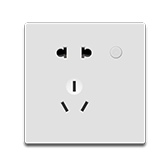</td>
      <td>Babuy Wall Outlet</td>
      <td></td>
      <td>babai.plug.sk86a</td>
      <td></td>
    </tr>
    <tr>
      <th>1639</th>
      <td></td>
      <td>Babuy Wi-Fi Smart Plug</td>
      <td></td>
      <td>babai.plug.sk01a</td>
      <td></td>
    </tr>
    <tr>
      <th>1640</th>
      <td></td>
      <td>Bafa socket</td>
      <td></td>
      <td>bemfa.plug.be002</td>
      <td></td>
    </tr>
    <tr>
      <th>1641</th>
      <td></td>
      <td>BlinkerSmartPlug</td>
      <td></td>
      <td>blink.plug.bp0001</td>
      <td></td>
    </tr>
    <tr>
      <th>1642</th>
      <td></td>
      <td>China Mobile Smart Socket CMCC-X11</td>
      <td></td>
      <td>cmcc.plug.x11</td>
      <td></td>
    </tr>
    <tr>
      <th>1643</th>
      <td></td>
      <td>Cloud access socket</td>
      <td>Cloud access universal socket</td>
      <td>ezhome.plug.yy0003</td>
      <td></td>
    </tr>
    <tr>
      <th>1644</th>
      <td>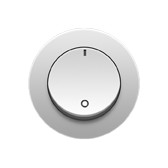</td>
      <td>Computer remote switch card</td>
      <td></td>
      <td>mengye.plug.rmtsw</td>
      <td></td>
    </tr>
    <tr>
      <th>1645</th>
      <td></td>
      <td>Crackle intelligent switch two three plug</td>
      <td>Crackling smart socket, WIFI connection.</td>
      <td>090615.plug.pipa86</td>
      <td></td>
    </tr>
    <tr>
      <th>1646</th>
      <td></td>
      <td>Create cloud access</td>
      <td></td>
      <td>a24234.plug.89987</td>
      <td></td>
    </tr>
    <tr>
      <th>1647</th>
      <td></td>
      <td>Cuco Smart Plug (wifi) Basic</td>
      <td>The first product accessed by wp5 on the Xiaomi iot platform</td>
      <td>cuco.plug.wp5</td>
      <td></td>
    </tr>
    <tr>
      <th>1648</th>
      <td></td>
      <td>Distributed Power 2.0</td>
      <td></td>
      <td>h2t.plug.2</td>
      <td></td>
    </tr>
    <tr>
      <th>1649</th>
      <td></td>
      <td>English-Product Name 03060958</td>
      <td></td>
      <td>miot.plug.v1640</td>
      <td></td>
    </tr>
    <tr>
      <th>1650</th>
      <td></td>
      <td>G27_Smart socket_16A three holes</td>
      <td></td>
      <td>bull.plug.gn003</td>
      <td></td>
    </tr>
    <tr>
      <th>1651</th>
      <td></td>
      <td>Golden Soft Net Smart Socket 2</td>
      <td>Jinsoft Network Smart Socket JRSocket_1_2</td>
      <td>jrnet.plug.out2</td>
      <td></td>
    </tr>
    <tr>
      <th>1652</th>
      <td></td>
      <td>Gosund Smart Plug</td>
      <td>Participate in the activities of Xiaomi Mall</td>
      <td>cuco.plug.cp1</td>
      <td>CP1</td>
    </tr>
    <tr>
      <th>1653</th>
      <td></td>
      <td>Gosund Smart Power Strip</td>
      <td></td>
      <td>cuco.plug.sp5</td>
      <td></td>
    </tr>
    <tr>
      <th>1654</th>
      <td></td>
      <td>Gosund Socket</td>
      <td>16A socket with power meter</td>
      <td>cuco.plug.cp2</td>
      <td></td>
    </tr>
    <tr>
      <th>1655</th>
      <td></td>
      <td>Green rice 86 concealed insert</td>
      <td></td>
      <td>lumi.86plug.v1</td>
      <td></td>
    </tr>
    <tr>
      <th>1656</th>
      <td></td>
      <td>Infrared socket</td>
      <td>Infrared socket</td>
      <td>wanye.plug.zcz004</td>
      <td></td>
    </tr>
    <tr>
      <th>1657</th>
      <td></td>
      <td>Infrared socket</td>
      <td></td>
      <td>wanye.plug.zcz005</td>
      <td></td>
    </tr>
    <tr>
      <th>1658</th>
      <td></td>
      <td>Intelligent 86 socket (WIFI)</td>
      <td>Smart 86 socket, WIFI connection, support row socket.</td>
      <td>090615.plug.plus01</td>
      <td></td>
    </tr>
    <tr>
      <th>1659</th>
      <td></td>
      <td>Intelligent Mobile Plug (WIFI)</td>
      <td></td>
      <td>090615.plug.plus02</td>
      <td></td>
    </tr>
    <tr>
      <th>1660</th>
      <td></td>
      <td>Intelligent digital remote control socket</td>
      <td></td>
      <td>zhijia.plug.dqcz02</td>
      <td></td>
    </tr>
    <tr>
      <th>1661</th>
      <td></td>
      <td>Intelligent wireless wall charger</td>
      <td>Smart wireless wall charger 5V/10W, Spec protocol version</td>
      <td>pwzn.plug.banana</td>
      <td></td>
    </tr>
    <tr>
      <th>1662</th>
      <td></td>
      <td>KH POWER PULG</td>
      <td>Through home WiFi, let the socket can remotely control local mobile phone locally, and use multiple safety protection: greatly enhance convenience and security. Anti-contact poor design: built-in temperature sensor, when the electrical plug and the socket are in a semi-contact state, when the temperature of the contact surface is too high, it will promptly notify the user and automatically power off. Anti-over protection design: Real-time statistics of built-in power, power exceeding rated range, inform the user to automatically power off, the outer casing uses high temperature flame retardant materials, 750 C high temperature flame retardant, independent safety door design, prevent human misunderstanding.</td>
      <td>693948.plug.khgsp</td>
      <td></td>
    </tr>
    <tr>
      <th>1663</th>
      <td></td>
      <td>MIJIA Smart Plug Enhanced</td>
      <td>Mijia Smart Socket Enhanced Edition</td>
      <td>chuangmi.plug.v3</td>
      <td>ZNCZ03CM/GMR4007CN</td>
    </tr>
    <tr>
      <th>1664</th>
      <td></td>
      <td>MINI K socket</td>
      <td>mini k smart socket, support on, off, timing, delay function</td>
      <td>konke2.plug.minik</td>
      <td></td>
    </tr>
    <tr>
      <th>1665</th>
      <td></td>
      <td>MINI PRO socket</td>
      <td>Support socket switch, timing, delay</td>
      <td>konke2.plug.minipr</td>
      <td></td>
    </tr>
    <tr>
      <th>1666</th>
      <td></td>
      <td>Metering socket</td>
      <td>Embedded zigbee standard protocol module, ultra-low power consumption, ultra-long standby, high stability, new manufacturing technology, exquisite appearance, easy installation.Flame-proof shell design, voltage overload protection, safe use, worry-free use, timing switch, power statistics, and always keep track of power consumption.</td>
      <td>feibit.plug.tskt106w</td>
      <td></td>
    </tr>
    <tr>
      <th>1667</th>
      <td></td>
      <td>Metering socket</td>
      <td></td>
      <td>jyx.plug.005101</td>
      <td></td>
    </tr>
    <tr>
      <th>1668</th>
      <td></td>
      <td>Metering socket (16A)</td>
      <td>Metering socket (16A)</td>
      <td>tc0756.plug.48</td>
      <td></td>
    </tr>
    <tr>
      <th>1669</th>
      <td></td>
      <td>Metering socket 10A</td>
      <td>Metering socket 10A</td>
      <td>tc0756.plug.47</td>
      <td></td>
    </tr>
    <tr>
      <th>1670</th>
      <td></td>
      <td>Mi Plug Mini</td>
      <td>Create a new name for Mi Mini Socket</td>
      <td>chuangmi.plug.m1</td>
      <td>ZNCZ02CM</td>
    </tr>
    <tr>
      <th>1671</th>
      <td></td>
      <td>Mi Smart Electrical Outlet</td>
      <td></td>
      <td>zimi.plug.zncz01</td>
      <td></td>
    </tr>
    <tr>
      <th>1672</th>
      <td></td>
      <td>Mi Smart Plug</td>
      <td>This product is a mobile smart socket that complies with American standards. It is connected to the gateway through zigbee and is controlled by a relay.</td>
      <td>lumi.plug.mitw01</td>
      <td>ZNCZ03LM</td>
    </tr>
    <tr>
      <th>1673</th>
      <td></td>
      <td>Mi Smart Plug</td>
      <td>Greenmi Gateway Sub-device</td>
      <td>lumi.plug.v1</td>
      <td></td>
    </tr>
    <tr>
      <th>1674</th>
      <td></td>
      <td>Mi Smart Plug (Wi-Fi) Basic</td>
      <td>Can remotely control real-time switch, countdown switch, timing switch</td>
      <td>chuangmi.plug.m3</td>
      <td>ZNCZ04CM/GMR4012CN</td>
    </tr>
    <tr>
      <th>1675</th>
      <td></td>
      <td>Mi Smart Plug (WiFi)</td>
      <td>Xiaomi Smart Socket Distribution Edition</td>
      <td>chuangmi.plug.hmi206</td>
      <td>ZNCZ05CM</td>
    </tr>
    <tr>
      <th>1676</th>
      <td></td>
      <td>Mi Smart Plug (Zigbee)</td>
      <td>A smart socket suitable for most parts of Europe.</td>
      <td>lumi.plug.mmeu01</td>
      <td>ZNCZ04LM/GMR4014GL (wrong: ZHCZ04LM)</td>
    </tr>
    <tr>
      <th>1677</th>
      <td>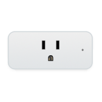</td>
      <td>Mi Smart Plug WiFi</td>
      <td>Overseas Amazon version</td>
      <td>chuangmi.plug.hmi205</td>
      <td>ZNCZ03CM</td>
    </tr>
    <tr>
      <th>1678</th>
      <td></td>
      <td>Mi Smart Power Plug</td>
      <td>Xiaomi Smart Socket</td>
      <td>chuangmi.plug.v1</td>
      <td>ZNCZ05CM/GMR4015GL/X22002</td>
    </tr>
    <tr>
      <th>1679</th>
      <td>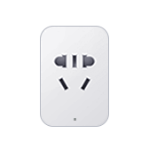</td>
      <td>Mi Smart Power Plug 2 (Wi-Fi and Bluetooth Gateway)</td>
      <td>Mijia Smart Socket 2 Bluetooth Gateway Version</td>
      <td>chuangmi.plug.212a01</td>
      <td>ZNCZ07CM</td>
    </tr>
    <tr>
      <th>1680</th>
      <td></td>
      <td>Mi Smart Socket Basic Edition (Expired)</td>
      <td></td>
      <td>chuangmi.plug.v2</td>
      <td>ZNCZ02LM</td>
    </tr>
    <tr>
      <th>1681</th>
      <td></td>
      <td>Mi Smart Wi-Fi Plug (Bluetooth Gateway)</td>
      <td>Mijia Smart Socket Bluetooth Gateway Version</td>
      <td>chuangmi.plug.hmi208</td>
      <td>ZNCZ06CM</td>
    </tr>
    <tr>
      <th>1682</th>
      <td></td>
      <td>Ohh smart socket</td>
      <td>With Ohh smart gateway to achieve the following multiple functions: Remote control: Check the status of home appliances at any time through the APP for remote control, and you can also use the scene to set time switch appliances to enjoy a comfortable smart life. Voice control: give instructions to the voice butler, you can easily control home appliances, and can be connected to the smart speakers on the market for control. Electricity statistics: monitor the daily and weekly electricity consumption of electrical appliances to help you rationally use each electrical appliance and achieve energy saving and environmental protection. Over-temperature and overload protection: When the socket detects the load power or the socket temperature exceeds the protection value, it will automatically cut off the power immediately to prevent danger and be your safety assistant. Actual power detection: You can check how much power the current device is using at any time in the APP, and you can control the status of home appliances at will. Support relay 315, 433 radio frequency equipment</td>
      <td>ohh.plug.sk01</td>
      <td></td>
    </tr>
    <tr>
      <th>1683</th>
      <td></td>
      <td>Outlet</td>
      <td>Smart sockets are controlled by APP, and users can locally/remotely control the on/off of traditional electrical equipment.When the device is connected to this socket, the device can be remotely controlled at any time through the APP.Smart sockets are a good choice for realizing local remote control timing for homes, enterprises, factories, shopping malls, etc. It can be controlled by multiple users at the same time and grouped. At the same time, APP supports power metering and monitoring functions, real-time viewing of power usage records, which is convenient for family energy saving. The smart socket has an overload protection function. If the working power of the electrical appliance exceeds the limited power (set in the APP), it will be directly powered off, which is very convenient and safe to use.</td>
      <td>chuan.plug.0100</td>
      <td></td>
    </tr>
    <tr>
      <th>1684</th>
      <td></td>
      <td>Outlet</td>
      <td>Single socket, support timing, remote control and other functions.</td>
      <td>oeco.plug.plug1</td>
      <td></td>
    </tr>
    <tr>
      <th>1685</th>
      <td></td>
      <td>PTH10</td>
      <td></td>
      <td>poer19.plug.pth10</td>
      <td></td>
    </tr>
    <tr>
      <th>1686</th>
      <td></td>
      <td>Plug socket</td>
      <td></td>
      <td>ddwl.plug.010002</td>
      <td></td>
    </tr>
    <tr>
      <th>1687</th>
      <td></td>
      <td>Plug socket</td>
      <td></td>
      <td>mpkx.plug.010002</td>
      <td></td>
    </tr>
    <tr>
      <th>1688</th>
      <td></td>
      <td>Plug socket</td>
      <td></td>
      <td>nvcls.plug.010002</td>
      <td></td>
    </tr>
    <tr>
      <th>1689</th>
      <td></td>
      <td>QIGAN</td>
      <td></td>
      <td>heiman.plug.ws2cg</td>
      <td></td>
    </tr>
    <tr>
      <th>1690</th>
      <td></td>
      <td>RS232 controller</td>
      <td>RS232 controller</td>
      <td>kuju.plug.36</td>
      <td></td>
    </tr>
    <tr>
      <th>1691</th>
      <td></td>
      <td>S20c Smart Socket</td>
      <td>WIFI smart socket, support voice control of Xiaoai audio.</td>
      <td>orvibo.plug.s20c</td>
      <td></td>
    </tr>
    <tr>
      <th>1692</th>
      <td></td>
      <td>S30c Smart Socket</td>
      <td>WIFI smart socket, support voice control of Xiaoai audio.</td>
      <td>orvibo.plug.s30</td>
      <td></td>
    </tr>
    <tr>
      <th>1693</th>
      <td></td>
      <td>Shenyong switch socket</td>
      <td></td>
      <td>sykj.plug.010002</td>
      <td></td>
    </tr>
    <tr>
      <th>1694</th>
      <td></td>
      <td>Shenyong switch socket</td>
      <td></td>
      <td>szsy.plug.010002</td>
      <td></td>
    </tr>
    <tr>
      <th>1695</th>
      <td></td>
      <td>Single hole socket</td>
      <td>Single hole socket</td>
      <td>fine.plug.dc1</td>
      <td></td>
    </tr>
    <tr>
      <th>1696</th>
      <td></td>
      <td>Smart Plug</td>
      <td>LifeSmart smart socket upgrades the traditional socket to a smart device that can be remotely controlled and supports two-way communication.</td>
      <td>lfsmt.plug.ls002</td>
      <td></td>
    </tr>
    <tr>
      <th>1697</th>
      <td></td>
      <td>Smart Plug (Wi-Fi)</td>
      <td>LifeSmart smart socket upgrades the traditional socket to a smart device that can be remotely controlled and supports two-way communication.</td>
      <td>lfsmt.plug.ls060</td>
      <td></td>
    </tr>
    <tr>
      <th>1698</th>
      <td></td>
      <td>Smart Power Plug</td>
      <td></td>
      <td>wd7qt6.plug.socket</td>
      <td></td>
    </tr>
    <tr>
      <th>1699</th>
      <td></td>
      <td>Smart Socket</td>
      <td>Socket equipment Smart socket 17 2</td>
      <td>uiot.plug.plug1</td>
      <td></td>
    </tr>
    <tr>
      <th>1700</th>
      <td></td>
      <td>Smart socket</td>
      <td>Xiao Ai controls the smart socket, timing, switch, etc. of the smart house</td>
      <td>123888.plug.znc102</td>
      <td></td>
    </tr>
    <tr>
      <th>1701</th>
      <td></td>
      <td>Smart socket</td>
      <td>Smart socket</td>
      <td>ecloud.plug.eq</td>
      <td></td>
    </tr>
    <tr>
      <th>1702</th>
      <td></td>
      <td>Smart socket</td>
      <td>External, built-in socket</td>
      <td>kiwik.plug.plug</td>
      <td></td>
    </tr>
    <tr>
      <th>1703</th>
      <td></td>
      <td>Smart socket</td>
      <td>Smart socket</td>
      <td>kuju.plug.1</td>
      <td></td>
    </tr>
    <tr>
      <th>1704</th>
      <td></td>
      <td>Smart socket</td>
      <td>Support smart socket control</td>
      <td>manka.plug.socket</td>
      <td></td>
    </tr>
    <tr>
      <th>1705</th>
      <td></td>
      <td>Smart socket</td>
      <td>Smart socket</td>
      <td>tbsy.plug.123</td>
      <td></td>
    </tr>
    <tr>
      <th>1706</th>
      <td></td>
      <td>Smart socket</td>
      <td></td>
      <td>thing.plug.socket</td>
      <td></td>
    </tr>
    <tr>
      <th>1707</th>
      <td></td>
      <td>Smart socket</td>
      <td></td>
      <td>wanye.plug.zcz00</td>
      <td></td>
    </tr>
    <tr>
      <th>1708</th>
      <td></td>
      <td>Smart socket</td>
      <td>No certification trademark required</td>
      <td>worth.plug.787076</td>
      <td></td>
    </tr>
    <tr>
      <th>1709</th>
      <td></td>
      <td>Smart socket (non-metered)</td>
      <td></td>
      <td>hsmart.plug.ws1sk</td>
      <td></td>
    </tr>
    <tr>
      <th>1710</th>
      <td></td>
      <td>Smart socket T1 (national standard)</td>
      <td></td>
      <td>lumi.plug.macn01</td>
      <td></td>
    </tr>
    <tr>
      <th>1711</th>
      <td></td>
      <td>Smart socket WiFi</td>
      <td></td>
      <td>hsmart.plug.ws2sk</td>
      <td></td>
    </tr>
    <tr>
      <th>1712</th>
      <td></td>
      <td>Smart switch</td>
      <td>KP3C2 (6/65) /KP03C0100/KP03C0600 small switch, single-hole socket</td>
      <td>ikecin.plug.6</td>
      <td>KP03C0100/KP03C0600</td>
    </tr>
    <tr>
      <th>1713</th>
      <td></td>
      <td>Smart wall plug</td>
      <td></td>
      <td>btiot.plug.outlet</td>
      <td></td>
    </tr>
    <tr>
      <th>1714</th>
      <td></td>
      <td>Smart wall socket T1</td>
      <td></td>
      <td>lumi.plug.sacn02</td>
      <td></td>
    </tr>
    <tr>
      <th>1715</th>
      <td></td>
      <td>SmartGw</td>
      <td></td>
      <td>heiman.plug.hs2gw</td>
      <td></td>
    </tr>
    <tr>
      <th>1716</th>
      <td></td>
      <td>SmartPlug</td>
      <td></td>
      <td>heiman.plug.hs2sk</td>
      <td></td>
    </tr>
    <tr>
      <th>1717</th>
      <td></td>
      <td>SmartSocket</td>
      <td>Smart sockets are controlled by APP, and users can locally/remotely control the on/off of traditional electrical equipment.When the device is connected to this socket, the device can be remotely controlled at any time through the APP.Smart sockets are a good choice for realizing local remote control timing for homes, enterprises, factories, shopping malls, etc. It can be controlled by multiple users at the same time and grouped. At the same time, APP supports power metering and monitoring functions, real-time viewing of power usage records, which is convenient for family energy saving. The smart socket has an overload protection function. If the working power of the electrical appliance exceeds the limited power (set in the APP), it will be directly powered off, which is very convenient and safe to use.</td>
      <td>oge.plug.seetime0101</td>
      <td></td>
    </tr>
    <tr>
      <th>1718</th>
      <td></td>
      <td>Smartjoy smart wall outlet (WiFi version)</td>
      <td>SmartJoy Smart Wall Socket (WiFi version)</td>
      <td>smartj.plug.sjsc86</td>
      <td></td>
    </tr>
    <tr>
      <th>1719</th>
      <td></td>
      <td>Smyoo Switch</td>
      <td>Smart socket</td>
      <td>smyoo.plug.plugin02</td>
      <td></td>
    </tr>
    <tr>
      <th>1720</th>
      <td></td>
      <td>Socket</td>
      <td>socket</td>
      <td>ezhome.plug.zhyapp07</td>
      <td></td>
    </tr>
    <tr>
      <th>1721</th>
      <td></td>
      <td>Socket</td>
      <td></td>
      <td>tt2019.plug.socket</td>
      <td></td>
    </tr>
    <tr>
      <th>1722</th>
      <td></td>
      <td>Socket</td>
      <td></td>
      <td>zengge.plug.socket</td>
      <td></td>
    </tr>
    <tr>
      <th>1723</th>
      <td></td>
      <td>Socket converter</td>
      <td>Smart socket converter</td>
      <td>bzhome.plug.sz070</td>
      <td></td>
    </tr>
    <tr>
      <th>1724</th>
      <td></td>
      <td>Switch</td>
      <td>Switch</td>
      <td>cydj.plug.v5</td>
      <td></td>
    </tr>
    <tr>
      <th>1725</th>
      <td></td>
      <td>Test analog socket</td>
      <td>Test analog socket</td>
      <td>xiaomi.plug.test1</td>
      <td></td>
    </tr>
    <tr>
      <th>1726</th>
      <td></td>
      <td>Wall socket</td>
      <td></td>
      <td>mpkx.plug.010001</td>
      <td></td>
    </tr>
    <tr>
      <th>1727</th>
      <td></td>
      <td>Wall socket</td>
      <td></td>
      <td>nvcls.plug.010001</td>
      <td></td>
    </tr>
    <tr>
      <th>1728</th>
      <td></td>
      <td>Wall socket</td>
      <td></td>
      <td>sykj.plug.010001</td>
      <td></td>
    </tr>
    <tr>
      <th>1729</th>
      <td></td>
      <td>Wall socket</td>
      <td></td>
      <td>szsy.plug.010001</td>
      <td></td>
    </tr>
    <tr>
      <th>1730</th>
      <td>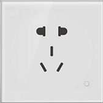</td>
      <td>Wall socket</td>
      <td></td>
      <td>xinrui.plug.lh003</td>
      <td></td>
    </tr>
    <tr>
      <th>1731</th>
      <td></td>
      <td>Wall socket (Zigbee version)</td>
      <td></td>
      <td>lumi.ctrl_86plug.es1</td>
      <td>QBCZ11LM</td>
    </tr>
    <tr>
      <th>1732</th>
      <td></td>
      <td>Wall socket (gateway version)</td>
      <td></td>
      <td>lumi.plug.sgwacn01</td>
      <td></td>
    </tr>
    <tr>
      <th>1733</th>
      <td></td>
      <td>Wi-Fi Socket</td>
      <td>Ordinary Wi-Fi socket/strip</td>
      <td>tuya.plug.tywp01</td>
      <td></td>
    </tr>
    <tr>
      <th>1734</th>
      <td></td>
      <td>Wi-Fi smart socket</td>
      <td></td>
      <td>tenda.plug.sp3</td>
      <td></td>
    </tr>
    <tr>
      <th>1735</th>
      <td></td>
      <td>WiFi smart socket</td>
      <td></td>
      <td>mhiot.plug.mp01w</td>
      <td></td>
    </tr>
    <tr>
      <th>1736</th>
      <td></td>
      <td>WiFi smart wall socket</td>
      <td></td>
      <td>mhiot.plug.ms86w</td>
      <td></td>
    </tr>
    <tr>
      <th>1737</th>
      <td></td>
      <td>WiFi smart wall socket</td>
      <td></td>
      <td>yugang.plug.dmc605</td>
      <td></td>
    </tr>
    <tr>
      <th>1738</th>
      <td></td>
      <td>Xiaoyan Smart Socket</td>
      <td></td>
      <td>terncy.plug.tsp01</td>
      <td></td>
    </tr>
    <tr>
      <th>1739</th>
      <td></td>
      <td>aigo smart powerstrip</td>
      <td></td>
      <td>qmi.plug.psv1</td>
      <td></td>
    </tr>
    <tr>
      <th>1740</th>
      <td></td>
      <td>dohome</td>
      <td>Smart socket, support WIFI distribution network, switch control and other functions.</td>
      <td>doit.plug.dohomeplug</td>
      <td></td>
    </tr>
    <tr>
      <th>1741</th>
      <td></td>
      <td>k2 pro smart plug</td>
      <td>Remote intelligent control Timing delay</td>
      <td>ikonke.plug.k2pro</td>
      <td></td>
    </tr>
    <tr>
      <th>1742</th>
      <td></td>
      <td>k2 smart plug</td>
      <td>Remote control switch Timing delay</td>
      <td>ikonke.plug.k2</td>
      <td></td>
    </tr>
    <tr>
      <th>1743</th>
      <td></td>
      <td>mini k smart plug</td>
      <td>wifi smart socket: remote control Timing delay Charging protection</td>
      <td>ikonke.plug.minik</td>
      <td></td>
    </tr>
    <tr>
      <th>1744</th>
      <td></td>
      <td>mini pro smart plug</td>
      <td>wifi smart socket: remote control Infrared remote control Timing delay Charging protection</td>
      <td>ikonke.plug.minipro</td>
      <td></td>
    </tr>
    <tr>
      <th>1745</th>
      <td></td>
      <td>outlet</td>
      <td></td>
      <td>bgdz.plug.chazuo</td>
      <td></td>
    </tr>
    <tr>
      <th>1746</th>
      <td>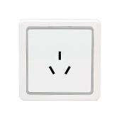</td>
      <td>outlet</td>
      <td>socket</td>
      <td>scmkcz.plug.chcz</td>
      <td></td>
    </tr>
    <tr>
      <th>1747</th>
      <td></td>
      <td>outlet</td>
      <td></td>
      <td>zhimai.plug.zm002</td>
      <td></td>
    </tr>
    <tr>
      <th>1748</th>
      <td></td>
      <td>outlet77</td>
      <td>Single channel socket (new multi-channel protocol)</td>
      <td>coolki.plug.uiid77</td>
      <td></td>
    </tr>
    <tr>
      <th>1749</th>
      <td></td>
      <td>outletGsm81</td>
      <td>GSM single channel socket (new protocol)</td>
      <td>coolki.plug.uiid81</td>
      <td></td>
    </tr>
    <tr>
      <th>1750</th>
      <td></td>
      <td>outletGsm82</td>
      <td>GSM dual channel socket (new protocol)</td>
      <td>coolki.plug.uiid82</td>
      <td></td>
    </tr>
    <tr>
      <th>1751</th>
      <td></td>
      <td>outletGsm83</td>
      <td>GSM three-channel socket (new protocol)</td>
      <td>coolki.plug.uiid83</td>
      <td></td>
    </tr>
    <tr>
      <th>1752</th>
      <td></td>
      <td>outletGsm84</td>
      <td>GSM four-channel socket (new protocol)</td>
      <td>coolki.plug.uiid84</td>
      <td></td>
    </tr>
    <tr>
      <th>1753</th>
      <td></td>
      <td>outlet_power</td>
      <td>Power detection single channel socket</td>
      <td>coolki.plug.uiid5</td>
      <td></td>
    </tr>
    <tr>
      <th>1754</th>
      <td></td>
      <td>plug</td>
      <td>socket</td>
      <td>cgzn.plug.plug</td>
      <td></td>
    </tr>
    <tr>
      <th>1755</th>
      <td></td>
      <td>plug_four</td>
      <td>Four channel socket</td>
      <td>coolki.plug.four</td>
      <td></td>
    </tr>
    <tr>
      <th>1756</th>
      <td></td>
      <td>plug_four</td>
      <td>Four channel socket</td>
      <td>zhihw.plug.uiid4</td>
      <td></td>
    </tr>
    <tr>
      <th>1757</th>
      <td></td>
      <td>plug_one</td>
      <td>Single channel socket</td>
      <td>coolki.plug.five</td>
      <td></td>
    </tr>
    <tr>
      <th>1758</th>
      <td></td>
      <td>plug_one</td>
      <td>Single channel socket</td>
      <td>zhihw.plug.uiid1</td>
      <td></td>
    </tr>
    <tr>
      <th>1759</th>
      <td></td>
      <td>plug_three</td>
      <td>Three-channel socket</td>
      <td>coolki.plug.three</td>
      <td></td>
    </tr>
    <tr>
      <th>1760</th>
      <td></td>
      <td>plug_three</td>
      <td>Three-channel socket</td>
      <td>zhihw.plug.uiid3</td>
      <td></td>
    </tr>
    <tr>
      <th>1761</th>
      <td></td>
      <td>plug_two</td>
      <td>Dual channel socket</td>
      <td>coolki.plug.two</td>
      <td></td>
    </tr>
    <tr>
      <th>1762</th>
      <td></td>
      <td>plug_two</td>
      <td>Dual channel socket</td>
      <td>zhihw.plug.uiid2</td>
      <td></td>
    </tr>
    <tr>
      <th>1763</th>
      <td></td>
      <td>pro_switch</td>
      <td></td>
      <td>yeelink.plug.prosw</td>
      <td></td>
    </tr>
    <tr>
      <th>1764</th>
      <td></td>
      <td>smart outlet</td>
      <td>Remotely control the smart socket switch.</td>
      <td>sunsea.plug.aspc1a</td>
      <td></td>
    </tr>
    <tr>
      <th>1765</th>
      <td></td>
      <td>smartOutlet</td>
      <td></td>
      <td>roome.plug.wallplug</td>
      <td></td>
    </tr>
    <tr>
      <th>1766</th>
      <td></td>
      <td>socket</td>
      <td></td>
      <td>biot.plug.socket</td>
      <td></td>
    </tr>
    <tr>
      <th>1767</th>
      <td></td>
      <td>socket</td>
      <td></td>
      <td>bright.plug.socket</td>
      <td></td>
    </tr>
    <tr>
      <th>1768</th>
      <td></td>
      <td>socket</td>
      <td></td>
      <td>btiot.plug.socket</td>
      <td></td>
    </tr>
    <tr>
      <th>1769</th>
      <td></td>
      <td>socket</td>
      <td>Universal socket</td>
      <td>dctrls.plug.common</td>
      <td></td>
    </tr>
    <tr>
      <th>1770</th>
      <td></td>
      <td>socket</td>
      <td></td>
      <td>future.plug.as02</td>
      <td></td>
    </tr>
    <tr>
      <th>1771</th>
      <td></td>
      <td>socket</td>
      <td></td>
      <td>ghome.plug.sf002</td>
      <td></td>
    </tr>
    <tr>
      <th>1772</th>
      <td></td>
      <td>socket</td>
      <td></td>
      <td>girt.plug.socket</td>
      <td></td>
    </tr>
    <tr>
      <th>1773</th>
      <td></td>
      <td>socket</td>
      <td></td>
      <td>giz.plug.outlet</td>
      <td></td>
    </tr>
    <tr>
      <th>1774</th>
      <td></td>
      <td>socket</td>
      <td></td>
      <td>hbkj1.plug.v1</td>
      <td></td>
    </tr>
    <tr>
      <th>1775</th>
      <td></td>
      <td>socket</td>
      <td>No certification trademark required</td>
      <td>ihome.plug.essp</td>
      <td></td>
    </tr>
    <tr>
      <th>1776</th>
      <td></td>
      <td>socket</td>
      <td></td>
      <td>jusval.plug.1</td>
      <td></td>
    </tr>
    <tr>
      <th>1777</th>
      <td></td>
      <td>socket</td>
      <td></td>
      <td>juzi.plug.010102</td>
      <td></td>
    </tr>
    <tr>
      <th>1778</th>
      <td></td>
      <td>socket</td>
      <td></td>
      <td>jyx.plug.000901</td>
      <td></td>
    </tr>
    <tr>
      <th>1779</th>
      <td></td>
      <td>socket</td>
      <td></td>
      <td>milamp.plug.cz</td>
      <td></td>
    </tr>
    <tr>
      <th>1780</th>
      <td></td>
      <td>socket</td>
      <td>For on-line products, please do not change if there is no need</td>
      <td>scinan.plug.socket</td>
      <td></td>
    </tr>
    <tr>
      <th>1781</th>
      <td></td>
      <td>socket</td>
      <td>socket</td>
      <td>tc0756.plug.9</td>
      <td></td>
    </tr>
    <tr>
      <th>1782</th>
      <td></td>
      <td>socket</td>
      <td></td>
      <td>tyzhjt.plug.cz0001</td>
      <td></td>
    </tr>
    <tr>
      <th>1783</th>
      <td></td>
      <td>socket</td>
      <td></td>
      <td>wfiot.plug.ot1001</td>
      <td></td>
    </tr>
    <tr>
      <th>1784</th>
      <td></td>
      <td>socket</td>
      <td>socket</td>
      <td>xzh.plug.socket</td>
      <td></td>
    </tr>
    <tr>
      <th>1785</th>
      <td></td>
      <td>socket</td>
      <td>YG_POWER_OUTLET</td>
      <td>yaguan.plug.outlet</td>
      <td></td>
    </tr>
    <tr>
      <th>1786</th>
      <td></td>
      <td>socket</td>
      <td></td>
      <td>ykkj.plug.ykm122</td>
      <td></td>
    </tr>
    <tr>
      <th>1787</th>
      <td>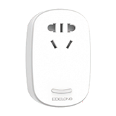</td>
      <td>socket</td>
      <td></td>
      <td>yonsz.plug.0</td>
      <td></td>
    </tr>
    <tr>
      <th>1788</th>
      <td></td>
      <td>socket</td>
      <td></td>
      <td>yuadon.plug.socket</td>
      <td></td>
    </tr>
    <tr>
      <th>1789</th>
      <td></td>
      <td>switch</td>
      <td></td>
      <td>kongke.plug.socket</td>
      <td></td>
    </tr>
    <tr>
      <th>1790</th>
      <td></td>
      <td>switchPower_Warning</td>
      <td>Power detection socket</td>
      <td>coolki.plug.uiid32</td>
      <td></td>
    </tr>
    <tr>
      <th>1791</th>
      <td></td>
      <td>wifi-socket</td>
      <td></td>
      <td>zhijia.plug.wifisocket</td>
      <td></td>
    </tr>
    <tr>
      <th>1792</th>
      <td></td>
      <td>wifiPlug</td>
      <td></td>
      <td>heiman.plug.ws2sk</td>
      <td></td>
    </tr>
    <tr>
      <th>1793</th>
      <td></td>
      <td>wifi_socket</td>
      <td>wifi smart socket, realize remote power on and off of home appliances. In particular, a poor contact prevention design is added. When the electrical plug and the socket are in a half-contact state, the use of high-power equipment will produce high temperature and cause fire and other safety hazards.The Geeklink smart socket has a built-in temperature sensor. When the temperature is too high, it will notify the user in time and automatically cut off the power to reduce the risk.</td>
      <td>jilian.plug.ff01</td>
      <td></td>
    </tr>
    <tr>
      <th>1794</th>
      <td></td>
      <td>zigbee wall plug</td>
      <td></td>
      <td>scinan.plug.zbqc</td>
      <td></td>
    </tr>
    <tr>
      <th>1795</th>
      <td></td>
      <td>zigbee wall socket</td>
      <td></td>
      <td>yuerzj.plug.zgsocket</td>
      <td></td>
    </tr>
  </tbody>
</table>

## Power strip
<table border="1" class="dataframe">
  <thead>
    <tr style="text-align: right;">
      <th></th>
      <th>Pic</th>
      <th>Name</th>
      <th>Description</th>
      <th>Model</th>
      <th>Product Number</th>
    </tr>
  </thead>
  <tbody>
    <tr>
      <th>1796</th>
      <td></td>
      <td>CHINGMI Smart Power Strip</td>
      <td></td>
      <td>qmi.powerstrip.v1</td>
      <td>QMCXB01ZN</td>
    </tr>
    <tr>
      <th>1797</th>
      <td></td>
      <td>Mi Smart Power Strip</td>
      <td>Purple rice patch panel</td>
      <td>zimi.powerstrip.v2</td>
      <td></td>
    </tr>
    <tr>
      <th>1798</th>
      <td></td>
      <td>socket</td>
      <td></td>
      <td>wd7qt6.plug.socket2</td>
      <td></td>
    </tr>
  </tbody>
</table>

## Remote control
<table border="1" class="dataframe">
  <thead>
    <tr style="text-align: right;">
      <th></th>
      <th>Pic</th>
      <th>Name</th>
      <th>Description</th>
      <th>Model</th>
      <th>Product Number</th>
    </tr>
  </thead>
  <tbody>
    <tr>
      <th>1799</th>
      <td></td>
      <td>Aqara Wireless Mini Switch T1</td>
      <td>Aqara wireless switch iterative version, the new growth is based on function.</td>
      <td>lumi.remote.b1acn02</td>
      <td>WXKG13LM</td>
    </tr>
    <tr>
      <th>1800</th>
      <td></td>
      <td>Aqara Wireless Remote Switch T1 (Double Rocker)</td>
      <td>The product is based on the currently available 86 wireless switch single button upgrade switch panel, buttons support: click, double click, long press.</td>
      <td>lumi.remote.b286acn03</td>
      <td></td>
    </tr>
    <tr>
      <th>1801</th>
      <td></td>
      <td>Aqara Wireless Remote Switch T1 (Single Rocker)</td>
      <td>The product is based on the currently available 86 wireless switch single button upgrade switch panel, buttons support: click, double click, long press.</td>
      <td>lumi.remote.b186acn03</td>
      <td></td>
    </tr>
    <tr>
      <th>1802</th>
      <td></td>
      <td>Custom Remote Control</td>
      <td>Mijia universal infrared remote control</td>
      <td>miir.remote.ir01</td>
      <td></td>
    </tr>
    <tr>
      <th>1803</th>
      <td></td>
      <td>IMI Remote</td>
      <td>Xiaobai Universal Remote Control Sichuan Telecom Edition</td>
      <td>chuangmi.remote.h102a03</td>
      <td></td>
    </tr>
    <tr>
      <th>1804</th>
      <td></td>
      <td>IMI Remote</td>
      <td></td>
      <td>chuangmi.remote.h102c01</td>
      <td></td>
    </tr>
    <tr>
      <th>1805</th>
      <td></td>
      <td>Mi Remote</td>
      <td>Mi Universal Remote Enhanced Edition</td>
      <td>chuangmi.remote.v2</td>
      <td>MJYKQ01CM</td>
    </tr>
    <tr>
      <th>1806</th>
      <td></td>
      <td>Set-top box infrared remote control</td>
      <td></td>
      <td>ghome.remote.sf003</td>
      <td></td>
    </tr>
    <tr>
      <th>1807</th>
      <td></td>
      <td>Yeelight Wireless Switch S1</td>
      <td>Yeelight Wireless Switch S1</td>
      <td>yeelink.remote.remote</td>
      <td></td>
    </tr>
    <tr>
      <th>1808</th>
      <td></td>
      <td>air-conditioner remote</td>
      <td></td>
      <td>ghome.remote.sf012</td>
      <td></td>
    </tr>
  </tbody>
</table>

## Router
<table border="1" class="dataframe">
  <thead>
    <tr style="text-align: right;">
      <th></th>
      <th>Pic</th>
      <th>Name</th>
      <th>Description</th>
      <th>Model</th>
      <th>Product Number</th>
    </tr>
  </thead>
  <tbody>
    <tr>
      <th>1809</th>
      <td></td>
      <td>HuaLai Xiao Fang Mesh router gateway</td>
      <td>Hualai Xiaofang Mesh Routing Gateway</td>
      <td>isa.router.mr01hl</td>
      <td></td>
    </tr>
    <tr>
      <th>1810</th>
      <td></td>
      <td>Mi Router 3</td>
      <td></td>
      <td>xiaomi.router.v3</td>
      <td></td>
    </tr>
    <tr>
      <th>1811</th>
      <td></td>
      <td>Mi Router 3A</td>
      <td>Mi Router 3A</td>
      <td>xiaomi.router.r3a</td>
      <td></td>
    </tr>
    <tr>
      <th>1812</th>
      <td></td>
      <td>Mi Router 3G</td>
      <td>Xiaomi router</td>
      <td>xiaomi.router.r3g</td>
      <td></td>
    </tr>
    <tr>
      <th>1813</th>
      <td></td>
      <td>Mi Router 3G</td>
      <td></td>
      <td>xiaomi.router.r3gv2</td>
      <td></td>
    </tr>
    <tr>
      <th>1814</th>
      <td></td>
      <td>Mi Router 3G</td>
      <td></td>
      <td>xiaomi.router.r3gv2n</td>
      <td></td>
    </tr>
    <tr>
      <th>1815</th>
      <td></td>
      <td>Mi Router 4</td>
      <td></td>
      <td>xiaomi.router.r4</td>
      <td></td>
    </tr>
    <tr>
      <th>1816</th>
      <td></td>
      <td>Mi Router 4 Pro</td>
      <td></td>
      <td>xiaomi.router.r1350</td>
      <td></td>
    </tr>
    <tr>
      <th>1817</th>
      <td></td>
      <td>Mi Router 4A</td>
      <td></td>
      <td>xiaomi.router.r4ac</td>
      <td></td>
    </tr>
    <tr>
      <th>1818</th>
      <td></td>
      <td>Mi Router 4A Giga Version</td>
      <td></td>
      <td>xiaomi.router.r4a</td>
      <td></td>
    </tr>
    <tr>
      <th>1819</th>
      <td></td>
      <td>Mi Router 4C</td>
      <td></td>
      <td>xiaomi.router.r4cm</td>
      <td></td>
    </tr>
    <tr>
      <th>1820</th>
      <td></td>
      <td>Mi Router 4Q</td>
      <td></td>
      <td>xiaomi.router.r4c</td>
      <td></td>
    </tr>
    <tr>
      <th>1821</th>
      <td></td>
      <td>Mi Router AC2100</td>
      <td></td>
      <td>xiaomi.router.r2100</td>
      <td>Xiaomi Mi Router (Black, R2100)</td>
    </tr>
    <tr>
      <th>1822</th>
      <td></td>
      <td>Mi Router HD</td>
      <td>Mi Router HD</td>
      <td>xiaomi.router.r3d</td>
      <td></td>
    </tr>
    <tr>
      <th>1823</th>
      <td></td>
      <td>Mi Router Mesh</td>
      <td></td>
      <td>xiaomi.router.d01</td>
      <td></td>
    </tr>
    <tr>
      <th>1824</th>
      <td></td>
      <td>Mi Router R3C</td>
      <td>Mi Router R3C</td>
      <td>xiaomi.router.lv3</td>
      <td></td>
    </tr>
    <tr>
      <th>1825</th>
      <td></td>
      <td>Mi Wi-Fi</td>
      <td>Xiaomi router</td>
      <td>xiaomi.router.v1</td>
      <td></td>
    </tr>
    <tr>
      <th>1826</th>
      <td></td>
      <td>Mi Wi-Fi</td>
      <td></td>
      <td>xiaomi.router.v2</td>
      <td></td>
    </tr>
    <tr>
      <th>1827</th>
      <td></td>
      <td>Mi Wi-Fi Mini</td>
      <td>Xiaomi router mini</td>
      <td>xiaomi.router.mv1</td>
      <td></td>
    </tr>
    <tr>
      <th>1828</th>
      <td></td>
      <td>Mi Wi-Fi Nano</td>
      <td>Xiaomi Routing Youth Edition</td>
      <td>xiaomi.router.lv1</td>
      <td></td>
    </tr>
    <tr>
      <th>1829</th>
      <td></td>
      <td>Redmi router AC2100</td>
      <td></td>
      <td>xiaomi.router.rm2100</td>
      <td>Xiaomi Redmi Router AC2100 (White, RM2100)</td>
    </tr>
    <tr>
      <th>1830</th>
      <td></td>
      <td>Redmi router AX5</td>
      <td></td>
      <td>xiaomi.router.ra67</td>
      <td></td>
    </tr>
    <tr>
      <th>1831</th>
      <td></td>
      <td>Redmi router AX5 JD Cloud wireless treasure</td>
      <td></td>
      <td>xiaomi.router.ra50</td>
      <td></td>
    </tr>
    <tr>
      <th>1832</th>
      <td></td>
      <td>Redmi router AX6</td>
      <td></td>
      <td>xiaomi.router.ra69</td>
      <td></td>
    </tr>
    <tr>
      <th>1833</th>
      <td></td>
      <td>Xiaomi AIoT router AC2350</td>
      <td></td>
      <td>xiaomi.router.r2350</td>
      <td>AC2350</td>
    </tr>
    <tr>
      <th>1834</th>
      <td></td>
      <td>Xiaomi AIoT router AX3600</td>
      <td></td>
      <td>xiaomi.router.r3600</td>
      <td>AX3600</td>
    </tr>
    <tr>
      <th>1835</th>
      <td></td>
      <td>Xiaomi router</td>
      <td></td>
      <td>xiaomi.router.old15</td>
      <td></td>
    </tr>
    <tr>
      <th>1836</th>
      <td></td>
      <td>Xiaomi router</td>
      <td></td>
      <td>xiaomi.router.r3p</td>
      <td></td>
    </tr>
    <tr>
      <th>1837</th>
      <td></td>
      <td>Xiaomi router</td>
      <td></td>
      <td>xiaomi.router.rmo15</td>
      <td></td>
    </tr>
    <tr>
      <th>1838</th>
      <td></td>
      <td>Xiaomi router AX1800</td>
      <td></td>
      <td>xiaomi.router.rm1800</td>
      <td></td>
    </tr>
    <tr>
      <th>1839</th>
      <td></td>
      <td>Xiaomi router AX6000</td>
      <td></td>
      <td>xiaomi.router.ra72</td>
      <td></td>
    </tr>
  </tbody>
</table>

## Smart cat eye
<table border="1" class="dataframe">
  <thead>
    <tr style="text-align: right;">
      <th></th>
      <th>Pic</th>
      <th>Name</th>
      <th>Description</th>
      <th>Model</th>
      <th>Product Number</th>
    </tr>
  </thead>
  <tbody>
    <tr>
      <th>1840</th>
      <td></td>
      <td>DUN Smart Doorbell</td>
      <td></td>
      <td>dun.cateye.nknk500</td>
      <td></td>
    </tr>
    <tr>
      <th>1841</th>
      <td></td>
      <td>IMILAB Digital Door Viewer</td>
      <td>Chuangmi Cat's Eye Camera</td>
      <td>chuangmi.cateye.ipc018</td>
      <td></td>
    </tr>
    <tr>
      <th>1842</th>
      <td></td>
      <td>Loock CatY</td>
      <td>Luke Smart Cat Eye has a product version, a smart cat eye with face recognition, smart alarm and long battery life.</td>
      <td>loock.cateye.v01</td>
      <td></td>
    </tr>
    <tr>
      <th>1843</th>
      <td></td>
      <td>Mi Smart Video Doorbell with Monitor</td>
      <td>Xiaomi Mijia Smart Cat Eye: Built by Yunding Technology, extremely cost-effective, Mijias first smart cat eye, internal codename CatM.</td>
      <td>loock.cateye.v02</td>
      <td></td>
    </tr>
    <tr>
      <th>1844</th>
      <td></td>
      <td>Xiaomo Smart Peep Hole</td>
      <td>Software functions: remote viewing, active alarm, face recognition, long battery life, AI automatic learning Basic parameters: 4.3-inch IPS LCD screen, 1.3 million pixel camera, viewing angle 160 degrees, human detection distance 3 meters, infrared night vision distance 5 meters, battery 5000mAh</td>
      <td>mxiang.cateye.xmcatt1</td>
      <td></td>
    </tr>
  </tbody>
</table>

## Smoke sensor
<table border="1" class="dataframe">
  <thead>
    <tr style="text-align: right;">
      <th></th>
      <th>Pic</th>
      <th>Name</th>
      <th>Description</th>
      <th>Model</th>
      <th>Product Number</th>
    </tr>
  </thead>
  <tbody>
    <tr>
      <th>1845</th>
      <td></td>
      <td>Aqara Smart Smoke Detector (NB-IoT)</td>
      <td>A smoke alarm based on NB-IoT communication protocol</td>
      <td>lumi.sensor_smoke.acn01</td>
      <td>JTY-GD-HS90/LM</td>
    </tr>
    <tr>
      <th>1846</th>
      <td></td>
      <td>Mi Smart Smoke Detector</td>
      <td></td>
      <td>lumi.sensor_smoke.v1</td>
      <td>JTYJ-GD-01LM/BW</td>
    </tr>
  </tbody>
</table>

## Spotlight
<table border="1" class="dataframe">
  <thead>
    <tr style="text-align: right;">
      <th></th>
      <th>Pic</th>
      <th>Name</th>
      <th>Description</th>
      <th>Model</th>
      <th>Product Number</th>
    </tr>
  </thead>
  <tbody>
    <tr>
      <th>1847</th>
      <td></td>
      <td>OREO</td>
      <td>Smart track spotlight OREO LS1.0</td>
      <td>shanu.light.oreo</td>
      <td></td>
    </tr>
    <tr>
      <th>1848</th>
      <td></td>
      <td>Yeelight Mesh LED Spotlight</td>
      <td>Mesh spotlight</td>
      <td>yeelink.light.spot1</td>
      <td></td>
    </tr>
  </tbody>
</table>

## Switch
<table border="1" class="dataframe">
  <thead>
    <tr style="text-align: right;">
      <th></th>
      <th>Pic</th>
      <th>Name</th>
      <th>Description</th>
      <th>Model</th>
      <th>Product Number</th>
    </tr>
  </thead>
  <tbody>
    <tr>
      <th>1849</th>
      <td></td>
      <td>1-Button Live Wire Switch</td>
      <td>Single fire wire touch switch Single fire single fire switch 1 1</td>
      <td>uiot.switch.switch1</td>
      <td></td>
    </tr>
    <tr>
      <th>1850</th>
      <td></td>
      <td>1-position smart switch</td>
      <td></td>
      <td>simon.switch.sw01</td>
      <td></td>
    </tr>
    <tr>
      <th>1851</th>
      <td></td>
      <td>2-Button Live Wire Switch</td>
      <td>Single fire wire touch switch Double open single fire switch 1 2</td>
      <td>uiot.switch.switch2</td>
      <td></td>
    </tr>
    <tr>
      <th>1852</th>
      <td></td>
      <td>2-Button Mechanical Switch Controller Box</td>
      <td>Mechanical switch Double-open mechanical switch control box 7 2</td>
      <td>uiot.switch.switch12</td>
      <td></td>
    </tr>
    <tr>
      <th>1853</th>
      <td></td>
      <td>2-Button Neutral Wire Switch</td>
      <td>Zero fire wire touch switch Double open zero fire switch 2 2</td>
      <td>uiot.switch.switch5</td>
      <td></td>
    </tr>
    <tr>
      <th>1854</th>
      <td></td>
      <td>2-position dimmer switch</td>
      <td>I7 2-position dimmer switch E3 2-position dimmer switch</td>
      <td>simon.switch.sw02</td>
      <td></td>
    </tr>
    <tr>
      <th>1855</th>
      <td></td>
      <td>2-position smart switch</td>
      <td></td>
      <td>simon.switch.sw2</td>
      <td></td>
    </tr>
    <tr>
      <th>1856</th>
      <td></td>
      <td>3 Key Smart Switch WIFI X1</td>
      <td>3-digit smart switch WiFi X1 version</td>
      <td>leshi.switch.v0004</td>
      <td></td>
    </tr>
    <tr>
      <th>1857</th>
      <td></td>
      <td>3-Button Neutral Wire Switch</td>
      <td>Zero fire wire touch switch Three open zero fire switch 2 3</td>
      <td>uiot.switch.switch6</td>
      <td></td>
    </tr>
    <tr>
      <th>1858</th>
      <td></td>
      <td>3-position smart switch</td>
      <td></td>
      <td>simon.switch.sw3</td>
      <td></td>
    </tr>
    <tr>
      <th>1859</th>
      <td></td>
      <td>4 scene multi-control switch</td>
      <td></td>
      <td>simon.switch.sw03</td>
      <td></td>
    </tr>
    <tr>
      <th>1860</th>
      <td></td>
      <td>4-position smart switch</td>
      <td></td>
      <td>simon.switch.sw04</td>
      <td></td>
    </tr>
    <tr>
      <th>1861</th>
      <td></td>
      <td>AllCenter Switch Series</td>
      <td>AllCenter Smart Switch Series</td>
      <td>umiot.switch.ums</td>
      <td></td>
    </tr>
    <tr>
      <th>1862</th>
      <td></td>
      <td>American switch</td>
      <td></td>
      <td>ddwl.switch.030001</td>
      <td></td>
    </tr>
    <tr>
      <th>1863</th>
      <td></td>
      <td>American switch</td>
      <td></td>
      <td>mpkx.switch.030001</td>
      <td></td>
    </tr>
    <tr>
      <th>1864</th>
      <td></td>
      <td>American switch</td>
      <td></td>
      <td>nvcls.switch.030001</td>
      <td></td>
    </tr>
    <tr>
      <th>1865</th>
      <td></td>
      <td>American switch</td>
      <td></td>
      <td>sykj.switch.030001</td>
      <td></td>
    </tr>
    <tr>
      <th>1866</th>
      <td></td>
      <td>American switch</td>
      <td></td>
      <td>szsy.switch.030001</td>
      <td></td>
    </tr>
    <tr>
      <th>1867</th>
      <td></td>
      <td>Aqara Single Switch Module T1 (With Neutral)</td>
      <td>Zigbee3.0, zero live wire to take power, small size, can be built into wall cassettes, ceiling lights or other high-power devices that need to be intelligently controlled on and off, and can be controlled by APP, multi-smart device linkage or original mechanical switchesThe device controls on and off.</td>
      <td>lumi.switch.n0acn2</td>
      <td></td>
    </tr>
    <tr>
      <th>1868</th>
      <td></td>
      <td>Aqara Single Switch Module T1 (With Neutral)</td>
      <td>Zigbee3.0, zero live wire to take power, small size, can be built into wall cassettes, ceiling lights or other high-power devices that need to be intelligently controlled on and off, and can be controlled by APP, multi-smart device linkage or original mechanical switchesThe device controls on and off.</td>
      <td>lumi.switch.n0acn2</td>
      <td></td>
    </tr>
    <tr>
      <th>1869</th>
      <td></td>
      <td>Aqara Single Switch Module T1 (With Neutral)</td>
      <td>Zigbee3.0, zero live wire to take power, small size, can be built into wall cassettes, ceiling lights or other high-power devices that need to be intelligently controlled on and off, and can be controlled by APP, multi-smart device linkage or original mechanical switchesThe device controls on and off.</td>
      <td>lumi.switch.n0acn2</td>
      <td></td>
    </tr>
    <tr>
      <th>1870</th>
      <td></td>
      <td>Aqara Single Switch Module T1 (With Neutral)</td>
      <td>Zigbee3.0, zero live wire to take power, small size, can be built into wall cassettes, ceiling lights or other high-power devices that need to be intelligently controlled on and off, and can be controlled by APP, multi-smart device linkage or original mechanical switchesThe device controls on and off.</td>
      <td>lumi.switch.n0acn2</td>
      <td></td>
    </tr>
    <tr>
      <th>1871</th>
      <td></td>
      <td>Aqara Smart Wall Switch D1 (No Neutral, Triple Rocker)</td>
      <td>Aqara smart wall switch D1 (single live wire three-button version) is an 86-type switch that can control 3 lights. Pressing the three buttons once will change the on-off state of the corresponding relay.It can be used by replacing the ordinary switch, and the neutral line is not required.Zigbee HA 1.2.</td>
      <td>lumi.switch.l3acn3</td>
      <td>QBKG25LM</td>
    </tr>
    <tr>
      <th>1872</th>
      <td></td>
      <td>Aqara Smart Wall Switch D1 (With Neutral, Triple Rocker)</td>
      <td>Aqara smart wall switch D1 (three-button version of zero live wire) is an 86-type switch that can control 3 lights. Pressing the three buttons once will change the on-off state of the corresponding relay.Need to leave a zero line in the bottom box to use.Zigbee1.2.</td>
      <td>lumi.switch.n3acn3</td>
      <td>QBKG26LM</td>
    </tr>
    <tr>
      <th>1873</th>
      <td></td>
      <td>Aqara Wall Switch (No Neutral, Double Rocker)</td>
      <td>Green rice Zigbee sub-device</td>
      <td>lumi.ctrl_neutral2.v1</td>
      <td>QBKG03LM</td>
    </tr>
    <tr>
      <th>1874</th>
      <td></td>
      <td>Aqara Wall Switch (No Neutral, Single Rocker)</td>
      <td>Green rice Zigbee sub-device</td>
      <td>lumi.ctrl_neutral1.v1</td>
      <td>QBKG04LM</td>
    </tr>
    <tr>
      <th>1875</th>
      <td></td>
      <td>Aqara Wall Switch (With Neutral, Double Rocker)</td>
      <td>Wall switch (zero fire double key), model needs to be changed to lumi.ctrl_ln2.aq1, with PA</td>
      <td>lumi.ctrl_ln2.aq1</td>
      <td>QBKG12LM</td>
    </tr>
    <tr>
      <th>1876</th>
      <td></td>
      <td>Aqara Wall Switch (With Neutral, Double Rocker)</td>
      <td>Aqara wall switch (zero fire wire two-key version)</td>
      <td>lumi.ctrl_ln2.v1</td>
      <td>QBKG12LM</td>
    </tr>
    <tr>
      <th>1877</th>
      <td></td>
      <td>Aqara Wall Switch (With Neutral, Single Rocker)</td>
      <td>Wall switch (zero fire single key), model needs to be changed to lumi.ctrl_ln1.aq1, with PA</td>
      <td>lumi.ctrl_ln1.aq1</td>
      <td>QBKG11LM</td>
    </tr>
    <tr>
      <th>1878</th>
      <td></td>
      <td>Aqara Wall Switch (With Neutral, Single Rocker)</td>
      <td>Aqara wall switch (zero fire wire one-touch version)</td>
      <td>lumi.ctrl_ln1.v1</td>
      <td></td>
    </tr>
    <tr>
      <th>1879</th>
      <td></td>
      <td>Aqara Wall Switch D1 (No Neutral, Double Rocker)</td>
      <td>AQARA Wall Switch (Split Double Touch), Upgrade Switch Panel (Embedded Add Temperature Excessive Protection) ZB1.2 Version, Press: Click the left button (action), click Right click (action), click left and rightkey.</td>
      <td>lumi.switch.b2lacn02</td>
      <td>QBKG22LM</td>
    </tr>
    <tr>
      <th>1880</th>
      <td></td>
      <td>Aqara Wall Switch D1 (No Neutral, Single Rocker)</td>
      <td>AQARA Wall Switch (Single Fire Single Key Edition), Upgrade Switch Panel (Embedded Add Temperature Excessive Protection) ZB1.2, Press: Click the left button (action), click Right click (action).</td>
      <td>lumi.switch.b1lacn02</td>
      <td>QBKG21LM</td>
    </tr>
    <tr>
      <th>1881</th>
      <td></td>
      <td>Aqara Wall Switch D1 (With Neutral, Double Rocker)</td>
      <td>AQARA Wall Switch (Zero Fire Double Backup), Upgrade Switch Panel (Embedded Join Temperature Excessive Protection) ZB1.2, Press: Click the left button (action), click Right click (action), click left and rightkey.</td>
      <td>lumi.switch.b2nacn02</td>
      <td>QBKG24LM</td>
    </tr>
    <tr>
      <th>1882</th>
      <td></td>
      <td>Aqara Wall Switch D1 (With Neutral, Single Rocker)</td>
      <td>AQARA Wall Switch (Zero Fire Single Key Edition), Upgrade Switch Panel (Embedded Add Temperature Excessive Protection) ZB1.2, Press: Click the left button (action), click Right click (action).</td>
      <td>lumi.switch.b1nacn02</td>
      <td>QBKG23LM</td>
    </tr>
    <tr>
      <th>1883</th>
      <td></td>
      <td>Aqara Wireless Remote Switch (Double Rocker)</td>
      <td>The dual-button wireless switch with the appearance of the national standard 86, because the product needs to be upgraded, but the product is powered by a button battery and cannot be OTA, so reapply for the Model.</td>
      <td>lumi.remote.b286acn01</td>
      <td>WXKG02LM</td>
    </tr>
    <tr>
      <th>1884</th>
      <td></td>
      <td>Aqara Wireless Remote Switch (Double Rocker)</td>
      <td></td>
      <td>lumi.sensor_86sw2.v1</td>
      <td>WXKG02LM</td>
    </tr>
    <tr>
      <th>1885</th>
      <td></td>
      <td>Aqara Wireless Remote Switch (Single Rocker)</td>
      <td>The single-button wireless switch with the appearance of the national standard 86, because the product needs to be upgraded, but the product is powered by a button battery and cannot be OTA, so reapply for the Model.</td>
      <td>lumi.remote.b186acn01</td>
      <td>WXKG03LM</td>
    </tr>
    <tr>
      <th>1886</th>
      <td></td>
      <td>Aqara Wireless Remote Switch (Single Rocker)</td>
      <td></td>
      <td>lumi.sensor_86sw1.v1</td>
      <td>WXKG03LM</td>
    </tr>
    <tr>
      <th>1887</th>
      <td></td>
      <td>Aqara Wireless Remote Switch D1 (Double Rocker)</td>
      <td>Based on the currently available 86 wireless switch double-key version upgrade switch panel, left and right key buttons support: click, double click, long press, left and right, click.</td>
      <td>lumi.remote.b286acn02</td>
      <td>WXKG07LM</td>
    </tr>
    <tr>
      <th>1888</th>
      <td></td>
      <td>Aqara Wireless Remote Switch D1 (Single Rocker)</td>
      <td>The product is based on the currently available 86 wireless switch single button upgrade switch panel, buttons support: click, double click, long press.</td>
      <td>lumi.remote.b186acn02</td>
      <td>WXKG06LM</td>
    </tr>
    <tr>
      <th>1889</th>
      <td></td>
      <td>B105 circuit breaker</td>
      <td>B105 circuit breaker</td>
      <td>rjkj.switch.b105</td>
      <td></td>
    </tr>
    <tr>
      <th>1890</th>
      <td></td>
      <td>Bit card power switch</td>
      <td>Card power switch</td>
      <td>btzn.switch.cardv1</td>
      <td></td>
    </tr>
    <tr>
      <th>1891</th>
      <td></td>
      <td>Bit double key weak current switch</td>
      <td></td>
      <td>btzn.switch.2key</td>
      <td></td>
    </tr>
    <tr>
      <th>1892</th>
      <td></td>
      <td>Bit four-button weak current switch</td>
      <td></td>
      <td>btzn.switch.4key</td>
      <td></td>
    </tr>
    <tr>
      <th>1893</th>
      <td></td>
      <td>Bit single key weak current switch</td>
      <td></td>
      <td>btzn.switch.1key</td>
      <td></td>
    </tr>
    <tr>
      <th>1894</th>
      <td></td>
      <td>Breaker</td>
      <td></td>
      <td>sykj.switch.030009</td>
      <td></td>
    </tr>
    <tr>
      <th>1895</th>
      <td></td>
      <td>Breaker</td>
      <td></td>
      <td>szsy.switch.030009</td>
      <td></td>
    </tr>
    <tr>
      <th>1896</th>
      <td></td>
      <td>Breaker</td>
      <td>Wi-Fi_Circuit_Relay</td>
      <td>yaguan.switch.relay</td>
      <td></td>
    </tr>
    <tr>
      <th>1897</th>
      <td></td>
      <td>Cloud access switch</td>
      <td>Cloud access universal switch</td>
      <td>ezhome.switch.yy0001</td>
      <td></td>
    </tr>
    <tr>
      <th>1898</th>
      <td></td>
      <td>Cloud switch</td>
      <td></td>
      <td>ftnet.switch.xh01s</td>
      <td></td>
    </tr>
    <tr>
      <th>1899</th>
      <td></td>
      <td>Cloud switch</td>
      <td></td>
      <td>xbyk.switch.xh01s</td>
      <td></td>
    </tr>
    <tr>
      <th>1900</th>
      <td></td>
      <td>Dimmer switch</td>
      <td>Dimming color switch CR2P</td>
      <td>scmkcz.switch.cr2p</td>
      <td></td>
    </tr>
    <tr>
      <th>1901</th>
      <td></td>
      <td>Domoticz-switch</td>
      <td>switch</td>
      <td>xkwl.switch.donoff</td>
      <td></td>
    </tr>
    <tr>
      <th>1902</th>
      <td></td>
      <td>Dual control module</td>
      <td></td>
      <td>lumi.ctrl_dualchn.aq1</td>
      <td></td>
    </tr>
    <tr>
      <th>1903</th>
      <td></td>
      <td>Dual control module</td>
      <td></td>
      <td>lumi.ctrl_dualchn.es1</td>
      <td></td>
    </tr>
    <tr>
      <th>1904</th>
      <td></td>
      <td>Dual control module</td>
      <td></td>
      <td>lumi.ctrl_dualchn.v1</td>
      <td></td>
    </tr>
    <tr>
      <th>1905</th>
      <td>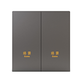</td>
      <td>ES Scene Switch (With Neutral, Double Rocker)</td>
      <td>Eggenstone</td>
      <td>lumi.switch.n2eic2</td>
      <td></td>
    </tr>
    <tr>
      <th>1906</th>
      <td></td>
      <td>ES Scene Switch (With Neutral, Quadruple Rocker)</td>
      <td>Eggenstone</td>
      <td>lumi.switch.n4eic2</td>
      <td></td>
    </tr>
    <tr>
      <th>1907</th>
      <td></td>
      <td>ES Scene Switch (With Neutral, Sextuple Rocker)</td>
      <td>Eggenstone</td>
      <td>lumi.switch.n6eic2</td>
      <td></td>
    </tr>
    <tr>
      <th>1908</th>
      <td></td>
      <td>ES Scene Switch (With Neutral, Single Rocker)</td>
      <td>Eggenstone</td>
      <td>lumi.switch.n1eic2</td>
      <td></td>
    </tr>
    <tr>
      <th>1909</th>
      <td></td>
      <td>ES Scene Switch (With Neutral, Triple Rocker)</td>
      <td>Eggenstone</td>
      <td>lumi.switch.n3eic2</td>
      <td></td>
    </tr>
    <tr>
      <th>1910</th>
      <td></td>
      <td>ES Wall Switch (With Neutral, Double Rocker)</td>
      <td>Eggenstone</td>
      <td>lumi.switch.n2eic1</td>
      <td></td>
    </tr>
    <tr>
      <th>1911</th>
      <td></td>
      <td>ES Wall Switch (With Neutral, Quadruple Rocker)</td>
      <td>Eggenstone</td>
      <td>lumi.switch.n4eic1</td>
      <td></td>
    </tr>
    <tr>
      <th>1912</th>
      <td></td>
      <td>ES Wall Switch (With Neutral, Sextuple Rocker)</td>
      <td>Eggenstone</td>
      <td>lumi.switch.n6eic1</td>
      <td></td>
    </tr>
    <tr>
      <th>1913</th>
      <td></td>
      <td>ES Wall Switch (With Neutral, Single Rocker)</td>
      <td>Eggenstone</td>
      <td>lumi.switch.n1eic1</td>
      <td></td>
    </tr>
    <tr>
      <th>1914</th>
      <td></td>
      <td>ES Wall Switch (With Neutral, Triple Rocker)</td>
      <td>Eggenstone</td>
      <td>lumi.switch.n3eic1</td>
      <td></td>
    </tr>
    <tr>
      <th>1915</th>
      <td></td>
      <td>Easy to switch</td>
      <td></td>
      <td>yeelink.switch.prosw1</td>
      <td></td>
    </tr>
    <tr>
      <th>1916</th>
      <td></td>
      <td>Eight-key scene switch</td>
      <td></td>
      <td>szsy.switch.090005</td>
      <td></td>
    </tr>
    <tr>
      <th>1917</th>
      <td></td>
      <td>Four-button strong electric switch in the future</td>
      <td>Wired connection</td>
      <td>bymiot.switch.4keyv1</td>
      <td></td>
    </tr>
    <tr>
      <th>1918</th>
      <td></td>
      <td>Four-way control module</td>
      <td></td>
      <td>lumi.relay.c4acn01</td>
      <td>LLKZMK11LM (Dev)</td>
    </tr>
    <tr>
      <th>1919</th>
      <td></td>
      <td>G27_Smart Switch_Three Open_Down Button</td>
      <td></td>
      <td>bull.switch.s312c</td>
      <td></td>
    </tr>
    <tr>
      <th>1920</th>
      <td></td>
      <td>G27_Smart Switch_Three Open_Middle Button</td>
      <td></td>
      <td>bull.switch.s312b</td>
      <td></td>
    </tr>
    <tr>
      <th>1921</th>
      <td></td>
      <td>G27_Smart Switch_Three Open_Up Button</td>
      <td></td>
      <td>bull.switch.s312a</td>
      <td></td>
    </tr>
    <tr>
      <th>1922</th>
      <td></td>
      <td>G27_Smart socket_10A five holes</td>
      <td></td>
      <td>bull.switch.gn004</td>
      <td></td>
    </tr>
    <tr>
      <th>1923</th>
      <td></td>
      <td>G27_smart switch_one open</td>
      <td></td>
      <td>bull.switch.s112</td>
      <td></td>
    </tr>
    <tr>
      <th>1924</th>
      <td></td>
      <td>G27_smart switch_two open_down button</td>
      <td></td>
      <td>bull.switch.s212b</td>
      <td></td>
    </tr>
    <tr>
      <th>1925</th>
      <td></td>
      <td>G27_smart switch_two open_up button</td>
      <td></td>
      <td>bull.switch.s212</td>
      <td></td>
    </tr>
    <tr>
      <th>1926</th>
      <td></td>
      <td>Geeklink_FB</td>
      <td>The intelligent feedback switch uses the GFSK two-way communication protocol to connect and communicate with the Thinker Mini. The feedback switch and scene switch are configured in the Geelian app. After the configuration, you can directly send commands to control the smart switch. At the same time, the mobile phone app can realize remote control of lights.And configure various linkage scenarios.</td>
      <td>jilian.switch.fb</td>
      <td></td>
    </tr>
    <tr>
      <th>1927</th>
      <td></td>
      <td>Golden Soft Network Smart Switch Box 1</td>
      <td>Jinsoft Smart Switch Box JRSwitch_1_1</td>
      <td>jrnet.switch.sw1</td>
      <td></td>
    </tr>
    <tr>
      <th>1928</th>
      <td></td>
      <td>Golden Soft Network Smart Switch Box 2</td>
      <td>Jinsoft Smart Switch Box JRSwitch_1_2</td>
      <td>jrnet.switch.sw2</td>
      <td></td>
    </tr>
    <tr>
      <th>1929</th>
      <td></td>
      <td>Gosund Smart Switch-Double Open</td>
      <td>Smart wall switch, two open</td>
      <td>cuco.switch.cs2</td>
      <td></td>
    </tr>
    <tr>
      <th>1930</th>
      <td></td>
      <td>Gosund Smart Switch-Single Open</td>
      <td>Smart wall switch, one open</td>
      <td>cuco.switch.cs1</td>
      <td></td>
    </tr>
    <tr>
      <th>1931</th>
      <td>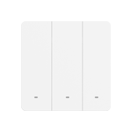</td>
      <td>Gosund Smart Switch-Three Open</td>
      <td>Smart wall switch, three open</td>
      <td>cuco.switch.cs3</td>
      <td></td>
    </tr>
    <tr>
      <th>1932</th>
      <td></td>
      <td>Guangzhou Zhunde Switch</td>
      <td>Control point socket on and off</td>
      <td>zdzn.switch.66749</td>
      <td></td>
    </tr>
    <tr>
      <th>1933</th>
      <td></td>
      <td>H intelligent double key switch (mesh)</td>
      <td>MESH Smart Switch</td>
      <td>090615.switch.hmb022</td>
      <td></td>
    </tr>
    <tr>
      <th>1934</th>
      <td></td>
      <td>H intelligent single key switch (mesh)</td>
      <td>MESH smart switch.</td>
      <td>090615.switch.hmb012</td>
      <td></td>
    </tr>
    <tr>
      <th>1935</th>
      <td></td>
      <td>H intelligent three key switch (mesh)</td>
      <td>MESH Smart Switch</td>
      <td>090615.switch.hmb032</td>
      <td></td>
    </tr>
    <tr>
      <th>1936</th>
      <td></td>
      <td>HUIZUO Switch (Double Key)</td>
      <td>huayi.switch.v0002 Two-way smart switch</td>
      <td>huayi.switch.v0002</td>
      <td></td>
    </tr>
    <tr>
      <th>1937</th>
      <td></td>
      <td>HUIZUO Switch (Single Key)</td>
      <td>huayi.switch.v0001 All the way smart switch</td>
      <td>huayi.switch.v0001</td>
      <td></td>
    </tr>
    <tr>
      <th>1938</th>
      <td></td>
      <td>Huayu Ruilian Smart Switch</td>
      <td></td>
      <td>schyrl.switch.sw12</td>
      <td></td>
    </tr>
    <tr>
      <th>1939</th>
      <td></td>
      <td>IMILAB Smart switch K1-A</td>
      <td>Xiaobai Smart Switch Bluetooth Mesh Zero Fire Single Button Version</td>
      <td>chuangmi.switch.mesh</td>
      <td></td>
    </tr>
    <tr>
      <th>1940</th>
      <td></td>
      <td>IMILAB Smart switch K1-B</td>
      <td>Xiaobai Smart Switch Bluetooth Mesh Version Zero Fire Double Button</td>
      <td>chuangmi.switch.meshb01</td>
      <td></td>
    </tr>
    <tr>
      <th>1941</th>
      <td></td>
      <td>IMILAB Smart switch K1-C</td>
      <td>Xiaobai Smart Switch Bluetooth Mesh Zero Fire Three Buttons</td>
      <td>chuangmi.switch.meshc01</td>
      <td></td>
    </tr>
    <tr>
      <th>1942</th>
      <td></td>
      <td>Intelligent dual control switch</td>
      <td></td>
      <td>yugang.switch.switch</td>
      <td></td>
    </tr>
    <tr>
      <th>1943</th>
      <td></td>
      <td>Intelligent feedback light panel (2-way)</td>
      <td></td>
      <td>zhijia.switch.dgmbl102</td>
      <td></td>
    </tr>
    <tr>
      <th>1944</th>
      <td></td>
      <td>KH Zero Fire Switch</td>
      <td>The sensitive glass touch panel allows you to switch with one touch.Support two-way feedback, remote control, timing switch.It can be combined with the scene panel to realize double connection and multiple connection.It can be combined with other products to freely set up different lighting scenes.</td>
      <td>693948.switch.khkz</td>
      <td></td>
    </tr>
    <tr>
      <th>1945</th>
      <td></td>
      <td>Kollini all the way light control panel</td>
      <td></td>
      <td>hotata.switch.ls011</td>
      <td></td>
    </tr>
    <tr>
      <th>1946</th>
      <td></td>
      <td>Kollini second road light control panel</td>
      <td></td>
      <td>hotata.switch.ls012</td>
      <td></td>
    </tr>
    <tr>
      <th>1947</th>
      <td></td>
      <td>Kollini second road light control panel</td>
      <td></td>
      <td>hotata.switch.ls022</td>
      <td></td>
    </tr>
    <tr>
      <th>1948</th>
      <td></td>
      <td>Kollini three-way light control panel</td>
      <td></td>
      <td>hotata.switch.ls013</td>
      <td></td>
    </tr>
    <tr>
      <th>1949</th>
      <td></td>
      <td>Kollini three-way light control panel</td>
      <td></td>
      <td>hotata.switch.ls023</td>
      <td></td>
    </tr>
    <tr>
      <th>1950</th>
      <td></td>
      <td>LONINK Intelligent one key switch WIFI</td>
      <td></td>
      <td>lonink.switch.ln064</td>
      <td></td>
    </tr>
    <tr>
      <th>1951</th>
      <td></td>
      <td>LONINK Intelligent three key switch WIFI</td>
      <td></td>
      <td>lonink.switch.ln066</td>
      <td></td>
    </tr>
    <tr>
      <th>1952</th>
      <td></td>
      <td>LONINK Intelligent two key switch WIFI</td>
      <td></td>
      <td>lonink.switch.ln065</td>
      <td></td>
    </tr>
    <tr>
      <th>1953</th>
      <td></td>
      <td>LONINK One key switch (WiFi)</td>
      <td></td>
      <td>lonink.switch.ln084</td>
      <td></td>
    </tr>
    <tr>
      <th>1954</th>
      <td></td>
      <td>LONINK Three key switch (WiFi)</td>
      <td></td>
      <td>lonink.switch.ln086</td>
      <td></td>
    </tr>
    <tr>
      <th>1955</th>
      <td></td>
      <td>LONINK Two key switch (WiFi)</td>
      <td></td>
      <td>lonink.switch.ln085</td>
      <td></td>
    </tr>
    <tr>
      <th>1956</th>
      <td></td>
      <td>Lezhigou WiFi light switch</td>
      <td></td>
      <td>dhzn.switch.sw0a01</td>
      <td></td>
    </tr>
    <tr>
      <th>1957</th>
      <td></td>
      <td>Linptech Smart Wall Switch (1 Key)</td>
      <td></td>
      <td>linp.switch.q31</td>
      <td></td>
    </tr>
    <tr>
      <th>1958</th>
      <td></td>
      <td>Linptech Smart Wall Switch (2 Keys)</td>
      <td></td>
      <td>linp.switch.q32</td>
      <td></td>
    </tr>
    <tr>
      <th>1959</th>
      <td></td>
      <td>Linptech Smart Wall Switch (3 Keys)</td>
      <td></td>
      <td>linp.switch.q33</td>
      <td></td>
    </tr>
    <tr>
      <th>1960</th>
      <td></td>
      <td>Mi Smart Dual one way Wall Switch</td>
      <td>Xiaomi Mijia Smart Switch (Dual Billing and Single Control)</td>
      <td>zimi.switch.dhkg02</td>
      <td></td>
    </tr>
    <tr>
      <th>1961</th>
      <td></td>
      <td>Mi Smart Single one way Wall Switch</td>
      <td>Xiaomi Mijia Smart Switch (single billing control)</td>
      <td>zimi.switch.dhkg01</td>
      <td></td>
    </tr>
    <tr>
      <th>1962</th>
      <td></td>
      <td>Mi Smart Triple One Way Wall Switch with Display</td>
      <td></td>
      <td>isa.switch.kg03hl</td>
      <td></td>
    </tr>
    <tr>
      <th>1963</th>
      <td></td>
      <td>MixPad Mini Super Smart Switch</td>
      <td>MixPad Mini Super Smart Switch</td>
      <td>orvibo.switch.mixpad</td>
      <td></td>
    </tr>
    <tr>
      <th>1964</th>
      <td></td>
      <td>Multiplexer</td>
      <td>4-way and more than 4-way combination switch, including 4-key scene button</td>
      <td>scmkcz.switch.4msw</td>
      <td></td>
    </tr>
    <tr>
      <th>1965</th>
      <td></td>
      <td>One Intelligent switch (WIFI)</td>
      <td>A smart switch, APP smart control</td>
      <td>090615.switch.switch01</td>
      <td></td>
    </tr>
    <tr>
      <th>1966</th>
      <td></td>
      <td>One Key Touch Switch X1 (WiFi)</td>
      <td>Xiaomi 1 touch switch WiFi version</td>
      <td>leshi.switch.sw1b01</td>
      <td></td>
    </tr>
    <tr>
      <th>1967</th>
      <td></td>
      <td>One button switch</td>
      <td></td>
      <td>huazhu.switch.1keyv2</td>
      <td></td>
    </tr>
    <tr>
      <th>1968</th>
      <td></td>
      <td>One button switch</td>
      <td>One-button wall smart switch</td>
      <td>lxk.switch.djkg</td>
      <td></td>
    </tr>
    <tr>
      <th>1969</th>
      <td>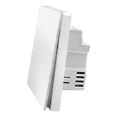</td>
      <td>One key single fire switch</td>
      <td></td>
      <td>ghome.switch.sf001</td>
      <td></td>
    </tr>
    <tr>
      <th>1970</th>
      <td></td>
      <td>One key smart switch WIFI X1</td>
      <td>1 bit smart switch WIFI X1 version</td>
      <td>leshi.switch.v0003</td>
      <td></td>
    </tr>
    <tr>
      <th>1971</th>
      <td></td>
      <td>One touch switch panel</td>
      <td>86 type touch switch panel, the bottom box uses flame-retardant PVC, zero live wire switch, rated power: between 3 and 1200W, working voltage: AC220V  15%.</td>
      <td>ezhome.switch.z4001</td>
      <td></td>
    </tr>
    <tr>
      <th>1972</th>
      <td></td>
      <td>One way switch</td>
      <td></td>
      <td>bright.switch.v100</td>
      <td></td>
    </tr>
    <tr>
      <th>1973</th>
      <td></td>
      <td>One way switch</td>
      <td></td>
      <td>milamp.switch.switch</td>
      <td></td>
    </tr>
    <tr>
      <th>1974</th>
      <td></td>
      <td>One-click Smart Switch Mesh version</td>
      <td>One-button smart switch-RTL8762-light touch</td>
      <td>lemesh.switch.sw1a02</td>
      <td></td>
    </tr>
    <tr>
      <th>1975</th>
      <td></td>
      <td>PTX Mesh intelligent one switch</td>
      <td>PTX Bluetooth Mesh Smart Switch One on</td>
      <td>090615.switch.mesw1</td>
      <td></td>
    </tr>
    <tr>
      <th>1976</th>
      <td></td>
      <td>PTX Mesh intelligent three switch</td>
      <td>PTX Bluetooth Mesh Smart Switch Three Open</td>
      <td>090615.switch.mesw3</td>
      <td></td>
    </tr>
    <tr>
      <th>1977</th>
      <td></td>
      <td>PTX Mesh intelligent two switch</td>
      <td>PTX Bluetooth Mesh smart switch two open</td>
      <td>090615.switch.mesw2</td>
      <td></td>
    </tr>
    <tr>
      <th>1978</th>
      <td></td>
      <td>PTX OneKey Switch (WIFI)</td>
      <td>One-key mechanical key switch, Mijia APP control, Xiaoai classmate control, 2.4G LAN auxiliary control, free paste auxiliary control function!</td>
      <td>090615.switch.xswitch01</td>
      <td></td>
    </tr>
    <tr>
      <th>1979</th>
      <td></td>
      <td>PTX Sle Bluetooth intelligent switch moduleing</td>
      <td>Single-channel switch reception, Xiaoai voice control, and random paste control.</td>
      <td>090615.switch.mhrsw1</td>
      <td></td>
    </tr>
    <tr>
      <th>1980</th>
      <td></td>
      <td>PTX ThreeKey Switch (WIFI)</td>
      <td>Three-button mechanical key switch, Mijia APP control, Xiaoai classmate control, 2.4G LAN auxiliary control, free paste auxiliary control function!</td>
      <td>090615.switch.xswitch03</td>
      <td></td>
    </tr>
    <tr>
      <th>1981</th>
      <td></td>
      <td>PTX Twokey switch (wifi)</td>
      <td>Two-button mechanical key switch, Mijia APP control, Xiaoai classmate control, 2.4G LAN auxiliary control, free paste auxiliary control function!</td>
      <td>090615.switch.xswitch02</td>
      <td></td>
    </tr>
    <tr>
      <th>1982</th>
      <td></td>
      <td>PTX dual Bluetooth intelligent switch module</td>
      <td>Two-way switch receiving module, Xiaoai voice control, free paste control.</td>
      <td>090615.switch.mhrsw2</td>
      <td></td>
    </tr>
    <tr>
      <th>1983</th>
      <td></td>
      <td>PTX intelligent touch switch on (mesh)</td>
      <td>PTX Smart Touch Switch on (MESH)</td>
      <td>090615.switch.ptxtc1</td>
      <td></td>
    </tr>
    <tr>
      <th>1984</th>
      <td></td>
      <td>PTX intelligent touch switch three on (mesh)</td>
      <td>PTX Smart Touch Switch Three Open (MESH)</td>
      <td>090615.switch.ptxtc3</td>
      <td></td>
    </tr>
    <tr>
      <th>1985</th>
      <td></td>
      <td>PTX intelligent touch two on (mesh)</td>
      <td>PTX Smart Touch Switch Two On (MESH)</td>
      <td>090615.switch.ptxtc2</td>
      <td></td>
    </tr>
    <tr>
      <th>1986</th>
      <td></td>
      <td>PTX one key intelligent switch (mesh)</td>
      <td></td>
      <td>090615.switch.mets1</td>
      <td></td>
    </tr>
    <tr>
      <th>1987</th>
      <td></td>
      <td>PTX three key intelligent switch (mesh)</td>
      <td></td>
      <td>090615.switch.mets3</td>
      <td></td>
    </tr>
    <tr>
      <th>1988</th>
      <td></td>
      <td>PTX two key intelligent switch (mesh)</td>
      <td></td>
      <td>090615.switch.mets2</td>
      <td></td>
    </tr>
    <tr>
      <th>1989</th>
      <td></td>
      <td>Parking spaces are intelligently locked</td>
      <td>Ground lock</td>
      <td>park.switch.fp509</td>
      <td></td>
    </tr>
    <tr>
      <th>1990</th>
      <td></td>
      <td>Piak intelligent one switch</td>
      <td>Meijiashun Electric Co., Ltd. smart switch, Xiaoai voice control, remote APP control.</td>
      <td>090615.switch.piak01</td>
      <td></td>
    </tr>
    <tr>
      <th>1991</th>
      <td></td>
      <td>Piak intelligent three switch</td>
      <td>Meijiashun Electric Co., Ltd. smart switch, Xiaoai voice control, remote APP control.</td>
      <td>090615.switch.piak03</td>
      <td></td>
    </tr>
    <tr>
      <th>1992</th>
      <td></td>
      <td>Piak intelligent two switch</td>
      <td>Meijiashun Electric Co., Ltd. smart switch, Xiaoai voice control, remote APP control.</td>
      <td>090615.switch.piak02</td>
      <td></td>
    </tr>
    <tr>
      <th>1993</th>
      <td></td>
      <td>Pinecone WiFi boot card</td>
      <td></td>
      <td>pinelc.switch.001</td>
      <td></td>
    </tr>
    <tr>
      <th>1994</th>
      <td></td>
      <td>Remo Smart Switch</td>
      <td></td>
      <td>raymo.switch.000101</td>
      <td></td>
    </tr>
    <tr>
      <th>1995</th>
      <td></td>
      <td>Remote control master-wifi to infrared-DVD</td>
      <td>Remote control master-wifi to infrared-DVD</td>
      <td>coolki.switch.yk0003</td>
      <td></td>
    </tr>
    <tr>
      <th>1996</th>
      <td></td>
      <td>Remote control master-wifi to infrared-DVD</td>
      <td>Remote control master-wifi to infrared-DVD</td>
      <td>zhihw.switch.yk0003</td>
      <td></td>
    </tr>
    <tr>
      <th>1997</th>
      <td></td>
      <td>Remote control master-wifi to infrared-projector</td>
      <td>Remote control master-wifi to infrared-projector</td>
      <td>coolki.switch.yk0005</td>
      <td></td>
    </tr>
    <tr>
      <th>1998</th>
      <td></td>
      <td>Remote control master-wifi to infrared-projector</td>
      <td>Remote control master-wifi to infrared-projector</td>
      <td>zhihw.switch.yk0005</td>
      <td></td>
    </tr>
    <tr>
      <th>1999</th>
      <td></td>
      <td>Reset-Switch</td>
      <td>Reset switch</td>
      <td>ezhome.switch.zhyapp06</td>
      <td></td>
    </tr>
    <tr>
      <th>2000</th>
      <td></td>
      <td>Scene mesh breaker</td>
      <td>One way Bluetooth switch controller</td>
      <td>lemesh.switch.sw0a01</td>
      <td></td>
    </tr>
    <tr>
      <th>2001</th>
      <td></td>
      <td>Scene mesh breaker DBS</td>
      <td>Mesh on-off device Realtek version</td>
      <td>dwdz.switch.sw0a01</td>
      <td></td>
    </tr>
    <tr>
      <th>2002</th>
      <td></td>
      <td>Scenes</td>
      <td></td>
      <td>hosjoy.switch.1245</td>
      <td></td>
    </tr>
    <tr>
      <th>2003</th>
      <td></td>
      <td>Scenes</td>
      <td>Maike custom scene mode</td>
      <td>scmkcz.switch.scene</td>
      <td></td>
    </tr>
    <tr>
      <th>2004</th>
      <td></td>
      <td>Shanhe IOT</td>
      <td></td>
      <td>shanhe.switch.1</td>
      <td></td>
    </tr>
    <tr>
      <th>2005</th>
      <td></td>
      <td>Shanhe IOT</td>
      <td></td>
      <td>shanhe.switch.v1</td>
      <td></td>
    </tr>
    <tr>
      <th>2006</th>
      <td></td>
      <td>Single control module</td>
      <td></td>
      <td>lumi.relay.c1acn01</td>
      <td></td>
    </tr>
    <tr>
      <th>2007</th>
      <td></td>
      <td>Single fire switch</td>
      <td></td>
      <td>edaltd.switch.switch</td>
      <td></td>
    </tr>
    <tr>
      <th>2008</th>
      <td></td>
      <td>Sinilink</td>
      <td></td>
      <td>sini.switch.495246</td>
      <td></td>
    </tr>
    <tr>
      <th>2009</th>
      <td></td>
      <td>Six-key strong electric switch in the future</td>
      <td>Wired connection</td>
      <td>bymiot.switch.6keyv1</td>
      <td></td>
    </tr>
    <tr>
      <th>2010</th>
      <td></td>
      <td>Smart Access Control Module</td>
      <td></td>
      <td>h2t.switch.h2tdp</td>
      <td></td>
    </tr>
    <tr>
      <th>2011</th>
      <td></td>
      <td>Smart Light Switch (1-way)</td>
      <td>LifeSmart streamer switch supports two-way communication and mobile phone remote control. The streamer switch can be controlled anytime and anywhere through the mobile phone, so as to control every electrical device connected to it, and it can also form linkage with other smart devices.</td>
      <td>lfsmt.switch.ls055</td>
      <td></td>
    </tr>
    <tr>
      <th>2012</th>
      <td></td>
      <td>Smart Light Switch (2-way)</td>
      <td>LifeSmart streamer switch supports two-way communication and mobile phone remote control. The streamer switch can be controlled anytime and anywhere through the mobile phone, so as to control every electrical device connected to it, and it can also form linkage with other smart devices.</td>
      <td>lfsmt.switch.ls056</td>
      <td></td>
    </tr>
    <tr>
      <th>2013</th>
      <td></td>
      <td>Smart Light Switch (3-way)</td>
      <td>LifeSmart streamer switch supports two-way communication and mobile phone remote control. The streamer switch can be controlled anytime and anywhere through the mobile phone, so as to control every electrical device connected to it, and it can also form linkage with other smart devices.</td>
      <td>lfsmt.switch.ls057</td>
      <td></td>
    </tr>
    <tr>
      <th>2014</th>
      <td>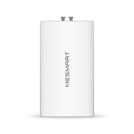</td>
      <td>Smart Module for Electric Switch</td>
      <td>The electric switch smart connector can be connected to watering devices, valves and sound and light alarms, with open and close functions</td>
      <td>881878.switch.ddkgznljq</td>
      <td></td>
    </tr>
    <tr>
      <th>2015</th>
      <td></td>
      <td>Smart Switch (Double)</td>
      <td></td>
      <td>cchome.switch.86l2v1</td>
      <td></td>
    </tr>
    <tr>
      <th>2016</th>
      <td></td>
      <td>Smart Switch (Single)</td>
      <td></td>
      <td>cchome.switch.86l1v1</td>
      <td></td>
    </tr>
    <tr>
      <th>2017</th>
      <td></td>
      <td>Smart Switch (Three)</td>
      <td></td>
      <td>cchome.switch.86l3v1</td>
      <td></td>
    </tr>
    <tr>
      <th>2018</th>
      <td></td>
      <td>Smart Switch WIFI X</td>
      <td>3-digit smart switch WIFI X version</td>
      <td>leshi.switch.v0001</td>
      <td></td>
    </tr>
    <tr>
      <th>2019</th>
      <td></td>
      <td>Smart Wall Switch (Zero Fire Wire Three-Key Version)</td>
      <td></td>
      <td>lumi.switch.b3n01</td>
      <td></td>
    </tr>
    <tr>
      <th>2020</th>
      <td></td>
      <td>Smart Wall Switch D1 (Single FireWire Three Button Version)</td>
      <td></td>
      <td>lumi.switch.b3lacn02</td>
      <td></td>
    </tr>
    <tr>
      <th>2021</th>
      <td></td>
      <td>Smart Wall Switch H1 (Single FireWire Double Button Version)</td>
      <td></td>
      <td>lumi.switch.l2acn1</td>
      <td></td>
    </tr>
    <tr>
      <th>2022</th>
      <td></td>
      <td>Smart Wall Switch H1 (Single FireWire Three Button Version)</td>
      <td></td>
      <td>lumi.switch.l3acn1</td>
      <td></td>
    </tr>
    <tr>
      <th>2023</th>
      <td></td>
      <td>Smart Wall Switch H1 (Zero Fire Double Button)</td>
      <td></td>
      <td>lumi.switch.n2acn1</td>
      <td></td>
    </tr>
    <tr>
      <th>2024</th>
      <td></td>
      <td>Smart Wall Switch H1 (Zero Fire Wire Three Button Version)</td>
      <td></td>
      <td>lumi.switch.n3acn1</td>
      <td></td>
    </tr>
    <tr>
      <th>2025</th>
      <td></td>
      <td>Smart Wall Switch T1 (Zero Fire Wire Double Button Version)</td>
      <td></td>
      <td>lumi.switch.b2nacn01</td>
      <td></td>
    </tr>
    <tr>
      <th>2026</th>
      <td></td>
      <td>Smart panel</td>
      <td></td>
      <td>juzi.switch.010101</td>
      <td></td>
    </tr>
    <tr>
      <th>2027</th>
      <td></td>
      <td>Smart scene panel switch S1 double version</td>
      <td></td>
      <td>lumi.controller.n4acn3</td>
      <td></td>
    </tr>
    <tr>
      <th>2028</th>
      <td></td>
      <td>Smart scene panel switch S1 single version</td>
      <td></td>
      <td>lumi.controller.n4acn2</td>
      <td></td>
    </tr>
    <tr>
      <th>2029</th>
      <td></td>
      <td>Smart scene panel switch S1 three-open version</td>
      <td></td>
      <td>lumi.controller.n4acn4</td>
      <td></td>
    </tr>
    <tr>
      <th>2030</th>
      <td></td>
      <td>Smart scene panel switch S1 three-open version</td>
      <td></td>
      <td>lumi.switch.n4acn4</td>
      <td>ZNCJMB14LM</td>
    </tr>
    <tr>
      <th>2031</th>
      <td></td>
      <td>Smart socket</td>
      <td></td>
      <td>lwkj.switch.2410</td>
      <td></td>
    </tr>
    <tr>
      <th>2032</th>
      <td></td>
      <td>Smart socket</td>
      <td>Smart socket supports switch and power statistics function</td>
      <td>yszj.switch.2410</td>
      <td></td>
    </tr>
    <tr>
      <th>2033</th>
      <td></td>
      <td>Smart switch</td>
      <td>Smart scene switch switch</td>
      <td>ecloud.switch.eq</td>
      <td></td>
    </tr>
    <tr>
      <th>2034</th>
      <td></td>
      <td>Smart switch</td>
      <td></td>
      <td>etlink.switch.swt001</td>
      <td></td>
    </tr>
    <tr>
      <th>2035</th>
      <td></td>
      <td>Smart touch switch double button</td>
      <td></td>
      <td>kiwik.switch.kt2</td>
      <td></td>
    </tr>
    <tr>
      <th>2036</th>
      <td></td>
      <td>Smart touch switch single button</td>
      <td></td>
      <td>kiwik.switch.kt1</td>
      <td></td>
    </tr>
    <tr>
      <th>2037</th>
      <td></td>
      <td>Smart touch switch three keys</td>
      <td></td>
      <td>kiwik.switch.kt3</td>
      <td></td>
    </tr>
    <tr>
      <th>2038</th>
      <td></td>
      <td>Smart wall switch D1 (zero fire wire three-button version)</td>
      <td></td>
      <td>lumi.switch.b3nacn02</td>
      <td></td>
    </tr>
    <tr>
      <th>2039</th>
      <td></td>
      <td>Smart wall switch H1 (single live wire single key version)</td>
      <td></td>
      <td>lumi.switch.l1acn1</td>
      <td></td>
    </tr>
    <tr>
      <th>2040</th>
      <td></td>
      <td>Smart wall switch H1 (zero fire wire one-key version)</td>
      <td></td>
      <td>lumi.switch.n1acn1</td>
      <td></td>
    </tr>
    <tr>
      <th>2041</th>
      <td></td>
      <td>Smart wall switch T1 (single live wire double key version)</td>
      <td></td>
      <td>lumi.switch.b2lacn01</td>
      <td></td>
    </tr>
    <tr>
      <th>2042</th>
      <td></td>
      <td>Smart wall switch T1 (single live wire single key version)</td>
      <td></td>
      <td>lumi.switch.b1lacn01</td>
      <td></td>
    </tr>
    <tr>
      <th>2043</th>
      <td></td>
      <td>Smart wall switch T1 (zero fire wire single key version)</td>
      <td></td>
      <td>lumi.switch.b1nacn01</td>
      <td></td>
    </tr>
    <tr>
      <th>2044</th>
      <td></td>
      <td>SmartJoy Zhizhen wall switch (one key Mesh)</td>
      <td></td>
      <td>smartj.switch.sjlh1s</td>
      <td></td>
    </tr>
    <tr>
      <th>2045</th>
      <td></td>
      <td>SmartJoy Zhizhen wall switch (three key Mesh)</td>
      <td></td>
      <td>smartj.switch.sjlh3s</td>
      <td></td>
    </tr>
    <tr>
      <th>2046</th>
      <td></td>
      <td>SmartJoy Zhizhen wall switch (two key Mesh)</td>
      <td></td>
      <td>smartj.switch.sjlh2s</td>
      <td></td>
    </tr>
    <tr>
      <th>2047</th>
      <td></td>
      <td>SmartJoy wisdom at wall switch (Three key WiFi)</td>
      <td>SmartJoy Wall Switch (Zero Fire Three Button WiFi Version)</td>
      <td>smartj.switch.sjlh3e</td>
      <td></td>
    </tr>
    <tr>
      <th>2048</th>
      <td></td>
      <td>SmartJoy wisdom at wall switch (one key WiFi)</td>
      <td>SmartJoy Wall Switch (Zero Fire One-Key WiFi Version)</td>
      <td>smartj.switch.sjlh1e</td>
      <td></td>
    </tr>
    <tr>
      <th>2049</th>
      <td></td>
      <td>SmartJoy wisdom at wall switch (two key WiFi)</td>
      <td>SmartJoy Wall Switch (Zero Fire Dual Button WiFi Version)</td>
      <td>smartj.switch.sjlh2e</td>
      <td></td>
    </tr>
    <tr>
      <th>2050</th>
      <td></td>
      <td>SmartJoy zhijian wall switch (one key WiFi)</td>
      <td>SmartJoy Smart Wall Switch (Zero Fire One Button WiFi Version)</td>
      <td>smartj.switch.sjlh01</td>
      <td></td>
    </tr>
    <tr>
      <th>2051</th>
      <td></td>
      <td>SmartJoy zhijian wall switch (three key WiFi )</td>
      <td>SmartJoy Wall Switch (Zero Fire Three Button WiFi Version) White/Black/Gray/Gold</td>
      <td>smartj.switch.sjlh03</td>
      <td></td>
    </tr>
    <tr>
      <th>2052</th>
      <td></td>
      <td>SmartJoy zhijian wall switch (two key WiFi)</td>
      <td>SmartJoy Wall Switch (Zero Fire Dual Button WiFi Version)</td>
      <td>smartj.switch.sjlh02</td>
      <td></td>
    </tr>
    <tr>
      <th>2053</th>
      <td></td>
      <td>SmartSwitch</td>
      <td>There are three types of smart switches: one-way/two-way/three-way. They are mainly used to connect traditional lamps or small appliances. They can be used in conjunction with the "Shizaizhiguanjia" APP to control lamps and appliances anytime and anywhere, making family life safer and more convenient. The APP supports one-click scenario triggering, device linkage, and group control functions. It also supports local area network device sharing and cloud account device sharing, which is convenient for home users.</td>
      <td>oge.switch.seetime0300</td>
      <td></td>
    </tr>
    <tr>
      <th>2054</th>
      <td></td>
      <td>Sumi A1 Bluetooth mesh switch (double key)</td>
      <td></td>
      <td>090615.switch.smbt02</td>
      <td></td>
    </tr>
    <tr>
      <th>2055</th>
      <td></td>
      <td>Sumi A1 Bluetooth mesh switch (single key)</td>
      <td>Smart mesh switch, smart group control.</td>
      <td>090615.switch.smbt01</td>
      <td></td>
    </tr>
    <tr>
      <th>2056</th>
      <td></td>
      <td>Sumi A1 Bluetooth mesh switch (three key)</td>
      <td></td>
      <td>090615.switch.smbt03</td>
      <td></td>
    </tr>
    <tr>
      <th>2057</th>
      <td></td>
      <td>Sumi B1 Bluetooth mesh switch (double key)</td>
      <td></td>
      <td>090615.switch.smb1s2</td>
      <td></td>
    </tr>
    <tr>
      <th>2058</th>
      <td></td>
      <td>Sumi B1 Bluetooth mesh switch (single key)</td>
      <td>Smart mesh switch, smart group control.</td>
      <td>090615.switch.smb1s1</td>
      <td></td>
    </tr>
    <tr>
      <th>2059</th>
      <td></td>
      <td>Sumi B1 Bluetooth mesh switch (three key)</td>
      <td></td>
      <td>090615.switch.smb1s3</td>
      <td></td>
    </tr>
    <tr>
      <th>2060</th>
      <td></td>
      <td>Super switch</td>
      <td></td>
      <td>p2c.switch.201144</td>
      <td></td>
    </tr>
    <tr>
      <th>2061</th>
      <td></td>
      <td>Switch</td>
      <td>There are three types of smart switches: one-way/two-way/three-way. They are mainly used to connect traditional lamps or small appliances. They can be used in conjunction with the "Shizaizhiguanjia" APP to control lamps and appliances anytime and anywhere, making family life safer and more convenient. The APP supports one-click scenario triggering, device linkage, and group control functions. It also supports local area network device sharing and cloud account device sharing, which is convenient for home users.</td>
      <td>chuan.switch.0300</td>
      <td></td>
    </tr>
    <tr>
      <th>2062</th>
      <td></td>
      <td>Switch</td>
      <td>switch</td>
      <td>ezhome.switch.zhyapp01</td>
      <td></td>
    </tr>
    <tr>
      <th>2063</th>
      <td></td>
      <td>Switch</td>
      <td></td>
      <td>zengge.switch.switch</td>
      <td></td>
    </tr>
    <tr>
      <th>2064</th>
      <td></td>
      <td>Switch 5</td>
      <td>switch</td>
      <td>permay.switch.pmswch</td>
      <td></td>
    </tr>
    <tr>
      <th>2065</th>
      <td></td>
      <td>Switch Breaker WIFI X</td>
      <td>Switch on-off device WIFI X version</td>
      <td>leshi.switch.v002</td>
      <td></td>
    </tr>
    <tr>
      <th>2066</th>
      <td></td>
      <td>Switch control board</td>
      <td></td>
      <td>ufun.switch.board</td>
      <td></td>
    </tr>
    <tr>
      <th>2067</th>
      <td></td>
      <td>Switch with restart</td>
      <td>Switch with restart</td>
      <td>smyoo.switch.syn020</td>
      <td></td>
    </tr>
    <tr>
      <th>2068</th>
      <td></td>
      <td>Terncy Wall Switch</td>
      <td></td>
      <td>terncy.switch.ws01</td>
      <td></td>
    </tr>
    <tr>
      <th>2069</th>
      <td>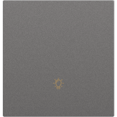</td>
      <td>The future is a single-key strong current switch</td>
      <td>Wired connection</td>
      <td>bymiot.switch.1keyv1</td>
      <td></td>
    </tr>
    <tr>
      <th>2070</th>
      <td></td>
      <td>The future is home to double-key power switch</td>
      <td>Wired connection</td>
      <td>bymiot.switch.2keyv1</td>
      <td></td>
    </tr>
    <tr>
      <th>2071</th>
      <td></td>
      <td>ThoughtHome Switch module</td>
      <td></td>
      <td>babai.switch.th01a</td>
      <td></td>
    </tr>
    <tr>
      <th>2072</th>
      <td></td>
      <td>Three Intelligent switch (WIFI)</td>
      <td>Three-position smart switch, APP smart control</td>
      <td>090615.switch.switch03</td>
      <td></td>
    </tr>
    <tr>
      <th>2073</th>
      <td></td>
      <td>Three Key Touch Switch X1 (WiFi)</td>
      <td>3-digit touch switch WiFi version</td>
      <td>leshi.switch.sw3b01</td>
      <td></td>
    </tr>
    <tr>
      <th>2074</th>
      <td></td>
      <td>Three button switch</td>
      <td></td>
      <td>lxk.switch.klsjkg</td>
      <td></td>
    </tr>
    <tr>
      <th>2075</th>
      <td></td>
      <td>Three button switch</td>
      <td>Three-button wall smart switch</td>
      <td>lxk.switch.sanjkg</td>
      <td></td>
    </tr>
    <tr>
      <th>2076</th>
      <td></td>
      <td>Three button wall switch</td>
      <td></td>
      <td>ddwl.switch.030003</td>
      <td></td>
    </tr>
    <tr>
      <th>2077</th>
      <td></td>
      <td>Three button wall switch</td>
      <td></td>
      <td>mpkx.switch.030003</td>
      <td></td>
    </tr>
    <tr>
      <th>2078</th>
      <td></td>
      <td>Three button wall switch</td>
      <td></td>
      <td>nvcls.switch.030003</td>
      <td></td>
    </tr>
    <tr>
      <th>2079</th>
      <td></td>
      <td>Three button wall switch</td>
      <td></td>
      <td>sykj.switch.030003</td>
      <td></td>
    </tr>
    <tr>
      <th>2080</th>
      <td></td>
      <td>Three button wall switch</td>
      <td></td>
      <td>szsy.switch.030003</td>
      <td></td>
    </tr>
    <tr>
      <th>2081</th>
      <td></td>
      <td>Three way switch</td>
      <td></td>
      <td>bright.switch.double</td>
      <td></td>
    </tr>
    <tr>
      <th>2082</th>
      <td></td>
      <td>Three way switch</td>
      <td></td>
      <td>milamp.switch.3lkg</td>
      <td></td>
    </tr>
    <tr>
      <th>2083</th>
      <td></td>
      <td>Three way switch</td>
      <td>Three-way combination switch, including mechanical combination switch, touch switch, 2.4G switch</td>
      <td>scmkcz.switch.3msw</td>
      <td></td>
    </tr>
    <tr>
      <th>2084</th>
      <td></td>
      <td>Three-button Smart Switch (Mesh)</td>
      <td>Three Button Smart Switch-RTL8762-Light Touch</td>
      <td>lemesh.switch.sw3a02</td>
      <td></td>
    </tr>
    <tr>
      <th>2085</th>
      <td></td>
      <td>Three-key power switch in the future</td>
      <td>Wired connection</td>
      <td>bymiot.switch.3keyv1</td>
      <td></td>
    </tr>
    <tr>
      <th>2086</th>
      <td></td>
      <td>Three-position touch switch panel</td>
      <td>86 type touch switch panel, the bottom box uses flame-retardant PVC, zero live wire switch, rated power: between 3 and 1200W, working voltage: AC220V  15%.</td>
      <td>ezhome.switch.z4003</td>
      <td></td>
    </tr>
    <tr>
      <th>2087</th>
      <td></td>
      <td>Two Intelligent Switch (WIFI)</td>
      <td>Two intelligent switches, APP intelligent control.</td>
      <td>090615.switch.switch02</td>
      <td></td>
    </tr>
    <tr>
      <th>2088</th>
      <td></td>
      <td>Two Key Touch Switch X1 (WiFi)</td>
      <td>2-digit tact switch WiFi version</td>
      <td>leshi.switch.sw2b01</td>
      <td></td>
    </tr>
    <tr>
      <th>2089</th>
      <td></td>
      <td>Two keys smart switch WIFI X1</td>
      <td>2 bit smart switch WIFI X1 version</td>
      <td>leshi.switch.v0002</td>
      <td></td>
    </tr>
    <tr>
      <th>2090</th>
      <td></td>
      <td>Two touch switch panel</td>
      <td>86 type touch switch panel, the bottom box uses flame-retardant PVC, zero live wire switch, rated power: between 3 and 1200W, working voltage: AC220V  15%.</td>
      <td>ezhome.switch.z4002</td>
      <td></td>
    </tr>
    <tr>
      <th>2091</th>
      <td></td>
      <td>Two way switch</td>
      <td></td>
      <td>bright.switch.switch</td>
      <td></td>
    </tr>
    <tr>
      <th>2092</th>
      <td></td>
      <td>Two way switch</td>
      <td></td>
      <td>milamp.switch.2lkg</td>
      <td></td>
    </tr>
    <tr>
      <th>2093</th>
      <td></td>
      <td>Two way switch</td>
      <td>Two-way switch (including combination switch CMSW, TMSW, and 2.4G CRSW and other models)</td>
      <td>scmkcz.switch.2msw</td>
      <td></td>
    </tr>
    <tr>
      <th>2094</th>
      <td></td>
      <td>Two-button Smart Switch (Mesh)</td>
      <td>Two-button smart switch-RTL8762-light touch</td>
      <td>lemesh.switch.sw2a02</td>
      <td></td>
    </tr>
    <tr>
      <th>2095</th>
      <td></td>
      <td>Two-button switch</td>
      <td>Two-button wall smart switch</td>
      <td>lxk.switch.sjkg</td>
      <td></td>
    </tr>
    <tr>
      <th>2096</th>
      <td></td>
      <td>Two-button wall switch</td>
      <td></td>
      <td>ddwl.switch.030002</td>
      <td></td>
    </tr>
    <tr>
      <th>2097</th>
      <td></td>
      <td>Two-button wall switch</td>
      <td></td>
      <td>mpkx.switch.030002</td>
      <td></td>
    </tr>
    <tr>
      <th>2098</th>
      <td></td>
      <td>Two-button wall switch</td>
      <td></td>
      <td>nvcls.switch.030002</td>
      <td></td>
    </tr>
    <tr>
      <th>2099</th>
      <td></td>
      <td>Two-button wall switch</td>
      <td></td>
      <td>sykj.switch.030002</td>
      <td></td>
    </tr>
    <tr>
      <th>2100</th>
      <td></td>
      <td>Two-button wall switch</td>
      <td></td>
      <td>szsy.switch.030002</td>
      <td></td>
    </tr>
    <tr>
      <th>2101</th>
      <td></td>
      <td>WIFI Switch</td>
      <td>Zhengguo Smart WIFI Wall Switch</td>
      <td>zinguo.switch.k2</td>
      <td></td>
    </tr>
    <tr>
      <th>2102</th>
      <td></td>
      <td>Wall Switch (Single FireWire, Single Key Version) (US Version)</td>
      <td></td>
      <td>lumi.switch.b1laus01</td>
      <td>WS-USC01</td>
    </tr>
    <tr>
      <th>2103</th>
      <td></td>
      <td>Wall Switch (Single Firewire and Dual Key Version) (US Version)</td>
      <td></td>
      <td>lumi.switch.b2laus01</td>
      <td>WS-USC02</td>
    </tr>
    <tr>
      <th>2104</th>
      <td></td>
      <td>Wall Switch (Zero Fire Wire Double Key Version) (US Version)</td>
      <td></td>
      <td>lumi.switch.b2naus01</td>
      <td>WS-USC04</td>
    </tr>
    <tr>
      <th>2105</th>
      <td></td>
      <td>Wall Switch (Zero Fire Wire Single Key Version) (US Version)</td>
      <td></td>
      <td>lumi.switch.b1naus01</td>
      <td></td>
    </tr>
    <tr>
      <th>2106</th>
      <td></td>
      <td>Wall socket</td>
      <td></td>
      <td>nvcls.switch.010001</td>
      <td></td>
    </tr>
    <tr>
      <th>2107</th>
      <td></td>
      <td>Wall switch (single live wire three key version)</td>
      <td></td>
      <td>lumi.switch.b3l01</td>
      <td></td>
    </tr>
    <tr>
      <th>2108</th>
      <td></td>
      <td>Wall switch (zero fire wire one-touch version)</td>
      <td></td>
      <td>lumi.ctrl_ln1.es1</td>
      <td></td>
    </tr>
    <tr>
      <th>2109</th>
      <td></td>
      <td>Wall switch (zero fire wire two-key version)</td>
      <td></td>
      <td>lumi.ctrl_ln2.es1</td>
      <td></td>
    </tr>
    <tr>
      <th>2110</th>
      <td></td>
      <td>Wall switch double button</td>
      <td></td>
      <td>xqh.switch.a20121</td>
      <td></td>
    </tr>
    <tr>
      <th>2111</th>
      <td></td>
      <td>Wall switch single button</td>
      <td></td>
      <td>xqh.switch.a20111</td>
      <td></td>
    </tr>
    <tr>
      <th>2112</th>
      <td></td>
      <td>Wall switch single live wire double key version</td>
      <td></td>
      <td>lumi.ctrl_neutral2.aq1</td>
      <td></td>
    </tr>
    <tr>
      <th>2113</th>
      <td></td>
      <td>Wall switch single live wire double key version</td>
      <td></td>
      <td>lumi.ctrl_neutral2.es1</td>
      <td></td>
    </tr>
    <tr>
      <th>2114</th>
      <td></td>
      <td>Wall switch single live wire single key version</td>
      <td></td>
      <td>lumi.ctrl_neutral1.aq1</td>
      <td></td>
    </tr>
    <tr>
      <th>2115</th>
      <td></td>
      <td>Wall switch single live wire single key version</td>
      <td></td>
      <td>lumi.ctrl_neutral1.es1</td>
      <td></td>
    </tr>
    <tr>
      <th>2116</th>
      <td></td>
      <td>Wall switch single live wire single key version</td>
      <td>Wall switch single live wire single key version</td>
      <td>lumi.switch.v1</td>
      <td></td>
    </tr>
    <tr>
      <th>2117</th>
      <td></td>
      <td>Wall switch three keys</td>
      <td></td>
      <td>xqh.switch.a20131</td>
      <td></td>
    </tr>
    <tr>
      <th>2118</th>
      <td></td>
      <td>Wall touch switch 1</td>
      <td></td>
      <td>creiot.switch.kg1</td>
      <td></td>
    </tr>
    <tr>
      <th>2119</th>
      <td></td>
      <td>Wall touch switch 1</td>
      <td></td>
      <td>lxk.switch.kg1</td>
      <td></td>
    </tr>
    <tr>
      <th>2120</th>
      <td></td>
      <td>Wall touch switch 2</td>
      <td></td>
      <td>creiot.switch.kg2</td>
      <td></td>
    </tr>
    <tr>
      <th>2121</th>
      <td></td>
      <td>Wall touch switch 2</td>
      <td></td>
      <td>lxk.switch.kg2</td>
      <td></td>
    </tr>
    <tr>
      <th>2122</th>
      <td></td>
      <td>Wall touch switch-3</td>
      <td></td>
      <td>creiot.switch.kg3</td>
      <td></td>
    </tr>
    <tr>
      <th>2123</th>
      <td></td>
      <td>Water leakage protector</td>
      <td>Water leakage protector</td>
      <td>pingke.switch.7b01</td>
      <td></td>
    </tr>
    <tr>
      <th>2124</th>
      <td></td>
      <td>Wi-Fi Smart Wall Switch</td>
      <td>"Support Xiao Ai" certification review equipment</td>
      <td>coolki.switch.t3uk1c</td>
      <td></td>
    </tr>
    <tr>
      <th>2125</th>
      <td></td>
      <td>Wi-Fi Smart Wall Switch</td>
      <td>"Support Xiao Ai" certification review equipment</td>
      <td>coolki.switch.t3uk2c</td>
      <td></td>
    </tr>
    <tr>
      <th>2126</th>
      <td></td>
      <td>Wi-Fi Smart Wall Switch</td>
      <td>"Support Xiao Ai" certification review equipment</td>
      <td>coolki.switch.t3uk3c</td>
      <td></td>
    </tr>
    <tr>
      <th>2127</th>
      <td></td>
      <td>Wi-Fi Switch</td>
      <td>Ordinary Wi-Fi switch</td>
      <td>tuya.switch.tyws02</td>
      <td></td>
    </tr>
    <tr>
      <th>2128</th>
      <td></td>
      <td>WiFi Wall Switch A1</td>
      <td></td>
      <td>babai.switch.bb101s</td>
      <td></td>
    </tr>
    <tr>
      <th>2129</th>
      <td></td>
      <td>WiFi Wall Switch A2</td>
      <td></td>
      <td>babai.switch.bb102s</td>
      <td></td>
    </tr>
    <tr>
      <th>2130</th>
      <td></td>
      <td>WiFi Wall Switch A3</td>
      <td></td>
      <td>babai.switch.bb103s</td>
      <td></td>
    </tr>
    <tr>
      <th>2131</th>
      <td></td>
      <td>WiFi smart switch</td>
      <td></td>
      <td>mhiot.switch.mc01w</td>
      <td></td>
    </tr>
    <tr>
      <th>2132</th>
      <td></td>
      <td>WiFi socket_metered version</td>
      <td>GN_Y201G</td>
      <td>bull.switch.bull01</td>
      <td></td>
    </tr>
    <tr>
      <th>2133</th>
      <td></td>
      <td>WiFi socket_non-metered version</td>
      <td>GN_Y2012</td>
      <td>bull.switch.001</td>
      <td></td>
    </tr>
    <tr>
      <th>2134</th>
      <td></td>
      <td>Wireless switch</td>
      <td>wireless switch</td>
      <td>lumi.sensor_switch.v1</td>
      <td></td>
    </tr>
    <tr>
      <th>2135</th>
      <td></td>
      <td>Xiaoyan scene switch</td>
      <td>Xiaoyan scene switch</td>
      <td>terncy.switch.scene</td>
      <td></td>
    </tr>
    <tr>
      <th>2136</th>
      <td></td>
      <td>Xiaoyan switch module</td>
      <td></td>
      <td>terncy.switch.tsm01</td>
      <td></td>
    </tr>
    <tr>
      <th>2137</th>
      <td></td>
      <td>Xinguang Bluetooth mesh switch</td>
      <td></td>
      <td>wainft.switch.sw0a01</td>
      <td></td>
    </tr>
    <tr>
      <th>2138</th>
      <td></td>
      <td>Yaguan access test</td>
      <td>Test switch access</td>
      <td>yaguan.switch.test</td>
      <td></td>
    </tr>
    <tr>
      <th>2139</th>
      <td></td>
      <td>Yeelight Smart Dual Control Module</td>
      <td></td>
      <td>yeelink.switch.sw1</td>
      <td>YLAI002</td>
    </tr>
    <tr>
      <th>2140</th>
      <td></td>
      <td>Yihuijia Smart Switch</td>
      <td>Yihuijia Smart Switch</td>
      <td>evecca.switch.sw001a</td>
      <td></td>
    </tr>
    <tr>
      <th>2141</th>
      <td></td>
      <td>Yihuijia smart doors and windows products</td>
      <td>Yihuijia smart door and window products are connected to Xiaoai</td>
      <td>evecca.switch.evecca</td>
      <td></td>
    </tr>
    <tr>
      <th>2142</th>
      <td></td>
      <td>Yuba switch (105)</td>
      <td></td>
      <td>coolki.switch.uid105</td>
      <td></td>
    </tr>
    <tr>
      <th>2143</th>
      <td></td>
      <td>Yuba switch (new)</td>
      <td></td>
      <td>coolki.switch.ui105</td>
      <td></td>
    </tr>
    <tr>
      <th>2144</th>
      <td></td>
      <td>Yunmi wireless switch inkRock (single button version)</td>
      <td></td>
      <td>viomi.switch.s1</td>
      <td></td>
    </tr>
    <tr>
      <th>2145</th>
      <td></td>
      <td>Zhiru Yiyun Docking Switch</td>
      <td>Zhiru Yiyun docking switch three keys</td>
      <td>roome.switch.v2</td>
      <td></td>
    </tr>
    <tr>
      <th>2146</th>
      <td></td>
      <td>Zhiru Yiyun Docking Switch</td>
      <td>Zhiru Yiyun docking switch single key</td>
      <td>roome.switch.v3</td>
      <td></td>
    </tr>
    <tr>
      <th>2147</th>
      <td></td>
      <td>Zhiru Yiyun Docking Switch</td>
      <td>Zhiru Yiyun docking switch two keys</td>
      <td>roome.switch.v4</td>
      <td></td>
    </tr>
    <tr>
      <th>2148</th>
      <td></td>
      <td>Zhiyun IoT</td>
      <td>Use Xiao Ai to remotely control your smart home devices.</td>
      <td>espush.switch.zy01</td>
      <td></td>
    </tr>
    <tr>
      <th>2149</th>
      <td></td>
      <td>ZigBee One Panel Switch</td>
      <td></td>
      <td>scinan.switch.panel</td>
      <td></td>
    </tr>
    <tr>
      <th>2150</th>
      <td></td>
      <td>ZigBee One Wall Switch</td>
      <td></td>
      <td>yuerzj.switch.yuers1</td>
      <td></td>
    </tr>
    <tr>
      <th>2151</th>
      <td></td>
      <td>delian_kaiguan</td>
      <td></td>
      <td>delian.switch.delian</td>
      <td></td>
    </tr>
    <tr>
      <th>2152</th>
      <td></td>
      <td>dfg</td>
      <td></td>
      <td>heiman.switch.hs2sw</td>
      <td></td>
    </tr>
    <tr>
      <th>2153</th>
      <td></td>
      <td>e108</td>
      <td>One way gateway switch</td>
      <td>ipuray.switch.e108</td>
      <td></td>
    </tr>
    <tr>
      <th>2154</th>
      <td></td>
      <td>e112</td>
      <td>Multi-way switch, four controls all the way</td>
      <td>ipuray.switch.e112</td>
      <td></td>
    </tr>
    <tr>
      <th>2155</th>
      <td></td>
      <td>e370</td>
      <td>Inductive switch</td>
      <td>ipuray.switch.e370</td>
      <td></td>
    </tr>
    <tr>
      <th>2156</th>
      <td></td>
      <td>e380</td>
      <td>Gateway switch</td>
      <td>ipuray.switch.e380</td>
      <td></td>
    </tr>
    <tr>
      <th>2157</th>
      <td></td>
      <td>gsm_switch_four</td>
      <td>GSM four-channel switch</td>
      <td>coolki.switch.uiid31</td>
      <td></td>
    </tr>
    <tr>
      <th>2158</th>
      <td></td>
      <td>gsm_switch_one</td>
      <td>GSM single channel switch</td>
      <td>coolki.switch.uiid24</td>
      <td></td>
    </tr>
    <tr>
      <th>2159</th>
      <td></td>
      <td>gsm_switch_three</td>
      <td>GSM three-channel switch</td>
      <td>coolki.switch.uiid30</td>
      <td></td>
    </tr>
    <tr>
      <th>2160</th>
      <td></td>
      <td>gsm_switch_two</td>
      <td>GSM dual channel switch</td>
      <td>coolki.switch.uiid29</td>
      <td></td>
    </tr>
    <tr>
      <th>2161</th>
      <td></td>
      <td>julun smart switch</td>
      <td></td>
      <td>julun.switch.jlsw01</td>
      <td></td>
    </tr>
    <tr>
      <th>2162</th>
      <td></td>
      <td>light</td>
      <td>Control the light on and off, adjust off and adjust brightness</td>
      <td>zunder.light.zun111</td>
      <td></td>
    </tr>
    <tr>
      <th>2163</th>
      <td></td>
      <td>modification_switch_one</td>
      <td>Switch retrofit module (single channel switch)</td>
      <td>coolki.switch.uiid14</td>
      <td></td>
    </tr>
    <tr>
      <th>2164</th>
      <td></td>
      <td>one gang smart switch</td>
      <td>Embedded zigbee standard protocol module, ultra-low power consumption, ultra-long standby, and high stability.Intelligent linkage of various scenes can automatically switch corresponding circuits according to environmental changes.</td>
      <td>feibit.switch.tzsw21hb</td>
      <td></td>
    </tr>
    <tr>
      <th>2165</th>
      <td></td>
      <td>out</td>
      <td>Control point socket on and off</td>
      <td>zunder.switch.onoff</td>
      <td></td>
    </tr>
    <tr>
      <th>2166</th>
      <td></td>
      <td>plug_four</td>
      <td>Four channel switch</td>
      <td>coolki.switch.four</td>
      <td></td>
    </tr>
    <tr>
      <th>2167</th>
      <td></td>
      <td>smart light</td>
      <td>smart light</td>
      <td>zhu123.switch.1</td>
      <td></td>
    </tr>
    <tr>
      <th>2168</th>
      <td></td>
      <td>smart lighting panel</td>
      <td>One-button, control Match the OHH intelligent gateway to achieve the following functions: At the same time, go home in the evening, linkage intelligent switch controls the highlights of the porch or air-conditioned TV. The corridor is turned on when the person passes, and after passing, it is closed. Kitchen, bathroom or landlift light, you can close in the bedroom, Multiple lighting is turned on or off, Control smart switch via voice conversation, Control or observe the real-time state of the lights through the mobile phone APP. Timed control light switch, etc. Support relay 315, 433 radio frequency equipment</td>
      <td>ohh.switch.slc03w</td>
      <td></td>
    </tr>
    <tr>
      <th>2169</th>
      <td></td>
      <td>smart pulg</td>
      <td>0000-0101-0001</td>
      <td>huihe.switch.plug</td>
      <td></td>
    </tr>
    <tr>
      <th>2170</th>
      <td></td>
      <td>switch</td>
      <td>Smart switch</td>
      <td>bzhome.switch.sz010</td>
      <td></td>
    </tr>
    <tr>
      <th>2171</th>
      <td></td>
      <td>switch</td>
      <td>switch</td>
      <td>cgzn.switch.onoff</td>
      <td></td>
    </tr>
    <tr>
      <th>2172</th>
      <td></td>
      <td>switch</td>
      <td>General switchgear</td>
      <td>dctrls.switch.test1</td>
      <td></td>
    </tr>
    <tr>
      <th>2173</th>
      <td></td>
      <td>switch</td>
      <td></td>
      <td>deocea.switch.cq</td>
      <td></td>
    </tr>
    <tr>
      <th>2174</th>
      <td></td>
      <td>switch</td>
      <td>Single</td>
      <td>fine.switch.switch</td>
      <td></td>
    </tr>
    <tr>
      <th>2175</th>
      <td></td>
      <td>switch</td>
      <td></td>
      <td>girt.switch.switch</td>
      <td></td>
    </tr>
    <tr>
      <th>2176</th>
      <td></td>
      <td>switch</td>
      <td></td>
      <td>giz.switch.switch</td>
      <td></td>
    </tr>
    <tr>
      <th>2177</th>
      <td></td>
      <td>switch</td>
      <td></td>
      <td>hbkj1.switch.v1</td>
      <td></td>
    </tr>
    <tr>
      <th>2178</th>
      <td></td>
      <td>switch</td>
      <td>Switchgear</td>
      <td>hosjoy.switch.hoc</td>
      <td></td>
    </tr>
    <tr>
      <th>2179</th>
      <td></td>
      <td>switch</td>
      <td>No certification trademark required</td>
      <td>ihome.switch.switch</td>
      <td></td>
    </tr>
    <tr>
      <th>2180</th>
      <td></td>
      <td>switch</td>
      <td>Infrared relay switch</td>
      <td>ikecin.switch.ir10</td>
      <td></td>
    </tr>
    <tr>
      <th>2181</th>
      <td></td>
      <td>switch</td>
      <td></td>
      <td>jusval.switch.1</td>
      <td></td>
    </tr>
    <tr>
      <th>2182</th>
      <td></td>
      <td>switch</td>
      <td></td>
      <td>jyx.switch.000201</td>
      <td></td>
    </tr>
    <tr>
      <th>2183</th>
      <td></td>
      <td>switch</td>
      <td>1. Control switch</td>
      <td>kongke.switch.light</td>
      <td></td>
    </tr>
    <tr>
      <th>2184</th>
      <td></td>
      <td>switch</td>
      <td></td>
      <td>mkzn.switch.switch</td>
      <td></td>
    </tr>
    <tr>
      <th>2185</th>
      <td></td>
      <td>switch</td>
      <td></td>
      <td>orvibo.switch.switch</td>
      <td></td>
    </tr>
    <tr>
      <th>2186</th>
      <td></td>
      <td>switch</td>
      <td></td>
      <td>permay.switch.kgkgk</td>
      <td></td>
    </tr>
    <tr>
      <th>2187</th>
      <td></td>
      <td>switch</td>
      <td>Smart switch, touch switch</td>
      <td>scmkcz.switch.chsw</td>
      <td></td>
    </tr>
    <tr>
      <th>2188</th>
      <td></td>
      <td>switch</td>
      <td></td>
      <td>tyzhjt.switch.000001</td>
      <td></td>
    </tr>
    <tr>
      <th>2189</th>
      <td></td>
      <td>switch</td>
      <td></td>
      <td>wfiot.switch.switch</td>
      <td></td>
    </tr>
    <tr>
      <th>2190</th>
      <td></td>
      <td>switch</td>
      <td></td>
      <td>xinrui.switch.lh001</td>
      <td></td>
    </tr>
    <tr>
      <th>2191</th>
      <td></td>
      <td>switch</td>
      <td>switch</td>
      <td>xzh.switch.onoff</td>
      <td></td>
    </tr>
    <tr>
      <th>2192</th>
      <td></td>
      <td>switch</td>
      <td></td>
      <td>ykkj.switch.ykm121</td>
      <td></td>
    </tr>
    <tr>
      <th>2193</th>
      <td></td>
      <td>switch</td>
      <td>switch</td>
      <td>yongqi.switch.yq0001</td>
      <td></td>
    </tr>
    <tr>
      <th>2194</th>
      <td></td>
      <td>switch panel</td>
      <td>Light switch</td>
      <td>wxzn.switch.801438</td>
      <td></td>
    </tr>
    <tr>
      <th>2195</th>
      <td></td>
      <td>switch'</td>
      <td></td>
      <td>zhimai.switch.zm004</td>
      <td></td>
    </tr>
    <tr>
      <th>2196</th>
      <td></td>
      <td>switch78</td>
      <td>Single channel switch (new protocol)</td>
      <td>coolki.switch.uiid78</td>
      <td></td>
    </tr>
    <tr>
      <th>2197</th>
      <td></td>
      <td>switch_four</td>
      <td>Four channel switch</td>
      <td>zhihw.switch.uiid9</td>
      <td></td>
    </tr>
    <tr>
      <th>2198</th>
      <td></td>
      <td>switch_one</td>
      <td>Single channel switch</td>
      <td>coolki.switch.test</td>
      <td></td>
    </tr>
    <tr>
      <th>2199</th>
      <td></td>
      <td>switch_one</td>
      <td>Single channel switch</td>
      <td>zhihw.switch.uiid6</td>
      <td></td>
    </tr>
    <tr>
      <th>2200</th>
      <td></td>
      <td>switch_three</td>
      <td>Three-channel switch</td>
      <td>coolki.switch.three</td>
      <td></td>
    </tr>
    <tr>
      <th>2201</th>
      <td></td>
      <td>switch_three</td>
      <td>Three-channel switch</td>
      <td>zhihw.switch.uiid8</td>
      <td></td>
    </tr>
    <tr>
      <th>2202</th>
      <td></td>
      <td>switch_two</td>
      <td>Dual channel switch</td>
      <td>coolki.switch.two</td>
      <td></td>
    </tr>
    <tr>
      <th>2203</th>
      <td></td>
      <td>switch_two</td>
      <td>Dual channel switch</td>
      <td>zhihw.switch.uiid7</td>
      <td></td>
    </tr>
    <tr>
      <th>2204</th>
      <td></td>
      <td>synIOT switch 1 key</td>
      <td>1-position smart switch</td>
      <td>syniot.switch.s1</td>
      <td></td>
    </tr>
    <tr>
      <th>2205</th>
      <td></td>
      <td>synIOT switch 2 key</td>
      <td>Two position switch</td>
      <td>syniot.switch.s2</td>
      <td></td>
    </tr>
    <tr>
      <th>2206</th>
      <td></td>
      <td>synIOT switch 3 key</td>
      <td></td>
      <td>syniot.switch.s3</td>
      <td></td>
    </tr>
    <tr>
      <th>2207</th>
      <td></td>
      <td>touch-panel</td>
      <td>Touch panel</td>
      <td>ezhome.switch.zhyapp03</td>
      <td></td>
    </tr>
    <tr>
      <th>2208</th>
      <td></td>
      <td>wireless switch</td>
      <td></td>
      <td>hsmart.switch.hs2sw</td>
      <td></td>
    </tr>
  </tbody>
</table>

## Temperature & humidity sensor
<table border="1" class="dataframe">
  <thead>
    <tr style="text-align: right;">
      <th></th>
      <th>Pic</th>
      <th>Name</th>
      <th>Description</th>
      <th>Model</th>
      <th>Product Number</th>
    </tr>
  </thead>
  <tbody>
    <tr>
      <th>2209</th>
      <td></td>
      <td>Air detector</td>
      <td>Applicable to Xiaoai students to get first-hand information about your indoor air quality.</td>
      <td>espush.sensor_ht.es03</td>
      <td></td>
    </tr>
    <tr>
      <th>2210</th>
      <td></td>
      <td>Aqara Temperature and Humidity Sensor</td>
      <td>Aqara temperature and humidity + barometric pressure sensor Aqara weather station (temperature humidity and pressure sensor)</td>
      <td>lumi.weather.v1</td>
      <td>WSDCGQ11LM</td>
    </tr>
    <tr>
      <th>2211</th>
      <td></td>
      <td>Aqara Temperature and Humidity Sensor T1</td>
      <td>Aqara temperature and humidity + barometric pressure sensor Aqara weather station (temperature humidity and pressure sensor)</td>
      <td>lumi.sensor_ht.agl02</td>
      <td>WSDCGQ12LM</td>
    </tr>
    <tr>
      <th>2212</th>
      <td></td>
      <td>CUBE Environmental Sensor</td>
      <td>LifeSmart multi-function environmental sensor is a radio frequency sensor that can provide temperature and humidity</td>
      <td>lfsmt.sensor_ht.ls063wh</td>
      <td></td>
    </tr>
    <tr>
      <th>2213</th>
      <td></td>
      <td>GFH</td>
      <td></td>
      <td>heiman.sensor_ht.hs2th</td>
      <td></td>
    </tr>
    <tr>
      <th>2214</th>
      <td></td>
      <td>Humidifier</td>
      <td></td>
      <td>bright.sensor_ht.humit</td>
      <td></td>
    </tr>
    <tr>
      <th>2215</th>
      <td></td>
      <td>Humidifier</td>
      <td></td>
      <td>milamp.sensor_ht.sensor</td>
      <td></td>
    </tr>
    <tr>
      <th>2216</th>
      <td></td>
      <td>Humidity Sensor</td>
      <td>1. Obtain the current environmental humidity in real time 2.View historical humidity data</td>
      <td>kongke.sensor_ht.humi</td>
      <td></td>
    </tr>
    <tr>
      <th>2217</th>
      <td></td>
      <td>LEE GUITARS Bluetooth Thermo-Hygrometer</td>
      <td></td>
      <td>cgllc.sensor_ht.cgm1</td>
      <td></td>
    </tr>
    <tr>
      <th>2218</th>
      <td></td>
      <td>Mi Temperature and Humidity Monitor</td>
      <td>Mijia Bluetooth Thermometer</td>
      <td>cleargrass.sensor_ht.dk1</td>
      <td>CGG1</td>
    </tr>
    <tr>
      <th>2219</th>
      <td></td>
      <td>Mi Temperature and Humidity Monitor 2</td>
      <td>Mijia Thermo-hygrometer Mini is a Bluetooth-enabled thermo-hygrometer, which uses LCD screen to display the current temperature and humidity, which is small and cute.Mini can connect to Mijia Bluetooth gateway and interact with other smart devices.</td>
      <td>miaomiaoce.sensor_ht.t2</td>
      <td></td>
    </tr>
    <tr>
      <th>2220</th>
      <td></td>
      <td>Mi Temperature and Humidity Monitor Digital Clock</td>
      <td>Mijia Bluetooth Thermometer 2 is a thermometer and hygrometer with time display function.The device uses the Elink screen, which can display the time very clearly.The device has Bluetooth, which can be connected to the bound Bluetooth device point-to-point, and can be used as a timing screen for electric toothbrushes, electric kettles, etc.</td>
      <td>miaomiaoce.sensor_ht.t1</td>
      <td>LYWSD03MMC/NUN4106CN/NUN4126GL</td>
    </tr>
    <tr>
      <th>2221</th>
      <td></td>
      <td>Mi Temperature and Humidity Sensor</td>
      <td>Multi-function gateway sub-device</td>
      <td>lumi.sensor_ht.v1</td>
      <td>WSDCGQ01LM</td>
    </tr>
    <tr>
      <th>2222</th>
      <td></td>
      <td>Qingping Temp & RH Monitor</td>
      <td>8253</td>
      <td>cgllc.sensor_ht.qpg1</td>
      <td></td>
    </tr>
    <tr>
      <th>2223</th>
      <td></td>
      <td>Qingping Temp & RH Monitor Lite</td>
      <td>Duck2</td>
      <td>cgllc.sensor_ht.dk2</td>
      <td></td>
    </tr>
    <tr>
      <th>2224</th>
      <td></td>
      <td>Qingping Temp & RH Monitor M Version</td>
      <td>832</td>
      <td>cgllc.sensor_ht.g1</td>
      <td></td>
    </tr>
    <tr>
      <th>2225</th>
      <td></td>
      <td>Temperature Sensor</td>
      <td>Get the current ambient temperature in real time View historical temperature values</td>
      <td>kongke.sensor_ht.temp</td>
      <td></td>
    </tr>
    <tr>
      <th>2226</th>
      <td></td>
      <td>Temperature and humidity sensor</td>
      <td>Real-time sensing of indoor temperature and humidity, sensing linkage with home temperature control equipment, setting the best indoor temperature and humidity environment.</td>
      <td>feibit.sensor_ht.fzb870</td>
      <td></td>
    </tr>
    <tr>
      <th>2227</th>
      <td></td>
      <td>Temperature and humidity sensor</td>
      <td>Temperature and humidity sensor</td>
      <td>fine.sensor_ht.th</td>
      <td></td>
    </tr>
    <tr>
      <th>2228</th>
      <td></td>
      <td>Temperature and humidity sensor</td>
      <td></td>
      <td>hsmart.sensor_ht.hs2th</td>
      <td></td>
    </tr>
    <tr>
      <th>2229</th>
      <td></td>
      <td>Temperature and humidity sensor</td>
      <td>Temperature and humidity sensor JRSensor_WSDC_1 JRSensor_WDC_1</td>
      <td>jrnet.sensor_ht.senws1</td>
      <td></td>
    </tr>
    <tr>
      <th>2230</th>
      <td></td>
      <td>Temperature and humidity sensor</td>
      <td></td>
      <td>jyx.sensor_ht.030201</td>
      <td></td>
    </tr>
    <tr>
      <th>2231</th>
      <td></td>
      <td>Xunming Thermometer</td>
      <td></td>
      <td>sxmiot.sensor_ht.th0001</td>
      <td></td>
    </tr>
    <tr>
      <th>2232</th>
      <td>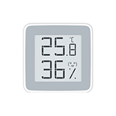</td>
      <td>ZenMeasure Bluetooth Hygrometer Thermometer</td>
      <td>The thermometer and hygrometer with Bluetooth can remotely check the temperature. Temperature measurement range: 0 C-+60 C Temperature accuracy: 0.3 C Humidity measurement range: 0-100% Humidity accuracy: 3%RH</td>
      <td>miaomiaoce.sensor_ht.h1</td>
      <td></td>
    </tr>
    <tr>
      <th>2233</th>
      <td></td>
      <td>Zigbee sub-device temperature and humidity sensor (1770)</td>
      <td></td>
      <td>coolki.sensor_ht.ui1770</td>
      <td></td>
    </tr>
    <tr>
      <th>2234</th>
      <td></td>
      <td>sensor</td>
      <td></td>
      <td>bemfa.sensor_ht.dht11</td>
      <td></td>
    </tr>
    <tr>
      <th>2235</th>
      <td></td>
      <td>sensor</td>
      <td></td>
      <td>zhimai.sensor_ht.zm003</td>
      <td></td>
    </tr>
  </tbody>
</table>

## Video doorbell
<table border="1" class="dataframe">
  <thead>
    <tr style="text-align: right;">
      <th></th>
      <th>Pic</th>
      <th>Name</th>
      <th>Description</th>
      <th>Model</th>
      <th>Product Number</th>
    </tr>
  </thead>
  <tbody>
    <tr>
      <th>2236</th>
      <td></td>
      <td>Dling Smart Video Doorbell C3</td>
      <td>Ding zero doorbell 720p, battery version</td>
      <td>madv.cateye.dlowlse</td>
      <td></td>
    </tr>
    <tr>
      <th>2237</th>
      <td></td>
      <td>Dling Smart Video Doorbell C5</td>
      <td>Ding zero doorbell 1080p, battery version</td>
      <td>madv.cateye.dlowlse2</td>
      <td></td>
    </tr>
    <tr>
      <th>2238</th>
      <td></td>
      <td>Dling Smart Video Doorbell E3</td>
      <td>Ding Zero Smart Video Doorbell E3</td>
      <td>madv.cateye.dlowle</td>
      <td></td>
    </tr>
    <tr>
      <th>2239</th>
      <td></td>
      <td>Dling Smart Video Doorbell Plus</td>
      <td>The smart video doorbell enhancement is a door to the door to let you miss the speaker's smart device.The visitors are tapped by the doorbell. When you are at home, the indoor chance sounds a wonderful ring tone reminder. When you are not at home, the smart doorbell will send your mobile phone to the mobile phone, and you can see the visitors after connecting, and talk to it.</td>
      <td>madv.cateye.dlowlplus</td>
      <td></td>
    </tr>
    <tr>
      <th>2240</th>
      <td></td>
      <td>IMILAB Intelligent Door Visual System H1</td>
      <td>Xiaobai Smart Door Visual System H1</td>
      <td>chuangmi.cateye.ipc508</td>
      <td></td>
    </tr>
    <tr>
      <th>2241</th>
      <td></td>
      <td>Mi Smart Video Doorbell</td>
      <td>Xiaomi Mijia video doorbell is a door to do not miss the speaker's smart device.The visitors are tapped by the doorbell. When you are at home, the indoor chance sounds a wonderful ring tone reminder. When you are not at home, the smart doorbell will send your mobile phone to the mobile phone, and you can see the visitors after connecting, and talk to it.</td>
      <td>madv.cateye.miowl</td>
      <td></td>
    </tr>
    <tr>
      <th>2242</th>
      <td></td>
      <td>Mi Smart Video Doorbell 2</td>
      <td>Xiaomi Smart Doorbell 2 (Hong Kong and Taiwan Version)</td>
      <td>madv.cateye.mi2gt</td>
      <td></td>
    </tr>
    <tr>
      <th>2243</th>
      <td></td>
      <td>Mi Smart Video Doorbell 2</td>
      <td>Xiaomi Smart Doorbell 2</td>
      <td>madv.cateye.miowlv2</td>
      <td></td>
    </tr>
    <tr>
      <th>2244</th>
      <td></td>
      <td>Mi Smart Video Doorbell 2 Lite</td>
      <td>Xiaomi Smart Doorbell 2 Lite</td>
      <td>madv.cateye.miowlv2l</td>
      <td></td>
    </tr>
    <tr>
      <th>2245</th>
      <td></td>
      <td>Uodi Smart Doorbell R1</td>
      <td>Photo doorbell</td>
      <td>ydhome.cateye.pr1</td>
      <td></td>
    </tr>
    <tr>
      <th>2246</th>
      <td></td>
      <td>Xiaomo Smart Video Doorbell</td>
      <td>Cost-effective high-value video doorbell</td>
      <td>mxiang.cateye.mdb10</td>
      <td></td>
    </tr>
    <tr>
      <th>2247</th>
      <td></td>
      <td>dling Smart Video Doorbell</td>
      <td>The smart video doorbell is an installed at home, so you will not miss the speaker's smart device.The visitors are tapped by the doorbell. When you are at home, the indoor chance sounds a wonderful ring tone reminder. When you are not at home, the smart doorbell will send your mobile phone to the mobile phone, and you can see the visitors after connecting, and talk to it.</td>
      <td>madv.cateye.dlowl</td>
      <td></td>
    </tr>
    <tr>
      <th>2248</th>
      <td></td>
      <td>imilab video doorbell</td>
      <td>Xiaobai Smart Video Doorbell</td>
      <td>chuangmi.cateye.i023a01</td>
      <td></td>
    </tr>
  </tbody>
</table>

## Water leak sensor
<table border="1" class="dataframe">
  <thead>
    <tr style="text-align: right;">
      <th></th>
      <th>Pic</th>
      <th>Name</th>
      <th>Description</th>
      <th>Model</th>
      <th>Product Number</th>
    </tr>
  </thead>
  <tbody>
    <tr>
      <th>2249</th>
      <td></td>
      <td>Aqara Water Leak Sensor T1</td>
      <td>Sensor to detect water immersion</td>
      <td>lumi.flood.agl02</td>
      <td>SJCGQ12LM</td>
    </tr>
    <tr>
      <th>2250</th>
      <td></td>
      <td>Mi Flood Detector</td>
      <td>The Mijia Bluetooth water sensor can monitor the status of your water system and detect the occurrence of water leakage.When detecting that the water level reaches 1 mm, the flood sensor will trigger the linked Mijia gateway to sound an alarm and send a notification to your Mijia app.</td>
      <td>lumi.flood.bmcn01</td>
      <td>SJWS01LM</td>
    </tr>
    <tr>
      <th>2251</th>
      <td></td>
      <td>Water Leak Sensor</td>
      <td>Sensor to detect water immersion</td>
      <td>lumi.sensor_wleak.aq1</td>
      <td>SJCGQ11LM</td>
    </tr>
  </tbody>
</table>

## Wireless switch
<table border="1" class="dataframe">
  <thead>
    <tr style="text-align: right;">
      <th></th>
      <th>Pic</th>
      <th>Name</th>
      <th>Description</th>
      <th>Model</th>
      <th>Product Number</th>
    </tr>
  </thead>
  <tbody>
    <tr>
      <th>2252</th>
      <td></td>
      <td>Aqara Wireless Mini Switch</td>
      <td>Aqara wireless switch iterative version, the new growth is based on function.</td>
      <td>lumi.remote.b1acn01</td>
      <td>WXKG11LM</td>
    </tr>
    <tr>
      <th>2253</th>
      <td></td>
      <td>Aqara Wireless Mini Switch</td>
      <td>Wireless switch, can generate events such as single-click and double-click</td>
      <td>lumi.sensor_switch.aq2</td>
      <td>WXKG11LM</td>
    </tr>
    <tr>
      <th>2254</th>
      <td></td>
      <td>Aqara Wireless Mini Switch (Advanced)</td>
      <td>Aqara wireless switch upgrade version, support shake function</td>
      <td>lumi.sensor_switch.aq3</td>
      <td>WXKG12LM</td>
    </tr>
    <tr>
      <th>2255</th>
      <td></td>
      <td>Mi Wireless Switch</td>
      <td>Wireless switch 2</td>
      <td>lumi.sensor_switch.v2</td>
      <td>WXKG01LM</td>
    </tr>
    <tr>
      <th>2256</th>
      <td></td>
      <td>Wireless Scene Switch (Four Button Edition)</td>
      <td>Wireless scene switch based on Zigbee 3.0, four-key version.Button support: single click, double click, long press, with a separate reset button.</td>
      <td>lumi.remote.b486opcn01</td>
      <td>WXCJKG12LM</td>
    </tr>
    <tr>
      <th>2257</th>
      <td></td>
      <td>Wireless Scene Switch (Two Button Edition)</td>
      <td>Wireless scene switch based on Zigbee 3.0, two-key version.Button support: single click, double click, long press, with a separate reset button.</td>
      <td>lumi.remote.b286opcn01</td>
      <td>WXCJKG11LM</td>
    </tr>
    <tr>
      <th>2258</th>
      <td></td>
      <td>Youdian Smart Bluetooth Mesh Switch</td>
      <td>Three open</td>
      <td>ydhome.switch.s1</td>
      <td></td>
    </tr>
    <tr>
      <th>2259</th>
      <td></td>
      <td>Youdian Smart Bluetooth Mesh Switch</td>
      <td>Two open</td>
      <td>ydhome.switch.s2</td>
      <td></td>
    </tr>
    <tr>
      <th>2260</th>
      <td></td>
      <td>Youdian Smart Bluetooth Mesh Switch</td>
      <td>Opened</td>
      <td>ydhome.switch.s3</td>
      <td></td>
    </tr>
  </tbody>
</table>

## Wireless switch (cube version)
<table border="1" class="dataframe">
  <thead>
    <tr style="text-align: right;">
      <th></th>
      <th>Pic</th>
      <th>Name</th>
      <th>Description</th>
      <th>Model</th>
      <th>Product Number</th>
    </tr>
  </thead>
  <tbody>
    <tr>
      <th>2261</th>
      <td></td>
      <td>Aqara Cube</td>
      <td>Sensor equipment based on zigbee technology can produce 6 different actions, which can be used as automatic trigger conditions to control other electrical equipment.</td>
      <td>lumi.sensor_cube.aqgl01</td>
      <td>MFKZQ01LM</td>
    </tr>
  </tbody>
</table>

## Wireless switch six-button version
<table border="1" class="dataframe">
  <thead>
    <tr style="text-align: right;">
      <th></th>
      <th>Pic</th>
      <th>Name</th>
      <th>Description</th>
      <th>Model</th>
      <th>Product Number</th>
    </tr>
  </thead>
  <tbody>
    <tr>
      <th>2262</th>
      <td></td>
      <td>Wireless Scene Switch (Six Button Edition)</td>
      <td>Wireless scene switch based on Zigbee 3.0, six-key version.Button support: single click, double click, long press, with a separate reset button.</td>
      <td>lumi.remote.b686opcn01</td>
      <td>WXCJKG13LM</td>
    </tr>
  </tbody>
</table>

---
# Kitchen appliances
## Coffee maker
<table border="1" class="dataframe">
  <thead>
    <tr style="text-align: right;">
      <th></th>
      <th>Pic</th>
      <th>Name</th>
      <th>Description</th>
      <th>Model</th>
      <th>Product Number</th>
    </tr>
  </thead>
  <tbody>
    <tr>
      <th>2263</th>
      <td></td>
      <td>SCISHARE Smart Capsule Coffee Machine</td>
      <td>One-click control coffee machine, three different functions, can directly produce concentrated coffee, American coffee, hot water, and add control operations to control the coffee machine switch, cleaning, adjustment parameters.</td>
      <td>scishare.coffee.s1102</td>
      <td>Scishare S1102</td>
    </tr>
  </tbody>
</table>

## Electric kettle
<table border="1" class="dataframe">
  <thead>
    <tr style="text-align: right;">
      <th></th>
      <th>Pic</th>
      <th>Name</th>
      <th>Description</th>
      <th>Model</th>
      <th>Product Number</th>
    </tr>
  </thead>
  <tbody>
    <tr>
      <th>2264</th>
      <td></td>
      <td>Drinking fountain</td>
      <td>Water dispenser WD01Ei</td>
      <td>lxk.kettle.ysj</td>
      <td>WD01Ei</td>
    </tr>
    <tr>
      <th>2265</th>
      <td></td>
      <td>Kettle</td>
      <td></td>
      <td>ghome.kettle.sf009</td>
      <td></td>
    </tr>
    <tr>
      <th>2266</th>
      <td></td>
      <td>MORFUN Smart Instant Heating Water Dispenser</td>
      <td></td>
      <td>morfun.kettle.mf809</td>
      <td></td>
    </tr>
    <tr>
      <th>2267</th>
      <td></td>
      <td>Mi Smart Kettle</td>
      <td></td>
      <td>yunmi.kettle.v1</td>
      <td></td>
    </tr>
    <tr>
      <th>2268</th>
      <td></td>
      <td>Mi Smart Kettle</td>
      <td>International Edition</td>
      <td>yunmi.kettle.v2</td>
      <td></td>
    </tr>
    <tr>
      <th>2269</th>
      <td></td>
      <td>Mi Smart Kettle</td>
      <td>Taiwan Version Mijia Thermostatic Electric Kettle</td>
      <td>yunmi.kettle.v3</td>
      <td></td>
    </tr>
    <tr>
      <th>2270</th>
      <td></td>
      <td>Mi Smart Kettle</td>
      <td>Korean version</td>
      <td>yunmi.kettle.v5</td>
      <td></td>
    </tr>
    <tr>
      <th>2271</th>
      <td></td>
      <td>Mi Smart Kettle Pro</td>
      <td>Mijia Thermostatic Electric Kettle Pro Hong Kong Version</td>
      <td>yunmi.kettle.v10</td>
      <td></td>
    </tr>
    <tr>
      <th>2272</th>
      <td></td>
      <td>Mi Smart Kettle Pro</td>
      <td>Mijia Thermostatic Electric Kettle Pro Korean Version</td>
      <td>yunmi.kettle.v11</td>
      <td></td>
    </tr>
    <tr>
      <th>2273</th>
      <td></td>
      <td>Mi Smart Kettle Pro</td>
      <td>Mijia Thermostatic Electric Kettle Pro Distribution Edition</td>
      <td>yunmi.kettle.v12</td>
      <td></td>
    </tr>
    <tr>
      <th>2274</th>
      <td></td>
      <td>Mi Smart Kettle Pro</td>
      <td>Mijia Thermostatic Electric Kettle 2nd Generation</td>
      <td>yunmi.kettle.v9</td>
      <td></td>
    </tr>
    <tr>
      <th>2275</th>
      <td></td>
      <td>VIOMI Smart Instant Heating Water Dispenser</td>
      <td>Yunmi Smart Instant Drinking Water Bar</td>
      <td>yunmi.kettle.r5</td>
      <td></td>
    </tr>
    <tr>
      <th>2276</th>
      <td></td>
      <td>Viomi Instant Heating Water Dispenser</td>
      <td>ESP32-WROOM-02D SPEC access</td>
      <td>yunmi.kettle.r7</td>
      <td></td>
    </tr>
    <tr>
      <th>2277</th>
      <td></td>
      <td>Viomi smart kettle</td>
      <td>Yunmi Thermostatic Electric Kettle Pro International Version</td>
      <td>yunmi.kettle.v6</td>
      <td></td>
    </tr>
    <tr>
      <th>2278</th>
      <td></td>
      <td>Viomi smart kettle</td>
      <td>Yunmi thermostatic kettle international version on Mijia app</td>
      <td>yunmi.kettle.v7</td>
      <td></td>
    </tr>
    <tr>
      <th>2279</th>
      <td></td>
      <td>drinking</td>
      <td>Water dispenser WD01Ei</td>
      <td>golden.kettle.wd01ei</td>
      <td>WD01Ei</td>
    </tr>
  </tbody>
</table>

## Exhaust hood
<table border="1" class="dataframe">
  <thead>
    <tr style="text-align: right;">
      <th></th>
      <th>Pic</th>
      <th>Name</th>
      <th>Description</th>
      <th>Model</th>
      <th>Product Number</th>
    </tr>
  </thead>
  <tbody>
    <tr>
      <th>2280</th>
      <td></td>
      <td>CXW-200-EMD1T.MI</td>
      <td></td>
      <td>fotile.hood.emd1tmi</td>
      <td></td>
    </tr>
    <tr>
      <th>2281</th>
      <td></td>
      <td>Exhaust Hood & Stovetop</td>
      <td>Mijia Smoke Stove</td>
      <td>viomi.hood.v1</td>
      <td></td>
    </tr>
    <tr>
      <th>2282</th>
      <td></td>
      <td>Hood</td>
      <td></td>
      <td>hxrcj.hood.e5</td>
      <td></td>
    </tr>
    <tr>
      <th>2283</th>
      <td></td>
      <td>Hood</td>
      <td>The first generation large screen hood N909i</td>
      <td>lxk.hood.n909i</td>
      <td></td>
    </tr>
    <tr>
      <th>2284</th>
      <td></td>
      <td>Hood</td>
      <td>Hood N913i</td>
      <td>lxk.hood.n913i</td>
      <td></td>
    </tr>
    <tr>
      <th>2285</th>
      <td></td>
      <td>Hood</td>
      <td>The first generation large screen hood N909i</td>
      <td>lxk.hood.yj</td>
      <td></td>
    </tr>
    <tr>
      <th>2286</th>
      <td></td>
      <td>Mi Smart Side-Draft Range Hood</td>
      <td>Mijia Internet Smoke Stove 2nd Generation</td>
      <td>viomi.hood.v2</td>
      <td></td>
    </tr>
    <tr>
      <th>2287</th>
      <td></td>
      <td>Ocooker</td>
      <td></td>
      <td>xckj.hood.s9001</td>
      <td></td>
    </tr>
    <tr>
      <th>2288</th>
      <td></td>
      <td>Ocooker</td>
      <td>z90 device</td>
      <td>xckj.hood.z9001</td>
      <td></td>
    </tr>
    <tr>
      <th>2289</th>
      <td></td>
      <td>Range hood EM52.i</td>
      <td></td>
      <td>hzft.hood.em52i</td>
      <td></td>
    </tr>
    <tr>
      <th>2290</th>
      <td></td>
      <td>VIOMI Smart Rang Hood Cross</td>
      <td>Yunmi Smart Range Hood Cross</td>
      <td>viomi.hood.c1</td>
      <td></td>
    </tr>
    <tr>
      <th>2291</th>
      <td></td>
      <td>Viomi Internet Hood Flash</td>
      <td>MIoT-Spec development access</td>
      <td>viomi.hood.h5</td>
      <td></td>
    </tr>
    <tr>
      <th>2292</th>
      <td></td>
      <td>Viomi Internet Hood Flash Pro</td>
      <td>MIoT-Spec protocol access</td>
      <td>viomi.hood.c4</td>
      <td></td>
    </tr>
    <tr>
      <th>2293</th>
      <td></td>
      <td>Viomi Internet Hood VK 707</td>
      <td>MIOT_Spec protocol</td>
      <td>viomi.hood.c8</td>
      <td></td>
    </tr>
    <tr>
      <th>2294</th>
      <td></td>
      <td>Viomi Internet hood Hurri standard</td>
      <td>Internet Range Hood Hurri Standard Edition</td>
      <td>viomi.hood.h1</td>
      <td></td>
    </tr>
    <tr>
      <th>2295</th>
      <td></td>
      <td>Viomi Smart Hood</td>
      <td>Miot_Spec protocol access</td>
      <td>viomi.hood.c7</td>
      <td></td>
    </tr>
    <tr>
      <th>2296</th>
      <td></td>
      <td>Viomi Smart Hood (European style)</td>
      <td>Yunmi Internet Range Hood</td>
      <td>viomi.hood.a9</td>
      <td></td>
    </tr>
    <tr>
      <th>2297</th>
      <td></td>
      <td>Viomi Smart Hood (VC302)</td>
      <td>MIoT-Spec access</td>
      <td>viomi.hood.a11</td>
      <td></td>
    </tr>
    <tr>
      <th>2298</th>
      <td></td>
      <td>Viomi Smart Hood (VC303)</td>
      <td>MIoT-Spec access</td>
      <td>viomi.hood.a12</td>
      <td></td>
    </tr>
    <tr>
      <th>2299</th>
      <td></td>
      <td>Viomi Smart Hood (VK501)</td>
      <td>MIoT-Spec access</td>
      <td>viomi.hood.c3</td>
      <td></td>
    </tr>
    <tr>
      <th>2300</th>
      <td></td>
      <td>Viomi Smart Hood Cross 2</td>
      <td>Yunmi Internet Range Hood Cross2</td>
      <td>viomi.hood.c2</td>
      <td></td>
    </tr>
    <tr>
      <th>2301</th>
      <td></td>
      <td>Viomi Smart Hood Free 3</td>
      <td>Yunmi Internet Range Hood Free3</td>
      <td>viomi.hood.a10</td>
      <td></td>
    </tr>
    <tr>
      <th>2302</th>
      <td></td>
      <td>Viomi Smart Hood Hurri 2</td>
      <td>Yunmi Internet Range Hood Hurri2</td>
      <td>viomi.hood.h3</td>
      <td></td>
    </tr>
    <tr>
      <th>2303</th>
      <td></td>
      <td>Viomi Smart Hood Wing</td>
      <td>Original name: Yunmi Internet Range Hood Hurri2C</td>
      <td>viomi.hood.h4</td>
      <td></td>
    </tr>
  </tbody>
</table>

## Formula maker
<table border="1" class="dataframe">
  <thead>
    <tr style="text-align: right;">
      <th></th>
      <th>Pic</th>
      <th>Name</th>
      <th>Description</th>
      <th>Model</th>
      <th>Product Number</th>
    </tr>
  </thead>
  <tbody>
    <tr>
      <th>2304</th>
      <td></td>
      <td>Kola Mother Smart Milking Machine</td>
      <td>Smart milk dispenser</td>
      <td>kola.milk.v1</td>
      <td></td>
    </tr>
  </tbody>
</table>

## Freezer
<table border="1" class="dataframe">
  <thead>
    <tr style="text-align: right;">
      <th></th>
      <th>Pic</th>
      <th>Name</th>
      <th>Description</th>
      <th>Model</th>
      <th>Product Number</th>
    </tr>
  </thead>
  <tbody>
    <tr>
      <th>2305</th>
      <td></td>
      <td>Ocooker Freezer</td>
      <td></td>
      <td>xckj.fridge.111wg2</td>
      <td></td>
    </tr>
  </tbody>
</table>

## Fridge
<table border="1" class="dataframe">
  <thead>
    <tr style="text-align: right;">
      <th></th>
      <th>Pic</th>
      <th>Name</th>
      <th>Description</th>
      <th>Model</th>
      <th>Product Number</th>
    </tr>
  </thead>
  <tbody>
    <tr>
      <th>2306</th>
      <td></td>
      <td>French refrigerator with four doors</td>
      <td></td>
      <td>xckj.fridge.448ws4</td>
      <td></td>
    </tr>
    <tr>
      <th>2307</th>
      <td></td>
      <td>MeiLing-Fridge</td>
      <td></td>
      <td>schmzn.fridge.ml48x</td>
      <td></td>
    </tr>
    <tr>
      <th>2308</th>
      <td></td>
      <td>Mi 4-Door Refrigerator 486L</td>
      <td>Mijia cross four-door refrigerator</td>
      <td>viomi.fridge.m1</td>
      <td></td>
    </tr>
    <tr>
      <th>2309</th>
      <td></td>
      <td>Mi Internet Refrigerator 450L</td>
      <td>ODM: Skyworth</td>
      <td>mibx2.fridge.v1</td>
      <td></td>
    </tr>
    <tr>
      <th>2310</th>
      <td></td>
      <td>Mi Internet Refrigerator 540L</td>
      <td>There are two types of 540 refrigerators.This model is a normal model, using module access, no screen.</td>
      <td>midjd6.fridge.v1</td>
      <td></td>
    </tr>
    <tr>
      <th>2311</th>
      <td></td>
      <td>Smart refrigerator for kitchen</td>
      <td>BD/BC-151WG1</td>
      <td>xckj.fridge.151wg1</td>
      <td>BC-151WG1</td>
    </tr>
    <tr>
      <th>2312</th>
      <td></td>
      <td>Viomi Internet refrigerator 21 face (side by side 450L)</td>
      <td>Yunmi Internet Refrigerator 21Face (with the door 450L)</td>
      <td>viomi.fridge.x4</td>
      <td></td>
    </tr>
    <tr>
      <th>2313</th>
      <td></td>
      <td>Viomi Internet refrigerator iLive</td>
      <td>Smart refrigerator iLive</td>
      <td>viomi.fridge.u1</td>
      <td></td>
    </tr>
    <tr>
      <th>2314</th>
      <td></td>
      <td>Viomi Internet refrigerator iLive (French style 462L)</td>
      <td>Yunmi Smart Refrigerator French iLive Voice Version</td>
      <td>viomi.fridge.v3</td>
      <td>BCD-462WMBA</td>
    </tr>
    <tr>
      <th>2315</th>
      <td></td>
      <td>Viomi Internet refrigerator iLive (side by side 545L)</td>
      <td>Yunmi Internet refrigerator ilive side door 545L</td>
      <td>viomi.fridge.u7</td>
      <td></td>
    </tr>
    <tr>
      <th>2316</th>
      <td></td>
      <td>Viomi Internet refrigerator iLive (side by side)</td>
      <td>BCD-456WMSD</td>
      <td>viomi.fridge.u2</td>
      <td>BCD-456WMSD</td>
    </tr>
    <tr>
      <th>2317</th>
      <td></td>
      <td>Viomi Refrigerator (Cross Door 408L)</td>
      <td></td>
      <td>viomi.fridge.b3</td>
      <td></td>
    </tr>
    <tr>
      <th>2318</th>
      <td></td>
      <td>Viomi Refrigerator (Cross Door 410L)</td>
      <td></td>
      <td>viomi.fridge.u35</td>
      <td></td>
    </tr>
    <tr>
      <th>2319</th>
      <td></td>
      <td>Viomi Refrigerator (Cross Door 450L)</td>
      <td></td>
      <td>viomi.fridge.u28</td>
      <td></td>
    </tr>
    <tr>
      <th>2320</th>
      <td></td>
      <td>Viomi Refrigerator (Cross Door 485L)</td>
      <td>MIoT-Spec protocol access</td>
      <td>viomi.fridge.u39</td>
      <td></td>
    </tr>
    <tr>
      <th>2321</th>
      <td></td>
      <td>Viomi Refrigerator (Cross Door 506L)</td>
      <td></td>
      <td>viomi.fridge.u36</td>
      <td></td>
    </tr>
    <tr>
      <th>2322</th>
      <td></td>
      <td>Viomi Refrigerator (Cross Door 508L)</td>
      <td></td>
      <td>viomi.fridge.u31</td>
      <td></td>
    </tr>
    <tr>
      <th>2323</th>
      <td></td>
      <td>Viomi Refrigerator (Cross Door 509L)</td>
      <td>MIoT-Spec protocol access</td>
      <td>viomi.fridge.u42</td>
      <td></td>
    </tr>
    <tr>
      <th>2324</th>
      <td></td>
      <td>Viomi Refrigerator (Cross Door 510L)</td>
      <td>Android SDK access</td>
      <td>viomi.fridge.x23</td>
      <td></td>
    </tr>
    <tr>
      <th>2325</th>
      <td></td>
      <td>Viomi Refrigerator (Cross Door 513L)</td>
      <td>MIoT-Spec protocol access</td>
      <td>viomi.fridge.u44</td>
      <td></td>
    </tr>
    <tr>
      <th>2326</th>
      <td></td>
      <td>Viomi Refrigerator (French Door 345L)</td>
      <td>Profile protocol development access</td>
      <td>viomi.fridge.u25</td>
      <td></td>
    </tr>
    <tr>
      <th>2327</th>
      <td></td>
      <td>Viomi Refrigerator (French Door 355L)</td>
      <td></td>
      <td>viomi.fridge.u29</td>
      <td></td>
    </tr>
    <tr>
      <th>2328</th>
      <td></td>
      <td>Viomi Refrigerator (French Door 445L)</td>
      <td>MIoT-Spec protocol access</td>
      <td>viomi.fridge.u43</td>
      <td></td>
    </tr>
    <tr>
      <th>2329</th>
      <td></td>
      <td>Viomi Refrigerator (French Door 508L)</td>
      <td>MIoT-Spec protocol access</td>
      <td>viomi.fridge.u45</td>
      <td></td>
    </tr>
    <tr>
      <th>2330</th>
      <td></td>
      <td>Viomi Refrigerator (SBS 528L)</td>
      <td>MI-Spec protocol access</td>
      <td>viomi.fridge.u37</td>
      <td></td>
    </tr>
    <tr>
      <th>2331</th>
      <td></td>
      <td>Viomi Refrigerator (SBS 566L)</td>
      <td></td>
      <td>viomi.fridge.u30</td>
      <td></td>
    </tr>
    <tr>
      <th>2332</th>
      <td></td>
      <td>Viomi Refrigerator (SBS 568L)</td>
      <td>MIoT-Spec protocol access</td>
      <td>viomi.fridge.u38</td>
      <td></td>
    </tr>
    <tr>
      <th>2333</th>
      <td></td>
      <td>Viomi Refrigerator (SBS 639L)</td>
      <td>MIoT-Spec protocol access</td>
      <td>viomi.fridge.u41</td>
      <td></td>
    </tr>
    <tr>
      <th>2334</th>
      <td></td>
      <td>Viomi Refrigerator (SBS456L)</td>
      <td></td>
      <td>viomi.fridge.u32</td>
      <td></td>
    </tr>
    <tr>
      <th>2335</th>
      <td></td>
      <td>Viomi Refrigerator (SBS458L)</td>
      <td></td>
      <td>viomi.fridge.b4</td>
      <td></td>
    </tr>
    <tr>
      <th>2336</th>
      <td></td>
      <td>Viomi Refrigerator (SBS630L)</td>
      <td>Android SDK access</td>
      <td>viomi.fridge.x21</td>
      <td></td>
    </tr>
    <tr>
      <th>2337</th>
      <td></td>
      <td>Viomi Refrigerator (SBS640L)</td>
      <td></td>
      <td>viomi.fridge.u34</td>
      <td></td>
    </tr>
    <tr>
      <th>2338</th>
      <td></td>
      <td>Viomi Refrigerator 21 Face (French 510L)</td>
      <td>Android SDK MIoT-Spec access</td>
      <td>viomi.fridge.x22</td>
      <td></td>
    </tr>
    <tr>
      <th>2339</th>
      <td></td>
      <td>Viomi Refrigerator 21FACE (SBS 635L)</td>
      <td></td>
      <td>viomi.fridge.x19</td>
      <td></td>
    </tr>
    <tr>
      <th>2340</th>
      <td></td>
      <td>Viomi Refrigerator 21FACE (SBS450L)</td>
      <td></td>
      <td>viomi.fridge.x17</td>
      <td></td>
    </tr>
    <tr>
      <th>2341</th>
      <td></td>
      <td>Viomi Refrigerator 21FACE (SBS456L)</td>
      <td>Android SDK access</td>
      <td>viomi.fridge.x25</td>
      <td></td>
    </tr>
    <tr>
      <th>2342</th>
      <td></td>
      <td>Viomi Refrigerator 21Face (451L)</td>
      <td>Android SDK access</td>
      <td>viomi.fridge.b5</td>
      <td></td>
    </tr>
    <tr>
      <th>2343</th>
      <td></td>
      <td>Viomi Refrigerator 21Face (516L)</td>
      <td>MIoT-Spec protocol access</td>
      <td>viomi.fridge.x14</td>
      <td></td>
    </tr>
    <tr>
      <th>2344</th>
      <td></td>
      <td>Viomi Refrigerator 21Face (520L)</td>
      <td>MIoT-Spec protocol access</td>
      <td>viomi.fridge.x13</td>
      <td></td>
    </tr>
    <tr>
      <th>2345</th>
      <td></td>
      <td>Viomi Refrigerator 21Face (CrossDoor502L)</td>
      <td></td>
      <td>viomi.fridge.x20</td>
      <td></td>
    </tr>
    <tr>
      <th>2346</th>
      <td></td>
      <td>Viomi Refrigerator 21Face (SBS 522L)</td>
      <td>Large screen access</td>
      <td>viomi.fridge.x15</td>
      <td></td>
    </tr>
    <tr>
      <th>2347</th>
      <td></td>
      <td>Viomi Refrigerator 21Face (SBS 525L-M)</td>
      <td>Yunmi Internet Refrigerator 21Face (with door 525L)</td>
      <td>viomi.fridge.x11</td>
      <td></td>
    </tr>
    <tr>
      <th>2348</th>
      <td></td>
      <td>Viomi Refrigerator iLive (French Door 416L)</td>
      <td>MIoT-Spec protocol access</td>
      <td>viomi.fridge.u40</td>
      <td></td>
    </tr>
    <tr>
      <th>2349</th>
      <td></td>
      <td>Viomi Refrigerator iLive (SBS 552L)</td>
      <td>MIoT-Spec protocol access</td>
      <td>viomi.fridge.u26</td>
      <td></td>
    </tr>
    <tr>
      <th>2350</th>
      <td></td>
      <td>Viomi Smart Refrigerator (French 516L)</td>
      <td>Android SDK access</td>
      <td>viomi.fridge.x24</td>
      <td></td>
    </tr>
    <tr>
      <th>2351</th>
      <td></td>
      <td>Viomi Smart Refrigerator (SBS 380L)</td>
      <td></td>
      <td>viomi.fridge.b1</td>
      <td></td>
    </tr>
    <tr>
      <th>2352</th>
      <td></td>
      <td>Viomi Smart Refrigerator (SBS 450L)</td>
      <td>Profile protocol development access</td>
      <td>viomi.fridge.u24</td>
      <td></td>
    </tr>
    <tr>
      <th>2353</th>
      <td></td>
      <td>Viomi Smart Refrigerator 21 Face (T-type three doors 408L)</td>
      <td>Yunmi Internet Refrigerator 21Face (T-shaped three-door 408L)</td>
      <td>viomi.fridge.x12</td>
      <td></td>
    </tr>
    <tr>
      <th>2354</th>
      <td></td>
      <td>Viomi Smart Refrigerator 21Face (502L)</td>
      <td>Android SDK access</td>
      <td>viomi.fridge.x28</td>
      <td></td>
    </tr>
    <tr>
      <th>2355</th>
      <td></td>
      <td>Viomi Smart Refrigerator 21Face (505L)</td>
      <td>Android SDK access</td>
      <td>viomi.fridge.x29</td>
      <td></td>
    </tr>
    <tr>
      <th>2356</th>
      <td></td>
      <td>Viomi Smart Refrigerator ILive BCD-398/415L</td>
      <td>Yunmi Internet Refrigerator Cross Four Doors 398/415L</td>
      <td>viomi.fridge.u17</td>
      <td></td>
    </tr>
    <tr>
      <th>2357</th>
      <td></td>
      <td>Viomi Smart Refrigerator ILive BCD-398/415WMSD</td>
      <td>Yunmi Internet Refrigerator 398/415 L Fixed Frequency</td>
      <td>viomi.fridge.u12</td>
      <td></td>
    </tr>
    <tr>
      <th>2358</th>
      <td></td>
      <td>Viomi Smart Refrigerator YMDK01</td>
      <td>MIoT-Spec protocol access</td>
      <td>viomi.fridge.x26</td>
      <td></td>
    </tr>
    <tr>
      <th>2359</th>
      <td></td>
      <td>Viomi Smart Refrigerator iLive (4-door 486L)</td>
      <td>Yunmi Internet refrigerator ilive cross four door 486L</td>
      <td>viomi.fridge.u6</td>
      <td></td>
    </tr>
    <tr>
      <th>2360</th>
      <td></td>
      <td>Viomi Smart Refrigerator iLive (Cross Four Door 415L/416L)</td>
      <td>Yunmi Internet Refrigerator iLive (Cross Four Door 415L)</td>
      <td>viomi.fridge.u13</td>
      <td></td>
    </tr>
    <tr>
      <th>2361</th>
      <td></td>
      <td>Viomi Smart Refrigerator iLive (French Style 365L)</td>
      <td>Yunmi Internet Refrigerator iLive (French 365L)</td>
      <td>viomi.fridge.u15</td>
      <td></td>
    </tr>
    <tr>
      <th>2362</th>
      <td></td>
      <td>Viomi Smart Refrigerator iLive (SBS 598L)</td>
      <td></td>
      <td>viomi.fridge.p1</td>
      <td></td>
    </tr>
    <tr>
      <th>2363</th>
      <td></td>
      <td>Viomi Smart Refrigerator iLive (SBS 603L)</td>
      <td>Open door 603L, refrigerated, freezer, no smart mode, holiday mode, quick-cooling mode, fast freezing mode,</td>
      <td>viomi.fridge.u8</td>
      <td></td>
    </tr>
    <tr>
      <th>2364</th>
      <td></td>
      <td>Viomi Smart Refrigerator iLive (side-by-side 483L)</td>
      <td>483L</td>
      <td>viomi.fridge.u4</td>
      <td></td>
    </tr>
    <tr>
      <th>2365</th>
      <td></td>
      <td>Viomi Smart Refrigerator iLive2 (Double Door 272L)</td>
      <td>Mijia refrigerator LED screen</td>
      <td>viomi.fridge.w2</td>
      <td></td>
    </tr>
    <tr>
      <th>2366</th>
      <td></td>
      <td>Viomi Smart Refrigerator iLive2 (Three Door 301L)</td>
      <td>Mijia refrigerator OLED</td>
      <td>viomi.fridge.w1</td>
      <td></td>
    </tr>
    <tr>
      <th>2367</th>
      <td></td>
      <td>Viomi Smart refrigerator 21 face (428L)</td>
      <td>Yunmi Internet Refrigerator 21Face (428L)</td>
      <td>viomi.fridge.x7</td>
      <td></td>
    </tr>
    <tr>
      <th>2368</th>
      <td></td>
      <td>Viomi smart refrigerator iLive (SBS 485L)</td>
      <td>Yunmi Internet refrigerator double door 485L</td>
      <td>viomi.fridge.u18</td>
      <td></td>
    </tr>
  </tbody>
</table>

## Hot water dispenser
<table border="1" class="dataframe">
  <thead>
    <tr style="text-align: right;">
      <th></th>
      <th>Pic</th>
      <th>Name</th>
      <th>Description</th>
      <th>Model</th>
      <th>Product Number</th>
    </tr>
  </thead>
  <tbody>
    <tr>
      <th>2369</th>
      <td></td>
      <td>VIOMI Smart Instant Heating Water Dispenser (MINI)</td>
      <td>1. Normal temperature water to boiling water does not need to be heated and stored, it is hot when used 2. User-defined water outlet temperature and water flow rate</td>
      <td>yunmi.kettle.r1</td>
      <td></td>
    </tr>
    <tr>
      <th>2370</th>
      <td></td>
      <td>VIOMI Smart Instant Heating Water Dispenser (MINI)</td>
      <td>Yunmi Smart Instant Drinking Water Bar (MINI)</td>
      <td>yunmi.kettle.r2</td>
      <td></td>
    </tr>
    <tr>
      <th>2371</th>
      <td></td>
      <td>VIOMI Smart Instant Heating Water Dispenser 1A (4L Ver.)</td>
      <td>Instant drinking water bar, segmented power heating</td>
      <td>yunmi.kettle.r3</td>
      <td></td>
    </tr>
  </tbody>
</table>

## Induction stove
<table border="1" class="dataframe">
  <thead>
    <tr style="text-align: right;">
      <th></th>
      <th>Pic</th>
      <th>Name</th>
      <th>Description</th>
      <th>Model</th>
      <th>Product Number</th>
    </tr>
  </thead>
  <tbody>
    <tr>
      <th>2372</th>
      <td></td>
      <td>Mi Dual Burner Induction Cooker</td>
      <td></td>
      <td>chunmi.ihcooker.double</td>
      <td></td>
    </tr>
    <tr>
      <th>2373</th>
      <td></td>
      <td>Mi Induction Cooker</td>
      <td>Mijia Induction Cooker-British Standard Edition</td>
      <td>chunmi.ihcooker.eg1</td>
      <td></td>
    </tr>
    <tr>
      <th>2374</th>
      <td></td>
      <td>Mi Induction Cooker</td>
      <td>Mijia induction cooker export version</td>
      <td>chunmi.ihcooker.exp1</td>
      <td></td>
    </tr>
    <tr>
      <th>2375</th>
      <td></td>
      <td>Mi Induction Cooker</td>
      <td>Mijia Induction Cooker-Hong Kong Version</td>
      <td>chunmi.ihcooker.hk1</td>
      <td></td>
    </tr>
    <tr>
      <th>2376</th>
      <td></td>
      <td>Mi Induction Cooker</td>
      <td>Mijia Induction Cooker-Korean Version</td>
      <td>chunmi.ihcooker.korea1</td>
      <td></td>
    </tr>
    <tr>
      <th>2377</th>
      <td></td>
      <td>Mi Induction Cooker</td>
      <td>Mijia Induction Cooker-Taiwan Version</td>
      <td>chunmi.ihcooker.tw1</td>
      <td></td>
    </tr>
    <tr>
      <th>2378</th>
      <td></td>
      <td>Mi Induction Cooker</td>
      <td>Mijia induction cooker</td>
      <td>chunmi.ihcooker.v1</td>
      <td>DCL01CM</td>
    </tr>
    <tr>
      <th>2379</th>
      <td></td>
      <td>Mi Induction Cooker Set Chef Nic Edition</td>
      <td></td>
      <td>chunmi.ihcooker.chefnic</td>
      <td></td>
    </tr>
    <tr>
      <th>2380</th>
      <td></td>
      <td>TOKIT Smart Induction Cooker Entry</td>
      <td></td>
      <td>tokit.ihcooker.tkv1</td>
      <td></td>
    </tr>
    <tr>
      <th>2381</th>
      <td></td>
      <td>TOKIT Smart Induction Cooker Pro</td>
      <td></td>
      <td>chunmi.ihcooker.tkpro1</td>
      <td></td>
    </tr>
    <tr>
      <th>2382</th>
      <td></td>
      <td>TOKIT Smart Induction Cooker Pro</td>
      <td></td>
      <td>tokit.ihcooker.tkpro1</td>
      <td></td>
    </tr>
    <tr>
      <th>2383</th>
      <td></td>
      <td>TOKIT-Smart induction Cooker Entry-chunmi</td>
      <td></td>
      <td>chunmi.ihcooker.tkv1</td>
      <td></td>
    </tr>
  </tbody>
</table>

## Microwave oven
<table border="1" class="dataframe">
  <thead>
    <tr style="text-align: right;">
      <th></th>
      <th>Pic</th>
      <th>Name</th>
      <th>Description</th>
      <th>Model</th>
      <th>Product Number</th>
    </tr>
  </thead>
  <tbody>
    <tr>
      <th>2384</th>
      <td></td>
      <td>Mi Smart Microwave Oven</td>
      <td></td>
      <td>chunmi.microwave.n20l01</td>
      <td></td>
    </tr>
    <tr>
      <th>2385</th>
      <td></td>
      <td>Mi Smart Microwave Oven with Grill</td>
      <td></td>
      <td>chunmi.microwave.n23l01</td>
      <td></td>
    </tr>
  </tbody>
</table>

## Rice cooker
<table border="1" class="dataframe">
  <thead>
    <tr style="text-align: right;">
      <th></th>
      <th>Pic</th>
      <th>Name</th>
      <th>Description</th>
      <th>Model</th>
      <th>Product Number</th>
    </tr>
  </thead>
  <tbody>
    <tr>
      <th>2386</th>
      <td></td>
      <td>Cooking robot</td>
      <td>Fanxiaoer rice cooking robot is an innovative smart home appliance that can intelligently store rice, automatically add rice, automatically wash rice, automatically add water, and intelligently cook rice. It can realize remote appointments, one-click rice purchase and other functions, at any time and placeYou can easily cook a pot of good rice, so you can eat good rice at home.</td>
      <td>imibar.cooker.mbihr3</td>
      <td></td>
    </tr>
    <tr>
      <th>2387</th>
      <td></td>
      <td>Mi IH Pressure Rice Cooker</td>
      <td>Mijia Pressure IH Rice Cooker</td>
      <td>chunmi.cooker.press1</td>
      <td>YLIH01CM</td>
    </tr>
    <tr>
      <th>2388</th>
      <td></td>
      <td>Mi IH Pressure Rice Cooker</td>
      <td>Mijia Pressure IH Rice Cooker</td>
      <td>chunmi.cooker.press2</td>
      <td></td>
    </tr>
    <tr>
      <th>2389</th>
      <td></td>
      <td>Mi IH Rice Cooker</td>
      <td>Mijia IH Rice Cooker-UK version</td>
      <td>chunmi.cooker.naeg1</td>
      <td></td>
    </tr>
    <tr>
      <th>2390</th>
      <td></td>
      <td>Mi IH Rice Cooker</td>
      <td>Yoneka IH Rice Cooker-Japan Version</td>
      <td>chunmi.cooker.najpn1</td>
      <td></td>
    </tr>
    <tr>
      <th>2391</th>
      <td></td>
      <td>Mi IH Rice Cooker</td>
      <td>Mijia IH Rice Cooker</td>
      <td>chunmi.cooker.normal1</td>
      <td>IHFB01CM</td>
    </tr>
    <tr>
      <th>2392</th>
      <td></td>
      <td>Mi IH Rice Cooker</td>
      <td></td>
      <td>chunmi.cooker.normal2</td>
      <td>IHFB01CM, 2016DP1293</td>
    </tr>
    <tr>
      <th>2393</th>
      <td></td>
      <td>Mi IH Rice Cooker</td>
      <td></td>
      <td>chunmi.cooker.normalcd1</td>
      <td></td>
    </tr>
    <tr>
      <th>2394</th>
      <td></td>
      <td>Mi IH Rice Cooker 4L</td>
      <td>Mijia IH Rice Cooker 4L</td>
      <td>chunmi.cooker.normal3</td>
      <td></td>
    </tr>
    <tr>
      <th>2395</th>
      <td></td>
      <td>Mi IH Rice Cooker 4L</td>
      <td>Mijia IH Rice Cooker 4L</td>
      <td>chunmi.cooker.normal4</td>
      <td></td>
    </tr>
    <tr>
      <th>2396</th>
      <td></td>
      <td>Mi IH Rice Cooker 4L</td>
      <td>Mijia IH Rice Cooker</td>
      <td>chunmi.cooker.normal5</td>
      <td></td>
    </tr>
    <tr>
      <th>2397</th>
      <td></td>
      <td>Mi IH Rice Cooker 4L</td>
      <td></td>
      <td>chunmi.cooker.normalcd2</td>
      <td></td>
    </tr>
    <tr>
      <th>2398</th>
      <td></td>
      <td>Mi Induction Heating Pressure Rice Cooker 1S</td>
      <td>Mijia Pressure IH PRO</td>
      <td>chunmi.cooker.k1pro1</td>
      <td></td>
    </tr>
    <tr>
      <th>2399</th>
      <td></td>
      <td>Mi Smart MultiCooker 1.6L</td>
      <td>Mijia rice cooker</td>
      <td>chunmi.cooker.eh1</td>
      <td>DFB201CM</td>
    </tr>
    <tr>
      <th>2400</th>
      <td></td>
      <td>Mi Smart Multicooker 4L</td>
      <td></td>
      <td>chunmi.cooker.eh402</td>
      <td></td>
    </tr>
    <tr>
      <th>2401</th>
      <td></td>
      <td>Mini Rice Cooker</td>
      <td></td>
      <td>tokit.cooker.tk20l01</td>
      <td></td>
    </tr>
    <tr>
      <th>2402</th>
      <td></td>
      <td>TOKIT Pressure IH Smart Rice Cooker</td>
      <td></td>
      <td>tokit.cooker.press1</td>
      <td></td>
    </tr>
    <tr>
      <th>2403</th>
      <td></td>
      <td>TOKIT Smart IH Rice Cooker</td>
      <td></td>
      <td>tokit.cooker.tk4001</td>
      <td></td>
    </tr>
    <tr>
      <th>2404</th>
      <td></td>
      <td>Viomi Rice Cooker (4L Premium Edition)</td>
      <td>Yunmi Internet Rice Cooker (4L Premium Edition)</td>
      <td>viomi.cooker.v2</td>
      <td></td>
    </tr>
    <tr>
      <th>2405</th>
      <td></td>
      <td>Viomi Smart IH Rice Cooker</td>
      <td>Yunmi Internet Rice Cooker</td>
      <td>viomi.cooker.v1</td>
      <td></td>
    </tr>
    <tr>
      <th>2406</th>
      <td></td>
      <td>Viomi Smart IH Rice Cooker 3L</td>
      <td>3L rice cooker spec</td>
      <td>viomi.cooker.v4</td>
      <td></td>
    </tr>
    <tr>
      <th>2407</th>
      <td></td>
      <td>Viomi Smart Rice Cooker 3L</td>
      <td>MIoT SPEC protocol</td>
      <td>viomi.cooker.v5</td>
      <td></td>
    </tr>
    <tr>
      <th>2408</th>
      <td></td>
      <td>intelligent cooking robot</td>
      <td>Unmanned cooking intelligent rice cooking robot</td>
      <td>dicook.cooker.wfz4003</td>
      <td></td>
    </tr>
  </tbody>
</table>

## Water purifier
<table border="1" class="dataframe">
  <thead>
    <tr style="text-align: right;">
      <th></th>
      <th>Pic</th>
      <th>Name</th>
      <th>Description</th>
      <th>Model</th>
      <th>Product Number</th>
    </tr>
  </thead>
  <tbody>
    <tr>
      <th>2409</th>
      <td></td>
      <td>352Water purifier K10</td>
      <td>K10 water purifier</td>
      <td>bj352.waterpuri.k10</td>
      <td></td>
    </tr>
    <tr>
      <th>2410</th>
      <td></td>
      <td>352WaterPurifierS100</td>
      <td>S100 Water Purifier Mijia Edition</td>
      <td>bj352.waterpuri.s100cm</td>
      <td></td>
    </tr>
    <tr>
      <th>2411</th>
      <td></td>
      <td>Chanitex Smart Water Purifier</td>
      <td></td>
      <td>smith.waterpuri.jnt600</td>
      <td></td>
    </tr>
    <tr>
      <th>2412</th>
      <td></td>
      <td>Circle kitchen household water purifier</td>
      <td></td>
      <td>xckj.waterpuri.js01</td>
      <td></td>
    </tr>
    <tr>
      <th>2413</th>
      <td></td>
      <td>Dimi RO water purifier 650G</td>
      <td></td>
      <td>dmaker.waterpuri.600g</td>
      <td></td>
    </tr>
    <tr>
      <th>2414</th>
      <td></td>
      <td>Mi Smart Water Purifier</td>
      <td>Xiaomi Water Purifier India Version</td>
      <td>yunmi.waterpuri.lx10</td>
      <td></td>
    </tr>
    <tr>
      <th>2415</th>
      <td></td>
      <td>Mi Water Purifier</td>
      <td>Mi Water Purifier Kitchen Top Edition (Espressif Module)</td>
      <td>yunmi.waterpuri.lx2</td>
      <td></td>
    </tr>
    <tr>
      <th>2416</th>
      <td></td>
      <td>Mi Water Purifier</td>
      <td>Mi Water Purifier Kitchen Enhanced Edition</td>
      <td>yunmi.waterpuri.lx4</td>
      <td></td>
    </tr>
    <tr>
      <th>2417</th>
      <td></td>
      <td>Mi Water Purifier</td>
      <td>Mi Water Purifier 2</td>
      <td>yunmi.waterpurifier.v2</td>
      <td></td>
    </tr>
    <tr>
      <th>2418</th>
      <td></td>
      <td>Mi Water Purifier (Under Counter)</td>
      <td>Mi water purifier under the kitchen style (Espressif module)</td>
      <td>yunmi.waterpuri.lx3</td>
      <td></td>
    </tr>
    <tr>
      <th>2419</th>
      <td></td>
      <td>Mi Water Purifier (Under Counter)</td>
      <td>Mi water purifier under the kitchen</td>
      <td>yunmi.waterpuri.lx6</td>
      <td></td>
    </tr>
    <tr>
      <th>2420</th>
      <td></td>
      <td>Mi Water Purifier (Under sink)</td>
      <td>Mi water purifier under the kitchen</td>
      <td>yunmi.waterpurifier.v3</td>
      <td></td>
    </tr>
    <tr>
      <th>2421</th>
      <td></td>
      <td>Mi Water Purifier 1A/400G Pro</td>
      <td>Mi Water Purifier II</td>
      <td>yunmi.waterpuri.lx5</td>
      <td>MR424-A</td>
    </tr>
    <tr>
      <th>2422</th>
      <td></td>
      <td>Mi Water Purifier 500G/500G Pro</td>
      <td>Mi Water Purifier 500G</td>
      <td>yunmi.waterpuri.lx7</td>
      <td></td>
    </tr>
    <tr>
      <th>2423</th>
      <td></td>
      <td>Mi Water Purifier 600G</td>
      <td>Mi Water Purifier 600G</td>
      <td>yunmi.waterpuri.lx8</td>
      <td></td>
    </tr>
    <tr>
      <th>2424</th>
      <td></td>
      <td>Mi Water Purifier C1 (Triple Setting)</td>
      <td>Mi Water Purifier C1 (three water outlets)</td>
      <td>yunmi.waterpuri.lx11</td>
      <td>MRB33</td>
    </tr>
    <tr>
      <th>2425</th>
      <td></td>
      <td>Mi Water Purifier D1</td>
      <td>Mi Water Purifier 50G</td>
      <td>yunmi.waterpuri.lx9</td>
      <td>MRC12</td>
    </tr>
    <tr>
      <th>2426</th>
      <td></td>
      <td>Mi Water Purifier H1000G</td>
      <td>MIoT-Spec protocol access</td>
      <td>yunmi.waterpuri.lx14</td>
      <td></td>
    </tr>
    <tr>
      <th>2427</th>
      <td></td>
      <td>Mi Water Purifier H400G</td>
      <td></td>
      <td>zhimi.waterpuri.ma1</td>
      <td></td>
    </tr>
    <tr>
      <th>2428</th>
      <td></td>
      <td>Mi Water Purifier H600G</td>
      <td></td>
      <td>chunmi.waterpuri.600f2</td>
      <td></td>
    </tr>
    <tr>
      <th>2429</th>
      <td></td>
      <td>Mi Water Purifier H800G</td>
      <td></td>
      <td>chunmi.waterpuri.800f3</td>
      <td></td>
    </tr>
    <tr>
      <th>2430</th>
      <td></td>
      <td>Mi Water Purifier S1</td>
      <td>Mi Water Purifier S1 800G</td>
      <td>yunmi.waterpuri.lx12</td>
      <td></td>
    </tr>
    <tr>
      <th>2431</th>
      <td></td>
      <td>Ocooker Water Purifier</td>
      <td></td>
      <td>xckj.waterpuri.ihwp01</td>
      <td></td>
    </tr>
    <tr>
      <th>2432</th>
      <td></td>
      <td>TOKIT Smart Water Purifier 600G</td>
      <td></td>
      <td>tokit.waterpuri.tkj1</td>
      <td></td>
    </tr>
    <tr>
      <th>2433</th>
      <td></td>
      <td>Uodi Cuber</td>
      <td></td>
      <td>ydzl.waterpuri.t1</td>
      <td></td>
    </tr>
    <tr>
      <th>2434</th>
      <td></td>
      <td>Viomi 1sec Instant Water Heating Purifier X1</td>
      <td>Yunmi 1 second instant hot water purifier X1 Pro</td>
      <td>yunmi.waterpuri.x7</td>
      <td></td>
    </tr>
    <tr>
      <th>2435</th>
      <td></td>
      <td>Viomi 1sec instant Water Heating Purifier X3 (Premium Version)</td>
      <td>Yunmi 1 second instant hot water purifier X3 Premium Edition</td>
      <td>yunmi.waterpuri.x2</td>
      <td></td>
    </tr>
    <tr>
      <th>2436</th>
      <td></td>
      <td>Viomi Smart Water Purifier Fast3 (400G W)</td>
      <td>MIoT-Spec protocol access</td>
      <td>yunmi.waterpuri.f1</td>
      <td></td>
    </tr>
    <tr>
      <th>2437</th>
      <td></td>
      <td>Viomi Smart Water Purifier Fast3 (600G W)</td>
      <td>MIoT-Spec protocol access</td>
      <td>yunmi.waterpuri.f2</td>
      <td></td>
    </tr>
    <tr>
      <th>2438</th>
      <td></td>
      <td>Viomi Smart Water Purifier Fast3 (800G W)</td>
      <td>MIoT-Spec protocol access</td>
      <td>yunmi.waterpuri.f3</td>
      <td></td>
    </tr>
    <tr>
      <th>2439</th>
      <td></td>
      <td>Viomi Smart Water purifier Blues (400G)</td>
      <td>MIoT SPEC protocol access</td>
      <td>yunmi.waterpuri.s11</td>
      <td></td>
    </tr>
    <tr>
      <th>2440</th>
      <td></td>
      <td>Viomi Smart Water purifier Blues (600G)</td>
      <td>MIoT SPEC protocol access</td>
      <td>yunmi.waterpuri.s12</td>
      <td></td>
    </tr>
    <tr>
      <th>2441</th>
      <td></td>
      <td>Viomi Smart Water purifier Easy3 (400G)</td>
      <td>MIoT-Spec protocol access</td>
      <td>yunmi.waterpuri.f4</td>
      <td></td>
    </tr>
    <tr>
      <th>2442</th>
      <td></td>
      <td>Viomi Smart Water purifier Easy3 (600G)</td>
      <td>MIoT-Spec protocol access</td>
      <td>yunmi.waterpuri.f5</td>
      <td></td>
    </tr>
    <tr>
      <th>2443</th>
      <td></td>
      <td>Viomi Smart Water purifier Easy3 (800G)</td>
      <td>MIoT-Spec protocol access</td>
      <td>yunmi.waterpuri.f6</td>
      <td></td>
    </tr>
    <tr>
      <th>2444</th>
      <td></td>
      <td>Viomi heating water purifier X2 Face</td>
      <td>MIoT-Spec protocol access</td>
      <td>yunmi.waterpuri.x9</td>
      <td></td>
    </tr>
    <tr>
      <th>2445</th>
      <td></td>
      <td>Viomi instant heat pipeline machine (MG2-A)</td>
      <td>Yunmi 1 second instant hot pipeline machine</td>
      <td>yunmi.waterpuri.mg5</td>
      <td></td>
    </tr>
    <tr>
      <th>2446</th>
      <td></td>
      <td>Viomi protable heating water purifier X2</td>
      <td>MIoT-Spec protocol access</td>
      <td>yunmi.waterpuri.x8</td>
      <td></td>
    </tr>
    <tr>
      <th>2447</th>
      <td></td>
      <td>Viomi smart water purifier C1 (500G)</td>
      <td>Yunmi Internet Water Purifier C1 (600G)</td>
      <td>yunmi.waterpuri.c5</td>
      <td></td>
    </tr>
    <tr>
      <th>2448</th>
      <td></td>
      <td>Viomi smart water purifier S2 (500G)</td>
      <td>Yunmi Internet Water Purifier S2 (500G)</td>
      <td>yunmi.waterpuri.s4</td>
      <td></td>
    </tr>
    <tr>
      <th>2449</th>
      <td></td>
      <td>Viomi smart water purifier S2 (600G)</td>
      <td>Yunmi Internet Water Purifier S2 (600G)</td>
      <td>yunmi.waterpuri.s5</td>
      <td></td>
    </tr>
    <tr>
      <th>2450</th>
      <td></td>
      <td>Viomi smart water purifier SE (400G)</td>
      <td>Yunmi Internet Water Purifier S2 (400G)</td>
      <td>yunmi.waterpuri.s3</td>
      <td></td>
    </tr>
    <tr>
      <th>2451</th>
      <td></td>
      <td>Viomi water purifier super 1000G</td>
      <td>MIoT SPEC protocol access</td>
      <td>yunmi.waterpuri.s9</td>
      <td></td>
    </tr>
    <tr>
      <th>2452</th>
      <td></td>
      <td>Water Purifier</td>
      <td></td>
      <td>creiot.waterpuri.w06i</td>
      <td></td>
    </tr>
    <tr>
      <th>2453</th>
      <td></td>
      <td>Water Purifier</td>
      <td>Water purifier W06i</td>
      <td>lxk.waterpuri.jsq</td>
      <td></td>
    </tr>
    <tr>
      <th>2454</th>
      <td></td>
      <td>Yunmi Quanxian Internet Water Purifier Xiaobailong 600G</td>
      <td></td>
      <td>yunmi.waterpuri.s14</td>
      <td></td>
    </tr>
    <tr>
      <th>2455</th>
      <td></td>
      <td>viomi smart water purifier Fast3 1000G</td>
      <td></td>
      <td>yunmi.waterpuri.f7</td>
      <td></td>
    </tr>
    <tr>
      <th>2456</th>
      <td></td>
      <td>viomi smart water purifier Fast3 800G</td>
      <td></td>
      <td>yunmi.waterpuri.s17</td>
      <td></td>
    </tr>
    <tr>
      <th>2457</th>
      <td></td>
      <td>viomi smart water purifier Mee 600G</td>
      <td></td>
      <td>yunmi.waterpuri.s18</td>
      <td></td>
    </tr>
    <tr>
      <th>2458</th>
      <td></td>
      <td>viomi smart water purifier Surging 1000G</td>
      <td></td>
      <td>yunmi.waterpuri.f8</td>
      <td></td>
    </tr>
    <tr>
      <th>2459</th>
      <td></td>
      <td>viomi smart water purifier dolphin 400G</td>
      <td></td>
      <td>yunmi.waterpuri.s15</td>
      <td></td>
    </tr>
    <tr>
      <th>2460</th>
      <td></td>
      <td>viomi smart water purifier dolphin 600G</td>
      <td></td>
      <td>yunmi.waterpuri.s16</td>
      <td></td>
    </tr>
    <tr>
      <th>2461</th>
      <td></td>
      <td>viomi water purifier super 1200G</td>
      <td>MioT SPEC protocol</td>
      <td>yunmi.waterpuri.s10</td>
      <td></td>
    </tr>
  </tbody>
</table>

---
# Other
## Bathroom heater
<table border="1" class="dataframe">
  <thead>
    <tr style="text-align: right;">
      <th></th>
      <th>Pic</th>
      <th>Name</th>
      <th>Description</th>
      <th>Model</th>
      <th>Product Number</th>
    </tr>
  </thead>
  <tbody>
    <tr>
      <th>2462</th>
      <td></td>
      <td>ARROW Smart Bath-Heater X1</td>
      <td></td>
      <td>roome.bhf_light.1036f</td>
      <td></td>
    </tr>
    <tr>
      <th>2463</th>
      <td></td>
      <td>ARROW Smart Bath-Heater X2</td>
      <td></td>
      <td>roome.bhf_light.1037fx</td>
      <td></td>
    </tr>
    <tr>
      <th>2464</th>
      <td></td>
      <td>Gomani bath heater</td>
      <td>G1-Yuba regular</td>
      <td>gmn.bhf_light.yb1</td>
      <td></td>
    </tr>
    <tr>
      <th>2465</th>
      <td></td>
      <td>HUIZUO LIBRA BATH HEATER Pro</td>
      <td>Huayihui made Libra Star Yuba Pro</td>
      <td>huayi.bhf_light.libra</td>
      <td></td>
    </tr>
    <tr>
      <th>2466</th>
      <td></td>
      <td>M-YF6002 Smart Bathroom Heater</td>
      <td>Six key Yuba products</td>
      <td>roome.bhf_light.yf6002</td>
      <td></td>
    </tr>
    <tr>
      <th>2467</th>
      <td></td>
      <td>M-YF6002A Smart Bathroom Heater</td>
      <td>Six-button Yuba Improvement</td>
      <td>roome.bhf_light.yf6004</td>
      <td></td>
    </tr>
    <tr>
      <th>2468</th>
      <td></td>
      <td>M-YF6003 SmartBathHeater</td>
      <td>Eight-key Yuba improved version</td>
      <td>roome.bhf_light.yf6005</td>
      <td></td>
    </tr>
    <tr>
      <th>2469</th>
      <td></td>
      <td>Mi Smart Bathroom Heater Pro</td>
      <td>Mijia Smart Yuba Pro</td>
      <td>yeelink.bhf_light.v5</td>
      <td></td>
    </tr>
    <tr>
      <th>2470</th>
      <td></td>
      <td>NVC Smart Bath-Heater</td>
      <td></td>
      <td>leishi.bhf_light.yuba02</td>
      <td></td>
    </tr>
    <tr>
      <th>2471</th>
      <td></td>
      <td>Opple Bath Heater</td>
      <td></td>
      <td>opple.bhf_light.acmoto</td>
      <td></td>
    </tr>
    <tr>
      <th>2472</th>
      <td></td>
      <td>Opple Bath Heater</td>
      <td>WiFi+Bluetooth</td>
      <td>opple.bhf_light.dcmoto</td>
      <td></td>
    </tr>
    <tr>
      <th>2473</th>
      <td></td>
      <td>Smart Bath (Basic)</td>
      <td>The multifunctional bathroom heating equipment integrating lighting, ventilation, heating and dehumidification realizes the coordinated control of the mobile phone and the remote control and redefines the life of the home bathroom.</td>
      <td>qike.bhf_light.qk201801</td>
      <td></td>
    </tr>
    <tr>
      <th>2474</th>
      <td></td>
      <td>Ultron Yuba Panel</td>
      <td></td>
      <td>orz.bhf_light.bh02</td>
      <td></td>
    </tr>
    <tr>
      <th>2475</th>
      <td></td>
      <td>Ultron Yuba Panel</td>
      <td></td>
      <td>orz.bhf_light.bh03</td>
      <td></td>
    </tr>
    <tr>
      <th>2476</th>
      <td></td>
      <td>Viomi Smart Bath Heater (Dinuclear version)</td>
      <td>MIIO SPEC protocol</td>
      <td>viomi.bhf_light.v6</td>
      <td></td>
    </tr>
    <tr>
      <th>2477</th>
      <td></td>
      <td>Viomi Smart Bath Heater (Touch Version)</td>
      <td>Yuba</td>
      <td>viomi.bhf_light.v1</td>
      <td></td>
    </tr>
    <tr>
      <th>2478</th>
      <td></td>
      <td>Viomi Smart Bath Heater A1</td>
      <td>ESP-WROOM-32D Spec protocol</td>
      <td>viomi.bhf_light.v4</td>
      <td></td>
    </tr>
    <tr>
      <th>2479</th>
      <td></td>
      <td>Viomi Smart Bath Heater PRO</td>
      <td></td>
      <td>viomi.bhf_light.v3</td>
      <td></td>
    </tr>
    <tr>
      <th>2480</th>
      <td></td>
      <td>Yeelight Smart Bath Heater</td>
      <td>Monochrome warm bath</td>
      <td>yeelink.bhf_light.v2</td>
      <td>YLYB01YL</td>
    </tr>
    <tr>
      <th>2481</th>
      <td></td>
      <td>Yeelight Smart Bath Heater Duo</td>
      <td>Ultra-thin Yuba</td>
      <td>yeelink.bhf_light.v3</td>
      <td></td>
    </tr>
    <tr>
      <th>2482</th>
      <td></td>
      <td>Yeelight Smart Bath Heater Pro</td>
      <td>Smart Yuba</td>
      <td>yeelink.bhf_light.v1</td>
      <td></td>
    </tr>
    <tr>
      <th>2483</th>
      <td></td>
      <td>Yeelight Smart Bathroom Heater S20</td>
      <td>Yeelight Smart Yuba S20 (spec)</td>
      <td>yeelink.bhf_light.v6</td>
      <td></td>
    </tr>
    <tr>
      <th>2484</th>
      <td></td>
      <td>intelligence bath heater</td>
      <td></td>
      <td>xinzhi.bhf_light.zhyb01</td>
      <td></td>
    </tr>
  </tbody>
</table>

## Blender
<table border="1" class="dataframe">
  <thead>
    <tr style="text-align: right;">
      <th></th>
      <th>Pic</th>
      <th>Name</th>
      <th>Description</th>
      <th>Model</th>
      <th>Product Number</th>
    </tr>
  </thead>
  <tbody>
    <tr>
      <th>2485</th>
      <td></td>
      <td>Mi High-speed Smart Blender</td>
      <td></td>
      <td>chunmi.juicer.a1</td>
      <td></td>
    </tr>
    <tr>
      <th>2486</th>
      <td></td>
      <td>Mi High-speed Smart Blender</td>
      <td>Mijia High Speed Mixer (Broken Wall Cooking Machine)</td>
      <td>viomi.juicer.v1</td>
      <td>MJPBJ01YM</td>
    </tr>
    <tr>
      <th>2487</th>
      <td></td>
      <td>Viomi High Speed Blender (Quiet Version)</td>
      <td>Yunmi Broken Wall Cooking Machine (Silent Version)</td>
      <td>viomi.juicer.v2</td>
      <td>VBH122</td>
    </tr>
  </tbody>
</table>

## Built-in stove
<table border="1" class="dataframe">
  <thead>
    <tr style="text-align: right;">
      <th></th>
      <th>Pic</th>
      <th>Name</th>
      <th>Description</th>
      <th>Model</th>
      <th>Product Number</th>
    </tr>
  </thead>
  <tbody>
    <tr>
      <th>2488</th>
      <td></td>
      <td>BIGDIPPER Internet Integrated Cooker Appliance ( A1/C2 steam box)</td>
      <td>Steam box type integrated stove: It includes the functions of steam box, range hood, and cooker, and an integrated whole machine.</td>
      <td>bdx.i_stove.a1z</td>
      <td></td>
    </tr>
    <tr>
      <th>2489</th>
      <td></td>
      <td>BIGDIPPER Internet Integrated Cooker Appliance (C1 disinfection cabinet)</td>
      <td>Disinfection cabinet type integrated stove: It includes the functions of the disinfection cabinet, range hood, and cooker, and an integrated whole machine.</td>
      <td>bdx.i_stove.c1x</td>
      <td></td>
    </tr>
    <tr>
      <th>2490</th>
      <td></td>
      <td>BIGDIPPER Internet Integrated Cooker Appliance (C2 disinfection cabinet)</td>
      <td>Disinfection cabinet type integrated stove: It includes the functions of the disinfection cabinet, range hood, and cooker, and an integrated whole machine.</td>
      <td>bdx.i_stove.c2x</td>
      <td></td>
    </tr>
    <tr>
      <th>2491</th>
      <td></td>
      <td>BIGDIPPER Internet Integrated Cooker Appliance (model S of A1 disinfection cabinet)</td>
      <td>Disinfection cabinet type integrated stove: It includes the functions of the disinfection cabinet, range hood, and cooker, and an integrated whole machine.</td>
      <td>bdx.i_stove.a1xs</td>
      <td></td>
    </tr>
    <tr>
      <th>2492</th>
      <td></td>
      <td>Viomi Smart Integrated Stove</td>
      <td>Yunmi Internet integrated stove</td>
      <td>viomi.i_stove.v1</td>
      <td></td>
    </tr>
    <tr>
      <th>2493</th>
      <td></td>
      <td>Viomi Smart Integrated Stove</td>
      <td>Disinfection cabinet integrated stove</td>
      <td>viomi.i_stove.v3</td>
      <td></td>
    </tr>
    <tr>
      <th>2494</th>
      <td></td>
      <td>Viomi smart integrated cooker (2 in 1)</td>
      <td>MIoT-Spec protocol access</td>
      <td>viomi.i_stove.v4</td>
      <td></td>
    </tr>
    <tr>
      <th>2495</th>
      <td></td>
      <td>Viomi smart steaming oven</td>
      <td></td>
      <td>viomi.i_stove.v5</td>
      <td></td>
    </tr>
  </tbody>
</table>

## Cat litter box
<table border="1" class="dataframe">
  <thead>
    <tr style="text-align: right;">
      <th></th>
      <th>Pic</th>
      <th>Name</th>
      <th>Description</th>
      <th>Model</th>
      <th>Product Number</th>
    </tr>
  </thead>
  <tbody>
    <tr>
      <th>2496</th>
      <td></td>
      <td>CO1</td>
      <td></td>
      <td>huoman.litter_box.co1</td>
      <td></td>
    </tr>
  </tbody>
</table>

## Cleansing device
<table border="1" class="dataframe">
  <thead>
    <tr style="text-align: right;">
      <th></th>
      <th>Pic</th>
      <th>Name</th>
      <th>Description</th>
      <th>Model</th>
      <th>Product Number</th>
    </tr>
  </thead>
  <tbody>
    <tr>
      <th>2497</th>
      <td></td>
      <td>DOCO</td>
      <td></td>
      <td>doco.fcb.docov001</td>
      <td></td>
    </tr>
  </tbody>
</table>

## Clothes dryer
<table border="1" class="dataframe">
  <thead>
    <tr style="text-align: right;">
      <th></th>
      <th>Pic</th>
      <th>Name</th>
      <th>Description</th>
      <th>Model</th>
      <th>Product Number</th>
    </tr>
  </thead>
  <tbody>
    <tr>
      <th>2498</th>
      <td></td>
      <td>Qingting Smart Portable Clothes Dryer</td>
      <td></td>
      <td>coc.dryer.fdpsm</td>
      <td></td>
    </tr>
    <tr>
      <th>2499</th>
      <td></td>
      <td>Shoes dryer</td>
      <td></td>
      <td>htwl.dryer.v1</td>
      <td></td>
    </tr>
    <tr>
      <th>2500</th>
      <td></td>
      <td>Smart clothing</td>
      <td>Xiaoqidian Smart Clothing Care</td>
      <td>huachu.dryer.xqd100</td>
      <td></td>
    </tr>
  </tbody>
</table>

## Clothes hanger
<table border="1" class="dataframe">
  <thead>
    <tr style="text-align: right;">
      <th></th>
      <th>Pic</th>
      <th>Name</th>
      <th>Description</th>
      <th>Model</th>
      <th>Product Number</th>
    </tr>
  </thead>
  <tbody>
    <tr>
      <th>2501</th>
      <td></td>
      <td>Ai Smart Airer</td>
      <td></td>
      <td>babai.airer.lyj01</td>
      <td></td>
    </tr>
    <tr>
      <th>2502</th>
      <td></td>
      <td>Ai Smart Clothes Dryer</td>
      <td></td>
      <td>beihao.airer.lyj08</td>
      <td></td>
    </tr>
    <tr>
      <th>2503</th>
      <td></td>
      <td>Airer</td>
      <td>Embedded zigbee standard protocol module, ultra-low power consumption, ultra-long standby, and high stability.Multi-functional intelligent drying rack, real-time control of rising, falling, stopping and lighting functions of the rack, with complete intelligent drying functions such as disinfection, drying, and air drying.</td>
      <td>feibit.airer.lch01sd</td>
      <td></td>
    </tr>
    <tr>
      <th>2504</th>
      <td></td>
      <td>Altron drying rack</td>
      <td></td>
      <td>orz.airer.hanger</td>
      <td></td>
    </tr>
    <tr>
      <th>2505</th>
      <td></td>
      <td>Aqara Smart Clothes Drying Rack</td>
      <td>A smart clothes dryer with electric lifting and lighting functions.</td>
      <td>lumi.airer.acn01</td>
      <td></td>
    </tr>
    <tr>
      <th>2506</th>
      <td></td>
      <td>Aqara Smart Clothes Drying Rack Lite</td>
      <td>Aqara Smart Clothes Dryer Lite is an IoT smart clothes dryer that integrates remote control, automatic lifting and lighting. After connecting to the app, you can remotely control and view the device status through the app, and communicate with other smart home devices., Realize richer intelligent application scenarios.Equipped with Bluetooth remote control.</td>
      <td>lumi.airer.acn02</td>
      <td></td>
    </tr>
    <tr>
      <th>2507</th>
      <td></td>
      <td>Benoson</td>
      <td></td>
      <td>bangbo.airer.x3xhqm</td>
      <td></td>
    </tr>
    <tr>
      <th>2508</th>
      <td></td>
      <td>COURAGE Smart Airer</td>
      <td>Karic</td>
      <td>kejia.airer.krq</td>
      <td></td>
    </tr>
    <tr>
      <th>2509</th>
      <td></td>
      <td>Clothes Drying Rack</td>
      <td>Qiaba smart clothes dryer connected to Mijia</td>
      <td>lbest.airer.lm01</td>
      <td></td>
    </tr>
    <tr>
      <th>2510</th>
      <td></td>
      <td>Color charm C</td>
      <td></td>
      <td>bangbo.airer.c3xhqm</td>
      <td></td>
    </tr>
    <tr>
      <th>2511</th>
      <td></td>
      <td>Courage Smart AirerPRO</td>
      <td></td>
      <td>kejia.airer.krqpro</td>
      <td></td>
    </tr>
    <tr>
      <th>2512</th>
      <td></td>
      <td>Drying rack</td>
      <td>Drying rack</td>
      <td>cgzn.airer.airer</td>
      <td></td>
    </tr>
    <tr>
      <th>2513</th>
      <td></td>
      <td>Drying rack</td>
      <td></td>
      <td>tuya.airer.tyarr1</td>
      <td></td>
    </tr>
    <tr>
      <th>2514</th>
      <td></td>
      <td>Drying rack</td>
      <td></td>
      <td>tuya.airer.tyarr2</td>
      <td></td>
    </tr>
    <tr>
      <th>2515</th>
      <td></td>
      <td>Drying rack</td>
      <td>Drying rack</td>
      <td>xzh.airer.airer</td>
      <td></td>
    </tr>
    <tr>
      <th>2516</th>
      <td></td>
      <td>GARJOSS Smart Airer</td>
      <td>Sir Good</td>
      <td>kejia.airer.jjs</td>
      <td></td>
    </tr>
    <tr>
      <th>2517</th>
      <td></td>
      <td>Galaxy series -003 (Lighting flagship)</td>
      <td></td>
      <td>micoe.airer.hz003z</td>
      <td></td>
    </tr>
    <tr>
      <th>2518</th>
      <td></td>
      <td>Galaxy series -003 (drying flagship)</td>
      <td></td>
      <td>micoe.airer.hz003h</td>
      <td></td>
    </tr>
    <tr>
      <th>2519</th>
      <td></td>
      <td>Good wife smart washing machine</td>
      <td>Full-featured model</td>
      <td>hotata.airer.gw1813</td>
      <td></td>
    </tr>
    <tr>
      <th>2520</th>
      <td></td>
      <td>Heichuang intelligent clothes drying machine</td>
      <td></td>
      <td>bangbo.airer.x5xhqm</td>
      <td></td>
    </tr>
    <tr>
      <th>2521</th>
      <td></td>
      <td>Hrlchure Intelligent Drying Rack s63</td>
      <td></td>
      <td>babai.airer.hc01b</td>
      <td></td>
    </tr>
    <tr>
      <th>2522</th>
      <td></td>
      <td>JIajueshi clothes-horse</td>
      <td></td>
      <td>beihao.airer.l9xf</td>
      <td></td>
    </tr>
    <tr>
      <th>2523</th>
      <td></td>
      <td>KFE</td>
      <td>KFE brand drying rack</td>
      <td>nbczwl.airer.kfe01</td>
      <td></td>
    </tr>
    <tr>
      <th>2524</th>
      <td></td>
      <td>Lanyou clothes-horse</td>
      <td></td>
      <td>beihao.airer.bd</td>
      <td></td>
    </tr>
    <tr>
      <th>2525</th>
      <td></td>
      <td>Lisheng clothes-horse</td>
      <td></td>
      <td>beihao.airer.l9</td>
      <td></td>
    </tr>
    <tr>
      <th>2526</th>
      <td></td>
      <td>MI Home smart clothes dryer</td>
      <td></td>
      <td>hyd.airer.znlyj1</td>
      <td></td>
    </tr>
    <tr>
      <th>2527</th>
      <td></td>
      <td>MI SmartElectric Airer</td>
      <td>Mi SmartElectric Clothes Dryer</td>
      <td>kejia.airer.mzn</td>
      <td></td>
    </tr>
    <tr>
      <th>2528</th>
      <td></td>
      <td>MR.BOND</td>
      <td>Mr. Bang M0 intelligent drying machine, small body, drying, drying is carried out, and is suitable for small space usage.</td>
      <td>mrbond.airer.m0</td>
      <td></td>
    </tr>
    <tr>
      <th>2529</th>
      <td></td>
      <td>MR.BOND</td>
      <td>Mr. Bangs M1pro smart clothes washing machine integrates large-area LED lighting, with remote-control drying pole lifting and clothes drying functions.</td>
      <td>mrbond.airer.m1pro</td>
      <td></td>
    </tr>
    <tr>
      <th>2530</th>
      <td></td>
      <td>MR.BOND</td>
      <td>Mr. Bang's M1 smart clothes washing machine integrates large-area LED lighting and has the function of remote-control drying rod lifting.</td>
      <td>mrbond.airer.m1s</td>
      <td></td>
    </tr>
    <tr>
      <th>2531</th>
      <td></td>
      <td>MR.BOND</td>
      <td>Mr. Bang's smart clothes dryer, on the basis of lighting and drying, adds ultraviolet disinfection function.</td>
      <td>mrbond.airer.m1super</td>
      <td></td>
    </tr>
    <tr>
      <th>2532</th>
      <td></td>
      <td>MR.BOND</td>
      <td></td>
      <td>mrbond.airer.m2</td>
      <td></td>
    </tr>
    <tr>
      <th>2533</th>
      <td></td>
      <td>MR.BOND</td>
      <td></td>
      <td>mrbond.airer.m2pro</td>
      <td></td>
    </tr>
    <tr>
      <th>2534</th>
      <td></td>
      <td>Mans Cooper</td>
      <td></td>
      <td>bangbo.airer.y6</td>
      <td></td>
    </tr>
    <tr>
      <th>2535</th>
      <td></td>
      <td>Manskubo K model smart clothes dryer</td>
      <td></td>
      <td>mskub.airer.k6</td>
      <td></td>
    </tr>
    <tr>
      <th>2536</th>
      <td></td>
      <td>Mi Smart AirerPRO</td>
      <td>Mi SmartElectric Clothes Dryer PRO</td>
      <td>kejia.airer.mznpro</td>
      <td></td>
    </tr>
    <tr>
      <th>2537</th>
      <td></td>
      <td>Mocie Mies 10 Pro- Drying Style</td>
      <td></td>
      <td>micoe.airer.hz001h</td>
      <td></td>
    </tr>
    <tr>
      <th>2538</th>
      <td></td>
      <td>Mocie Mies 10S lighting</td>
      <td></td>
      <td>micoe.airer.hz001z</td>
      <td></td>
    </tr>
    <tr>
      <th>2539</th>
      <td></td>
      <td>MrBond smart clothes dryer</td>
      <td></td>
      <td>mrbond.airer.c1x</td>
      <td></td>
    </tr>
    <tr>
      <th>2540</th>
      <td></td>
      <td>MrBond smart clothes dryer</td>
      <td></td>
      <td>mrbond.airer.m1t</td>
      <td></td>
    </tr>
    <tr>
      <th>2541</th>
      <td></td>
      <td>MrBond smart clothes dryer</td>
      <td></td>
      <td>mrbond.airer.m1tpro</td>
      <td></td>
    </tr>
    <tr>
      <th>2542</th>
      <td></td>
      <td>MrBond smart clothes dryer-Simple2</td>
      <td></td>
      <td>mrbond.airer.m31a</td>
      <td></td>
    </tr>
    <tr>
      <th>2543</th>
      <td></td>
      <td>MrBond smart clothes dryer-UV2</td>
      <td></td>
      <td>mrbond.airer.m31c</td>
      <td></td>
    </tr>
    <tr>
      <th>2544</th>
      <td></td>
      <td>PanPan Smart Clothes Rack</td>
      <td>A smart clothes washing machine that can be controlled by Mijia and Xiaoai</td>
      <td>dooya.airer.mjlyj</td>
      <td></td>
    </tr>
    <tr>
      <th>2545</th>
      <td></td>
      <td>Rise10 Mix- Ring pole retainer (drying flagship)</td>
      <td></td>
      <td>micoe.airer.hz002h</td>
      <td></td>
    </tr>
    <tr>
      <th>2546</th>
      <td></td>
      <td>Rise10- Ring pole rod (Sterilizing & Body sensing lamp)</td>
      <td></td>
      <td>micoe.airer.hz002x</td>
      <td></td>
    </tr>
    <tr>
      <th>2547</th>
      <td></td>
      <td>Smart Airer</td>
      <td></td>
      <td>nbczwl.airer.airer</td>
      <td></td>
    </tr>
    <tr>
      <th>2548</th>
      <td></td>
      <td>Smart drying rack</td>
      <td>Lady Jingui Smart Clothes Machine</td>
      <td>kejia.airer.th001</td>
      <td></td>
    </tr>
    <tr>
      <th>2549</th>
      <td></td>
      <td>Viomi electric drying rack Lite 1C</td>
      <td></td>
      <td>viomi.airer.ich108</td>
      <td></td>
    </tr>
    <tr>
      <th>2550</th>
      <td></td>
      <td>Washing machine</td>
      <td></td>
      <td>yonsz.airer.0</td>
      <td></td>
    </tr>
    <tr>
      <th>2551</th>
      <td></td>
      <td>ZBS</td>
      <td>Smart helper electric drying rack</td>
      <td>nbczwl.airer.zbs01</td>
      <td></td>
    </tr>
    <tr>
      <th>2552</th>
      <td></td>
      <td>smart airer</td>
      <td>Smart drying rack</td>
      <td>syniot.airer.l2</td>
      <td></td>
    </tr>
    <tr>
      <th>2553</th>
      <td></td>
      <td>xiangyang clothes-horse</td>
      <td></td>
      <td>beihao.airer.airer3</td>
      <td></td>
    </tr>
  </tbody>
</table>

## Dehumidifier
<table border="1" class="dataframe">
  <thead>
    <tr style="text-align: right;">
      <th></th>
      <th>Pic</th>
      <th>Name</th>
      <th>Description</th>
      <th>Model</th>
      <th>Product Number</th>
    </tr>
  </thead>
  <tbody>
    <tr>
      <th>2554</th>
      <td></td>
      <td>Dehumidifier</td>
      <td>Universal dehumidifier</td>
      <td>dctrls.derh.common</td>
      <td></td>
    </tr>
    <tr>
      <th>2555</th>
      <td></td>
      <td>Deye dehumidifier</td>
      <td></td>
      <td>deye.derh.u20a3</td>
      <td></td>
    </tr>
    <tr>
      <th>2556</th>
      <td></td>
      <td>Deye dehumidifier</td>
      <td></td>
      <td>deye.derh.z12a3</td>
      <td></td>
    </tr>
    <tr>
      <th>2557</th>
      <td></td>
      <td>NEW WIDETECH Internet Dehumidifier 12L</td>
      <td>NWT Internet Dehumidifier 12L</td>
      <td>nwt.derh.312en</td>
      <td>WDH312ENW1</td>
    </tr>
    <tr>
      <th>2558</th>
      <td></td>
      <td>NWT Internet Dehumidifier</td>
      <td>18L</td>
      <td>nwt.derh.wdh318efw1</td>
      <td>WDH318EFW1</td>
    </tr>
    <tr>
      <th>2559</th>
      <td></td>
      <td>NWT Internet Dehumidifier 30L</td>
      <td>NWT Internet Dehumidifier 30L</td>
      <td>nwt.derh.330ef</td>
      <td></td>
    </tr>
    <tr>
      <th>2560</th>
      <td></td>
      <td>Pulishi Intelligent Dehumidifying Clothes Dryer</td>
      <td></td>
      <td>purest.derh.bossp1</td>
      <td></td>
    </tr>
    <tr>
      <th>2561</th>
      <td></td>
      <td>Pulishi Smart Dehumidifier Clothes Dryer</td>
      <td></td>
      <td>purest.derh.bossp</td>
      <td></td>
    </tr>
    <tr>
      <th>2562</th>
      <td></td>
      <td>dehumidifier</td>
      <td></td>
      <td>giz.derh.csj001</td>
      <td></td>
    </tr>
  </tbody>
</table>

## Dishwasher
<table border="1" class="dataframe">
  <thead>
    <tr style="text-align: right;">
      <th></th>
      <th>Pic</th>
      <th>Name</th>
      <th>Description</th>
      <th>Model</th>
      <th>Product Number</th>
    </tr>
  </thead>
  <tbody>
    <tr>
      <th>2563</th>
      <td></td>
      <td>Mi Smart Built-in Dishwasher (8 Dining Sets)</td>
      <td>Mijia Internet Dishwasher 8 sets of embedded</td>
      <td>viomi.dishwasher.m01</td>
      <td></td>
    </tr>
    <tr>
      <th>2564</th>
      <td></td>
      <td>Mi Smart Dishwasher (4 Dining Sets)</td>
      <td>Mijia Internet Dishwasher 4 sets of countertops</td>
      <td>viomi.dishwasher.m02</td>
      <td></td>
    </tr>
    <tr>
      <th>2565</th>
      <td></td>
      <td>Ocooker The Dishwasher</td>
      <td></td>
      <td>xckj.dishwasher.idw01</td>
      <td></td>
    </tr>
    <tr>
      <th>2566</th>
      <td></td>
      <td>Smart washing dishwasher</td>
      <td>Shenzhen Anxinke Technology Co., Ltd. Cooperation Project</td>
      <td>zjyg.dishwasher.zzy01</td>
      <td></td>
    </tr>
    <tr>
      <th>2567</th>
      <td></td>
      <td>Viomi Dishwasher</td>
      <td>Yunmi Smart Dishwasher</td>
      <td>viomi.dishwasher.v01</td>
      <td></td>
    </tr>
    <tr>
      <th>2568</th>
      <td></td>
      <td>Viomi Smart Built-in Dishwasher</td>
      <td>MIoT-Spec protocol access</td>
      <td>viomi.dishwasher.v06</td>
      <td></td>
    </tr>
    <tr>
      <th>2569</th>
      <td></td>
      <td>Viomi Smart Dish Washer (Build-in)</td>
      <td>Yunmi Internet Dishwasher (embedded)</td>
      <td>viomi.dishwasher.v03</td>
      <td></td>
    </tr>
    <tr>
      <th>2570</th>
      <td></td>
      <td>Viomi Smart Protable dishwasher</td>
      <td>Taiwan version</td>
      <td>viomi.dishwasher.v07</td>
      <td></td>
    </tr>
    <tr>
      <th>2571</th>
      <td></td>
      <td>Viomi Smart dishwahser 4 settings 0402</td>
      <td>MIOT-SPEC access</td>
      <td>viomi.dishwasher.v09</td>
      <td></td>
    </tr>
    <tr>
      <th>2572</th>
      <td></td>
      <td>Viomi Smart dishwahser 8 settings 0803A</td>
      <td>MioT_SPEC protocol access</td>
      <td>viomi.dishwasher.v08</td>
      <td></td>
    </tr>
    <tr>
      <th>2573</th>
      <td></td>
      <td>Viomi Smart sink dishwasher</td>
      <td>Yunmi Internet sink dishwasher</td>
      <td>viomi.dishwasher.v05</td>
      <td></td>
    </tr>
    <tr>
      <th>2574</th>
      <td></td>
      <td>viomi smart dishwasher 8 settings 0803B</td>
      <td>MIOT_SPEC (ESP-WROOM-02D)</td>
      <td>viomi.dishwasher.v12</td>
      <td></td>
    </tr>
  </tbody>
</table>

## Disinfection cabinet
<table border="1" class="dataframe">
  <thead>
    <tr style="text-align: right;">
      <th></th>
      <th>Pic</th>
      <th>Name</th>
      <th>Description</th>
      <th>Model</th>
      <th>Product Number</th>
    </tr>
  </thead>
  <tbody>
    <tr>
      <th>2575</th>
      <td></td>
      <td>FIVE sterilization rack</td>
      <td>Smart knife and chopsticks cutting board sterilization rack, the official product.</td>
      <td>uvfive.steriliser.tiger</td>
      <td></td>
    </tr>
    <tr>
      <th>2576</th>
      <td></td>
      <td>Viomi Disinfection Cabinet (Build-in)</td>
      <td>Yunmi three-drawing disinfection cabinet</td>
      <td>viomi.steriliser.v1</td>
      <td></td>
    </tr>
  </tbody>
</table>

## Doorbell
<table border="1" class="dataframe">
  <thead>
    <tr style="text-align: right;">
      <th></th>
      <th>Pic</th>
      <th>Name</th>
      <th>Description</th>
      <th>Model</th>
      <th>Product Number</th>
    </tr>
  </thead>
  <tbody>
    <tr>
      <th>2577</th>
      <td></td>
      <td>Self-Powered Wirelss Doorbell</td>
      <td>Self-powered wireless doorbell, built-in WiFi module, access to Xiaomi IOT platform. New ID.The internal model is G6L-WIFI.</td>
      <td>linp.doorbell.g03</td>
      <td>G6L-WIFI-SW</td>
    </tr>
  </tbody>
</table>

## Electric blanket
<table border="1" class="dataframe">
  <thead>
    <tr style="text-align: right;">
      <th></th>
      <th>Pic</th>
      <th>Name</th>
      <th>Description</th>
      <th>Model</th>
      <th>Product Number</th>
    </tr>
  </thead>
  <tbody>
    <tr>
      <th>2578</th>
      <td></td>
      <td>Chanitex Water-heated mattress CXM-A1</td>
      <td></td>
      <td>smith.blanket.cxma1</td>
      <td></td>
    </tr>
    <tr>
      <th>2579</th>
      <td></td>
      <td>JESIF Smart Plumbing Mattress (double)</td>
      <td>Intelligent plumbing, temperature transmission by water, dual temperature and dual control</td>
      <td>sxds.blanket.jssn01</td>
      <td></td>
    </tr>
    <tr>
      <th>2580</th>
      <td></td>
      <td>JESIF Smart Plumbing Mattress (single)</td>
      <td></td>
      <td>sxds.blanket.jssncd</td>
      <td></td>
    </tr>
    <tr>
      <th>2581</th>
      <td></td>
      <td>LETSLEEP Water Heating Mattress HS2001</td>
      <td>Painted Sleep One-Key Sleeping Water Heating Pad HS2001</td>
      <td>isleep.blanket.hs2001</td>
      <td></td>
    </tr>
    <tr>
      <th>2582</th>
      <td></td>
      <td>Letsleep one click smart aqua-heat mattress</td>
      <td></td>
      <td>xinyue.blanket.n1918</td>
      <td></td>
    </tr>
    <tr>
      <th>2583</th>
      <td></td>
      <td>Smart Low Voltage Blanket Double</td>
      <td>wifi single mode double electric blanket</td>
      <td>miaomiaoce.blanket.d02</td>
      <td></td>
    </tr>
    <tr>
      <th>2584</th>
      <td></td>
      <td>Smart Low Voltage Blanket Single</td>
      <td>Wifi single-mode low-voltage electric blanket</td>
      <td>miaomiaoce.blanket.s02</td>
      <td></td>
    </tr>
    <tr>
      <th>2585</th>
      <td></td>
      <td>Smart electric blanket</td>
      <td></td>
      <td>hddz.blanket.zndrt</td>
      <td></td>
    </tr>
  </tbody>
</table>

## Electric towel rack
<table border="1" class="dataframe">
  <thead>
    <tr style="text-align: right;">
      <th></th>
      <th>Pic</th>
      <th>Name</th>
      <th>Description</th>
      <th>Model</th>
      <th>Product Number</th>
    </tr>
  </thead>
  <tbody>
    <tr>
      <th>2586</th>
      <td></td>
      <td>Bathroom Rack</td>
      <td></td>
      <td>cchome.tow_w.wyj001</td>
      <td></td>
    </tr>
    <tr>
      <th>2587</th>
      <td></td>
      <td>Intelligent electric heating towel rack</td>
      <td>Smart electric towel rack</td>
      <td>ows.towel_w.mj1x0</td>
      <td></td>
    </tr>
  </tbody>
</table>

## Flower pot
<table border="1" class="dataframe">
  <thead>
    <tr style="text-align: right;">
      <th></th>
      <th>Pic</th>
      <th>Name</th>
      <th>Description</th>
      <th>Model</th>
      <th>Product Number</th>
    </tr>
  </thead>
  <tbody>
    <tr>
      <th>2588</th>
      <td></td>
      <td>Ropot</td>
      <td>Flowers and grass bluetooth flower pots</td>
      <td>hhcc.bleflowerpot.v2</td>
      <td></td>
    </tr>
  </tbody>
</table>

## Foot bath
<table border="1" class="dataframe">
  <thead>
    <tr style="text-align: right;">
      <th></th>
      <th>Pic</th>
      <th>Name</th>
      <th>Description</th>
      <th>Model</th>
      <th>Product Number</th>
    </tr>
  </thead>
  <tbody>
    <tr>
      <th>2589</th>
      <td></td>
      <td>HITH wireless foot bath Q2</td>
      <td>Product parameters: rated voltage: AC 220V, rated power: 1000W Product functions: heated surfing, foot massage, temperature setting, time setting, electric drainage</td>
      <td>hith.foot_bath.q2</td>
      <td></td>
    </tr>
    <tr>
      <th>2590</th>
      <td></td>
      <td>ZDEER Intelligent Foot Steamer Z8</td>
      <td></td>
      <td>zdeer.foot_bath.zdz8</td>
      <td></td>
    </tr>
    <tr>
      <th>2591</th>
      <td></td>
      <td>ZDEER Intelligent Foot Steamer Z9</td>
      <td></td>
      <td>zdeer.foot_bath.zdz7</td>
      <td></td>
    </tr>
    <tr>
      <th>2592</th>
      <td></td>
      <td>ZDEER Intelligent Foot Steamer Z9</td>
      <td></td>
      <td>zdeer.foot_bath.zdz9</td>
      <td></td>
    </tr>
  </tbody>
</table>

## Fruit & vegetable cleaner
<table border="1" class="dataframe">
  <thead>
    <tr style="text-align: right;">
      <th></th>
      <th>Pic</th>
      <th>Name</th>
      <th>Description</th>
      <th>Model</th>
      <th>Product Number</th>
    </tr>
  </thead>
  <tbody>
    <tr>
      <th>2593</th>
      <td></td>
      <td>Sink cleaning machine</td>
      <td>It has a sink-type washing machine that automatically cleans fruits, vegetables, meat and seafood.It integrates the functions of a sink and a fruit and vegetable purifier.</td>
      <td>msj.f_washer.m1</td>
      <td></td>
    </tr>
    <tr>
      <th>2594</th>
      <td></td>
      <td>Smart sink washing machine</td>
      <td>Smart sink washing machine</td>
      <td>msj.f_washer.m2</td>
      <td></td>
    </tr>
  </tbody>
</table>

## Iptv set-top box
<table border="1" class="dataframe">
  <thead>
    <tr style="text-align: right;">
      <th></th>
      <th>Pic</th>
      <th>Name</th>
      <th>Description</th>
      <th>Model</th>
      <th>Product Number</th>
    </tr>
  </thead>
  <tbody>
    <tr>
      <th>2595</th>
      <td></td>
      <td>Guangzhou Zhunde set-top boxes</td>
      <td>Control the TV through a set-top box</td>
      <td>zdzn.stb.66960</td>
      <td></td>
    </tr>
    <tr>
      <th>2596</th>
      <td></td>
      <td>KH set-top box</td>
      <td>Through the mobile phone APP or with smart speakers, you can voice control home appliances.Cloud massive infrared code library, one-key pairing of home appliances.You can set the channel in the APP, and then you can control the channel by voice.No matter on the street, the company can use mobile phones to remotely control home appliances.</td>
      <td>693948.stb.khp</td>
      <td></td>
    </tr>
    <tr>
      <th>2597</th>
      <td></td>
      <td>Remote control master-wifi to infrared-TV set-top box</td>
      <td>Remote control master-wifi to infrared-TV set-top box</td>
      <td>coolki.stb.yk0001</td>
      <td></td>
    </tr>
    <tr>
      <th>2598</th>
      <td></td>
      <td>Remote control master-wifi to infrared-TV set-top box</td>
      <td>Remote control master-wifi to infrared-TV set-top box</td>
      <td>zhihw.stb.yk0001</td>
      <td></td>
    </tr>
    <tr>
      <th>2599</th>
      <td></td>
      <td>STB</td>
      <td>Smart set-top box remote control, support Xiaoai audio voice control</td>
      <td>orvibo.stb.irstbv1</td>
      <td></td>
    </tr>
    <tr>
      <th>2600</th>
      <td></td>
      <td>STB</td>
      <td>IPTV set-top box</td>
      <td>tuya.stb.tystb01</td>
      <td></td>
    </tr>
    <tr>
      <th>2601</th>
      <td></td>
      <td>Set top box</td>
      <td>Control the TV through a set-top box</td>
      <td>zunder.stb.zunder</td>
      <td></td>
    </tr>
    <tr>
      <th>2602</th>
      <td></td>
      <td>Set-Top Box Remote Control</td>
      <td>Mijia set-top box infrared remote control</td>
      <td>miir.stb.ir01</td>
      <td></td>
    </tr>
    <tr>
      <th>2603</th>
      <td></td>
      <td>Set-top box</td>
      <td>Xiaohei Universal Remote Controls the STB through Xiao Ai</td>
      <td>123888.stb.1101</td>
      <td></td>
    </tr>
    <tr>
      <th>2604</th>
      <td></td>
      <td>Set-top box</td>
      <td></td>
      <td>deocea.stb.cq</td>
      <td></td>
    </tr>
    <tr>
      <th>2605</th>
      <td></td>
      <td>Set-top box</td>
      <td></td>
      <td>future.stb.iptv</td>
      <td></td>
    </tr>
    <tr>
      <th>2606</th>
      <td></td>
      <td>Set-top box</td>
      <td>Infrared set-top box</td>
      <td>ikecin.stb.ir3</td>
      <td></td>
    </tr>
    <tr>
      <th>2607</th>
      <td></td>
      <td>Set-top box</td>
      <td></td>
      <td>tyzhjt.stb.stb</td>
      <td></td>
    </tr>
    <tr>
      <th>2608</th>
      <td></td>
      <td>Set-top box</td>
      <td></td>
      <td>tyzhjt.stb.stb002</td>
      <td></td>
    </tr>
    <tr>
      <th>2609</th>
      <td></td>
      <td>Set-top box</td>
      <td></td>
      <td>tyzhjt.stb.stb003</td>
      <td></td>
    </tr>
    <tr>
      <th>2610</th>
      <td></td>
      <td>Set-top box</td>
      <td>Set-top box</td>
      <td>xzh.stb.stb</td>
      <td></td>
    </tr>
    <tr>
      <th>2611</th>
      <td></td>
      <td>Set-top box</td>
      <td></td>
      <td>ykkj.stb.ykm101</td>
      <td></td>
    </tr>
    <tr>
      <th>2612</th>
      <td></td>
      <td>Set-top box infrared remote control</td>
      <td>IR-BOX set-top box remote control</td>
      <td>kiwik.stb.iriptv</td>
      <td></td>
    </tr>
    <tr>
      <th>2613</th>
      <td></td>
      <td>Set-top box infrared remote control</td>
      <td></td>
      <td>oge.stb.stb</td>
      <td></td>
    </tr>
    <tr>
      <th>2614</th>
      <td></td>
      <td>ZJ Intelligent STB</td>
      <td></td>
      <td>zhijia.stb.zjjdh</td>
      <td></td>
    </tr>
    <tr>
      <th>2615</th>
      <td></td>
      <td>delian_stb</td>
      <td></td>
      <td>delian.stb.delian</td>
      <td></td>
    </tr>
    <tr>
      <th>2616</th>
      <td></td>
      <td>mini-stb</td>
      <td>Thinker mini has a mature universal infrared and radio frequency remote control compatible program, which supports the learning and control of set-top box remote control.App has a built-in set-top box cloud code library, which supports smart and fast matching, which is simple and convenient.</td>
      <td>jilian.stb.ministb</td>
      <td></td>
    </tr>
    <tr>
      <th>2617</th>
      <td></td>
      <td>sdf</td>
      <td></td>
      <td>heiman.stb.rc1</td>
      <td></td>
    </tr>
    <tr>
      <th>2618</th>
      <td></td>
      <td>stb</td>
      <td>Infrared set-top box supported by Aiyun Intelligent Scene Control A1</td>
      <td>ayzn.stb.irstb</td>
      <td></td>
    </tr>
    <tr>
      <th>2619</th>
      <td></td>
      <td>stb</td>
      <td>Set-top box</td>
      <td>cgzn.stb.stb</td>
      <td></td>
    </tr>
  </tbody>
</table>

## Kitchen cooler
<table border="1" class="dataframe">
  <thead>
    <tr style="text-align: right;">
      <th></th>
      <th>Pic</th>
      <th>Name</th>
      <th>Description</th>
      <th>Model</th>
      <th>Product Number</th>
    </tr>
  </thead>
  <tbody>
    <tr>
      <th>2620</th>
      <td></td>
      <td>Difeisi Air Cool</td>
      <td></td>
      <td>difeis.ven_fan.dql04h</td>
      <td></td>
    </tr>
    <tr>
      <th>2621</th>
      <td></td>
      <td>Yeelight Smart Panel Fan</td>
      <td>Yeelight Smart Liangba</td>
      <td>yeelink.ven_fan.vf1</td>
      <td></td>
    </tr>
  </tbody>
</table>

## Light sensor
<table border="1" class="dataframe">
  <thead>
    <tr style="text-align: right;">
      <th></th>
      <th>Pic</th>
      <th>Name</th>
      <th>Description</th>
      <th>Model</th>
      <th>Product Number</th>
    </tr>
  </thead>
  <tbody>
    <tr>
      <th>2622</th>
      <td></td>
      <td>Aqara Light Detection Sensor T1</td>
      <td>A Zigbee 3.0 light sensor of Aqara brand, accurately detects the ambient light intensity, and can intelligently link lamps, curtain motors and other equipment.</td>
      <td>lumi.sen_ill.agl01</td>
      <td>GZCGQ11LM</td>
    </tr>
    <tr>
      <th>2623</th>
      <td></td>
      <td>Mi Light Detection Sensor</td>
      <td>This product is a Mijia brand ZigBee 3.0 light sensor, which accurately detects the ambient light intensity and can intelligently link lamps, curtain motors and other equipment.</td>
      <td>lumi.sen_ill.mgl01</td>
      <td>GZCGQ01LM</td>
    </tr>
  </tbody>
</table>

## Moping robot
<table border="1" class="dataframe">
  <thead>
    <tr style="text-align: right;">
      <th></th>
      <th>Pic</th>
      <th>Name</th>
      <th>Description</th>
      <th>Model</th>
      <th>Product Number</th>
    </tr>
  </thead>
  <tbody>
    <tr>
      <th>2624</th>
      <td></td>
      <td>ZDG300s</td>
      <td>This is a mopping robot that can mopping the floor. The robot is equipped with a water tank and a mop. When mopping the floor, the robot will autonomously plan the path, or clean it according to the area specified by the user.When the power of the robot is too low, it will automatically return to the pile for charging. At the same time, it supports the user to manually divide the cleaning area, set the cleaning time, and set the parameters of the mop.</td>
      <td>kxf321.mop.mo002</td>
      <td>ZDG300</td>
    </tr>
    <tr>
      <th>2625</th>
      <td></td>
      <td>sawadika robot</td>
      <td>This is a mopping robot that can mopping the floor. The robot is equipped with a water tank and a mop. When mopping the floor, the robot will autonomously plan the path, or clean it according to the area specified by the user.When the power of the robot is too low, it will automatically return to the pile for charging. At the same time, it supports the user to manually divide the cleaning area, set the cleaning time, and set the parameters of the mop.</td>
      <td>kxf321.mop.mo001</td>
      <td></td>
    </tr>
  </tbody>
</table>

## Motor controller
<table border="1" class="dataframe">
  <thead>
    <tr style="text-align: right;">
      <th></th>
      <th>Pic</th>
      <th>Name</th>
      <th>Description</th>
      <th>Model</th>
      <th>Product Number</th>
    </tr>
  </thead>
  <tbody>
    <tr>
      <th>2626</th>
      <td></td>
      <td>KMZ intelligent shutter door controller</td>
      <td>Smart roller shutter door controller is used to control the motors of commonly used roller shutter doors, curtain machines, drying racks and other equipment</td>
      <td>aice.motor.kzmu3</td>
      <td></td>
    </tr>
    <tr>
      <th>2627</th>
      <td></td>
      <td>Manipulator</td>
      <td></td>
      <td>juzi.motor.106011</td>
      <td></td>
    </tr>
    <tr>
      <th>2628</th>
      <td></td>
      <td>Smart curtain motor</td>
      <td>Curtain motor</td>
      <td>thing.motor.smart2</td>
      <td></td>
    </tr>
    <tr>
      <th>2629</th>
      <td></td>
      <td>The electromagnetic valve</td>
      <td>Obsolete</td>
      <td>juzi.motor.010601</td>
      <td></td>
    </tr>
    <tr>
      <th>2630</th>
      <td></td>
      <td>Window controller</td>
      <td>Deprecated</td>
      <td>mjj.motor.mode1</td>
      <td></td>
    </tr>
    <tr>
      <th>2631</th>
      <td></td>
      <td>Yihuijia smart doors and windows</td>
      <td>Chengdu Yihuijia Technology Co., Ltd., smart door and window products</td>
      <td>evecca.motor.tl001a</td>
      <td></td>
    </tr>
  </tbody>
</table>

## Moxibustion device
<table border="1" class="dataframe">
  <thead>
    <tr style="text-align: right;">
      <th></th>
      <th>Pic</th>
      <th>Name</th>
      <th>Description</th>
      <th>Model</th>
      <th>Product Number</th>
    </tr>
  </thead>
  <tbody>
    <tr>
      <th>2632</th>
      <td></td>
      <td>Intelligent Moxibustion heater</td>
      <td></td>
      <td>zdeer.ajh.zdl9</td>
      <td></td>
    </tr>
    <tr>
      <th>2633</th>
      <td></td>
      <td>Intelligent Moxibustion heater X8</td>
      <td></td>
      <td>zdeer.ajh.zdx8</td>
      <td></td>
    </tr>
    <tr>
      <th>2634</th>
      <td></td>
      <td>Moxibustion steam engine</td>
      <td></td>
      <td>zdeer.ajh.zjy</td>
      <td></td>
    </tr>
    <tr>
      <th>2635</th>
      <td></td>
      <td>Warm Moxibustion Box</td>
      <td></td>
      <td>zdeer.ajh.ajb</td>
      <td></td>
    </tr>
    <tr>
      <th>2636</th>
      <td></td>
      <td>ZDEER 2Max</td>
      <td></td>
      <td>zdeer.ajh.zda10</td>
      <td></td>
    </tr>
    <tr>
      <th>2637</th>
      <td></td>
      <td>ZDEER Moxibustion Box</td>
      <td></td>
      <td>zdeer.ajh.a8</td>
      <td></td>
    </tr>
    <tr>
      <th>2638</th>
      <td></td>
      <td>ZDEER Moxibustion Box 2th</td>
      <td></td>
      <td>zdeer.ajh.a9</td>
      <td></td>
    </tr>
    <tr>
      <th>2639</th>
      <td></td>
      <td>ZDEER Moxibustion Box 2th</td>
      <td></td>
      <td>zdeer.ajh.zda9</td>
      <td></td>
    </tr>
  </tbody>
</table>

## Multipurpose kettle
<table border="1" class="dataframe">
  <thead>
    <tr style="text-align: right;">
      <th></th>
      <th>Pic</th>
      <th>Name</th>
      <th>Description</th>
      <th>Model</th>
      <th>Product Number</th>
    </tr>
  </thead>
  <tbody>
    <tr>
      <th>2640</th>
      <td></td>
      <td>Mi Smart Multi-functional Kettle</td>
      <td></td>
      <td>chunmi.health_pot.a1</td>
      <td></td>
    </tr>
    <tr>
      <th>2641</th>
      <td></td>
      <td>Mi Smart Multipurpose Kettle</td>
      <td>Mijia Multifunctional Electric Cooking Pot</td>
      <td>viomi.health_pot.v1</td>
      <td>MJYSH01YM</td>
    </tr>
    <tr>
      <th>2642</th>
      <td></td>
      <td>Viomi Smart Health Pot Honey Pro</td>
      <td>MIoT-Spec protocol development</td>
      <td>viomi.health_pot.c2</td>
      <td></td>
    </tr>
  </tbody>
</table>

## Other
<table border="1" class="dataframe">
  <thead>
    <tr style="text-align: right;">
      <th></th>
      <th>Pic</th>
      <th>Name</th>
      <th>Description</th>
      <th>Model</th>
      <th>Product Number</th>
    </tr>
  </thead>
  <tbody>
    <tr>
      <th>2643</th>
      <td></td>
      <td>Beta build</td>
      <td>For developers-mc200</td>
      <td>xiaomi.demo.v1</td>
      <td></td>
    </tr>
    <tr>
      <th>2644</th>
      <td></td>
      <td>Beta build</td>
      <td>Developer-only-8777 module</td>
      <td>xiaomi.demo.v2</td>
      <td></td>
    </tr>
    <tr>
      <th>2645</th>
      <td></td>
      <td>Candor Wine Cooler (80L/275L)</td>
      <td></td>
      <td>candor.wine_cool.a</td>
      <td></td>
    </tr>
    <tr>
      <th>2646</th>
      <td></td>
      <td>Carrobot C2-Mini</td>
      <td>C2-M official version configuration</td>
      <td>ileja.hud.ccm</td>
      <td></td>
    </tr>
    <tr>
      <th>2647</th>
      <td></td>
      <td>Carrobot C2-Mini Pro</td>
      <td>Smart HUD Pro</td>
      <td>ileja.hud.ccms</td>
      <td></td>
    </tr>
    <tr>
      <th>2648</th>
      <td></td>
      <td>Drinking fountain</td>
      <td></td>
      <td>creiot.ysj.wd01ei</td>
      <td></td>
    </tr>
    <tr>
      <th>2649</th>
      <td></td>
      <td>HOTO Smart Laser Measure</td>
      <td></td>
      <td>hoto.etool.finder</td>
      <td></td>
    </tr>
    <tr>
      <th>2650</th>
      <td></td>
      <td>IMILAB Digital Door Looc H1</td>
      <td>Little White Wisdom Door H1</td>
      <td>chuangmi.door.hmi508</td>
      <td></td>
    </tr>
    <tr>
      <th>2651</th>
      <td></td>
      <td>MORFUN Smart Instant Heating Water Dispenser MF208</td>
      <td></td>
      <td>morfun.ysj.mf208</td>
      <td></td>
    </tr>
    <tr>
      <th>2652</th>
      <td></td>
      <td>Mi Countertop Filtered Water Dispenser</td>
      <td></td>
      <td>chunmi.ysj.tsa1</td>
      <td></td>
    </tr>
    <tr>
      <th>2653</th>
      <td></td>
      <td>Mi Smart Heat Pump Dryer 10kg</td>
      <td>P20-002-Domestic-Mijia Internet Smart Heat Pump Clothes Dryer, Xiaoji</td>
      <td>mibx5.dry.v2</td>
      <td></td>
    </tr>
    <tr>
      <th>2654</th>
      <td></td>
      <td>Midea infrared stickers</td>
      <td>Midea infrared stickers</td>
      <td>lumi.sensor_ir.v1</td>
      <td></td>
    </tr>
    <tr>
      <th>2655</th>
      <td></td>
      <td>Silencare AirFryer</td>
      <td>Model: SC-K505W Volume: 2.5L</td>
      <td>silen.fryer.sck505</td>
      <td></td>
    </tr>
    <tr>
      <th>2656</th>
      <td></td>
      <td>Silencare AirFryer 1.8L</td>
      <td>Model: SC-K501W Volume: 1.8L</td>
      <td>silen.fryer.sck501</td>
      <td></td>
    </tr>
    <tr>
      <th>2657</th>
      <td></td>
      <td>Silencare Grill</td>
      <td></td>
      <td>silen.mfcp.sck307</td>
      <td></td>
    </tr>
    <tr>
      <th>2658</th>
      <td></td>
      <td>Zigbee Device</td>
      <td>Zigbee device addition</td>
      <td>mijia.p_adapter.zb1</td>
      <td></td>
    </tr>
  </tbody>
</table>

## Pet feeder
<table border="1" class="dataframe">
  <thead>
    <tr style="text-align: right;">
      <th></th>
      <th>Pic</th>
      <th>Name</th>
      <th>Description</th>
      <th>Model</th>
      <th>Product Number</th>
    </tr>
  </thead>
  <tbody>
    <tr>
      <th>2659</th>
      <td></td>
      <td>Mijia Smart Pet Feeder</td>
      <td>Domestic profile agreement</td>
      <td>mmgg.feeder.petfeeder</td>
      <td></td>
    </tr>
    <tr>
      <th>2660</th>
      <td></td>
      <td>Nutri Vision Mini</td>
      <td></td>
      <td>skyrc.feeder.vdfeed</td>
      <td></td>
    </tr>
    <tr>
      <th>2661</th>
      <td></td>
      <td>Pawbby Dog Camera & Treat Cam</td>
      <td>Smart pet snack machine.</td>
      <td>mmgg.feeder.snack</td>
      <td></td>
    </tr>
    <tr>
      <th>2662</th>
      <td></td>
      <td>Pet feeder</td>
      <td>tuya.feeder.tyccw1 is abandoned because the feed volume has an out parameter</td>
      <td>tuya.feeder.tycwws</td>
      <td></td>
    </tr>
    <tr>
      <th>2663</th>
      <td></td>
      <td>Pet feeder</td>
      <td></td>
      <td>tuya.feeder.tywsq1</td>
      <td></td>
    </tr>
    <tr>
      <th>2664</th>
      <td></td>
      <td>Petoneer Nutri Mini Feeder</td>
      <td>..</td>
      <td>skyrc.feeder.fed</td>
      <td></td>
    </tr>
    <tr>
      <th>2665</th>
      <td></td>
      <td>Petoneer Nutri Vision</td>
      <td>Nutri Vision</td>
      <td>skyrc.feeder.vfed</td>
      <td></td>
    </tr>
    <tr>
      <th>2666</th>
      <td></td>
      <td>XIAOWAN Smart Pet Feeder</td>
      <td>Overseas version spec agreement</td>
      <td>mmgg.feeder.spec</td>
      <td></td>
    </tr>
  </tbody>
</table>

## Pet water dispenser
<table border="1" class="dataframe">
  <thead>
    <tr style="text-align: right;">
      <th></th>
      <th>Pic</th>
      <th>Name</th>
      <th>Description</th>
      <th>Model</th>
      <th>Product Number</th>
    </tr>
  </thead>
  <tbody>
    <tr>
      <th>2667</th>
      <td></td>
      <td>Fresco Mini Plus</td>
      <td>Pet water dispenser</td>
      <td>skyrc.pet_waterer.fre1</td>
      <td></td>
    </tr>
    <tr>
      <th>2668</th>
      <td></td>
      <td>Mijia Smart Pet Water Dispenser</td>
      <td>Xiaowan smart pet water dispenser</td>
      <td>mmgg.pet_waterer.s1</td>
      <td>XWWF01MG</td>
    </tr>
    <tr>
      <th>2669</th>
      <td></td>
      <td>XIAOWAN Smart Pet Water Dispenser</td>
      <td>Xiaowan smart pet water dispenser overseas version</td>
      <td>mmgg.pet_waterer.s4</td>
      <td></td>
    </tr>
  </tbody>
</table>

## Pressure cooker
<table border="1" class="dataframe">
  <thead>
    <tr style="text-align: right;">
      <th></th>
      <th>Pic</th>
      <th>Name</th>
      <th>Description</th>
      <th>Model</th>
      <th>Product Number</th>
    </tr>
  </thead>
  <tbody>
    <tr>
      <th>2670</th>
      <td></td>
      <td>Mi Smart Pressure Cooker</td>
      <td>GUAVA</td>
      <td>chunmi.pre_cooker.eh1</td>
      <td></td>
    </tr>
    <tr>
      <th>2671</th>
      <td></td>
      <td>Mi Smart Pressure Cooker 2.5L</td>
      <td></td>
      <td>chunmi.pre_cooker.mini1</td>
      <td></td>
    </tr>
    <tr>
      <th>2672</th>
      <td></td>
      <td>TOKIT Smart IH Pressure Cooker</td>
      <td></td>
      <td>tokit.pre_cooker.tkih1</td>
      <td></td>
    </tr>
  </tbody>
</table>

## Projector
<table border="1" class="dataframe">
  <thead>
    <tr style="text-align: right;">
      <th></th>
      <th>Pic</th>
      <th>Name</th>
      <th>Description</th>
      <th>Model</th>
      <th>Product Number</th>
    </tr>
  </thead>
  <tbody>
    <tr>
      <th>2673</th>
      <td></td>
      <td>A300 Splendid Laser Projector</td>
      <td>A300 Zhen color laser TV</td>
      <td>fengmi.projector.l166</td>
      <td></td>
    </tr>
    <tr>
      <th>2674</th>
      <td></td>
      <td>Appotronics D30 Laser Projector</td>
      <td>Light peak ultra-short focus laser projection L306A, Fengos system</td>
      <td>fengmi.projector.l306a</td>
      <td></td>
    </tr>
    <tr>
      <th>2675</th>
      <td></td>
      <td>C700 4K Home Theater Projector</td>
      <td>C700 4K Smart Direct Projection Laser Home Theater</td>
      <td>fengmi.projector.l246</td>
      <td></td>
    </tr>
    <tr>
      <th>2676</th>
      <td></td>
      <td>Fengmi Laser Projecot 4K Cinema</td>
      <td>Fengmi 4K ultra short throw projection</td>
      <td>fengmi.projector.l176</td>
      <td></td>
    </tr>
    <tr>
      <th>2677</th>
      <td></td>
      <td>Fengmi Projector Vogue</td>
      <td>Fengmi projector Vogue, Fengmi projector M135F</td>
      <td>fengmi.projector.m135f</td>
      <td></td>
    </tr>
    <tr>
      <th>2678</th>
      <td></td>
      <td>Fengmi Young</td>
      <td>Mijia projector</td>
      <td>fengmi.projector.fm05</td>
      <td></td>
    </tr>
    <tr>
      <th>2679</th>
      <td></td>
      <td>Fengmi projector Smart</td>
      <td>Fengmi Projector Young</td>
      <td>fengmi.projector.m055</td>
      <td></td>
    </tr>
    <tr>
      <th>2680</th>
      <td></td>
      <td>Fengmi projector Smart Lite</td>
      <td>Fengmi Projector Smart Lite</td>
      <td>fengmi.projector.m055d</td>
      <td></td>
    </tr>
    <tr>
      <th>2681</th>
      <td></td>
      <td>Formovie Laser Cinema 4K Max</td>
      <td>Fengmi laser ultra-short focus 4K projection, Fengos system</td>
      <td>fengmi.projector.l406f</td>
      <td></td>
    </tr>
    <tr>
      <th>2682</th>
      <td></td>
      <td>Formovie Laser Projector 4K Cinema Pro</td>
      <td>Fengmi ultra-short throw laser projection 4K L176Pro, Fengos system</td>
      <td>fengmi.projector.l176fp</td>
      <td></td>
    </tr>
    <tr>
      <th>2683</th>
      <td></td>
      <td>Formovie Projector Vogue Pro</td>
      <td>Fengmi projector Vogue Pro, Fengos system</td>
      <td>fengmi.projector.m135fp</td>
      <td></td>
    </tr>
    <tr>
      <th>2684</th>
      <td></td>
      <td>Mi Cinema Headset</td>
      <td>Headset cinema</td>
      <td>linqi.projector.td01lq</td>
      <td></td>
    </tr>
    <tr>
      <th>2685</th>
      <td></td>
      <td>Mi Laser Projector</td>
      <td>Xiaomi's project product Mijia Laser Projector</td>
      <td>fengmi.projector.l185</td>
      <td></td>
    </tr>
    <tr>
      <th>2686</th>
      <td></td>
      <td>Mi Projector 2</td>
      <td>Xiaomi's project product Mijia Projector 2 (M085J)</td>
      <td>fengmi.projector.m085j</td>
      <td></td>
    </tr>
    <tr>
      <th>2687</th>
      <td></td>
      <td>Mi Projector 2 Pro</td>
      <td>M135JCN Pro,patchwall</td>
      <td>fengmi.projector.m135jp</td>
      <td></td>
    </tr>
    <tr>
      <th>2688</th>
      <td></td>
      <td>Mi Projector Young 2</td>
      <td>Mijia Projector Youth Edition 2, patchwall, m045j</td>
      <td>fengmi.projector.m045j</td>
      <td></td>
    </tr>
    <tr>
      <th>2689</th>
      <td></td>
      <td>Mijia Laser Projection TV 4K</td>
      <td>4k laser projection TV</td>
      <td>fengmi.projector.fm154k</td>
      <td></td>
    </tr>
    <tr>
      <th>2690</th>
      <td></td>
      <td>Mijia Laser TV</td>
      <td></td>
      <td>fengmi.projector.fm15</td>
      <td></td>
    </tr>
    <tr>
      <th>2691</th>
      <td></td>
      <td>Mijia projector TYY01ZM</td>
      <td>LED light source Mijia projector</td>
      <td>zimi.projector.v1</td>
      <td></td>
    </tr>
    <tr>
      <th>2692</th>
      <td></td>
      <td>Projector Remote Control</td>
      <td>Mijia projector infrared remote control</td>
      <td>miir.projector.ir01</td>
      <td></td>
    </tr>
    <tr>
      <th>2693</th>
      <td></td>
      <td>Projector intelligent control module</td>
      <td></td>
      <td>h2t.projector.projet</td>
      <td></td>
    </tr>
    <tr>
      <th>2694</th>
      <td></td>
      <td>Projector remote control (infrared)</td>
      <td>Projector remote control (infrared)</td>
      <td>kongke.projector.irproj</td>
      <td></td>
    </tr>
    <tr>
      <th>2695</th>
      <td></td>
      <td>inovel projector</td>
      <td>Split smart projection, with wireless charging function, CPU: AmlogicT968</td>
      <td>inovel.projector.me2</td>
      <td></td>
    </tr>
  </tbody>
</table>

## Relay control module
<table border="1" class="dataframe">
  <thead>
    <tr style="text-align: right;">
      <th></th>
      <th>Pic</th>
      <th>Name</th>
      <th>Description</th>
      <th>Model</th>
      <th>Product Number</th>
    </tr>
  </thead>
  <tbody>
    <tr>
      <th>2696</th>
      <td></td>
      <td>16 relays module</td>
      <td>Mijia control relay module</td>
      <td>pwzn.relay.apple</td>
      <td></td>
    </tr>
    <tr>
      <th>2697</th>
      <td></td>
      <td>16 relays module modbus version</td>
      <td>32-way relay modbus interface version</td>
      <td>pwzn.relay.banana</td>
      <td></td>
    </tr>
    <tr>
      <th>2698</th>
      <td></td>
      <td>Aqara Single Switch Module T1 (No Neutral)</td>
      <td>The dual-channel control module is a dual-channel power on-off control device with two built-in relays, which can control the power on and off of high-voltage products such as lights and motors, and then control their working status.</td>
      <td>lumi.switch.l0acn1</td>
      <td></td>
    </tr>
    <tr>
      <th>2699</th>
      <td></td>
      <td>Aqara Single Switch Module T1 (No Neutral)</td>
      <td>The dual-channel control module is a dual-channel power on-off control device with two built-in relays, which can control the power on and off of high-voltage products such as lights and motors, and then control their working status.</td>
      <td>lumi.switch.l0agl1</td>
      <td>SSM-U02</td>
    </tr>
    <tr>
      <th>2700</th>
      <td></td>
      <td>Aqara Single Switch Module T1 (With Neutral)</td>
      <td>The dual-channel control module is a dual-channel power on-off control device with two built-in relays, which can control the power on and off of high-voltage products such as lights and motors, and then control their working status.</td>
      <td>lumi.switch.n0acn2</td>
      <td></td>
    </tr>
    <tr>
      <th>2701</th>
      <td></td>
      <td>Aqara Single Switch Module T1 (With Neutral)</td>
      <td>The dual-channel control module is a dual-channel power on-off control device with two built-in relays, which can control the power on and off of high-voltage products such as lights and motors, and then control their working status.</td>
      <td>lumi.switch.n0acn2</td>
      <td></td>
    </tr>
    <tr>
      <th>2702</th>
      <td></td>
      <td>Aqara Single Switch Module T1 (With Neutral)</td>
      <td>The dual-channel control module is a dual-channel power on-off control device with two built-in relays, which can control the power on and off of high-voltage products such as lights and motors, and then control their working status.</td>
      <td>lumi.switch.n0acn2</td>
      <td></td>
    </tr>
    <tr>
      <th>2703</th>
      <td></td>
      <td>Aqara Single Switch Module T1 (With Neutral)</td>
      <td>The dual-channel control module is a dual-channel power on-off control device with two built-in relays, which can control the power on and off of high-voltage products such as lights and motors, and then control their working status.</td>
      <td>lumi.switch.n0acn2</td>
      <td></td>
    </tr>
    <tr>
      <th>2704</th>
      <td></td>
      <td>Aqara Single Switch Module T1 (With Neutral)</td>
      <td>The dual-channel control module is a dual-channel power on-off control device with two built-in relays, which can control the power on and off of high-voltage products such as lights and motors, and then control their working status.</td>
      <td>lumi.switch.n0agl1</td>
      <td>SSM-U01</td>
    </tr>
    <tr>
      <th>2705</th>
      <td></td>
      <td>Aqara Wireless Relay Controller (2 Channels)</td>
      <td>The dual-channel control module is a dual-channel power on-off control device with two built-in relays, which can control the power on and off of high-voltage products such as lights and motors, and then control their working status.</td>
      <td>lumi.relay.c2acn01</td>
      <td>LLKZMK11LM</td>
    </tr>
  </tbody>
</table>

## Remote control
<table border="1" class="dataframe">
  <thead>
    <tr style="text-align: right;">
      <th></th>
      <th>Pic</th>
      <th>Name</th>
      <th>Description</th>
      <th>Model</th>
      <th>Product Number</th>
    </tr>
  </thead>
  <tbody>
    <tr>
      <th>2706</th>
      <td></td>
      <td>DVD Remote Control</td>
      <td>Mijia DVD infrared remote control</td>
      <td>miir.dvd.ir01</td>
      <td></td>
    </tr>
    <tr>
      <th>2707</th>
      <td></td>
      <td>IR Remote Add</td>
      <td>Add infrared remote control</td>
      <td>mijia.ir.add</td>
      <td></td>
    </tr>
    <tr>
      <th>2708</th>
      <td></td>
      <td>IR remote</td>
      <td></td>
      <td>xiaomi.phone_ir.v1</td>
      <td></td>
    </tr>
    <tr>
      <th>2709</th>
      <td></td>
      <td>Infrared remote control for mobile phone</td>
      <td></td>
      <td>xiaomi.phone_ir.t1</td>
      <td></td>
    </tr>
    <tr>
      <th>2710</th>
      <td></td>
      <td>Mi Universal Remote</td>
      <td>Mi Universal Remote</td>
      <td>chuangmi.ir.v2</td>
      <td>NDZ-08-GA</td>
    </tr>
  </tbody>
</table>

## Roller skates
<table border="1" class="dataframe">
  <thead>
    <tr style="text-align: right;">
      <th></th>
      <th>Pic</th>
      <th>Name</th>
      <th>Description</th>
      <th>Model</th>
      <th>Product Number</th>
    </tr>
  </thead>
  <tbody>
    <tr>
      <th>2711</th>
      <td></td>
      <td>Xiaoxun Inline Skate</td>
      <td>Children's roller skates</td>
      <td>xiaoxun.ro_skates.v1</td>
      <td></td>
    </tr>
  </tbody>
</table>

## Safe deposit box
<table border="1" class="dataframe">
  <thead>
    <tr style="text-align: right;">
      <th></th>
      <th>Pic</th>
      <th>Name</th>
      <th>Description</th>
      <th>Model</th>
      <th>Product Number</th>
    </tr>
  </thead>
  <tbody>
    <tr>
      <th>2712</th>
      <td></td>
      <td>CRMCR Annuo Smart Safe PRO</td>
      <td></td>
      <td>lcrmcr.safe.ms30mp</td>
      <td></td>
    </tr>
    <tr>
      <th>2713</th>
      <td></td>
      <td>CRMCR Kanuo Smart Safe</td>
      <td></td>
      <td>lcrmcr.safe.ms55kn</td>
      <td></td>
    </tr>
    <tr>
      <th>2714</th>
      <td></td>
      <td>CRMCR iRon electronic safe</td>
      <td>CRMCR card-mark electronic safe deposit box, minimalist design, easy to use, feel smart and safe storage. APP intelligent remote alarm, special alloy steel box, integrated drawing process, tempered glass laminate, moisture-proof flannel interior.Fashion style in black and white.</td>
      <td>lcrmcr.safe.an35sidz</td>
      <td></td>
    </tr>
    <tr>
      <th>2715</th>
      <td></td>
      <td>CRMCR iRon fingerprint safe</td>
      <td>Anno fingerprint safe, minimalist design, all operations are concentrated in one point, double-layer composite stainless steel door, special alloy steel box, giving the safe an indestructible body.Integrated integrated control mechanism, ONE TOUCH technology, electronically controlled telescopic handle, intelligent remote alarm and many other intelligent technologies give more convenience and safety attributes to use.</td>
      <td>lcrmcr.safe.an35sizw</td>
      <td></td>
    </tr>
    <tr>
      <th>2716</th>
      <td></td>
      <td>Carberry Face Recognition Safe</td>
      <td>Cartier face recognizes the safe, the infrared face recognizes the full dark environment can easily unlock, touch the LCD screen, easy to operate, face recognition / fingerprint unlocking / password unlock / remote alarm, the spirit arc box is in one, guardianYour treasure.</td>
      <td>lcrmcr.safe.ms80b</td>
      <td></td>
    </tr>
    <tr>
      <th>2717</th>
      <td></td>
      <td>Mi Smart Safe Box</td>
      <td>Mijia's first safe deposit box</td>
      <td>loock.safe.v1</td>
      <td></td>
    </tr>
    <tr>
      <th>2718</th>
      <td></td>
      <td>Privacy box for finger vein identification</td>
      <td>One of the biometric technology</td>
      <td>duoqin.safe.pbfv01</td>
      <td></td>
    </tr>
    <tr>
      <th>2719</th>
      <td></td>
      <td>kamai safe box</td>
      <td>safe</td>
      <td>lcrmcr.safe.ms30b</td>
      <td></td>
    </tr>
  </tbody>
</table>

## Smart bed
<table border="1" class="dataframe">
  <thead>
    <tr style="text-align: right;">
      <th></th>
      <th>Pic</th>
      <th>Name</th>
      <th>Description</th>
      <th>Model</th>
      <th>Product Number</th>
    </tr>
  </thead>
  <tbody>
    <tr>
      <th>2720</th>
      <td></td>
      <td>8H Milan Smart Electric Bed Pro</td>
      <td></td>
      <td>qushui.bed.003</td>
      <td></td>
    </tr>
    <tr>
      <th>2721</th>
      <td></td>
      <td>8H Milan smart electric bed</td>
      <td></td>
      <td>qushui.bed.001</td>
      <td></td>
    </tr>
    <tr>
      <th>2722</th>
      <td></td>
      <td>8H Smart Adjustable Mattress</td>
      <td></td>
      <td>qushui.bed.002</td>
      <td></td>
    </tr>
    <tr>
      <th>2723</th>
      <td></td>
      <td>Blupeace Air Massage Mattress Topper</td>
      <td></td>
      <td>bkrobo.bed.t1</td>
      <td></td>
    </tr>
    <tr>
      <th>2724</th>
      <td></td>
      <td>CHEERS Smart Bed</td>
      <td>Chivas Smart Bed</td>
      <td>rmt.bed.zhsbed</td>
      <td></td>
    </tr>
    <tr>
      <th>2725</th>
      <td></td>
      <td>MPE smart bed</td>
      <td></td>
      <td>mpe.bed.mpe</td>
      <td></td>
    </tr>
    <tr>
      <th>2726</th>
      <td></td>
      <td>Qisheng Technology Smart Bed</td>
      <td></td>
      <td>keeson.bed.ks001</td>
      <td></td>
    </tr>
    <tr>
      <th>2727</th>
      <td></td>
      <td>Smart bed</td>
      <td></td>
      <td>lwkj.bed.5110</td>
      <td></td>
    </tr>
    <tr>
      <th>2728</th>
      <td></td>
      <td>Smart mattress</td>
      <td>The smart mattress supports backrest and leg adjustment, and supports reading, sleep, and theater modes.</td>
      <td>yszj.bed.5110</td>
      <td></td>
    </tr>
  </tbody>
</table>

## Smart fish tank
<table border="1" class="dataframe">
  <thead>
    <tr style="text-align: right;">
      <th></th>
      <th>Pic</th>
      <th>Name</th>
      <th>Description</th>
      <th>Model</th>
      <th>Product Number</th>
    </tr>
  </thead>
  <tbody>
    <tr>
      <th>2729</th>
      <td></td>
      <td>Desgeo C series smart fish tank</td>
      <td></td>
      <td>hfjh.fishbowl.v2</td>
      <td></td>
    </tr>
    <tr>
      <th>2730</th>
      <td></td>
      <td>Desgeo amphibious ecological bottom filter fish tank</td>
      <td></td>
      <td>hfjh.fishbowl.c500</td>
      <td></td>
    </tr>
    <tr>
      <th>2731</th>
      <td></td>
      <td>Desgeo smart fishbowl</td>
      <td></td>
      <td>hfjh.fishbowl.v1</td>
      <td></td>
    </tr>
  </tbody>
</table>

## Smart pillow
<table border="1" class="dataframe">
  <thead>
    <tr style="text-align: right;">
      <th></th>
      <th>Pic</th>
      <th>Name</th>
      <th>Description</th>
      <th>Model</th>
      <th>Product Number</th>
    </tr>
  </thead>
  <tbody>
    <tr>
      <th>2732</th>
      <td></td>
      <td>Natural latex sleep pillow</td>
      <td>Massage, hot compress, music sleep aid pillow</td>
      <td>sxds.pillow.pillow02</td>
      <td></td>
    </tr>
  </tbody>
</table>

## Smart rear view mirror
<table border="1" class="dataframe">
  <thead>
    <tr style="text-align: right;">
      <th></th>
      <th>Pic</th>
      <th>Name</th>
      <th>Description</th>
      <th>Model</th>
      <th>Product Number</th>
    </tr>
  </thead>
  <tbody>
    <tr>
      <th>2733</th>
      <td></td>
      <td>70mai Smart Driving Mate</td>
      <td>The 70mai light car machine is a vehicle-mounted network device that can be directly installed in the upper row area of the vehicle center console.The light car machine has application functions such as voice, navigation, online music, online radio, ADAS, and driving record.Compared with Mijia rearview mirror, added Xiaoai skills, active service, news push, startup greetings and other functions that favor user services</td>
      <td>midr.rv_mirror.m5</td>
      <td></td>
    </tr>
    <tr>
      <th>2734</th>
      <td></td>
      <td>70mai Smart Rearview Mirror lite</td>
      <td>The 70 Mai Smart Rearview Mirror Youth Edition is an on-vehicle networked device. The rearview mirror can be fixed to the original rearview mirror of the vehicle through a simple installation method.The smart rearview mirror has application functions such as voice, navigation, online music, online radio, ADAS, Bluetooth calls, and driving records.Compared with the Mijia rearview mirror, new features such as in-vehicle WeChat, active service, news push, start-up greetings and other user-oriented services have been added</td>
      <td>midr.rv_mirror.m2</td>
      <td></td>
    </tr>
    <tr>
      <th>2735</th>
      <td></td>
      <td>Mi Smart Rear-view Mirror</td>
      <td>Xiaomi Smart Rearview Mirror is an on-vehicle networked device. The rearview mirror can be fixed to the original rearview mirror of the vehicle through simple installation.The smart rearview mirror has application functions such as voice, navigation, online music, online radio, ADAS, Bluetooth calls, driving records, and in-vehicle WeChat.</td>
      <td>midr.rv_mirror.v1</td>
      <td></td>
    </tr>
  </tbody>
</table>

## Smart table
<table border="1" class="dataframe">
  <thead>
    <tr style="text-align: right;">
      <th></th>
      <th>Pic</th>
      <th>Name</th>
      <th>Description</th>
      <th>Model</th>
      <th>Product Number</th>
    </tr>
  </thead>
  <tbody>
    <tr>
      <th>2736</th>
      <td></td>
      <td>Leband Electric Sit-to-Stand Desk</td>
      <td>More beautiful and smarter than conventional lifting tables!</td>
      <td>17216.desk.lt001</td>
      <td></td>
    </tr>
    <tr>
      <th>2737</th>
      <td></td>
      <td>NOC LOC Intelligent electric learning desk for children</td>
      <td></td>
      <td>xlang.desk.nlocv1</td>
      <td></td>
    </tr>
  </tbody>
</table>

## Steam eye mask
<table border="1" class="dataframe">
  <thead>
    <tr style="text-align: right;">
      <th></th>
      <th>Pic</th>
      <th>Name</th>
      <th>Description</th>
      <th>Model</th>
      <th>Product Number</th>
    </tr>
  </thead>
  <tbody>
    <tr>
      <th>2738</th>
      <td></td>
      <td>Hi+ Intelligent Steam Eyeshade</td>
      <td>The world's first "real" steam eye mask, steam hot compress, gently care for your eyes.</td>
      <td>guoshi.other.sem01</td>
      <td></td>
    </tr>
  </tbody>
</table>

## Steam oven
<table border="1" class="dataframe">
  <thead>
    <tr style="text-align: right;">
      <th></th>
      <th>Pic</th>
      <th>Name</th>
      <th>Description</th>
      <th>Model</th>
      <th>Product Number</th>
    </tr>
  </thead>
  <tbody>
    <tr>
      <th>2739</th>
      <td></td>
      <td>Mi Smart Steam Oven</td>
      <td></td>
      <td>chunmi.oven.steam30lv1</td>
      <td></td>
    </tr>
    <tr>
      <th>2740</th>
      <td></td>
      <td>TOKIT Mini Smart Oven</td>
      <td></td>
      <td>tokit.oven.tk12l01</td>
      <td></td>
    </tr>
    <tr>
      <th>2741</th>
      <td></td>
      <td>TOKIT Smart Oven</td>
      <td></td>
      <td>tokit.oven.tk32pro1</td>
      <td></td>
    </tr>
    <tr>
      <th>2742</th>
      <td></td>
      <td>VIOMI Internet steaming and baking all-in-one machine king (embedded)</td>
      <td>Steaming and baking integrated, model VSO4501</td>
      <td>viomi.oven.so1</td>
      <td>VSO4501</td>
    </tr>
    <tr>
      <th>2743</th>
      <td></td>
      <td>VIOMI Internet steaming and baking all-in-one machine queen (embedded)</td>
      <td>Yunmi Internet Electric Steamer Queen (embedded)</td>
      <td>viomi.oven.so2</td>
      <td></td>
    </tr>
    <tr>
      <th>2744</th>
      <td></td>
      <td>Viomi Smart Steaming and Baking Machine King Pro (Build-in)</td>
      <td>MIoT-Spec protocol access</td>
      <td>viomi.oven.so3</td>
      <td></td>
    </tr>
    <tr>
      <th>2745</th>
      <td></td>
      <td>steam box</td>
      <td></td>
      <td>hxrcj.oven.e5</td>
      <td></td>
    </tr>
  </tbody>
</table>

## Sterilization light
<table border="1" class="dataframe">
  <thead>
    <tr style="text-align: right;">
      <th></th>
      <th>Pic</th>
      <th>Name</th>
      <th>Description</th>
      <th>Model</th>
      <th>Product Number</th>
    </tr>
  </thead>
  <tbody>
    <tr>
      <th>2746</th>
      <td></td>
      <td>Five germicidal lamp</td>
      <td>Intelligent, safe and efficient ultraviolet disinfection and germicidal lamp</td>
      <td>uvfive.s_lamp.slmap2</td>
      <td></td>
    </tr>
    <tr>
      <th>2747</th>
      <td></td>
      <td>XiaoDa sterilizing lamp</td>
      <td></td>
      <td>hddz.s_lamp.uvl38w</td>
      <td></td>
    </tr>
    <tr>
      <th>2748</th>
      <td></td>
      <td>ZIWOOO Intelligent germicidal lamp</td>
      <td>Official product</td>
      <td>afour.s_lamp.001</td>
      <td></td>
    </tr>
    <tr>
      <th>2749</th>
      <td></td>
      <td>ZIWOOO Intelligent germicidal lamp Pro</td>
      <td></td>
      <td>ziwooo.s_lamp.uvc</td>
      <td></td>
    </tr>
  </tbody>
</table>

## Stir-fryer
<table border="1" class="dataframe">
  <thead>
    <tr style="text-align: right;">
      <th></th>
      <th>Pic</th>
      <th>Name</th>
      <th>Description</th>
      <th>Model</th>
      <th>Product Number</th>
    </tr>
  </thead>
  <tbody>
    <tr>
      <th>2750</th>
      <td></td>
      <td>Solista Automatic Cooker</td>
      <td></td>
      <td>jyaiot.cm.ccj01</td>
      <td></td>
    </tr>
  </tbody>
</table>

## Treadmill
<table border="1" class="dataframe">
  <thead>
    <tr style="text-align: right;">
      <th></th>
      <th>Pic</th>
      <th>Name</th>
      <th>Description</th>
      <th>Model</th>
      <th>Product Number</th>
    </tr>
  </thead>
  <tbody>
    <tr>
      <th>2751</th>
      <td></td>
      <td>KingSmith K12 Treadmill</td>
      <td>Xiaojin K12 treadmill is a cost-effective, high-value treadmill developed for running enthusiasts.</td>
      <td>ksmb.treadmill.k12</td>
      <td></td>
    </tr>
    <tr>
      <th>2752</th>
      <td></td>
      <td>KingSmith K15 Treadmill</td>
      <td>Xiaojin K15 treadmill is a cost-effective, high-value treadmill developed for running enthusiasts.</td>
      <td>ksmb.treadmill.v2</td>
      <td></td>
    </tr>
    <tr>
      <th>2753</th>
      <td></td>
      <td>KingSmith Treadmill</td>
      <td>Xiaojin Smart Folding Treadmill is a cost-effective and high-value treadmill developed for runners.</td>
      <td>ksmb.treadmill.v1</td>
      <td></td>
    </tr>
    <tr>
      <th>2754</th>
      <td></td>
      <td>Lijiujia M1 treadmill</td>
      <td>Lijiujia treadmill</td>
      <td>asp.treadmill.pbj</td>
      <td></td>
    </tr>
  </tbody>
</table>

## Tv
<table border="1" class="dataframe">
  <thead>
    <tr style="text-align: right;">
      <th></th>
      <th>Pic</th>
      <th>Name</th>
      <th>Description</th>
      <th>Model</th>
      <th>Product Number</th>
    </tr>
  </thead>
  <tbody>
    <tr>
      <th>2755</th>
      <td></td>
      <td>Mi Laser Projector 1S 4K</td>
      <td>Mijia Laser Projection L176JCN-Pro, Andriod6.0</td>
      <td>fengmi.projector.l176jp</td>
      <td></td>
    </tr>
  </tbody>
</table>

## Tv splitter
<table border="1" class="dataframe">
  <thead>
    <tr style="text-align: right;">
      <th></th>
      <th>Pic</th>
      <th>Name</th>
      <th>Description</th>
      <th>Model</th>
      <th>Product Number</th>
    </tr>
  </thead>
  <tbody>
    <tr>
      <th>2756</th>
      <td></td>
      <td>Mi TV Bar</td>
      <td>This product is a split TV host with only Bluetooth and no infrared</td>
      <td>xiaomi.split_tv.b1</td>
      <td></td>
    </tr>
    <tr>
      <th>2757</th>
      <td></td>
      <td>Mi TV Bar</td>
      <td>This product is a split host of Xiaomi TV with both Bluetooth and infrared</td>
      <td>xiaomi.split_tv.v1</td>
      <td></td>
    </tr>
  </tbody>
</table>

## Water purifier
<table border="1" class="dataframe">
  <thead>
    <tr style="text-align: right;">
      <th></th>
      <th>Pic</th>
      <th>Name</th>
      <th>Description</th>
      <th>Model</th>
      <th>Product Number</th>
    </tr>
  </thead>
  <tbody>
    <tr>
      <th>2758</th>
      <td></td>
      <td>Viomi instant heat pipeline machine (MG2-A)</td>
      <td>VIOMI Brand MG2 Instant Heat Pipeline Machine</td>
      <td>yunmi.plmachine.mg2</td>
      <td></td>
    </tr>
  </tbody>
</table>

## Water softener
<table border="1" class="dataframe">
  <thead>
    <tr style="text-align: right;">
      <th></th>
      <th>Pic</th>
      <th>Name</th>
      <th>Description</th>
      <th>Model</th>
      <th>Product Number</th>
    </tr>
  </thead>
  <tbody>
    <tr>
      <th>2759</th>
      <td></td>
      <td>CHANITEX WATER SOFTENER</td>
      <td></td>
      <td>smith.w_soften.cxs05ta1</td>
      <td></td>
    </tr>
  </tbody>
</table>

## Window opener
<table border="1" class="dataframe">
  <thead>
    <tr style="text-align: right;">
      <th></th>
      <th>Pic</th>
      <th>Name</th>
      <th>Description</th>
      <th>Model</th>
      <th>Product Number</th>
    </tr>
  </thead>
  <tbody>
    <tr>
      <th>2760</th>
      <td></td>
      <td>Haobo window opener</td>
      <td></td>
      <td>aqara.wopener.hocn02</td>
      <td></td>
    </tr>
    <tr>
      <th>2761</th>
      <td></td>
      <td>Motor Controller</td>
      <td></td>
      <td>cchome.wopener.tcq001</td>
      <td></td>
    </tr>
    <tr>
      <th>2762</th>
      <td></td>
      <td>Window controller</td>
      <td>use</td>
      <td>mjj.wopener.mode11</td>
      <td></td>
    </tr>
    <tr>
      <th>2763</th>
      <td></td>
      <td>Window pusher</td>
      <td>Obsolete</td>
      <td>juzi.wopener.040102</td>
      <td></td>
    </tr>
    <tr>
      <th>2764</th>
      <td></td>
      <td>Yun yi translation window opener</td>
      <td>The sliding window opener is composed of a track and a motor, and the structure principle and operation method are similar to electric curtains.Control the motor forward and reverse to make the pulley on the track slide through the timing belt, thereby driving the door and window to move left and right.</td>
      <td>yyunyi.wopener.yypy24</td>
      <td></td>
    </tr>
    <tr>
      <th>2765</th>
      <td></td>
      <td>window</td>
      <td>Intelligent window control system</td>
      <td>hopo.wopener.si200</td>
      <td></td>
    </tr>
  </tbody>
</table>

---
# Sanitary appliances
## Smart beauty mirror
<table border="1" class="dataframe">
  <thead>
    <tr style="text-align: right;">
      <th></th>
      <th>Pic</th>
      <th>Name</th>
      <th>Description</th>
      <th>Model</th>
      <th>Product Number</th>
    </tr>
  </thead>
  <tbody>
    <tr>
      <th>2766</th>
      <td></td>
      <td>diiib&Yeelight smart mirror cabinet</td>
      <td>Dabai joint smart mirror cabinet</td>
      <td>yeelink.mirror.bm1</td>
      <td>DXYSJ007</td>
    </tr>
  </tbody>
</table>

## Smart toilet seat
<table border="1" class="dataframe">
  <thead>
    <tr style="text-align: right;">
      <th></th>
      <th>Pic</th>
      <th>Name</th>
      <th>Description</th>
      <th>Model</th>
      <th>Product Number</th>
    </tr>
  </thead>
  <tbody>
    <tr>
      <th>2767</th>
      <td></td>
      <td>Horow S4</td>
      <td></td>
      <td>horow.toilet.s4</td>
      <td></td>
    </tr>
    <tr>
      <th>2768</th>
      <td></td>
      <td>Smart Toilet Lid-ZS320T</td>
      <td></td>
      <td>ijomoo.toilet.zs320</td>
      <td></td>
    </tr>
    <tr>
      <th>2769</th>
      <td></td>
      <td>Smartmi Smart Bidet Toilet Seat Pro</td>
      <td>Zhimi high-end toilet seat, ST platform</td>
      <td>zhimi.toilet.sa1</td>
      <td></td>
    </tr>
    <tr>
      <th>2770</th>
      <td></td>
      <td>Smartmi Smart Bidet Toilet Seat S</td>
      <td>Compared with the Pro version of the high-end toilet lid, the human body sensing function and the automatic flip function are removed.</td>
      <td>zhimi.toilet.va1</td>
      <td></td>
    </tr>
    <tr>
      <th>2771</th>
      <td></td>
      <td>TINYMU Smart Toilet</td>
      <td>toilet lid</td>
      <td>tinymu.toiletlid.v1</td>
      <td>ZWC1647-A01</td>
    </tr>
    <tr>
      <th>2772</th>
      <td></td>
      <td>TINYMU Smart Toilet AI Version</td>
      <td>Toilet lid with AI function</td>
      <td>tinymu.toilet.ailid</td>
      <td></td>
    </tr>
    <tr>
      <th>2773</th>
      <td></td>
      <td>Uclean Smart Toilet Seat</td>
      <td>Instant thermostatic smart toilet lid with APP interconnection control function</td>
      <td>xjx.toilet.pro</td>
      <td>LY-ST1808-008B</td>
    </tr>
  </tbody>
</table>

## Toilet
<table border="1" class="dataframe">
  <thead>
    <tr style="text-align: right;">
      <th></th>
      <th>Pic</th>
      <th>Name</th>
      <th>Description</th>
      <th>Model</th>
      <th>Product Number</th>
    </tr>
  </thead>
  <tbody>
    <tr>
      <th>2774</th>
      <td></td>
      <td>Uclean smart toilet pure</td>
      <td>Instant hot cleaning, massage cleaning, warm air drying function, automatic flushing off the seat.</td>
      <td>xjx.toilet.pure</td>
      <td></td>
    </tr>
    <tr>
      <th>2775</th>
      <td></td>
      <td>Uclean smart toilet relax</td>
      <td>Instant hot cleaning, with massage cleaning function, with marine fragrance foaming agent, automatic flushing off the seat, and automatic opening and closing of the cover seat ring.</td>
      <td>xjx.toilet.relax</td>
      <td></td>
    </tr>
    <tr>
      <th>2776</th>
      <td></td>
      <td>Whale Spout Smart Toilet Zero</td>
      <td>One-piece smart toilet, instant hot cleaning, massage cleaning function, with marine scent foaming agent, automatic flushing off the seat.</td>
      <td>xjx.toilet.zero</td>
      <td></td>
    </tr>
  </tbody>
</table>

## Washing machine
<table border="1" class="dataframe">
  <thead>
    <tr style="text-align: right;">
      <th></th>
      <th>Pic</th>
      <th>Name</th>
      <th>Description</th>
      <th>Model</th>
      <th>Product Number</th>
    </tr>
  </thead>
  <tbody>
    <tr>
      <th>2777</th>
      <td></td>
      <td>Mi Internet Direct Drive Washer Dryer 10kg</td>
      <td>P20-006-Domestic, Skyworth</td>
      <td>mibx2.washer.v1</td>
      <td></td>
    </tr>
    <tr>
      <th>2778</th>
      <td></td>
      <td>Mi Smart Combo Washer Dryer 10kg (or 1S 10kg Golden/Silver)</td>
      <td>Mijia Internet Washing and Drying Machine 10kg</td>
      <td>minij.washer.v8</td>
      <td></td>
    </tr>
    <tr>
      <th>2779</th>
      <td></td>
      <td>Mi Smart Combo Washer Dryer 1S 10kg</td>
      <td>JUMP Youth Edition+OTA+Xiaoai Internet</td>
      <td>minij.washer.v11</td>
      <td></td>
    </tr>
    <tr>
      <th>2780</th>
      <td></td>
      <td>Mi Smart Combo Washer Dryer Pro 10kg</td>
      <td>Mijia Internet Washing and Drying Machine Pro 10kg</td>
      <td>minij.washer.v5</td>
      <td></td>
    </tr>
    <tr>
      <th>2781</th>
      <td></td>
      <td>Mi Smart Mini Wave Washing Machine Pro 3 kg</td>
      <td>Xiaomi B4P module</td>
      <td>minij.washer.v20</td>
      <td></td>
    </tr>
    <tr>
      <th>2782</th>
      <td></td>
      <td>Mi Washer Dryer 10kg</td>
      <td>AKO JUMP-Y-2</td>
      <td>minij.washer.v10</td>
      <td></td>
    </tr>
    <tr>
      <th>2783</th>
      <td></td>
      <td>Mi Washer Dryer 1C 10kg</td>
      <td>H-combo10kg</td>
      <td>minij.washer.v14</td>
      <td></td>
    </tr>
    <tr>
      <th>2784</th>
      <td></td>
      <td>MiniJ Smart Wall-mounted Washer</td>
      <td>G1-MZB Pro</td>
      <td>minij.washer.v12</td>
      <td></td>
    </tr>
    <tr>
      <th>2785</th>
      <td></td>
      <td>MiniJ Smart Wall-mounted Washer Dryer</td>
      <td>Product model: V2-MZB (Pearl White)</td>
      <td>minij.washer.v17</td>
      <td></td>
    </tr>
    <tr>
      <th>2786</th>
      <td></td>
      <td>Minij Washing Machine 2.8kg</td>
      <td>minij 6c second generation</td>
      <td>minij.washer.v15</td>
      <td></td>
    </tr>
    <tr>
      <th>2787</th>
      <td></td>
      <td>Miniji Washing Machine</td>
      <td></td>
      <td>minij.washer.v1</td>
      <td></td>
    </tr>
    <tr>
      <th>2788</th>
      <td></td>
      <td>Moyu Smart Baby Washing Machine</td>
      <td>Moyu Smart Washing Machine</td>
      <td>moyu.washer.s1hm</td>
      <td></td>
    </tr>
    <tr>
      <th>2789</th>
      <td></td>
      <td>Viomi Smart Top Loading Washing Machine (9KG)</td>
      <td>Yunmi Internet Washing Machine (9KG)</td>
      <td>viomi.washer.s1</td>
      <td></td>
    </tr>
    <tr>
      <th>2790</th>
      <td></td>
      <td>Viomi Smart Washer & Dryer Combo (10kg) WD10FB</td>
      <td>Yunmi Internet Washing and Drying Machine (10kg Premium Edition)</td>
      <td>viomi.washer.v11</td>
      <td></td>
    </tr>
    <tr>
      <th>2791</th>
      <td></td>
      <td>Viomi Smart Washer & Dryer Combo (8kg) WD8FB</td>
      <td>Yunmi Internet Washing and Drying Machine (8kg exclusive version)</td>
      <td>viomi.washer.v10</td>
      <td></td>
    </tr>
    <tr>
      <th>2792</th>
      <td></td>
      <td>Viomi Smart Washer & Dryer Combo Neo (10kg OTA )</td>
      <td>Yunmi Internet Washing and Drying Machine (10KG)</td>
      <td>viomi.washer.v8</td>
      <td></td>
    </tr>
    <tr>
      <th>2793</th>
      <td></td>
      <td>Viomi Smart Washer & Dryer Combo Neo (8kg OTA )</td>
      <td>Yunmi Internet Washing and Drying Machine (8KG)</td>
      <td>viomi.washer.v7</td>
      <td></td>
    </tr>
    <tr>
      <th>2794</th>
      <td></td>
      <td>Viomi Smart Washer&Dryer</td>
      <td>Yunmi Internet Washing and Drying Machine</td>
      <td>viomi.washer.u2</td>
      <td></td>
    </tr>
    <tr>
      <th>2795</th>
      <td></td>
      <td>Viomi Smart Washer&Dryer (WD10S)</td>
      <td></td>
      <td>viomi.washer.u7</td>
      <td></td>
    </tr>
    <tr>
      <th>2796</th>
      <td></td>
      <td>Viomi Smart Washing Machine (10KG)</td>
      <td></td>
      <td>viomi.washer.u4</td>
      <td></td>
    </tr>
    <tr>
      <th>2797</th>
      <td></td>
      <td>Viomi Smart Washing Machine (10KG)</td>
      <td>MIoT-Spec</td>
      <td>viomi.washer.v24</td>
      <td></td>
    </tr>
    <tr>
      <th>2798</th>
      <td></td>
      <td>Viomi Smart Washing Machine (8KG)</td>
      <td>MIoT-Spec</td>
      <td>viomi.washer.v23</td>
      <td></td>
    </tr>
    <tr>
      <th>2799</th>
      <td></td>
      <td>Viomi Smart Washing Machine (8kg)</td>
      <td></td>
      <td>viomi.washer.u3</td>
      <td></td>
    </tr>
    <tr>
      <th>2800</th>
      <td></td>
      <td>Viomi Voice Controlled Washer & Dryer</td>
      <td></td>
      <td>viomi.washer.u5</td>
      <td></td>
    </tr>
    <tr>
      <th>2801</th>
      <td></td>
      <td>Viomi Voice Controlled Washing Machine</td>
      <td>Yunmi Internet Washing Machine</td>
      <td>viomi.washer.u1</td>
      <td></td>
    </tr>
    <tr>
      <th>2802</th>
      <td></td>
      <td>Viomi Wall Mounted Washing Machine</td>
      <td></td>
      <td>viomi.washer.w1</td>
      <td></td>
    </tr>
    <tr>
      <th>2803</th>
      <td></td>
      <td>Viomi Washer & Dryer Neo (10kg)</td>
      <td></td>
      <td>viomi.washer.v13</td>
      <td></td>
    </tr>
    <tr>
      <th>2804</th>
      <td></td>
      <td>Viomi Washer & Dryer Neo2 (10kg)</td>
      <td>MIoT-Spec protocol access</td>
      <td>viomi.washer.v28</td>
      <td></td>
    </tr>
    <tr>
      <th>2805</th>
      <td></td>
      <td>Viomi Washer Eyebot (12KG)</td>
      <td>MIoT-Spec protocol access</td>
      <td>viomi.washer.v32</td>
      <td></td>
    </tr>
    <tr>
      <th>2806</th>
      <td></td>
      <td>Viomi Washer&Dryer (10kg Navi Version)</td>
      <td>MIoT-Spec protocol access</td>
      <td>viomi.washer.v20</td>
      <td></td>
    </tr>
    <tr>
      <th>2807</th>
      <td></td>
      <td>Viomi Washer&Dryer Eyebot (11kg)</td>
      <td>MIoT-Spec protocol access</td>
      <td>viomi.washer.v17</td>
      <td></td>
    </tr>
    <tr>
      <th>2808</th>
      <td></td>
      <td>Viomi Washer&Dryer Eyebot Face 11kg</td>
      <td>MIoT-Spec protocol development</td>
      <td>viomi.washer.v18</td>
      <td></td>
    </tr>
    <tr>
      <th>2809</th>
      <td></td>
      <td>Viomi Washer&Dryer Master (10KG)</td>
      <td>MIoT-Spec</td>
      <td>viomi.washer.v25</td>
      <td></td>
    </tr>
    <tr>
      <th>2810</th>
      <td></td>
      <td>Viomi Washer&Dryer Neo (10kg DD)</td>
      <td>MIoT-Spec protocol access</td>
      <td>viomi.washer.v19</td>
      <td></td>
    </tr>
    <tr>
      <th>2811</th>
      <td></td>
      <td>Viomi Washer&Dryer Neo2 Pro (10kg DD)</td>
      <td>MIoT-Spec protocol access</td>
      <td>viomi.washer.v26</td>
      <td></td>
    </tr>
    <tr>
      <th>2812</th>
      <td></td>
      <td>Viomi Washer&Dryer Rose 9kg</td>
      <td>Yunmi Internet Washing and Drying Machine Rose 9kg</td>
      <td>viomi.washer.v6</td>
      <td></td>
    </tr>
    <tr>
      <th>2813</th>
      <td></td>
      <td>Viomi Washing Drying Machine (10KG)</td>
      <td>Yunmi Internet Washing and Drying Machine (10KG Enjoy Edition)</td>
      <td>viomi.washer.v5</td>
      <td></td>
    </tr>
    <tr>
      <th>2814</th>
      <td></td>
      <td>Viomi Washing Drying Machine (8KG)</td>
      <td>Hejing</td>
      <td>viomi.washer.v4</td>
      <td></td>
    </tr>
    <tr>
      <th>2815</th>
      <td></td>
      <td>Viomi Washing Machine (10kg Navi Version)</td>
      <td>MIoT-Spec protocol access</td>
      <td>viomi.washer.v21</td>
      <td></td>
    </tr>
    <tr>
      <th>2816</th>
      <td></td>
      <td>Viomi Washing Machine Neo (10kg)</td>
      <td></td>
      <td>viomi.washer.v14</td>
      <td></td>
    </tr>
    <tr>
      <th>2817</th>
      <td></td>
      <td>Viomi Washing Machine Neo2 Pro (10kg DD)</td>
      <td>MIoT-Spec protocol access</td>
      <td>viomi.washer.v27</td>
      <td></td>
    </tr>
    <tr>
      <th>2818</th>
      <td></td>
      <td>whirlpool_waster_WG-F80870BI</td>
      <td>Frequency conversion, WIFI, drum washing machine</td>
      <td>whp.washer.wgf80870bi</td>
      <td></td>
    </tr>
  </tbody>
</table>

## Water heater
<table border="1" class="dataframe">
  <thead>
    <tr style="text-align: right;">
      <th></th>
      <th>Pic</th>
      <th>Name</th>
      <th>Description</th>
      <th>Model</th>
      <th>Product Number</th>
    </tr>
  </thead>
  <tbody>
    <tr>
      <th>2819</th>
      <td></td>
      <td>Apple Smart</td>
      <td>Hot water</td>
      <td>pingke.waterheater.7a01</td>
      <td></td>
    </tr>
    <tr>
      <th>2820</th>
      <td></td>
      <td>Chanitex Electric Water Heater CXE-60B1</td>
      <td></td>
      <td>smith.waterheater.cxeb1</td>
      <td></td>
    </tr>
    <tr>
      <th>2821</th>
      <td></td>
      <td>Chanitex Electric Water Heater CXE-A1</td>
      <td></td>
      <td>smith.waterheater.cxea1</td>
      <td></td>
    </tr>
    <tr>
      <th>2822</th>
      <td></td>
      <td>Circle kitchen ultra-thin Internet electric water heater</td>
      <td></td>
      <td>xckj.waterheater.int01</td>
      <td></td>
    </tr>
    <tr>
      <th>2823</th>
      <td></td>
      <td>Circle kitchen ultra-thin Internet electric water heater</td>
      <td></td>
      <td>xckj.waterheater.int02</td>
      <td></td>
    </tr>
    <tr>
      <th>2824</th>
      <td></td>
      <td>Heater Remote Control</td>
      <td>Mijia water heater infrared remote control</td>
      <td>miir.waterheater.ir01</td>
      <td></td>
    </tr>
    <tr>
      <th>2825</th>
      <td></td>
      <td>PHNIX Heat Pump Water Heater</td>
      <td>Finney Air Energy Wall-mounted Water Heater</td>
      <td>phnix.waterheater.sf</td>
      <td></td>
    </tr>
    <tr>
      <th>2826</th>
      <td></td>
      <td>VANWARD Water Heater S5</td>
      <td></td>
      <td>wanhe.waterheater.s5</td>
      <td></td>
    </tr>
    <tr>
      <th>2827</th>
      <td></td>
      <td>VIOMI Internet electric water heater 1A (60L)</td>
      <td>Electric water heater (60L)</td>
      <td>viomi.waterheater.e1</td>
      <td>VEW602-W</td>
    </tr>
    <tr>
      <th>2828</th>
      <td></td>
      <td>VIOMI Internet electric water heater 50L (Premium Version)</td>
      <td>VEW502</td>
      <td>viomi.waterheater.e4</td>
      <td>VEW502</td>
    </tr>
    <tr>
      <th>2829</th>
      <td></td>
      <td>Viomi Electric Water Heater (50L)</td>
      <td>Yunmi Internet free replacement magnesium rod electric water heater 50L</td>
      <td>viomi.waterheater.e13</td>
      <td></td>
    </tr>
    <tr>
      <th>2830</th>
      <td></td>
      <td>Viomi Electric Water Heater (60L)</td>
      <td>Yunmi Internet free replacement magnesium rod electric water heater 60L</td>
      <td>viomi.waterheater.e14</td>
      <td></td>
    </tr>
    <tr>
      <th>2831</th>
      <td></td>
      <td>Viomi Electric Water Heater (80L)</td>
      <td>Yunmi Internet free replacement magnesium rod electric water heater 80L</td>
      <td>viomi.waterheater.e15</td>
      <td></td>
    </tr>
    <tr>
      <th>2832</th>
      <td></td>
      <td>Viomi Electric Water Heater VEW5015</td>
      <td>MIOT-SPEC access</td>
      <td>viomi.waterheater.e19</td>
      <td></td>
    </tr>
    <tr>
      <th>2833</th>
      <td></td>
      <td>Viomi Electric Water Heater VEW5016</td>
      <td>MIOT-SPEC access</td>
      <td>viomi.waterheater.e21</td>
      <td></td>
    </tr>
    <tr>
      <th>2834</th>
      <td></td>
      <td>Viomi Electric Water Heater VEW6015</td>
      <td>MIOT-SPEC access</td>
      <td>viomi.waterheater.e20</td>
      <td></td>
    </tr>
    <tr>
      <th>2835</th>
      <td></td>
      <td>Viomi Electric Water Heater VEW6016</td>
      <td>MIOT-SPEC access</td>
      <td>viomi.waterheater.e22</td>
      <td></td>
    </tr>
    <tr>
      <th>2836</th>
      <td></td>
      <td>Viomi Internet Gas Water Heater Zero (13L Zero Cold Water)</td>
      <td>Yunmi Internet gas water heater (13L zero cold water)</td>
      <td>viomi.waterheater.u10</td>
      <td></td>
    </tr>
    <tr>
      <th>2837</th>
      <td></td>
      <td>Viomi Internet gas water heater 16L (Premium Version)</td>
      <td>JSQ30-VGW163, same appearance and firmware as 1A13L</td>
      <td>viomi.waterheater.u6</td>
      <td>JSQ30-VGW163</td>
    </tr>
    <tr>
      <th>2838</th>
      <td></td>
      <td>Viomi Internet gas water heater 1A (13L)</td>
      <td>liquefied petroleum gas</td>
      <td>viomi.waterheater.u4</td>
      <td></td>
    </tr>
    <tr>
      <th>2839</th>
      <td></td>
      <td>Viomi Smart Electric Water Heater Air (60L Dual-Tank Excellent)</td>
      <td>Yunmi Internet Electric Water Heater Air (60L Double Tank Premium Edition)</td>
      <td>viomi.waterheater.e7</td>
      <td></td>
    </tr>
    <tr>
      <th>2840</th>
      <td></td>
      <td>Viomi Smart Electric Water Heater Air (60L Dual-Tank Voice-Contorl)</td>
      <td>VEW601</td>
      <td>viomi.waterheater.e3</td>
      <td>VEW601</td>
    </tr>
    <tr>
      <th>2841</th>
      <td></td>
      <td>Viomi Smart Electric Water Heater Air (60L Dual-Tank Wisdom)</td>
      <td>Yunmi Internet Electric Water Heater Air (60L Dual Tank Smart Enjoy Edition)</td>
      <td>viomi.waterheater.e8</td>
      <td></td>
    </tr>
    <tr>
      <th>2842</th>
      <td></td>
      <td>Viomi Smart Electric Water Heater C1 (50L)</td>
      <td>MIoT-Spec protocol access</td>
      <td>viomi.waterheater.e16</td>
      <td></td>
    </tr>
    <tr>
      <th>2843</th>
      <td></td>
      <td>Viomi Smart Electric Water Heater C1 (60L)</td>
      <td>MIoT-Spec protocol access</td>
      <td>viomi.waterheater.e17</td>
      <td></td>
    </tr>
    <tr>
      <th>2844</th>
      <td></td>
      <td>Viomi Smart Gas Water Heater 12L</td>
      <td>MIoT-Spec access</td>
      <td>viomi.waterheater.u19</td>
      <td></td>
    </tr>
    <tr>
      <th>2845</th>
      <td></td>
      <td>Viomi Smart Gas Water Heater 1C (13L)</td>
      <td>Yunmi Internet Gas Water Heater 1C (13L)</td>
      <td>viomi.waterheater.u3</td>
      <td></td>
    </tr>
    <tr>
      <th>2846</th>
      <td></td>
      <td>Viomi Smart Gas Water Heater 1C 16L</td>
      <td>Yunmi Internet Gas Water Heater 1C 16L</td>
      <td>viomi.waterheater.u16</td>
      <td></td>
    </tr>
    <tr>
      <th>2847</th>
      <td></td>
      <td>Viomi Smart Gas Water Heater A1 13L</td>
      <td>MIoT-Spec access</td>
      <td>viomi.waterheater.u24</td>
      <td></td>
    </tr>
    <tr>
      <th>2848</th>
      <td></td>
      <td>Viomi Smart Gas Water Heater A1 16L</td>
      <td>MIoT-Spec access</td>
      <td>viomi.waterheater.u25</td>
      <td></td>
    </tr>
    <tr>
      <th>2849</th>
      <td></td>
      <td>Viomi Smart Gas Water Heater C1 13L</td>
      <td>MIoT-Spec access</td>
      <td>viomi.waterheater.u22</td>
      <td></td>
    </tr>
    <tr>
      <th>2850</th>
      <td></td>
      <td>Viomi Smart Gas Water Heater C1 16L</td>
      <td>MIoT-Spec access</td>
      <td>viomi.waterheater.u23</td>
      <td></td>
    </tr>
    <tr>
      <th>2851</th>
      <td></td>
      <td>Viomi Smart Gas Water Heater Mate 13L</td>
      <td>MIOT-SPEC</td>
      <td>viomi.waterheater.u31</td>
      <td></td>
    </tr>
    <tr>
      <th>2852</th>
      <td></td>
      <td>Viomi Smart Gas Water Heater Mate 16L</td>
      <td>MIOT-SPEC</td>
      <td>viomi.waterheater.u32</td>
      <td></td>
    </tr>
    <tr>
      <th>2853</th>
      <td></td>
      <td>Viomi Smart Gas Water Heater Mate Pro 13L</td>
      <td>MIOT-SPEC access</td>
      <td>viomi.waterheater.u29</td>
      <td></td>
    </tr>
    <tr>
      <th>2854</th>
      <td></td>
      <td>Viomi Smart Gas Water Heater Mate Pro 16L</td>
      <td>MIOT-SPEC access</td>
      <td>viomi.waterheater.u30</td>
      <td></td>
    </tr>
    <tr>
      <th>2855</th>
      <td></td>
      <td>Viomi Smart Gas Water Heater S1 13L</td>
      <td>MIoT-Spec access</td>
      <td>viomi.waterheater.u17</td>
      <td></td>
    </tr>
    <tr>
      <th>2856</th>
      <td></td>
      <td>Viomi Smart Gas Water Heater S1 16L</td>
      <td>MIoT-Spec access</td>
      <td>viomi.waterheater.u18</td>
      <td></td>
    </tr>
    <tr>
      <th>2857</th>
      <td></td>
      <td>Viomi Smart Gas Water Heater VGW1615 16L</td>
      <td>MIOT-SPEC</td>
      <td>viomi.waterheater.u33</td>
      <td></td>
    </tr>
    <tr>
      <th>2858</th>
      <td></td>
      <td>Viomi Smart Gas Water Heater VGW1617 16L</td>
      <td>MIOT-SPEC access</td>
      <td>viomi.waterheater.u39</td>
      <td></td>
    </tr>
    <tr>
      <th>2859</th>
      <td></td>
      <td>Viomi Smart Gas Water Heater VGW1815 18L</td>
      <td>MIOT-SPEC</td>
      <td>viomi.waterheater.u34</td>
      <td></td>
    </tr>
    <tr>
      <th>2860</th>
      <td></td>
      <td>Viomi Smart Gas Water Heater VGW1817 18L</td>
      <td>MIOT-SPEC access</td>
      <td>viomi.waterheater.u38</td>
      <td></td>
    </tr>
    <tr>
      <th>2861</th>
      <td></td>
      <td>Viomi Smart Gas Water Heater Zero (18L)</td>
      <td>JSQ34-VGW181</td>
      <td>viomi.waterheater.u8</td>
      <td>JSQ34-VGW181</td>
    </tr>
    <tr>
      <th>2862</th>
      <td></td>
      <td>Viomi Smart Gas Water Heater Zero 12L</td>
      <td>Yunmi Internet Gas Water Heater Zero (12L zero cold water)</td>
      <td>viomi.waterheater.u15</td>
      <td></td>
    </tr>
    <tr>
      <th>2863</th>
      <td></td>
      <td>Viomi Smart Gas Water Heater Zero 13L</td>
      <td>Yunmi Internet Gas Water Heater (13L Zero Cold Water Premium Edition)</td>
      <td>viomi.waterheater.u11</td>
      <td></td>
    </tr>
    <tr>
      <th>2864</th>
      <td></td>
      <td>Viomi Smart Gas Water Heater Zero 16L</td>
      <td>Similar products already on the market: Yunmi Internet Gas Water Heater Zero (13L Zero Cold Water Premium Edition)</td>
      <td>viomi.waterheater.u12</td>
      <td></td>
    </tr>
    <tr>
      <th>2865</th>
      <td></td>
      <td>Viomi Smart Gas Water Heater Zero 16L</td>
      <td>JSQ30-VGW161</td>
      <td>viomi.waterheater.u7</td>
      <td>JSQ30-VGW161</td>
    </tr>
    <tr>
      <th>2866</th>
      <td></td>
      <td>Viomi Smart Gas Water Heater Zero S1 13L</td>
      <td>The MIot-Spec agreement, the original viomi.waterheater.u20 is invalid.13L</td>
      <td>viomi.waterheater.u26</td>
      <td></td>
    </tr>
    <tr>
      <th>2867</th>
      <td></td>
      <td>Viomi Smart Gas Water Heater Zero S1 16L</td>
      <td>MIot-Spec access, the original viomi.waterheater.u21 is invalid.16L</td>
      <td>viomi.waterheater.u27</td>
      <td></td>
    </tr>
    <tr>
      <th>2868</th>
      <td></td>
      <td>Water heater D1301i</td>
      <td></td>
      <td>hzft.waterheater.d1301i</td>
      <td></td>
    </tr>
    <tr>
      <th>2869</th>
      <td></td>
      <td>Xiaowo boiler</td>
      <td>Xiaowo boiler</td>
      <td>iwarm.waterheater.l1p24</td>
      <td></td>
    </tr>
    <tr>
      <th>2870</th>
      <td></td>
      <td>Yunmi Internet gas water heater 1A (13L)</td>
      <td>Gas water heater (13L)</td>
      <td>viomi.waterheater.u1</td>
      <td></td>
    </tr>
    <tr>
      <th>2871</th>
      <td></td>
      <td>vanward-ElectricWaterHeater</td>
      <td>Wanhe electric water heater Control temperature range 35-75 degrees</td>
      <td>wanhe.waterheater.dr</td>
      <td></td>
    </tr>
    <tr>
      <th>2872</th>
      <td></td>
      <td>vanward-gasheater</td>
      <td>Gas water heater series</td>
      <td>wanhe.waterheater.rr2</td>
      <td></td>
    </tr>
    <tr>
      <th>2873</th>
      <td></td>
      <td>vanward-gasheater</td>
      <td>The control temperature range is 35-65 degrees</td>
      <td>wanhe.waterheater.rr3</td>
      <td></td>
    </tr>
    <tr>
      <th>2874</th>
      <td></td>
      <td>vanward_gasheater</td>
      <td>The control temperature range is 30-65 degrees</td>
      <td>wanhe.waterheater.rr4</td>
      <td></td>
    </tr>
  </tbody>
</table>

---
# Sports & health
## Band
<table border="1" class="dataframe">
  <thead>
    <tr style="text-align: right;">
      <th></th>
      <th>Pic</th>
      <th>Name</th>
      <th>Description</th>
      <th>Model</th>
      <th>Product Number</th>
    </tr>
  </thead>
  <tbody>
    <tr>
      <th>2875</th>
      <td></td>
      <td>Hey+ Band</td>
      <td></td>
      <td>ryeex.bracelet.sake</td>
      <td></td>
    </tr>
    <tr>
      <th>2876</th>
      <td></td>
      <td>Mi Band</td>
      <td>Mi Band 1</td>
      <td>xiaomi.watch.band1</td>
      <td></td>
    </tr>
    <tr>
      <th>2877</th>
      <td></td>
      <td>Mi Band</td>
      <td>Mi Band 1A</td>
      <td>xiaomi.watch.band1A</td>
      <td></td>
    </tr>
    <tr>
      <th>2878</th>
      <td></td>
      <td>Mi Band</td>
      <td>Mi Band 1S</td>
      <td>xiaomi.watch.band1S</td>
      <td></td>
    </tr>
    <tr>
      <th>2879</th>
      <td></td>
      <td>Mi Band</td>
      <td>Mi Band 2 Generation</td>
      <td>xiaomi.watch.band2</td>
      <td></td>
    </tr>
    <tr>
      <th>2880</th>
      <td></td>
      <td>Mi Band 3 NFC version</td>
      <td></td>
      <td>hmpace.bracelet.v3nfc</td>
      <td></td>
    </tr>
    <tr>
      <th>2881</th>
      <td></td>
      <td>Mi Smart Band 4 NFC</td>
      <td></td>
      <td>hmpace.bracelet.v4</td>
      <td></td>
    </tr>
  </tbody>
</table>

## Blood pressure monitor
<table border="1" class="dataframe">
  <thead>
    <tr style="text-align: right;">
      <th></th>
      <th>Pic</th>
      <th>Name</th>
      <th>Description</th>
      <th>Model</th>
      <th>Product Number</th>
    </tr>
  </thead>
  <tbody>
    <tr>
      <th>2882</th>
      <td></td>
      <td>Andon Smart Sphygmomanometer</td>
      <td>WiFi blood pressure monitor</td>
      <td>ihealth.bpm.kd5907</td>
      <td></td>
    </tr>
    <tr>
      <th>2883</th>
      <td></td>
      <td>iHealth Sphygmomanometer</td>
      <td></td>
      <td>ihealth.bp.bpm1</td>
      <td></td>
    </tr>
  </tbody>
</table>

## Body fat scale
<table border="1" class="dataframe">
  <thead>
    <tr style="text-align: right;">
      <th></th>
      <th>Pic</th>
      <th>Name</th>
      <th>Description</th>
      <th>Model</th>
      <th>Product Number</th>
    </tr>
  </thead>
  <tbody>
    <tr>
      <th>2884</th>
      <td></td>
      <td>Mi Body Composition Scale 2</td>
      <td>The second generation of Xiaomi Body Fat Scale provides users with multiple body weight and body fat measurement services.</td>
      <td>hmpace.scales.mibfs</td>
      <td>XMTZC05HM / NUN4048GL</td>
    </tr>
    <tr>
      <th>2885</th>
      <td></td>
      <td>YUNMAI mini2</td>
      <td>Haoqing mini2 intelligent body fat scale is an intelligent hardware that helps users manage their health. It can provide exercise and diet reference for fitness people.</td>
      <td>yunmai.scales.m1690</td>
      <td></td>
    </tr>
  </tbody>
</table>

## Massage chair
<table border="1" class="dataframe">
  <thead>
    <tr style="text-align: right;">
      <th></th>
      <th>Pic</th>
      <th>Name</th>
      <th>Description</th>
      <th>Model</th>
      <th>Product Number</th>
    </tr>
  </thead>
  <tbody>
    <tr>
      <th>2886</th>
      <td></td>
      <td>Easewell AI Massage Chair</td>
      <td>One-dimensional AI smart massage chair, define a new massage experience, give you extraordinary enjoyment</td>
      <td>17216.massage.ec1266a</td>
      <td></td>
    </tr>
    <tr>
      <th>2887</th>
      <td></td>
      <td>MOMODA RT5728</td>
      <td>Getting started massage chair RT5728</td>
      <td>rotai.massage.rt5728</td>
      <td>RT5728</td>
    </tr>
    <tr>
      <th>2888</th>
      <td></td>
      <td>MOMODA RT5870</td>
      <td>Mid-range massage chair RT5870</td>
      <td>rotai.massage.rt5870</td>
      <td></td>
    </tr>
    <tr>
      <th>2889</th>
      <td></td>
      <td>MomoDa AI Massage Chair</td>
      <td>New massage chair</td>
      <td>rotai.massage.rt5863</td>
      <td></td>
    </tr>
    <tr>
      <th>2890</th>
      <td></td>
      <td>Rongtai 5850</td>
      <td>Massage chair rt5850</td>
      <td>rotai.massage.rt5850</td>
      <td></td>
    </tr>
    <tr>
      <th>2891</th>
      <td></td>
      <td>Rongtai 5850s</td>
      <td>Massage chair RT5850s</td>
      <td>rotai.massage.rt5850s</td>
      <td>RT5850s</td>
    </tr>
    <tr>
      <th>2892</th>
      <td></td>
      <td>Xiao mo xia 3D massage chair</td>
      <td>Mid-range massage chair rt5859</td>
      <td>rotai.massage.rt5859</td>
      <td></td>
    </tr>
    <tr>
      <th>2893</th>
      <td></td>
      <td>Yuxiu Massage Chair</td>
      <td></td>
      <td>biqing.massage.m6202</td>
      <td></td>
    </tr>
    <tr>
      <th>2894</th>
      <td></td>
      <td>joypal AI Health Master</td>
      <td></td>
      <td>17216.massage.j6261a</td>
      <td></td>
    </tr>
    <tr>
      <th>2895</th>
      <td></td>
      <td>joypal Health Smart</td>
      <td></td>
      <td>17216.massage.jp3209</td>
      <td></td>
    </tr>
  </tbody>
</table>

## Massager
<table border="1" class="dataframe">
  <thead>
    <tr style="text-align: right;">
      <th></th>
      <th>Pic</th>
      <th>Name</th>
      <th>Description</th>
      <th>Model</th>
      <th>Product Number</th>
    </tr>
  </thead>
  <tbody>
    <tr>
      <th>2896</th>
      <td></td>
      <td>G2 Spinal comfort neck massager</td>
      <td>G2 Chiropractic Neck Massager</td>
      <td>janshi.magic_touch.g2</td>
      <td></td>
    </tr>
    <tr>
      <th>2897</th>
      <td></td>
      <td>Intelligent cervical massage instrument</td>
      <td>JMZN-M-S9 The cervical spine massager combines four physiotherapy methods of low frequency electric therapy, magnetic therapy, thermal moxibustion, and pillow traction. It uses the principles of traditional Chinese medicine to form an efficient composite energy field, which can relax the muscles and activate the collaterals and help improve blood circulation in the neck.Relieve the stiffness and pain of neck muscles.</td>
      <td>jieman.magic_touch.ms9</td>
      <td></td>
    </tr>
    <tr>
      <th>2898</th>
      <td></td>
      <td>Intelligent plantar massager</td>
      <td>Smart Foot Massager SX300</td>
      <td>rotai.magic_touch.sx300</td>
      <td></td>
    </tr>
    <tr>
      <th>2899</th>
      <td></td>
      <td>Jishu Intelligent Cervical Massage</td>
      <td>The cervical spine massager combines four physiotherapy methods of low frequency electric therapy, magnetic therapy, thermal moxibustion, and pillow traction. It uses the principles of traditional Chinese medicine to form an efficient composite energy field, which can relax the muscles and activate the collaterals and help improve blood circulation in the neck.Relieve the stiffness and pain of neck muscles.</td>
      <td>jieman.magic_touch.js78</td>
      <td></td>
    </tr>
    <tr>
      <th>2900</th>
      <td></td>
      <td>Jishu Intelligent cervical spine massage instrument</td>
      <td>The cervical spine massager combines four physiotherapy methods of low-frequency electric therapy, magnetic therapy, thermal moxibustion, and pillow traction. It uses the principles of traditional Chinese medicine to form an efficient composite energy field, which can relax the muscles and activate the collaterals and help improve blood circulation in the neck, which is effectiveRelieve the stiffness and pain of neck muscles.</td>
      <td>jieman.magic_touch.js01</td>
      <td></td>
    </tr>
    <tr>
      <th>2901</th>
      <td></td>
      <td>Kangduoli Smart Massager</td>
      <td>The cervical spine massager combines four physiotherapy methods of low-frequency electric therapy, magnetic therapy, thermal moxibustion, and pillow traction. It uses the principles of traditional Chinese medicine to form an efficient composite energy field, which can relax the muscles and activate the collaterals and help improve blood circulation in the neck, which is effectiveRelieve the stiffness and pain of neck muscles.</td>
      <td>jieman.magic_touch.kdl0</td>
      <td></td>
    </tr>
    <tr>
      <th>2902</th>
      <td></td>
      <td>MOMODA Head Massager</td>
      <td></td>
      <td>rotai.magic_touch.sx315</td>
      <td></td>
    </tr>
    <tr>
      <th>2903</th>
      <td></td>
      <td>MagicTouch Warm</td>
      <td>The magic sticker uses the low-frequency working principle to massage the human body muscles, and the warm version adds heating function and APP intelligent control on this basis</td>
      <td>17216.magic_touch.d150</td>
      <td></td>
    </tr>
    <tr>
      <th>2904</th>
      <td></td>
      <td>MagicTouch-Go</td>
      <td>The working principle of the magic sticker is to stimulate the human muscles through low-frequency current (human body safety current), so that the muscles actively contract and stretch, so as to achieve the effect of stiff muscles.</td>
      <td>17216.magic_touch.d152</td>
      <td></td>
    </tr>
    <tr>
      <th>2905</th>
      <td></td>
      <td>New for Smart Massager</td>
      <td>The cervical spine massager combines four physiotherapy methods of low-frequency electric therapy, magnetic therapy, thermal moxibustion, and pillow traction. It uses the principles of traditional Chinese medicine to form an efficient composite energy field, which can relax the muscles and activate the collaterals and help improve blood circulation in the neck, which is effectiveRelieve the stiffness and pain of neck muscles.</td>
      <td>jieman.magic_touch.newf</td>
      <td></td>
    </tr>
    <tr>
      <th>2906</th>
      <td></td>
      <td>P5B Intelligent Neck Massager</td>
      <td>D19B</td>
      <td>dtr.magic_touch.211mgr</td>
      <td></td>
    </tr>
    <tr>
      <th>2907</th>
      <td></td>
      <td>PGG Neck Massager P6</td>
      <td></td>
      <td>dtr.magic_touch.p6b</td>
      <td></td>
    </tr>
    <tr>
      <th>2908</th>
      <td></td>
      <td>PGG Neck Massager P7</td>
      <td></td>
      <td>dtr.magic_touch.p7</td>
      <td></td>
    </tr>
    <tr>
      <th>2909</th>
      <td></td>
      <td>Tefeishi Smart Massager</td>
      <td>The cervical spine massager combines four physiotherapy methods of low-frequency electric therapy, magnetic therapy, thermal moxibustion, and pillow traction. It uses the principles of traditional Chinese medicine to form an efficient composite energy field, which can relax the muscles and activate the collaterals and help improve blood circulation in the neck, which is effectiveRelieve the stiffness and pain of neck muscles.</td>
      <td>jieman.magic_touch.tfs2</td>
      <td></td>
    </tr>
    <tr>
      <th>2910</th>
      <td></td>
      <td>Tefeishi Smart Massager</td>
      <td>The cervical spine massager combines four physiotherapy methods of low-frequency electric therapy, magnetic therapy, thermal moxibustion, and pillow traction. It uses the principles of traditional Chinese medicine to form an efficient composite energy field, which can relax the muscles and activate the collaterals and help improve blood circulation in the neck, which is effectiveRelieve the stiffness and pain of neck muscles.</td>
      <td>jieman.magic_touch.tsf1</td>
      <td></td>
    </tr>
    <tr>
      <th>2911</th>
      <td></td>
      <td>Yashen Intelligent cervical massage instrument</td>
      <td></td>
      <td>jieman.magic_touch.ys01</td>
      <td></td>
    </tr>
    <tr>
      <th>2912</th>
      <td></td>
      <td>Yashen Smart Massager</td>
      <td></td>
      <td>jieman.magic_touch.ys02</td>
      <td></td>
    </tr>
  </tbody>
</table>

## Sleep monitor
<table border="1" class="dataframe">
  <thead>
    <tr style="text-align: right;">
      <th></th>
      <th>Pic</th>
      <th>Name</th>
      <th>Description</th>
      <th>Model</th>
      <th>Product Number</th>
    </tr>
  </thead>
  <tbody>
    <tr>
      <th>2913</th>
      <td></td>
      <td>37 Degree Sleep Tracking Strap SMH013</td>
      <td>Sleep monitoring with Mijia version</td>
      <td>degree.lunar.smh013</td>
      <td></td>
    </tr>
    <tr>
      <th>2914</th>
      <td></td>
      <td>Bioradar</td>
      <td></td>
      <td>jyx.lunar.049901</td>
      <td></td>
    </tr>
    <tr>
      <th>2915</th>
      <td></td>
      <td>Smart Sleeping Sensor -- Lunar</td>
      <td>Record basic sleep status</td>
      <td>thinks.lunar.xm1</td>
      <td></td>
    </tr>
  </tbody>
</table>

## Smart shoes
<table border="1" class="dataframe">
  <thead>
    <tr style="text-align: right;">
      <th></th>
      <th>Pic</th>
      <th>Name</th>
      <th>Description</th>
      <th>Model</th>
      <th>Product Number</th>
    </tr>
  </thead>
  <tbody>
    <tr>
      <th>2916</th>
      <td></td>
      <td>90 urevo</td>
      <td>Curie modular running shoes</td>
      <td>desay.bleshoes.s311</td>
      <td></td>
    </tr>
    <tr>
      <th>2917</th>
      <td></td>
      <td>CODOOON RUNNER 10K</td>
      <td></td>
      <td>codoon.bleshoes.s10k</td>
      <td></td>
    </tr>
    <tr>
      <th>2918</th>
      <td></td>
      <td>FreeTie Smart Sports Core</td>
      <td>A sports chip, put in the shoes, can record the user's daily running, walking, static and other information to help users analyze their sports status.</td>
      <td>trios1.bleshoes.v02</td>
      <td></td>
    </tr>
    <tr>
      <th>2919</th>
      <td></td>
      <td>Mijia smart running shoes</td>
      <td>One-piece high-elastic knit upper, herringbone arch locking system, combined sole, sports smart chip</td>
      <td>trios.bleshoes.v1</td>
      <td></td>
    </tr>
  </tbody>
</table>

## Thermometer
<table border="1" class="dataframe">
  <thead>
    <tr style="text-align: right;">
      <th></th>
      <th>Pic</th>
      <th>Name</th>
      <th>Description</th>
      <th>Model</th>
      <th>Product Number</th>
    </tr>
  </thead>
  <tbody>
    <tr>
      <th>2920</th>
      <td></td>
      <td>Mi Digital Thermometer</td>
      <td>Mijia Electronic Thermometer is a wireless electronic rod-shaped thermometer that can accurately measure human body temperature, distinguish different measuring persons, and record measurement history.</td>
      <td>miaomiaoce.thermo.t10</td>
      <td></td>
    </tr>
    <tr>
      <th>2921</th>
      <td></td>
      <td>ZenMeasure Bluetooth Electronic Thermometer</td>
      <td>The second Bluetooth electronic thermometer is a wireless electronic stick thermometer, which can accurately measure the body temperature, distinguish different measuring persons, and record the measurement history.</td>
      <td>miaomiaoce.thermo.t11</td>
      <td></td>
    </tr>
    <tr>
      <th>2922</th>
      <td></td>
      <td>Zenmeasure smart thermometer</td>
      <td>The Miaomiao Smart Thermometer is a wireless electronic thermometer, which can be attached to the human body to monitor the body temperature and display the real-time body temperature curve.It has the functions of high and low temperature alarm, historical record, remote monitoring and so on.</td>
      <td>miaomiaoce.thermo.t01</td>
      <td></td>
    </tr>
  </tbody>
</table>

## Toothbrush
<table border="1" class="dataframe">
  <thead>
    <tr style="text-align: right;">
      <th></th>
      <th>Pic</th>
      <th>Name</th>
      <th>Description</th>
      <th>Model</th>
      <th>Product Number</th>
    </tr>
  </thead>
  <tbody>
    <tr>
      <th>2923</th>
      <td></td>
      <td>DR.BEI Kids Sonic Electric Toothbrush</td>
      <td></td>
      <td>k0918.toothbrush.kid01</td>
      <td></td>
    </tr>
    <tr>
      <th>2924</th>
      <td></td>
      <td>Mi Electric Toothbrush</td>
      <td>Mijia Sonic Electric Toothbrush</td>
      <td>soocare.toothbrush.m1</td>
      <td></td>
    </tr>
    <tr>
      <th>2925</th>
      <td></td>
      <td>Mi Kids Electric Toothbrush</td>
      <td>M Rabbit Children's Sonic Toothbrush</td>
      <td>soocare.toothbrush.mc1</td>
      <td></td>
    </tr>
    <tr>
      <th>2926</th>
      <td></td>
      <td>Mi Smart Electric Toothbrush T500</td>
      <td>T500, Mijia Sonic Electric Toothbrush</td>
      <td>soocare.toothbrush.m1s</td>
      <td></td>
    </tr>
    <tr>
      <th>2927</th>
      <td></td>
      <td>Smartknow Smart Sterilization Cup Bluetooth Version</td>
      <td></td>
      <td>zhij.toothbrush.bv1</td>
      <td></td>
    </tr>
    <tr>
      <th>2928</th>
      <td></td>
      <td>Soocare Electric Toothbrush</td>
      <td>Soshi sonic electric toothbrush</td>
      <td>soocare.toothbrush.x3</td>
      <td></td>
    </tr>
  </tbody>
</table>

## Watch
<table border="1" class="dataframe">
  <thead>
    <tr style="text-align: right;">
      <th></th>
      <th>Pic</th>
      <th>Name</th>
      <th>Description</th>
      <th>Model</th>
      <th>Product Number</th>
    </tr>
  </thead>
  <tbody>
    <tr>
      <th>2929</th>
      <td></td>
      <td>Amazfit Watch</td>
      <td>Amazfit smart sports watch</td>
      <td>hmpace.watch.v1</td>
      <td></td>
    </tr>
    <tr>
      <th>2930</th>
      <td></td>
      <td>CODOON GPS SPORT WATCH S1</td>
      <td></td>
      <td>codoon.watch.s1</td>
      <td></td>
    </tr>
    <tr>
      <th>2931</th>
      <td></td>
      <td>Mi Bunny Watch</td>
      <td>Mitu children positioning watch</td>
      <td>xiaoxun.watch.v1</td>
      <td></td>
    </tr>
    <tr>
      <th>2932</th>
      <td></td>
      <td>Mi Kids Smartwatch 2</td>
      <td>Mi Rabbit Children's Watch</td>
      <td>xiaoxun.watch.v3</td>
      <td></td>
    </tr>
    <tr>
      <th>2933</th>
      <td></td>
      <td>Mi Kids Smartwatch 2C</td>
      <td>Mitu Children's Phone Watch 2C, circular screen design, button control operation, with positioning, telephone, voice and other functions</td>
      <td>xiaoxun.watch.v9</td>
      <td></td>
    </tr>
    <tr>
      <th>2934</th>
      <td></td>
      <td>Mi Kids Smartwatch 2S</td>
      <td>Mito Children's Phone Watch 2S</td>
      <td>xiaoxun.watch.sw560</td>
      <td></td>
    </tr>
    <tr>
      <th>2935</th>
      <td></td>
      <td>Mi Kids Smartwatch 3</td>
      <td>Mito Children's Phone Watch 3</td>
      <td>xiaoxun.watch.v11</td>
      <td></td>
    </tr>
    <tr>
      <th>2936</th>
      <td></td>
      <td>Mi Kids Smartwatch 3C</td>
      <td>Mito Children's Phone Watch 3C</td>
      <td>xiaoxun.watch.sw760</td>
      <td></td>
    </tr>
    <tr>
      <th>2937</th>
      <td></td>
      <td>Mi Kids Smartwatch 4</td>
      <td>Mitu Children's Learning Watch 4</td>
      <td>xiaoxun.watch.sw761</td>
      <td></td>
    </tr>
    <tr>
      <th>2938</th>
      <td></td>
      <td>Mi Kids Smartwatch 4 Pro</td>
      <td>Mito Children's Phone Watch 4 PRO</td>
      <td>xiaoxun.watch.sw960</td>
      <td></td>
    </tr>
    <tr>
      <th>2939</th>
      <td></td>
      <td>Mi Kids Smartwatch 4C</td>
      <td>Mito Children's Phone Watch 4C</td>
      <td>xiaoxun.watch.sw762</td>
      <td></td>
    </tr>
    <tr>
      <th>2940</th>
      <td></td>
      <td>Mi Kids Smartwatch 4X</td>
      <td>Mitu Children's Learning Watch 4X</td>
      <td>xiaoxun.watch.sw763</td>
      <td></td>
    </tr>
    <tr>
      <th>2941</th>
      <td></td>
      <td>Mi Quartz Watch</td>
      <td>Quartz watches based on traditional watches, including chips and sensors, which can be connected to mobile phones to realize sports step counting, important reminders, time scales and other wearable device functions</td>
      <td>inshow.watch.w1</td>
      <td></td>
    </tr>
    <tr>
      <th>2942</th>
      <td></td>
      <td>Xun AI Smartwatch MAX Pro</td>
      <td>Xiaoxun AI Learning Watch MAX Pro</td>
      <td>xiaoxun.watch.sw900</td>
      <td></td>
    </tr>
    <tr>
      <th>2943</th>
      <td></td>
      <td>Xun Kids Smartwatch</td>
      <td>Xiaoxun Watch</td>
      <td>xiaoxun.watch.v2</td>
      <td></td>
    </tr>
    <tr>
      <th>2944</th>
      <td></td>
      <td>Xun Kids Smartwatch A2</td>
      <td>Xiaoxun Children's Phone Watch A2</td>
      <td>xiaoxun.watch.v7</td>
      <td></td>
    </tr>
    <tr>
      <th>2945</th>
      <td></td>
      <td>Xun Kids Smartwatch A3</td>
      <td></td>
      <td>xiaoxun.watch.sw306</td>
      <td></td>
    </tr>
    <tr>
      <th>2946</th>
      <td></td>
      <td>Xun Kids Smartwatch F1</td>
      <td>Xiaoxun Children's Phone Watch F1</td>
      <td>xiaoxun.watch.v8</td>
      <td></td>
    </tr>
    <tr>
      <th>2947</th>
      <td></td>
      <td>Xun Kids Smartwatch F2</td>
      <td>Xiaoxun Children's Phone Watch F2</td>
      <td>xiaoxun.watch.v10</td>
      <td></td>
    </tr>
    <tr>
      <th>2948</th>
      <td></td>
      <td>Xun Kids Smartwatch S1</td>
      <td>New Xiaoxun Children's Phone Watch</td>
      <td>xiaoxun.watch.v5</td>
      <td></td>
    </tr>
    <tr>
      <th>2949</th>
      <td></td>
      <td>Xun Kids Smartwatch T1</td>
      <td>Xiaoxun Children's Watch</td>
      <td>xiaoxun.watch.v4</td>
      <td></td>
    </tr>
    <tr>
      <th>2950</th>
      <td></td>
      <td>Xun Kids Smartwatch X1</td>
      <td>Xiaoxun Children's Phone Watch T2</td>
      <td>xiaoxun.watch.sw710a2</td>
      <td></td>
    </tr>
    <tr>
      <th>2951</th>
      <td></td>
      <td>Xun Kids Smartwatch Y1</td>
      <td></td>
      <td>xiaoxun.watch.sw705</td>
      <td></td>
    </tr>
  </tbody>
</table>

## Weight scale
<table border="1" class="dataframe">
  <thead>
    <tr style="text-align: right;">
      <th></th>
      <th>Pic</th>
      <th>Name</th>
      <th>Description</th>
      <th>Model</th>
      <th>Product Number</th>
    </tr>
  </thead>
  <tbody>
    <tr>
      <th>2952</th>
      <td></td>
      <td>Mi Smart Scale 2</td>
      <td>The second generation of Xiaomi scales provides users with weight measurement and analysis services.</td>
      <td>hmpace.scales.miscale2</td>
      <td></td>
    </tr>
  </tbody>
</table>

---
# Vehicles & accessories
## Bicycle
<table border="1" class="dataframe">
  <thead>
    <tr style="text-align: right;">
      <th></th>
      <th>Pic</th>
      <th>Name</th>
      <th>Description</th>
      <th>Model</th>
      <th>Product Number</th>
    </tr>
  </thead>
  <tbody>
    <tr>
      <th>2953</th>
      <td></td>
      <td>70mai Smart E- A1 Pro</td>
      <td>The 70mai smart electric bike A1 Pro is a smart electric bike with an intelligent central control system comparable to smart cars, supporting voice, navigation, online music, online radio, driving records, remote monitoring and other application functions.</td>
      <td>midr.bike.x1</td>
      <td></td>
    </tr>
    <tr>
      <th>2954</th>
      <td></td>
      <td>Mi Smart Electric Folding Bike</td>
      <td></td>
      <td>qicyc.bike.xmdzlzxc01qj</td>
      <td></td>
    </tr>
    <tr>
      <th>2955</th>
      <td></td>
      <td>qicybike</td>
      <td>Qiji Electric Assisted Bicycle</td>
      <td>qicyc.bike.tdp02z</td>
      <td></td>
    </tr>
  </tbody>
</table>

## Car air purifier
<table border="1" class="dataframe">
  <thead>
    <tr style="text-align: right;">
      <th></th>
      <th>Pic</th>
      <th>Name</th>
      <th>Description</th>
      <th>Model</th>
      <th>Product Number</th>
    </tr>
  </thead>
  <tbody>
    <tr>
      <th>2956</th>
      <td></td>
      <td>MOJIETU Car-Air P8S</td>
      <td>Car air purifier to purify the air environment in the car</td>
      <td>roidmi.carairpuri.pro</td>
      <td></td>
    </tr>
    <tr>
      <th>2957</th>
      <td></td>
      <td>MiJia Car Air Purifier</td>
      <td>Car air purifier to purify the air environment in the car</td>
      <td>roidmi.carairpuri.v1</td>
      <td></td>
    </tr>
  </tbody>
</table>

## Car speakers
<table border="1" class="dataframe">
  <thead>
    <tr style="text-align: right;">
      <th></th>
      <th>Pic</th>
      <th>Name</th>
      <th>Description</th>
      <th>Model</th>
      <th>Product Number</th>
    </tr>
  </thead>
  <tbody>
    <tr>
      <th>2958</th>
      <td></td>
      <td>Roidmi Music Blue C</td>
      <td>The second-generation car Bluetooth player is upgraded with new functions such as call, voice recognition, voltage alarm, etc.</td>
      <td>roidmi.btfm.m1</td>
      <td></td>
    </tr>
    <tr>
      <th>2959</th>
      <td></td>
      <td>Rui Mi Car Bluetooth Player</td>
      <td>Rui Mi Car Bluetooth Player</td>
      <td>roidmi.btfm.v1</td>
      <td></td>
    </tr>
  </tbody>
</table>

## Dash cam
<table border="1" class="dataframe">
  <thead>
    <tr style="text-align: right;">
      <th></th>
      <th>Pic</th>
      <th>Name</th>
      <th>Description</th>
      <th>Model</th>
      <th>Product Number</th>
    </tr>
  </thead>
  <tbody>
    <tr>
      <th>2960</th>
      <td></td>
      <td>Mi Dash Cam</td>
      <td>Check the video playback during the driving process through the mobile phone APP, and set up the driving recorder terminal for wonderful moments.</td>
      <td>midr.cardvr.v1</td>
      <td></td>
    </tr>
    <tr>
      <th>2961</th>
      <td></td>
      <td>Mi Dash Cam 1S</td>
      <td>Use the mobile app to view playback of driving footage, view moments, and set up the dash cam.</td>
      <td>midr.cardvr.v2</td>
      <td></td>
    </tr>
    <tr>
      <th>2962</th>
      <td></td>
      <td>Mi Dash Cam 1S</td>
      <td>Use the mobile app to view playback of driving footage, view moments, and set up the dash cam.</td>
      <td>midr.cardvr.wv2</td>
      <td></td>
    </tr>
    <tr>
      <th>2963</th>
      <td></td>
      <td>Mi Dash Cam 2</td>
      <td>Use the app for playback of driving videos and to adjust settings of the dash cam.</td>
      <td>midr.cardvr.mv2h</td>
      <td></td>
    </tr>
    <tr>
      <th>2964</th>
      <td></td>
      <td>Mi Dash Cam 2 2K</td>
      <td>Check the video playback during the driving process through the mobile phone APP, and set up the driving recorder terminal for wonderful moments.</td>
      <td>midr.cardvr.mv2</td>
      <td></td>
    </tr>
    <tr>
      <th>2965</th>
      <td></td>
      <td>Mi Dash Cam2 1080p</td>
      <td>Check the video in the driving process through the APP and change the settings of the dash cam.</td>
      <td>midr.cardvr.mv2n</td>
      <td></td>
    </tr>
    <tr>
      <th>2966</th>
      <td></td>
      <td>Mi rear-view mirror recorder</td>
      <td>The Mi Rearview Mirror Recorder is a rearview mirror-shaped driving recorder. You can view and download the videos and photos recorded during driving through the mobile phone APP, and set the driving recorder.</td>
      <td>midr.cardvr.m1</td>
      <td></td>
    </tr>
  </tbody>
</table>

## Portable wi-fi router
<table border="1" class="dataframe">
  <thead>
    <tr style="text-align: right;">
      <th></th>
      <th>Pic</th>
      <th>Name</th>
      <th>Description</th>
      <th>Model</th>
      <th>Product Number</th>
    </tr>
  </thead>
  <tbody>
    <tr>
      <th>2967</th>
      <td></td>
      <td>Xiaomi portable WIFI</td>
      <td></td>
      <td>chuangmi.wifi.v1</td>
      <td></td>
    </tr>
  </tbody>
</table>

## Power bank
<table border="1" class="dataframe">
  <thead>
    <tr style="text-align: right;">
      <th></th>
      <th>Pic</th>
      <th>Name</th>
      <th>Description</th>
      <th>Model</th>
      <th>Product Number</th>
    </tr>
  </thead>
  <tbody>
    <tr>
      <th>2968</th>
      <td></td>
      <td>ZMI Power Bank</td>
      <td>Zimi Smart Power Bank</td>
      <td>zimi.powerbank.v1</td>
      <td></td>
    </tr>
  </tbody>
</table>

## Scooter
<table border="1" class="dataframe">
  <thead>
    <tr style="text-align: right;">
      <th></th>
      <th>Pic</th>
      <th>Name</th>
      <th>Description</th>
      <th>Model</th>
      <th>Product Number</th>
    </tr>
  </thead>
  <tbody>
    <tr>
      <th>2969</th>
      <td></td>
      <td>Electric Scooter</td>
      <td></td>
      <td>ninebot.scooter.v1</td>
      <td></td>
    </tr>
    <tr>
      <th>2970</th>
      <td></td>
      <td>Mi Electric Scooter 1S</td>
      <td></td>
      <td>ninebot.scooter.v3</td>
      <td></td>
    </tr>
    <tr>
      <th>2971</th>
      <td></td>
      <td>Mi Electric Scooter 1S</td>
      <td>Xiaomi Mijia Electric Scooter 1S Domestic Version Product</td>
      <td>ninebot.scooter.v6</td>
      <td></td>
    </tr>
    <tr>
      <th>2972</th>
      <td></td>
      <td>Mi Electric Scooter Essential</td>
      <td>Xiaomi Electric Scooter Lite</td>
      <td>ninebot.scooter.v5</td>
      <td></td>
    </tr>
    <tr>
      <th>2973</th>
      <td></td>
      <td>Mi Electric Scooter Pro</td>
      <td>Electric Scooter Pro</td>
      <td>ninebot.scooter.v2</td>
      <td></td>
    </tr>
    <tr>
      <th>2974</th>
      <td></td>
      <td>Mi Electric Scooter Pro 2 series</td>
      <td></td>
      <td>ninebot.scooter.v4</td>
      <td></td>
    </tr>
  </tbody>
</table>

## Self-balancing scooter
<table border="1" class="dataframe">
  <thead>
    <tr style="text-align: right;">
      <th></th>
      <th>Pic</th>
      <th>Name</th>
      <th>Description</th>
      <th>Model</th>
      <th>Product Number</th>
    </tr>
  </thead>
  <tbody>
    <tr>
      <th>2975</th>
      <td></td>
      <td>Ninebot</td>
      <td>NineBot Balance Bike</td>
      <td>ninebot.balscooter.v1</td>
      <td></td>
    </tr>
  </tbody>
</table>

## Suitcase
<table border="1" class="dataframe">
  <thead>
    <tr style="text-align: right;">
      <th></th>
      <th>Pic</th>
      <th>Name</th>
      <th>Description</th>
      <th>Model</th>
      <th>Product Number</th>
    </tr>
  </thead>
  <tbody>
    <tr>
      <th>2976</th>
      <td></td>
      <td>90 Marks Smart Metal Suitcase</td>
      <td></td>
      <td>runmi.suitcase.v1</td>
      <td></td>
    </tr>
  </tbody>
</table>

